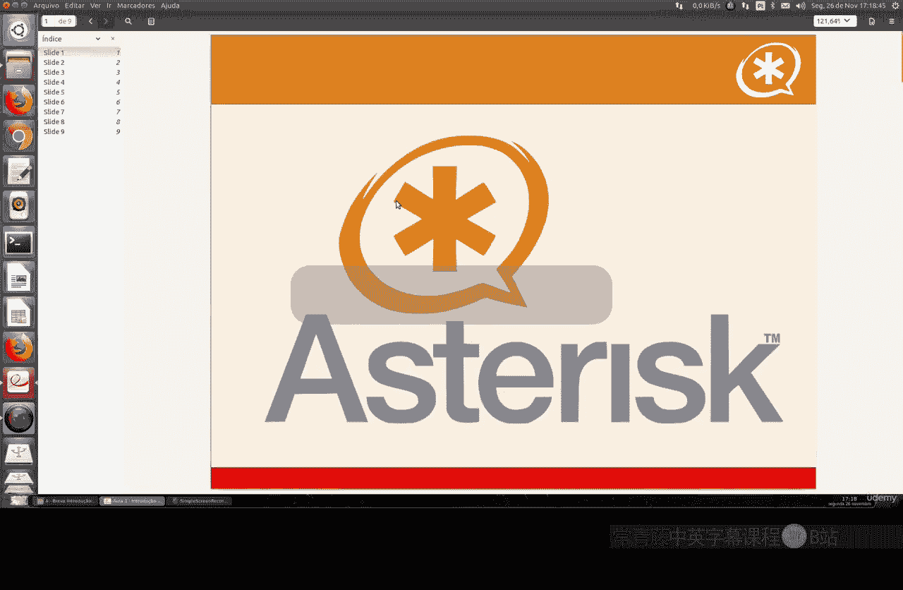
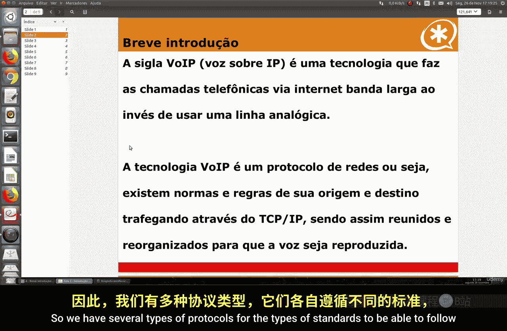
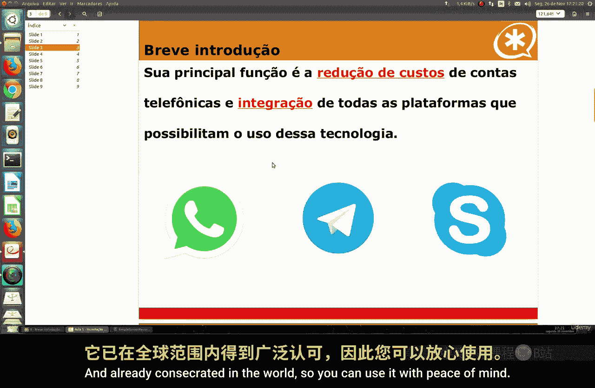
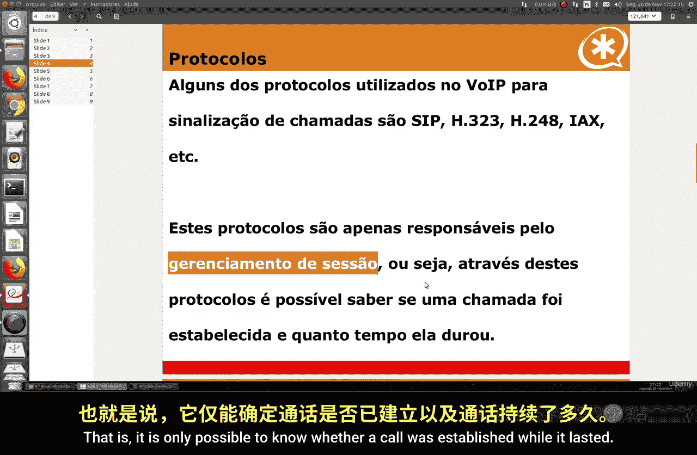
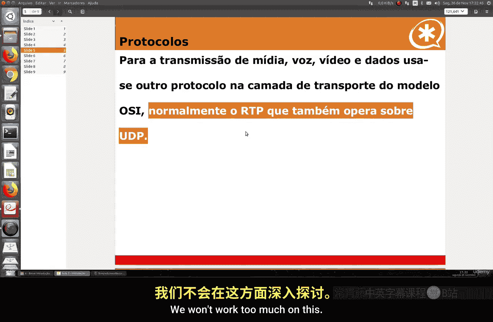
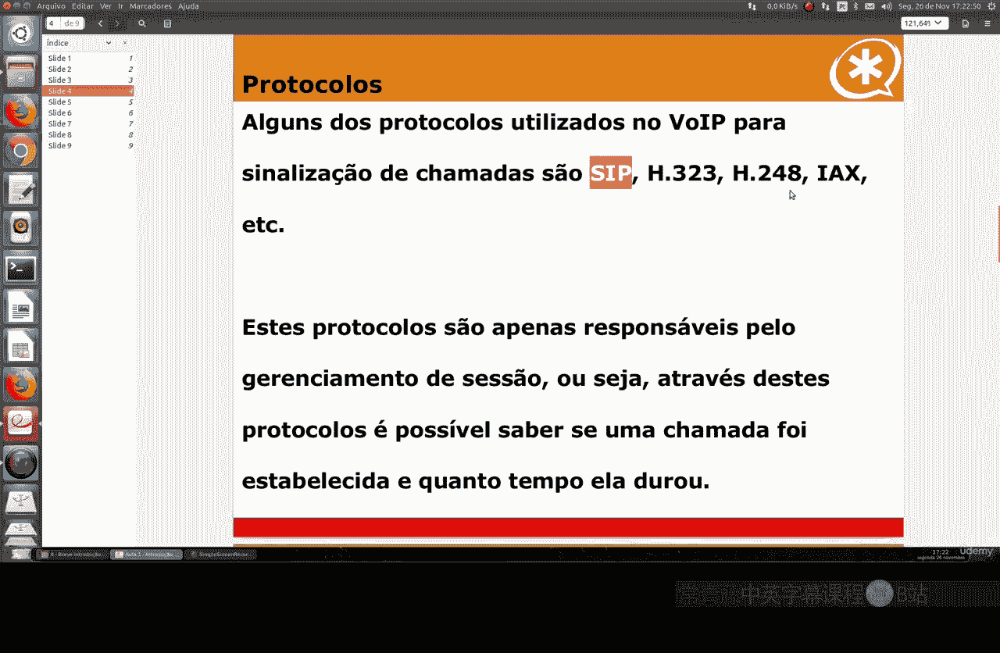
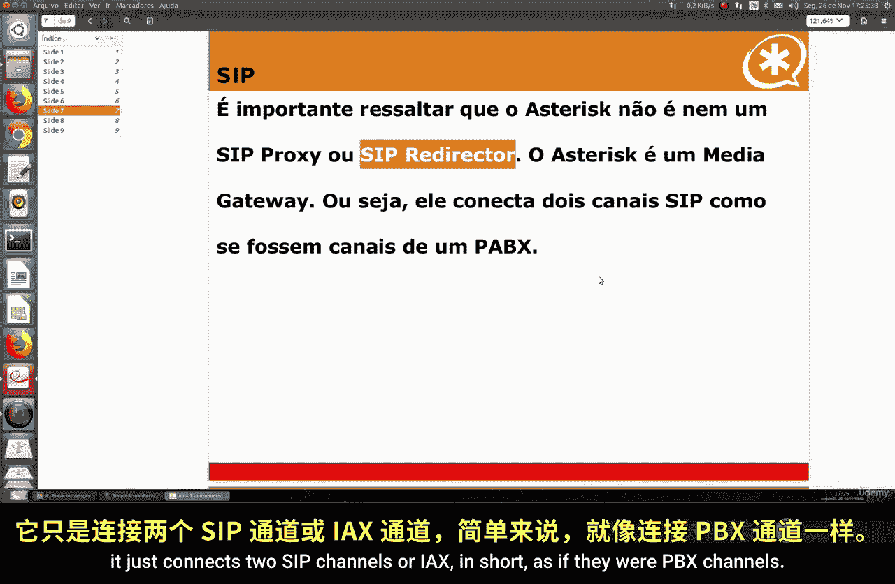
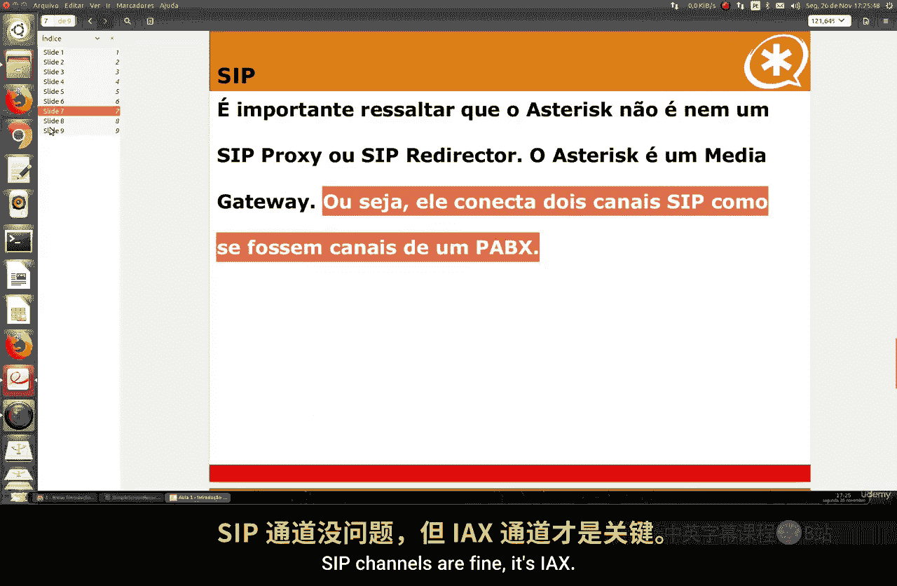
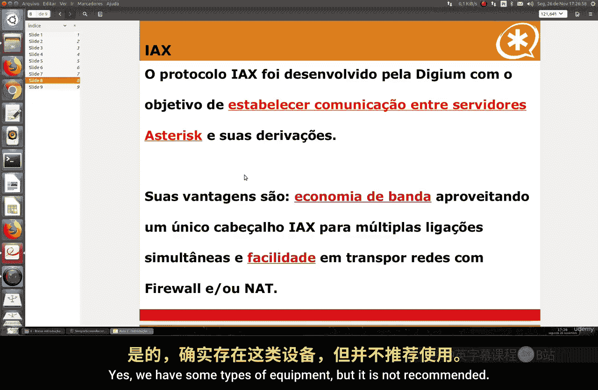
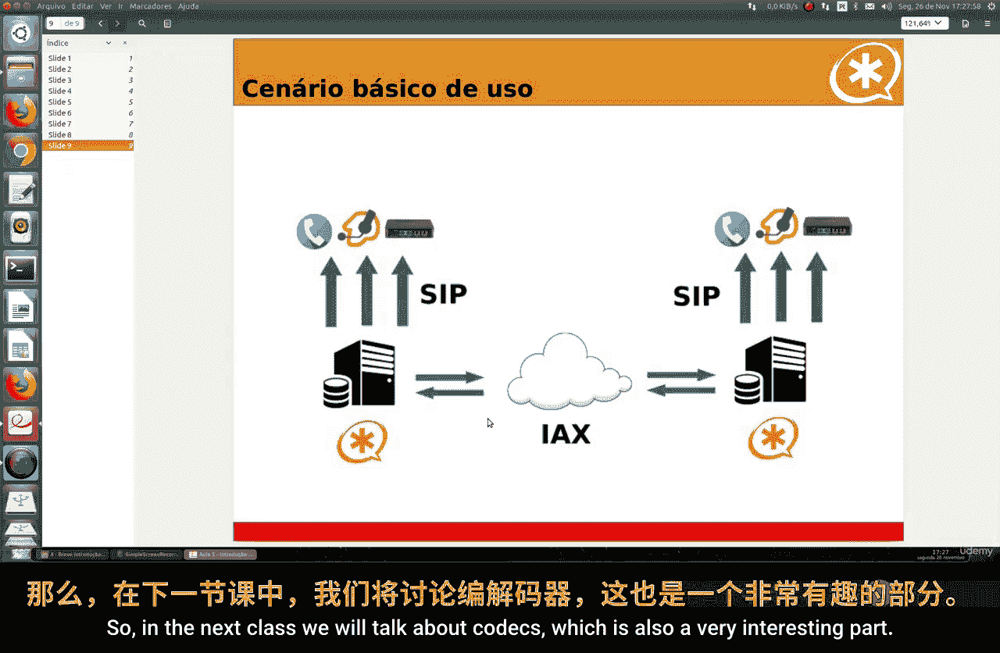

# 068：VoIP及其通信协议介绍 📞

在本节课中，我们将要学习VoIP技术及其核心通信协议。VoIP是一种通过互联网进行语音通话的技术，它改变了传统的电话通信方式。我们将了解其工作原理、主要协议以及在Asterisk系统中的应用。

## 概述

VoIP，全称Voice over IP，是一种通过宽带互联网而非模拟线路进行电话通话的技术。它是一种网络协议，遵循特定的标准和规则，确保语音数据能在TCP/IP网络中正确传输和重组。

## VoIP的主要功能与影响

上一节我们介绍了VoIP的基本概念，本节中我们来看看它的主要功能和带来的影响。

VoIP技术被引入时，其主要目标在于降低通信成本和电话账单，并整合所有支持该技术的平台。

以下是三家对VoIP普及起到关键作用的公司及其贡献：
*   **WhatsApp**：极大地降低了手机通话成本。在20-30年前，手机通话费用非常昂贵。WhatsApp的出现，尤其是集成了VoIP功能后，使得通话资费大幅下降。用户通过Wi-Fi连接即可进行不限时长的免费通话。
*   **Telegram**
*   **Skype**

如今，市场上许多应用程序都在使用VoIP技术。VoIP已成为一种标准化且被广泛认可的协议，可以放心使用。Asterisk系统也采用了这项技术。

## VoIP的信令协议

了解了VoIP的宏观影响后，我们需要深入其技术核心，即信令协议。这些协议负责通话的建立和管理。

VoIP使用特定的协议进行呼叫信令。以下是几种主要且开源的信令协议：
*   **SIP**
*   **H.323**
*   **IAX**

这些协议是免费的、开源的，无需付费即可使用。它们的主要职责是进行会话管理，例如确认呼叫是否建立、通话持续了多久等。

## 媒体传输协议

信令协议负责“沟通”，而真正的语音、视频和数据媒体的传输则需要另一类协议。

媒体传输使用OSI模型传输层的协议，通常是**RTP**，它通常运行在UDP之上。这是我们课程中不会深入讨论的另一种协议类型，因为本课程的重点是Asterisk。

## IAX协议详解

我们将重点学习IAX协议，它在Asterisk系统中扮演着重要角色。

Asterisk本身不是一个SIP代理服务器。实际上，它是一个媒体网关，负责连接两个SIP通道或IAX通道，就像连接PBX分机一样。简单来说，它是一个“连接器”。

IAX协议由Digium公司开发，旨在建立Asterisk服务器及其衍生系统（如Issabel PBX、Elastix等）之间的通信。它是用于Asterisk服务器间通信的协议。

IAX协议具有以下优势：
*   **节省带宽**：可以利用单一的IAX连接处理多个同时进行的会话。
*   **易于穿越防火墙和NAT**：在网络环境中配置更简单。

因此，IAX是连接两个或多个Asterisk服务器的首选协议。我们将在后续课程中演示如何使用它。

## Asterisk场景最佳实践

最后，我们来总结一下在Asterisk中构建通信场景的最佳实践。

以下是创建Asterisk场景的推荐方案：
*   **Asterisk服务器之间的连接**：始终使用**IAX**协议。
*   **网关、话机、软电话和SIP电话卡等终端设备的连接**：使用**SIP**协议。
*   **Asterisk服务器与Issabel PBX等系统之间的连接**：使用**IAX**协议。

这些是本课程中将遵循的最佳实践。

## 总结

本节课中我们一起学习了VoIP技术的基础知识。我们了解了VoIP是一种通过IP网络传输语音的技术，它能显著降低成本。我们探讨了负责呼叫控制的信令协议（如SIP、IAX）和负责媒体流传输的协议（如RTP）。重点掌握了IAX协议的特点及其在连接Asterisk服务器时的优势。最后，我们明确了在Asterisk环境中，服务器间连接使用IAX，而终端设备连接使用SIP的最佳实践。

在下一节课中，我们将讨论编解码器，这也是一个非常有趣的部分。