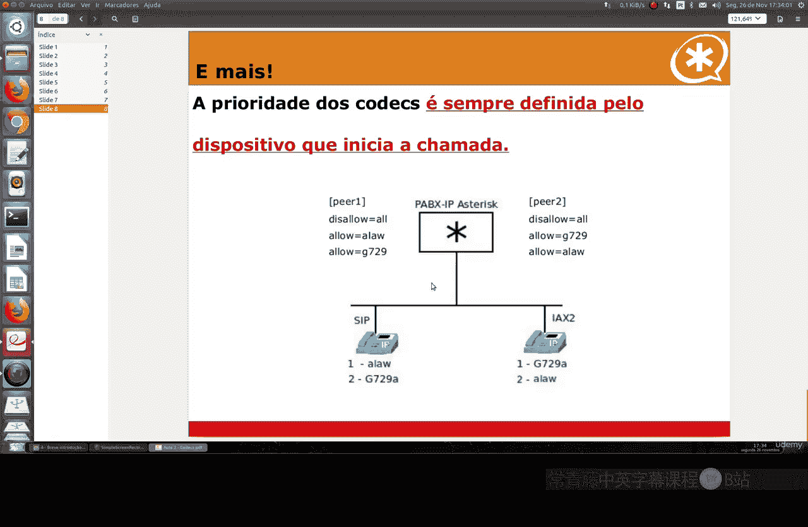

# 069：编解码器详解 🎵

在本节课中，我们将要学习Linux系统中，特别是在Asterisk电话系统环境下，编解码器（Codec）的核心概念、工作原理以及不同类型编解码器的特点与选择策略。

## 概述

编解码器，即编码器-解码器，负责信号的编码与解码。其核心功能包括：将模拟信号转换为数字信号，或将数字信号转换回模拟信号。同时，编解码器也涉及信号的理解，即通过压缩技术减小数字信号数据包的大小，以优化网络带宽的消耗。

## 编解码器的作用与重要性

想象一个需要处理200、300甚至400个同时连接的服务器。为了确保所有连接都能获得足够的带宽，编解码器技术应运而生，它使得高效的数据传输成为可能。市场上存在多种编解码器，尤其在Asterisk系统中，我们可以灵活选用。

## 主要编解码器类型介绍

以下是我们在课程中将重点关注的几种主要编解码器。

### G.711 A律或U律

*   **公式/描述**：`带宽 ≈ 64 kbps`
*   这是巴西PSTN（公共交换电话网络）运营商使用的标准。
*   它每秒使用约64千比特的带宽，因此每路通话占用的带宽较大。
*   其优点是无任何压缩，意味着对服务器处理能力要求较低，且延迟低。
*   显然，它更适用于地面网络（Land networks）。如果你的连接需要处理多种类型的并发通话，这种编解码器是最佳推荐。

### GSM

*   **公式/描述**：`带宽 ≈ 13 kbps`，`特性：压缩`
*   因其在手机中的使用而非常著名，与移动电话网络使用的技术相同。
*   它每秒使用约13千字节，采用了压缩技术。
*   因此，它需要一定的处理能力，并可能带来一些延迟。

### 其他编解码器

上一节我们介绍了两种基础编解码器，本节中我们来看看其他几种类型。

以下是另外几种常见的编解码器：
*   **G.729**：由Digium公司所有，是付费编解码器。带宽为8 kbps，具有压缩功能，也会产生延迟。
*   **iLBC**：这是一种非常有趣的编解码器，因其对数据包丢失有很强的抵抗能力。
*   **G.723.1**：这种编解码器不太推荐使用，因为它需要很高的处理能力，并且故障率较高。

## 编解码器对比与选择策略

为了更直观地理解不同编解码器的差异，这里有一个快速的对比表，涵盖了带宽、复杂度、抗丢包能力等维度。

（注：此处应插入原文提到的对比表图示或描述。例如，G.711、G.729、iLBC、GSM等编解码器在带宽使用上存在显著差异，G.729的带宽消耗远低于G.711。）

从对比中可以看出，例如G.729与G.711相比，带宽使用有非常显著的下降。实际上，三到四个使用G.729的连接才相当于一个G.711连接所占用的带宽。

关于开源与授权：
*   iLBC和GSM是开源编解码器，可以无需担心授权问题自由使用。
*   当我们编译Asterisk时，默认会启用所有可能的编解码器，**除了G.729**。因为它需要付费授权，所以不会默认提供免费使用。

## 编解码器协商与使用建议

如果通话的源端和目的端使用的编解码器不同，或者你没有启用或使用某些类型的编解码器，Asterisk会进行**转码**。转码即首先进行格式转换，然后再发送音频数据。

如果你的网络带宽非常弱，过多的转码可能会产生高延迟并引发问题。

编解码器的优先级总是由**发起呼叫的设备**决定，而不是由接收方决定。

让我们通过一个例子来理解。假设有两个SIP话机，我们可以创建一个场景：第一个话机优先使用G.729，第二个话机优先使用G.711 A律。如果第一个话机呼叫第二个，显然它们只能使用ULaw（G.711 U律）或进行转码才能使用另一种编解码器。

因此，为了避免通话建立时出现问题，请始终为你注册在Asterisk中的所有IP话机使用相同的编解码器优先级顺序。

**核心建议**：在创建编解码器顺序表时，始终使用相同的模式，以避免任何潜在问题。

## 总结

本节课中我们一起学习了编解码器在Linux及Asterisk环境中的关键作用。我们了解了编解码器的基本功能是进行模数/数模转换和信号压缩。重点分析了G.711、GSM、G.729、iLBC等不同编解码器的带宽、复杂度及适用场景。最后，我们掌握了编解码器协商的机制，并学习了为确保通话质量，应在所有设备上统一编解码器优先级顺序的最佳实践。理解这些内容，将帮助你在构建语音通信系统时做出更合适的技术选型与配置。