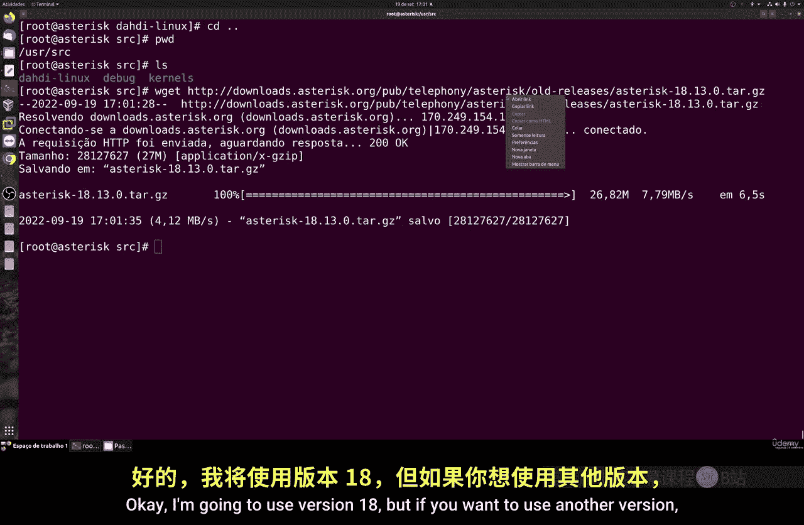
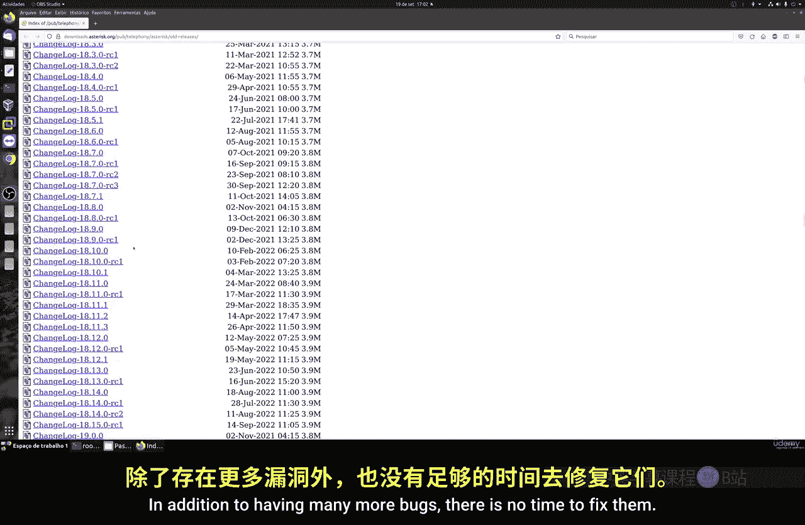
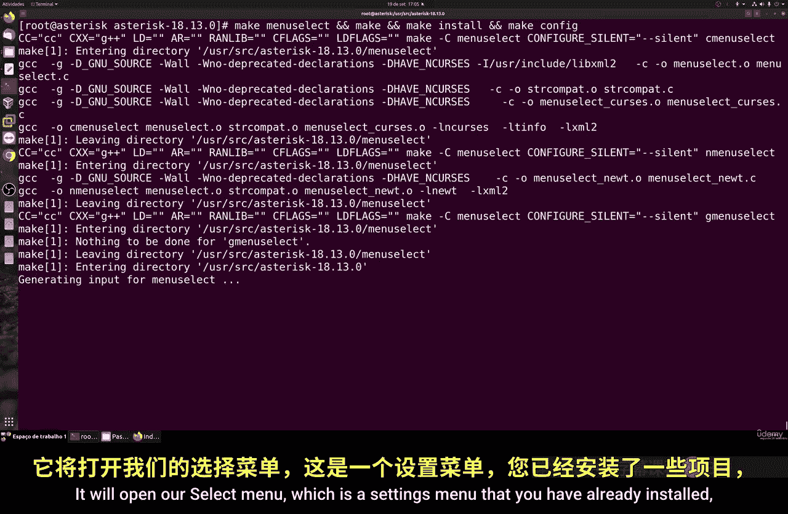
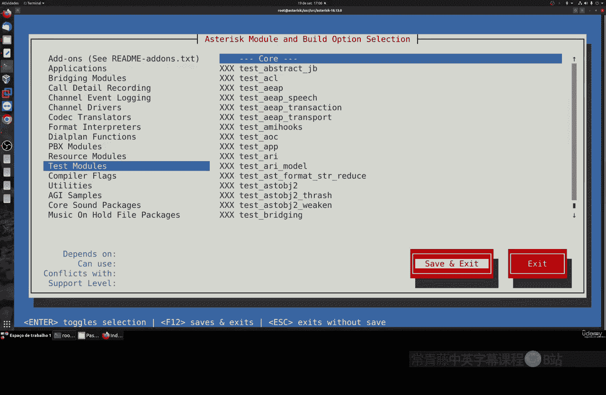
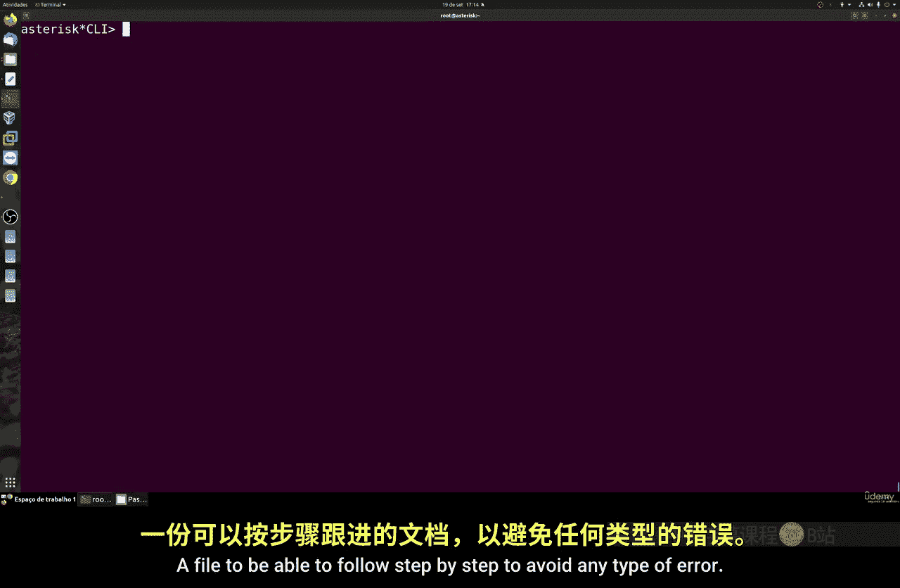

# 070：在Rocky Linux上安装Asterisk 🚀

在本节课中，我们将学习如何在Rocky Linux 8服务器上安装Asterisk PBX系统。我们将从系统准备开始，逐步完成依赖安装、Asterisk编译、配置以及最终启动服务的全过程。

---

## 概述

Asterisk是一个功能强大的开源通信平台。本节教程将指导你完成在Rocky Linux 8系统上安装Asterisk 18 LTS版本的具体步骤。安装过程包括更新系统、配置环境、下载源码、编译安装以及启动服务。

---

## 系统准备与更新

首先，我们需要确保系统是最新的，并安装一些必要的工具。

执行以下命令来更新系统并安装Vim编辑器与WGet下载工具：
```bash
yum update -y
yum install vim wget -y
```

接下来，为了避免安装过程中的权限问题，我们需要临时禁用SELinux。请注意，这仅是临时措施，在生产环境中应按照安全规范进行配置。
```bash
setenforce 0
sed -i 's/^SELINUX=.*/SELINUX=disabled/g' /etc/selinux/config
```

同样，我们暂时停止防火墙服务，后续再按需配置。
```bash
systemctl stop firewalld
systemctl disable firewalld
```

完成上述操作后，重启服务器以使更改生效。
```bash
reboot
```

---

## 安装必要的仓库与开发工具

服务器重启后，我们需要添加EPEL仓库并安装开发工具组，因为编译Asterisk需要C语言环境及其他开发库。

以下是需要执行的命令：
```bash
yum install -y epel-release
yum config-manager --set-enabled powertools
yum groupinstall -y "Development Tools"
```

接着，安装Git、WGet以及一些额外的开发库。
```bash
yum install -y git wget
yum install -y libedit-devel
```



---

## 下载并安装依赖（DAHDI）



良好的实践是将所有下载的源码放在`/usr/src`目录下。我们首先在此目录下安装DAHDI，这是一个与Asterisk协同工作的电话接口驱动。

切换到源码目录并下载安装DAHDI：
```bash
cd /usr/src
wget https://downloads.asterisk.org/pub/telephony/dahdi-linux-complete/dahdi-linux-complete-current.tar.gz
tar zxvf dahdi-linux-complete-current.tar.gz
cd dahdi-linux-complete-*
make
make install
```

> **注意**：建议使用Red Hat系（如Rocky、CentOS）而非内核更新频繁的发行版（如Ubuntu、Debian）进行安装，以获得更好的稳定性。

---

## 下载并安装Asterisk

返回`/usr/src`目录，下载Asterisk 18 LTS版本的源码。始终建议使用LTS（长期支持）版本，避免在生产环境中使用标准版。

执行以下命令：
```bash
cd /usr/src
wget https://downloads.asterisk.org/pub/telephony/asterisk/asterisk-18-current.tar.gz
tar zxvf asterisk-18-current.tar.gz
cd asterisk-18.*
```

进入Asterisk源码目录后，首先安装所有必需的依赖包。
```bash
./contrib/scripts/install_prereq install
```



依赖安装成功后，开始配置和编译Asterisk。这个过程可能会花费一些时间。
```bash
./configure --with-jansson-bundled
make menuselect
```

`make menuselect`命令会打开一个配置菜单。对于初次安装，通常无需修改，直接保存退出即可。



接着，完成编译与安装。
```bash
make
make install
```

如果你是第一次安装Asterisk，可以运行以下命令来生成带注释的示例配置文件。
```bash
make samples
```

---

## 配置系统服务并启动Asterisk

安装完成后，我们需要将Asterisk设置为系统服务，以便随系统启动。

执行以下命令：
```bash
systemctl enable asterisk
systemctl start asterisk
```

可以使用以下命令验证Asterisk服务是否正在运行：
```bash
systemctl status asterisk
ps aux | grep asterisk
```

要进入Asterisk的命令行界面（CLI）进行管理，请运行：
```bash
asterisk -rvvv
```

成功进入CLI即表示Asterisk已安装并运行正常。在此界面，你可以执行重载配置、查看状态、调试等所有管理操作。

---

## 总结



本节课中，我们一起完成了在Rocky Linux 8上安装Asterisk 18 LTS的全过程。我们学习了如何准备系统环境、安装必要的开发工具与依赖、编译并安装Asterisk源码，以及如何配置系统服务并启动它。记住，所有对配置文件的修改后，都需要在CLI中使用`reload`等命令使其生效。