# 071：创建PJSIP分机配置教程 📞

在本节课中，我们将学习如何在Asterisk系统中配置PJSIP分机。PJSIP是一个集成了SIP协议及其他功能的库，自Asterisk 18版本起，它已成为默认的、推荐使用的标准，取代了传统的纯SIP配置。我们将从零开始，创建一个包含两个分机（1001和1002）的简单配置文件。

## 概述与准备工作

上一节我们介绍了Asterisk的基本概念。本节中，我们来看看如何配置PJSIP分机。首先，我们需要进入Asterisk的配置目录。

```bash
cd /etc/asterisk
```

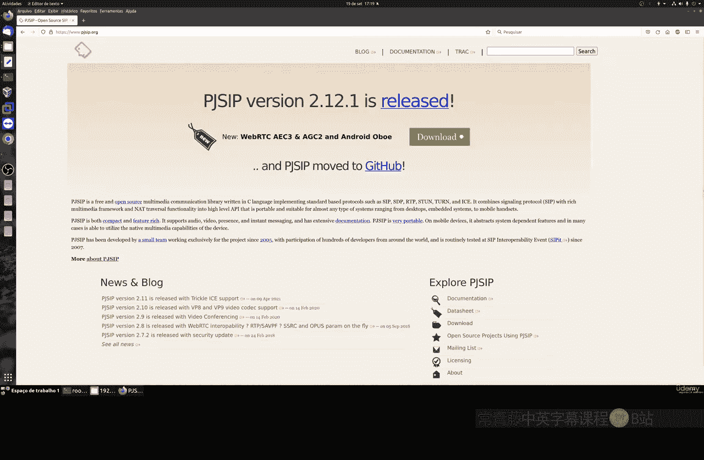

我们将创建一个全新的PJSIP配置文件。建议先备份系统自动生成的示例文件，因为它包含大量信息，可能对初学者造成困扰。

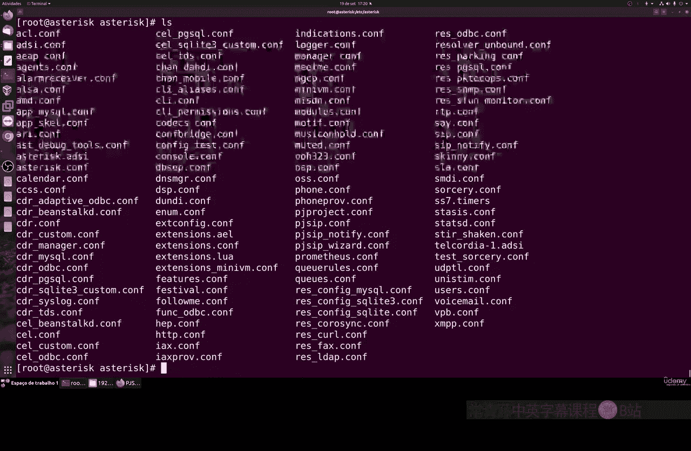

```bash
mv pjsip.conf pjsip.conf.bak
touch pjsip.conf
```


## 配置基础传输头

任何PJSIP配置都需要一个基础的传输头定义。它指定了Asterisk将使用哪种协议和端口来监听连接。

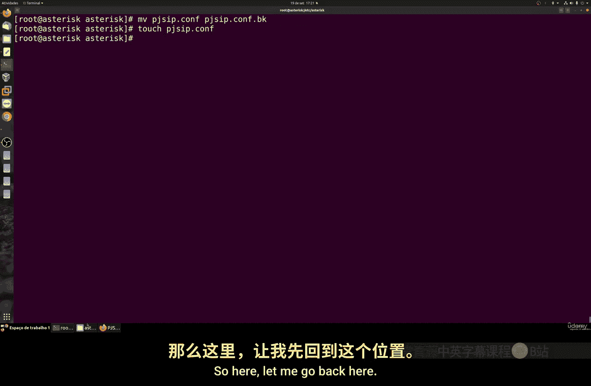

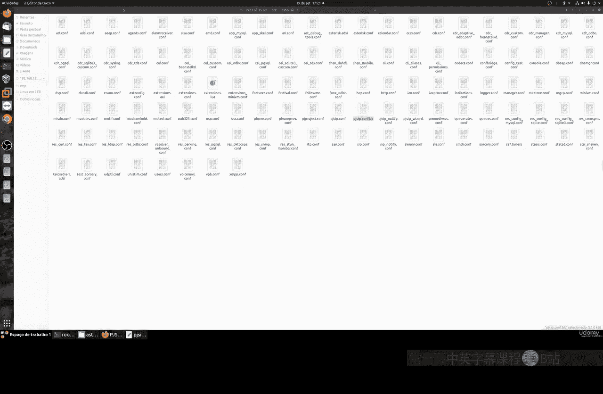

以下是必须配置的四行基础信息：

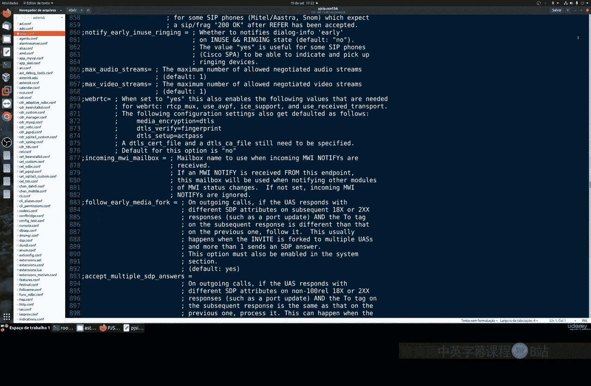

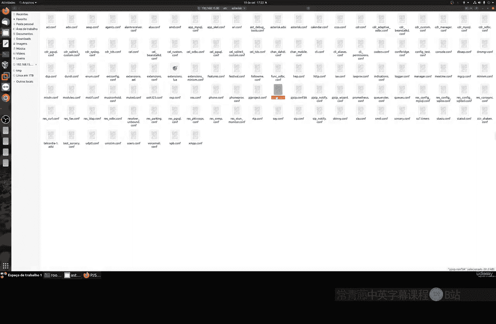

```ini
[transport-udp]
type=transport
protocol=udp
bind=0.0.0.0:5060
```

*   **`[transport-udp]`**： 这是一个配置段的开始，我们将其命名为“transport-udp”。
*   **`type=transport`**： 定义此段为传输类型。
*   **`protocol=udp`**： 指定使用UDP协议，这是SIP的默认协议。
*   **`bind=0.0.0.0:5060`**： 绑定到所有IPv4地址的5060端口。`0.0.0.0`表示监听所有网络接口。

## 配置分机1001

配置完传输头后，我们就可以开始定义具体的分机了。PJSIP将一个分机的配置分散到三个关联的段中：`endpoint`、`aor`和`auth`。这样做是为了提高灵活性和安全性。

### 1. 端点配置

端点是分机的核心定义，它连接了电话设备与Asterisk。

```ini
[1001]
type=endpoint
context=extensions
disallow=all
allow=ulaw
aors=1001
auth=1001
```

*   **`[1001]`**： 分机号码，也是此配置段的名称。
*   **`type=endpoint`**： 定义此段为端点类型。
*   **`context=extensions`**： 指定此分机所属的拨号方案上下文，我们将在后续课程中创建名为`extensions`的拨号方案。
*   **`disallow=all`** 和 **`allow=ulaw`**： 先禁止所有编解码器，再单独允许`ulaw`。这是一种最佳实践，可以避免不必要的转码，降低系统延迟。`ulaw`是北美地区常用的高质量音频编解码器。
*   **`aors=1001`** 和 **`auth=1001`**： 将此端点与下面即将创建的`aor`和`auth`段关联起来。**这里的名称必须完全一致**。

### 2. 地址记录配置

AOR定义了分机的注册地址。

```ini
[1001]
type=aor
max_contacts=1
```

*   **`[1001]`**： 名称必须与端点段中`aors`参数指定的值相同。
*   **`type=aor`**： 定义此段为地址记录类型。
*   **`max_contacts=1`**： 限制此账户只能从一个设备注册，这是PJSIP增强安全性的特性之一。

### 3. 认证配置

认证段用于设置分机的登录凭据。

```ini
[1001]
type=auth
auth_type=userpass
username=1001
password=1001
```

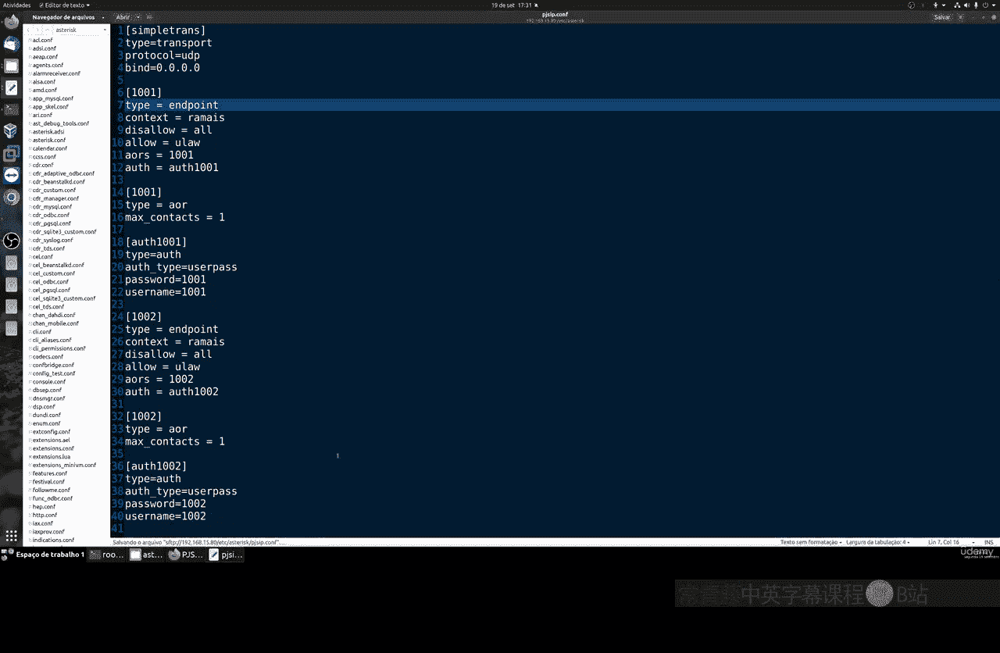

*   **`[1001]`**： 名称必须与端点段中`auth`参数指定的值相同。
*   **`type=auth`**： 定义此段为认证类型。
*   **`auth_type=userpass`**： 使用用户名/密码的方式进行认证。
*   **`username`** 和 **`password`**： 设置登录的用户名和密码。为了安全，建议使用强密码（包含大小写字母、数字和特殊字符，至少8位）。

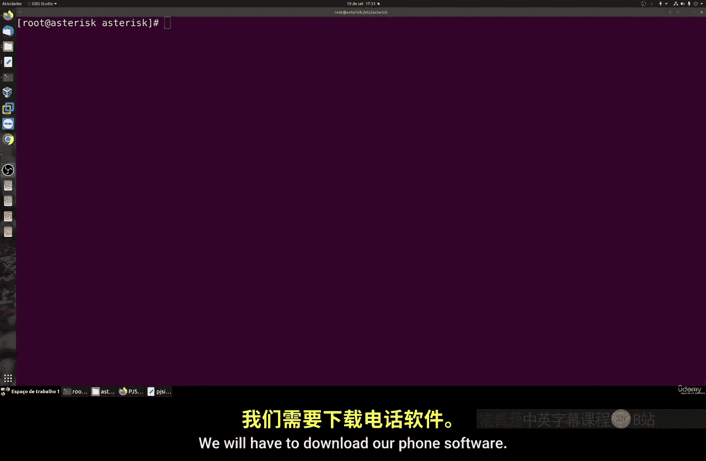

## 配置分机1002

配置完分机1001后，创建分机1002就非常简单了，只需复制上述三段配置，并将所有的“1001”替换为“1002”即可。使用文本编辑器或IDE的复制/替换功能可以大大提高效率。

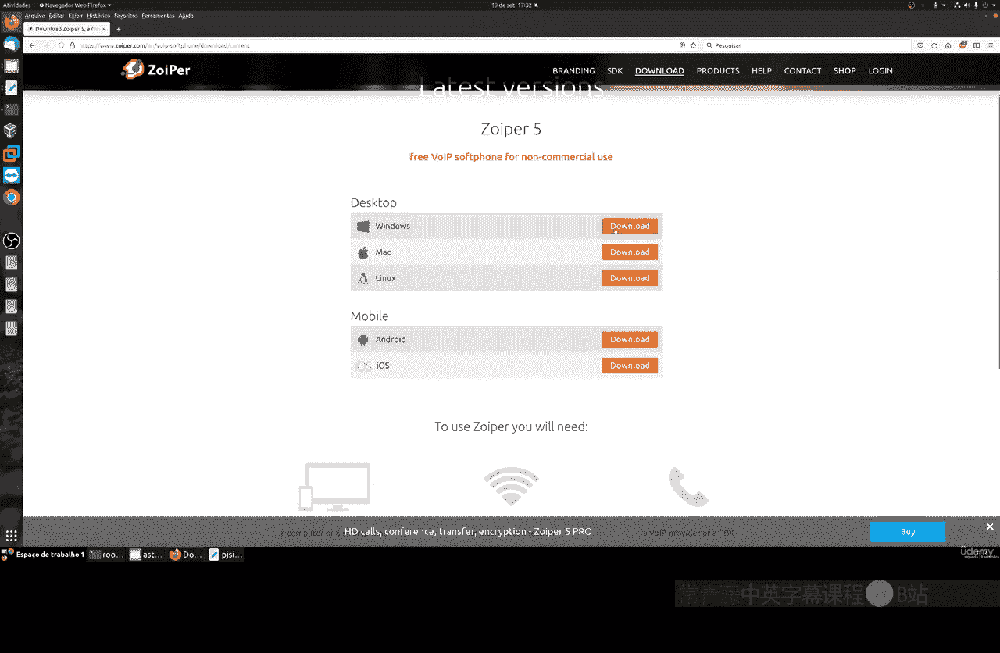

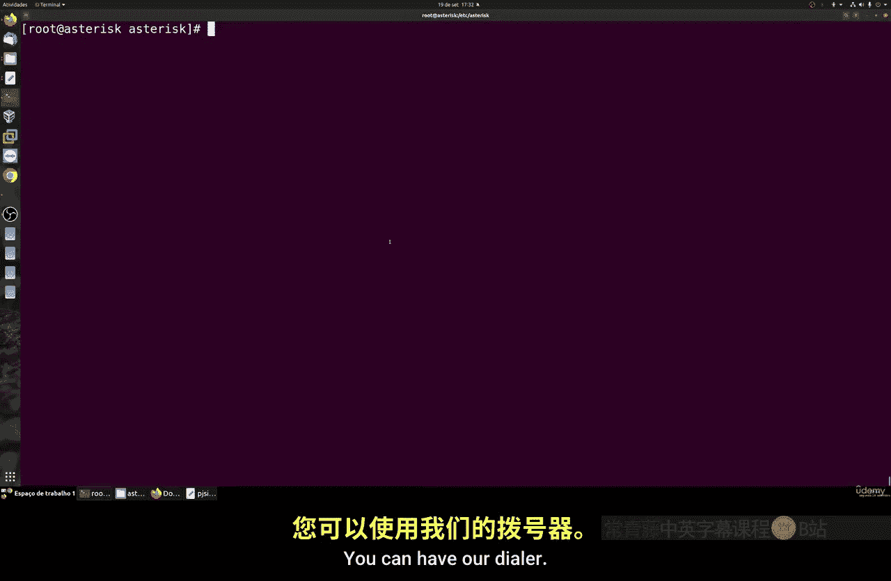


## 应用配置并检查

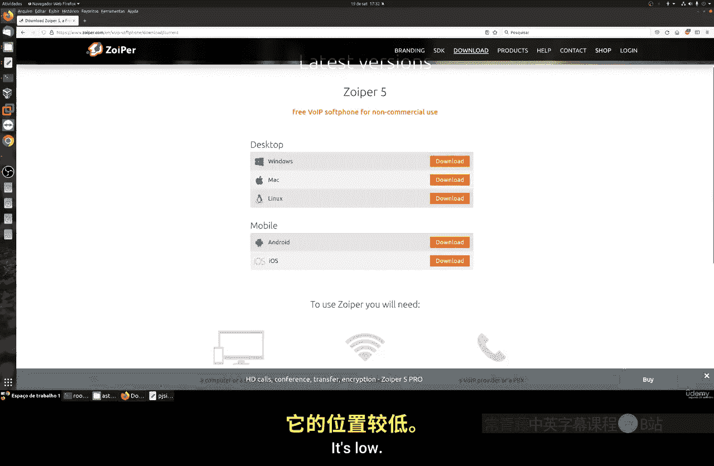

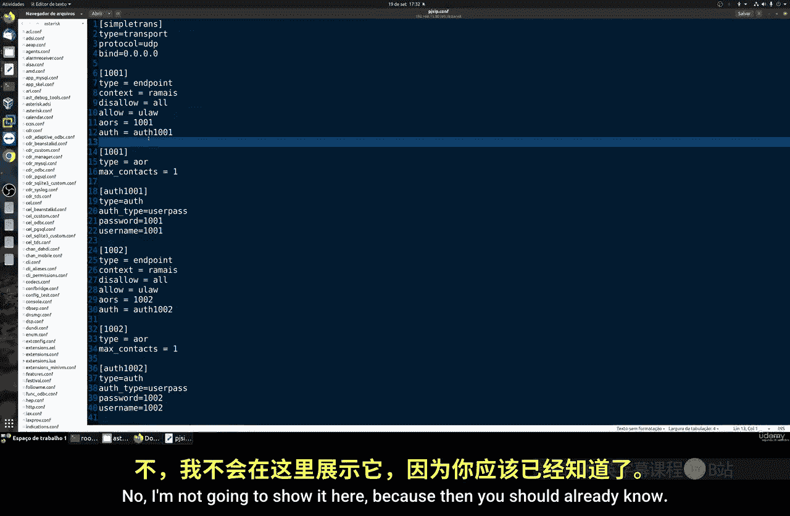

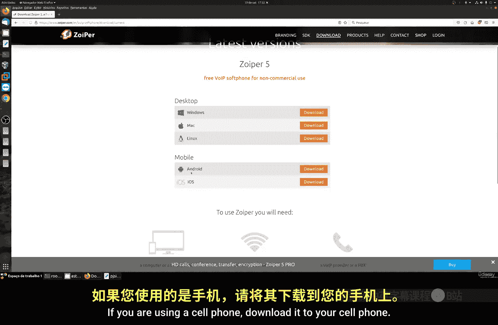

配置文件创建完成后，需要通知Asterisk重新加载PJSIP配置使其生效。

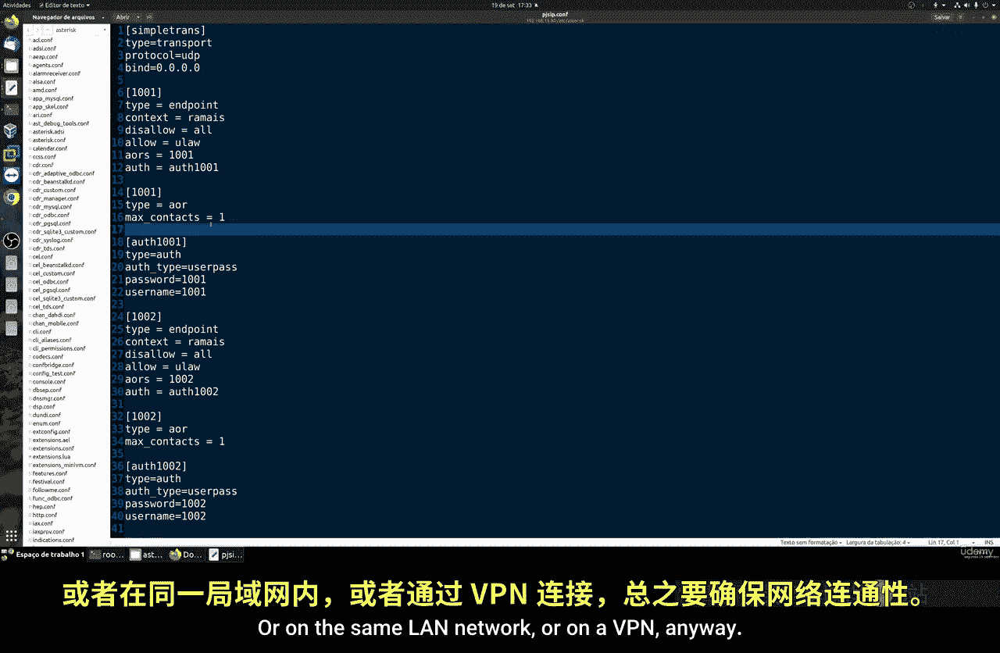

1.  进入Asterisk CLI：
    ```bash
    asterisk -rvvv
    ```
2.  执行重载命令：
    ```bash
    pjsip reload
    ```
    **请注意：每次修改PJSIP配置文件后，都必须执行此命令。**

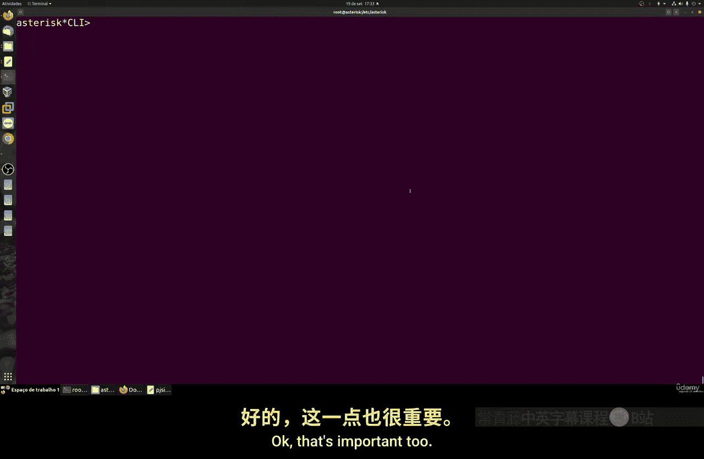

3.  检查分机状态。可以使用以下命令查看端点注册情况：
    ```bash
    pjsip show endpoints
    ```
    如果配置正确，你应该能看到`Endpoint: 1001`和`Endpoint: 1002`，并且状态为`Avail`（可用）。


## 使用软电话注册测试

理论配置完成后，我们需要用实际的软电话来测试注册是否成功。推荐使用跨平台的免费软电话**Zoiper**。

以下是使用Zoiper注册分机1001的步骤：

1.  **下载安装**： 从Zoiper官网或手机应用商店下载并安装Zoiper客户端。
2.  **添加账户**： 打开Zoiper，选择添加SIP账户。
3.  **填写信息**：
    *   **账号/分机**： `1001`
    *   **密码**： `1001`（即你在`auth`段中设置的密码）
    *   **域名/服务器**： 你的Asterisk服务器的IP地址（例如 `192.168.1.100`）
    *   **端口**： 默认为`5060`，如果你修改了`transport`中的端口，则需要填写新端口。
4.  **保存注册**： 保存设置后，Zoiper会尝试向服务器注册。如果一切配置正确，账户状态应显示为绿色“已注册”。

在Asterisk CLI中再次运行 `pjsip show endpoints`，你应该能看到分机1001的`Contact`字段显示了Zoiper客户端的IP和端口，表示注册成功。

## 安全建议：修改默认端口

使用默认的5060端口容易成为网络扫描和攻击的目标。一个有效的安全措施是将其改为非标准端口。

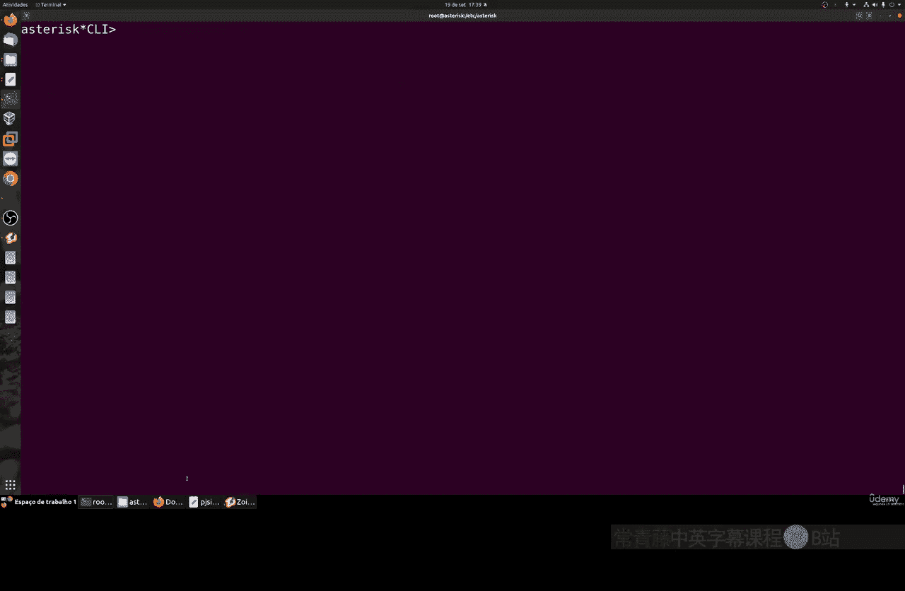

修改`transport-udp`段中的`bind`行即可：
```ini
bind=0.0.0.0:5080
```
同时，记得在软电话的服务器设置中将端口也改为`5080`。**修改配置后，务必在CLI中执行 `pjsip reload`。**

## 总结

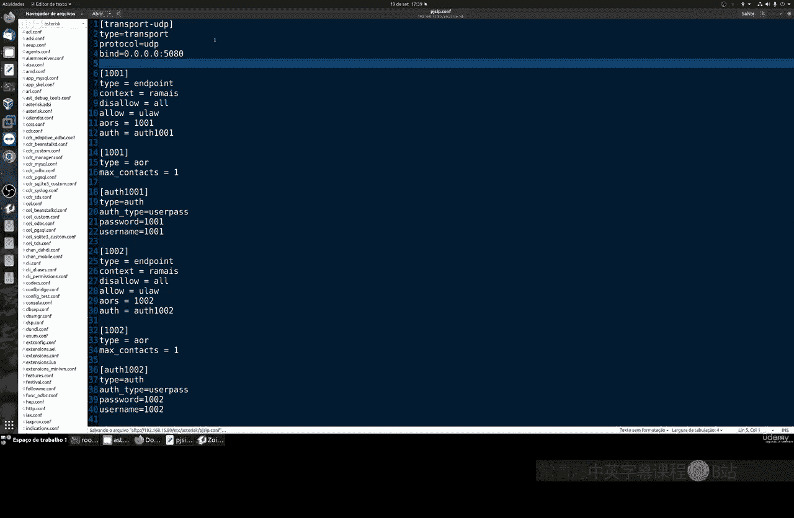

本节课中我们一起学习了Asterisk PJSIP分机的基础配置。我们了解了PJSIP相比传统SIP在结构和安全性上的改进，并动手完成了以下核心步骤：

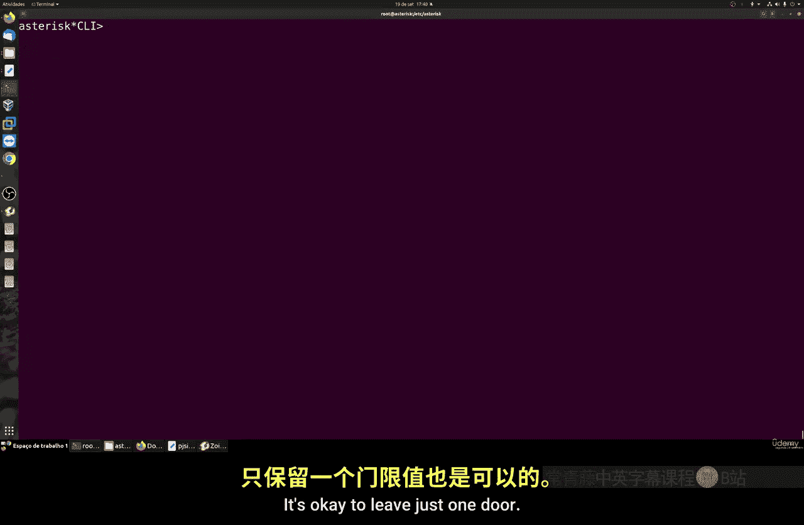

1.  创建了基础的传输头 `[transport-udp]`。
2.  为每个分机配置了三个关联段：`endpoint`、`aor`和`auth`。
3.  学习了应用配置的命令 `pjsip reload`。
4.  使用Zoiper软电话成功注册分机，验证了配置。
5.  了解了修改默认端口以增强安全性的最佳实践。

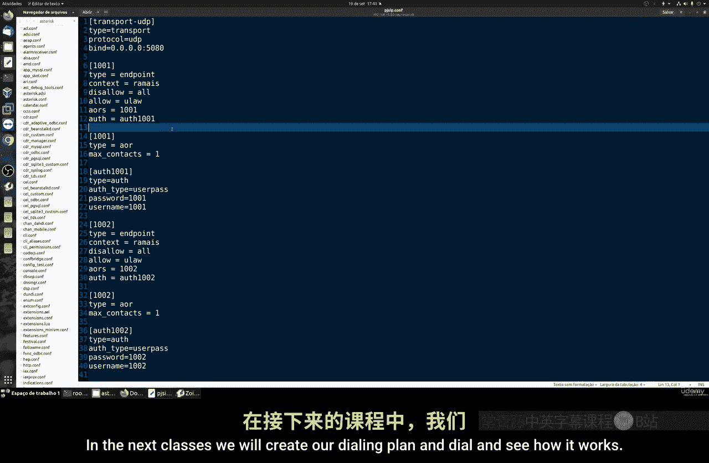


现在，你已经成功地在Asterisk服务器上创建并注册了PJSIP分机。在下一节课中，我们将学习如何创建拨号方案，让这些分机之间能够互相通话。