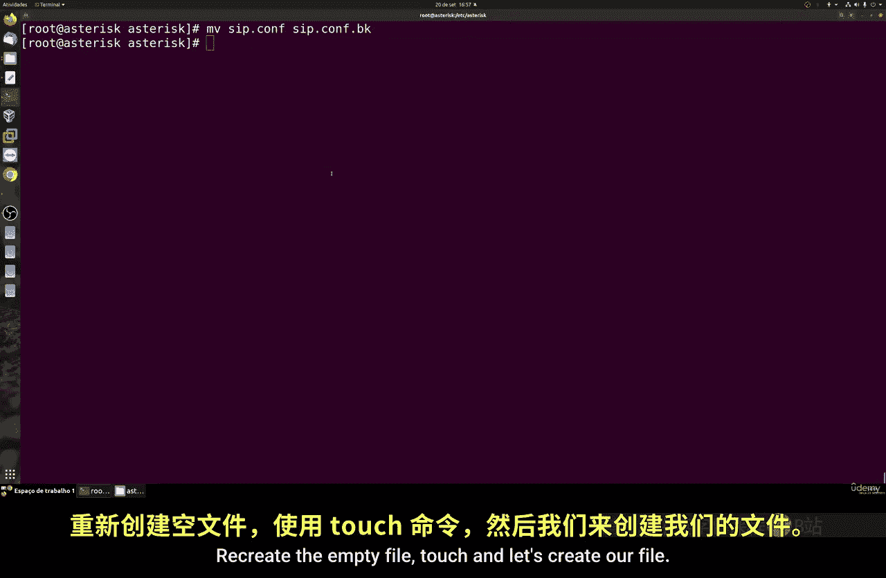
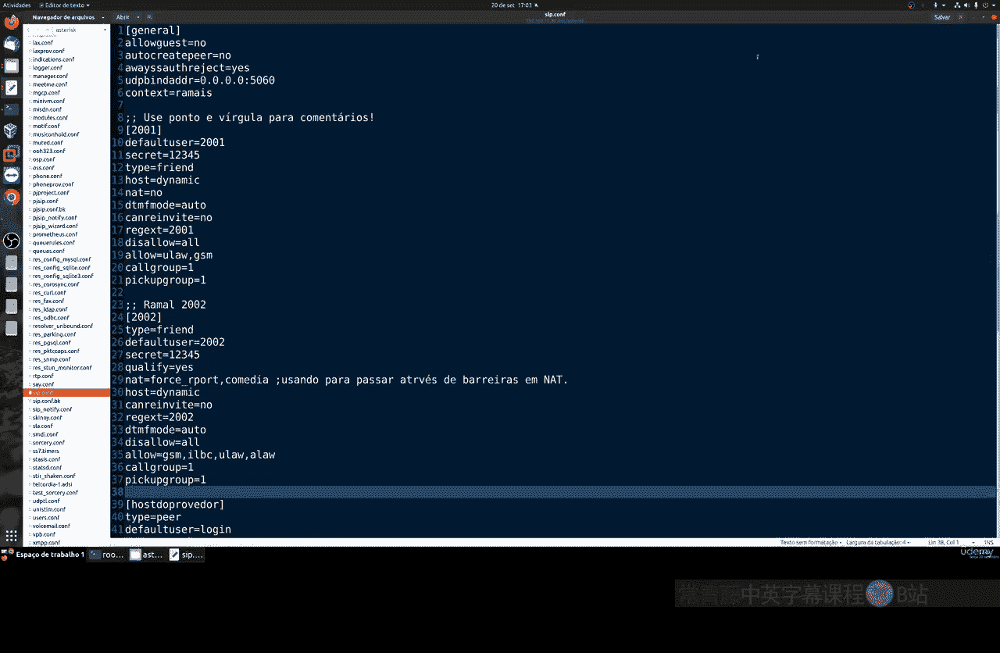
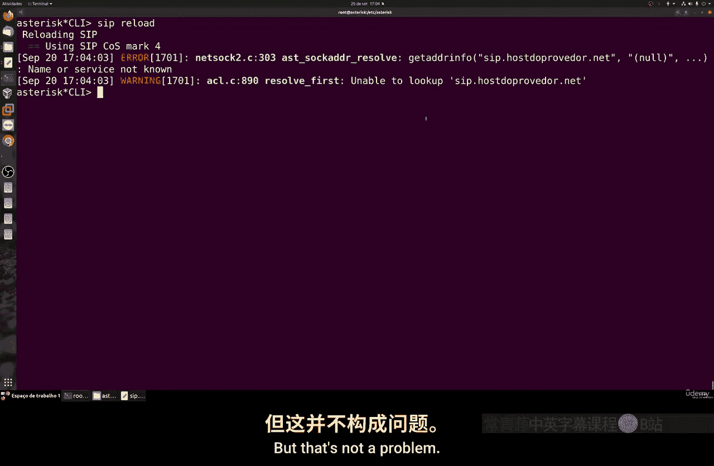
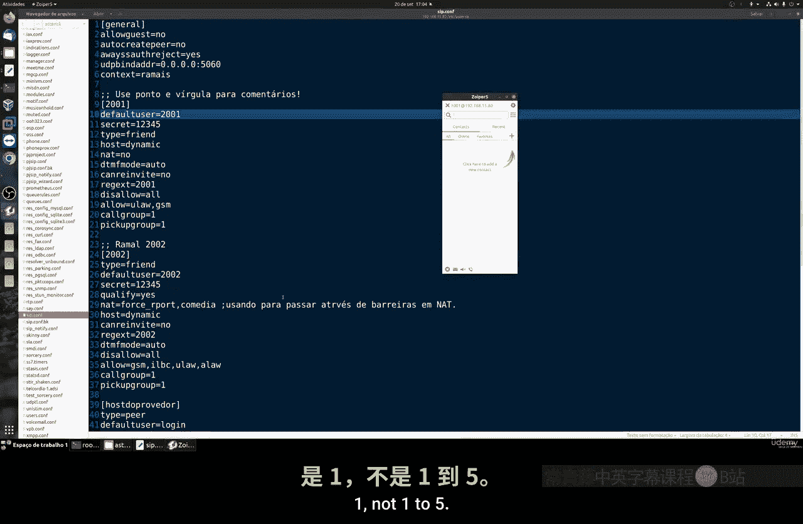
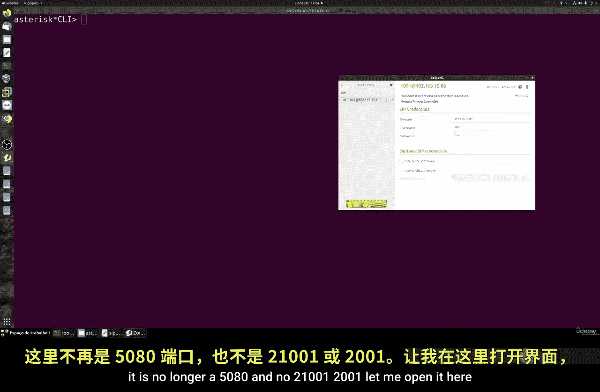
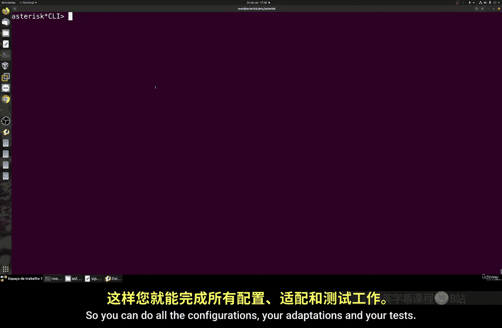

# 072：创建SIP分机 📞

在本节课中，我们将学习如何在Asterisk中配置传统的SIP协议分机。请注意，SIP是旧版配置方式，现代系统主要使用PJSIP。本节内容仅供教育目的，帮助你了解过去的工作方式。

## 概述

我们将通过编辑配置文件来启用SIP模块并创建分机。首先需要禁用PJSIP模块以避免冲突。整个过程包括编辑模块文件、重启服务以及配置分机的基本参数。

## 配置模块

在开始配置SIP分机前，我们需要禁用PJSIP模块并启用SIP模块。否则，两者会产生冲突。

以下是操作步骤：

1.  导航到Asterisk的模块配置目录：`/etc/asterisk/modules.conf`。
2.  在配置文件中，找到与PJSIP相关的所有模块行，将它们的状态从 `load` 改为 `noload`。
3.  找到SIP模块的行（通常是 `chan_sip.so`），确保其状态为 `load`。
4.  保存文件并退出编辑器。

完成修改后，需要完全重启Asterisk服务以使更改生效。可以执行命令 `asterisk -rx “core restart now”` 或使用系统服务管理命令。

## 创建SIP配置文件

上一节我们配置了模块，本节中我们来看看如何创建SIP分机的配置文件。SIP的配置比PJSIP更为简单。

首先，我们需要进入Asterisk的配置目录并处理 `sip.conf` 文件。

以下是操作步骤：

1.  备份现有的 `sip.conf` 文件（如果存在）：`mv sip.conf sip.conf.backup`。
2.  创建一个新的空配置文件：`touch sip.conf`。
3.  使用文本编辑器打开 `sip.conf` 文件进行编辑。

## 编写配置内容

现在，我们将在 `sip.conf` 文件中编写具体的分机配置。一个基本的SIP分机配置包含几个核心部分。

以下是配置示例的结构说明：

*   `[general]`：此部分用于全局设置。例如，`allowguest=no` 可以禁止自动创建来宾分机，增强安全性。`udpbindaddr` 用于绑定本地IP地址。`context` 用于设置默认的拨号方案上下文。
*   `[2001]`：这是一个分机配置节，分机号为2001。`type=friend` 表示该分机既可以拨打电话也可以接听电话。如果只想拨出，使用 `type=peer`；如果只想接听，使用 `type=user`。`secret` 字段设置认证密码。`host` 可以设置为 `dynamic` 以允许动态IP注册，或设置为固定IP地址以增强安全。`nat` 设置用于处理网络地址转换，在分机位于防火墙或路由器后方时需要配置。`dtmfmode` 设置DTMF（双音多频）信号的发送方式。`disallow` 和 `allow` 用于控制支持的音频编解码器。`callgroup` 和 `pickupgroup` 用于设置呼叫组和代接组，实现呼叫转移和代接功能。

你可以按照相同格式添加更多分机，例如 `[2002]`。对于需要从外部网络（如4G/5G）注册的分机，`nat` 的设置尤为重要。

## 应用配置并验证

配置文件编写完成后，需要将其加载到Asterisk中并验证分机是否成功注册。

以下是操作步骤：

1.  在Asterisk CLI中执行命令 `sip reload` 以重新加载SIP配置。
2.  使用软电话客户端（如MicroSIP、Zoiper）尝试注册分机2001，服务器地址填写Asterisk系统的IP，用户名和密码填写配置中设置的值。
3.  在Asterisk CLI中执行 `sip show peers` 命令，查看分机2001的注册状态。如果显示为 “OK”，则表示注册成功。
4.  可以执行 `sip show peer 2001` 命令查看该分机的详细配置信息。

## 关于SIP中继的补充说明

除了内部分机，SIP配置也可用于连接外部服务提供商（即SIP中继）。其配置结构与分机类似，但 `type` 通常设为 `peer`，并且需要填写提供商提供的 `host`、`username`、`secret`、`context` 等信息。请注意，我们后续课程将专注于PJSIP。

## 总结

本节课中我们一起学习了如何在Asterisk中配置传统的SIP协议分机。我们了解了启用SIP模块、编写 `sip.conf` 配置文件、设置分机参数以及验证注册状态的全过程。需要再次强调，SIP是旧版配置方式，社区未来可能不再维护。因此，强烈建议在新项目中使用功能更强大、支持更现代的PJSIP协议。理解SIP有助于处理遗留系统或进行知识拓展。