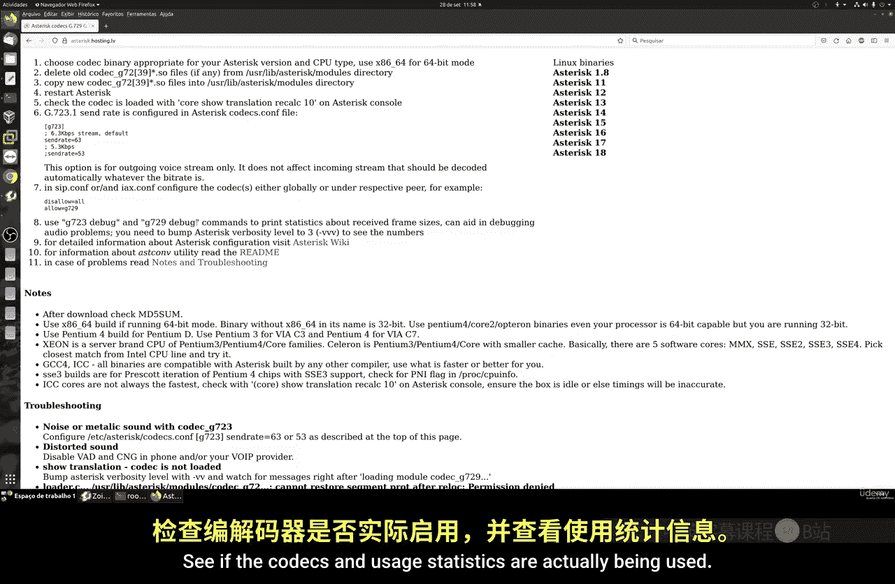

# 073：安装G.729编解码器

## 概述
在本节课中，我们将学习如何在Asterisk系统中安装G.729编解码器。G.729是一种流行的音频编解码器，特别适用于网络连接质量不佳的环境。我们将通过一个脚本完成安装，并验证其功能。

## 安装G.729编解码器
G.729编解码器能帮助系统在网络带宽有限的情况下获得更好的音频质量。它消耗更多的CPU资源，但占用更少的网络带宽。因此，在CPU性能较弱的旧机器上使用需谨慎，以免系统过载。

许多应用程序和系统支持G.729，但有些可能要求付费版本。不过，我们可以免费使用它。安装过程可能有些复杂，但我们提供了一个脚本来自动化整个流程。

以下是安装步骤：



1.  进入Asterisk源代码目录：`cd /usr/src/asterisk`
2.  从GitHub获取安装脚本。
3.  运行安装命令：`bash codec_install.sh`

该脚本会自动安装G.729以及G.723编解码器，配置相关模块，并重启Asterisk服务。

## 验证安装
上一节我们完成了安装，本节中我们来看看如何验证G.729编解码器是否成功安装并可用。

进入Asterisk命令行界面（CLI），执行以下命令来查看已安装的编解码器：

```bash
core show translation
```

在输出列表中，如果看到`g729`，则表明安装成功。G.723通常也会一并安装，但G.729是更常用的一个。

## 配置使用
安装完成后，需要在你的SIP配置文件（如`sip.conf`或`pjsip.conf`）中启用它。

以下是配置方法：

1.  打开你的SIP配置文件。
2.  在相应的分机（extension）或对等体（peer）配置部分，添加`allow=g729`。
3.  你可以通过调整`disallow=all`和`allow`语句的顺序来设置编解码器优先级，将`allow=g729`放在靠前的位置。
4.  保存文件并重新加载SIP模块：在CLI中执行 `sip reload` 或 `pjsip reload`。
5.  检查注册的分机是否已允许使用G.729。

## 注意事项与总结
随着互联网速度的提升和稳定性的增强（如光纤、5G），G.729的重要性已不如早期拨号或ADSL宽带时代那样突出。但对于一些网络条件仍然欠佳的环境，它依然能提供很大帮助。


本节课中我们一起学习了如何在Asterisk中安装和配置G.729编解码器。主要内容包括：通过脚本自动化安装、在CLI中验证安装结果、以及在SIP配置文件中启用该编解码器。建议将其安装到系统中以备不时之需。