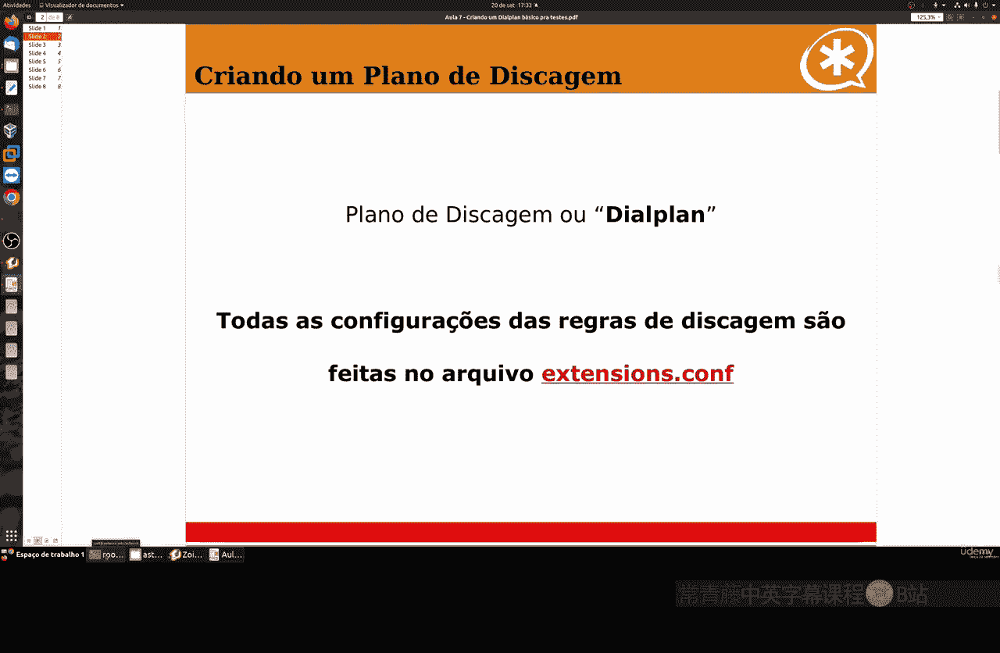
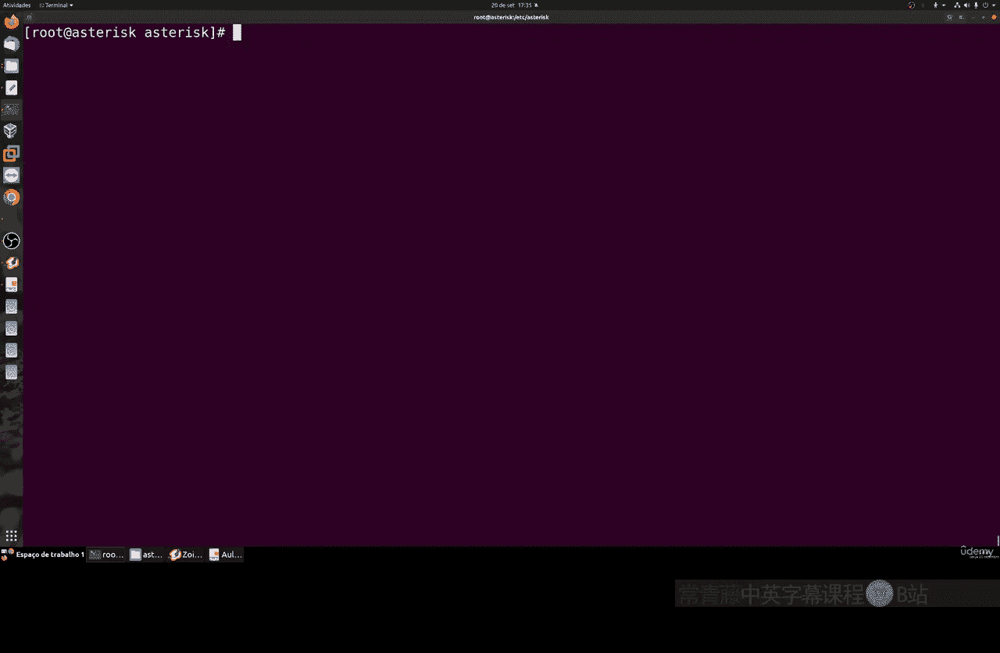

# 074：创建基本拨号计划用于测试 📞

在本节课中，我们将学习如何为Asterisk系统创建一个基础的拨号计划。拨号计划是定义呼叫如何被路由和处理的核心规则集合。我们将从基本概念开始，逐步构建一个可用的配置。

---

## 概述

拨号计划文件通常名为 `extensions.conf`，它包含了所有呼叫路由的逻辑。我们将学习其语法结构、如何定义上下文和分机，以及如何使用正则表达式来简化配置。

---

## 拨号计划基础语法

拨号计划的基本结构围绕“上下文”和“分机”展开。上下文用方括号 `[]` 定义，分机则在其下进行配置。

### 上下文与分机

一个基础的拨号计划条目如下所示：
```
[internal]
exten => 2000,1,Dial(PJSIP/2000)
```

*   `[internal]`：这是一个**上下文**。它的名称必须与你在PJSIP终端配置中设置的上下文名称完全一致。
*   `exten => 2000,1,Dial(PJSIP/2000)`：这是一条**分机**规则。
    *   `2000`：分机号码。当用户拨打这个号码时，系统会匹配此规则。
    *   `1`：**优先级**。规则按优先级数字从小到大的顺序执行。
    *   `Dial(PJSIP/2000)`：**应用程序**。这里使用了 `Dial` 应用程序来发起呼叫，它尝试呼叫PJSIP协议下注册为 `2000` 的终端。

上一节我们介绍了拨号计划的基本结构，本节中我们来看看如何定义更复杂的分机规则。

### 应用程序与挂断

一个完整的基础呼叫流程通常包含至少两个优先级：
```
[internal]
exten => 2000,1,Dial(PJSIP/2000)
exten => 2000,n,Hangup()
```
*   第一行（优先级1）尝试呼叫分机2000。
*   第二行（优先级n）使用 `Hangup()` 应用程序在呼叫结束后挂断连接。

你可以为不同的分机创建类似的规则，例如分机2001和2002。

---

## 使用正则表达式简化配置

如果你需要配置成百上千个分机，为每一个都单独写规则是不现实的。这时就需要用到**正则表达式**。

正则表达式能让我们用更简洁的规则匹配一系列分机，极大地节省配置行数和维护时间。

以下是Asterisk中常用的几个通配符：
*   `X`：匹配数字 **0-9**。
*   `Z`：匹配数字 **1-9**（排除0）。
*   `N`：匹配数字 **2-9**（排除0和1）。
*   `.` （点号）：匹配**一个或多个**任意字符。

当在分机号码中使用正则表达式时，必须在号码前加上下划线 `_`。

让我们看几个例子：

**示例1：匹配所有以2开头的4位分机**
```
[internal]
exten => _2XXX,1,Dial(PJSIP/${EXTEN})
```
*   `_2XXX`：匹配从2000到2999的所有号码。
*   `${EXTEN}`：这是一个**变量**，它代表用户实际拨打的号码。因此，拨打2001就会呼叫 `PJSIP/2001`。

仅用这两行，你就为1000个潜在分机配置了呼叫路由。

**示例2：匹配特定范围的号码**
使用方括号 `[]` 可以匹配单个特定数字。
```
exten => _2[5-7]XX,1,Dial(PJSIP/${EXTEN})
```
这条规则匹配以25、26或27开头的所有4位数分机（如2500, 2699, 2701）。

---

## 组织上下文：包含（Include）功能

一个复杂的拨号计划会有多个上下文。你可以使用 `include` 指令让一个上下文继承另一个上下文的规则，这有助于模块化配置。

假设我们有以下上下文：
```
[internal_local]
exten => _2XXX,1,Dial(PJSIP/${EXTEN})

[internal_longdistance]
exten => _0ZXXXXXXXXX,1,Dial(PJSIP/voip_provider/${EXTEN:1})
```

你可以创建一个主上下文来包含它们：
```
[main_context]
include => internal_local
include => internal_longdistance
```
这样，任何使用 `main_context` 的终端，既可以拨打内部短号（2XXX），也可以拨打长途号码（0ZXXXXXXXXX）。

---

## 规则匹配的优先级顺序

当多个分机规则可能匹配同一个拨号时，Asterisk按照**从最具体到最通用**的顺序进行匹配。

请看以下示例：
```
[test]
exten => 2100,1,Playback(hello-world)      ; 规则1：精确匹配2100
exten => _21XX,1,Playback(beep)            ; 规则2：匹配21开头的4位数
exten => _2NXX,1,Playback(beep)            ; 规则3：匹配2开头，第二位是2-9的4位数
```

当用户拨打 `2100` 时：
1.  系统首先找到**精确匹配**的规则1。
2.  即使规则2和规则3也能匹配 `2100`，但规则1更具体，因此会执行规则1（播放“hello-world”）。

这种设计确保了呼叫路由的准确性和可预测性。

---

## Dial应用程序的常用选项

`Dial` 应用程序功能非常丰富，支持许多选项来定制呼叫行为。以下是几个最常用的选项：

以下是 `Dial` 应用程序的一些关键参数：
*   `T`：允许被叫方按 `*` 键将呼叫**转接**给其他分机。
*   `t`：允许主叫方按 `*` 键将呼叫**转接**给其他分机。
*   `r`：在呼叫接通前**播放回铃音**。
*   `g`：如果被叫方忙线，则**跳转**到当前分机的下一个优先级（通常用于播放忙音）。
*   `L(60000)`：将本次通话的**时长限制**在60000毫秒（1分钟）。
*   `A(playback-file)`：在接通前**播放**指定的语音文件（如欢迎词）。

一个使用了选项的示例如下：
```
exten => 2000,1,Dial(PJSIP/2000,30,Ttr)
```
这表示：呼叫PJSIP/2000，超时时间为30秒，允许主叫和被叫转接，并播放回铃音。

---

## 实践前的准备工作

在进入下一节课的实践操作前，请确保你已经完成以下准备：



以下是开始测试前必须完成的步骤：
1.  **配置至少两个SIP终端**：你需要两个可以互相呼叫的分机。可以使用软电话（如Zoiper）安装在电脑或手机上。
2.  **确认通信协议**：本教程使用 **PJSIP**。如果你的Asterisk加载了旧的 `chan_sip` 模块，请确保在 `modules.conf` 中正确加载了PJSIP模块 (`modules.conf` 中应有 `load => chan_pjsip.so`)，并根据需要禁用 `chan_sip`。
3.  **重启Asterisk**：在修改任何核心配置（如模块或拨号计划）后，务必重启Asterisk服务以使更改生效。
    ```bash
    systemctl restart asterisk
    ```

---

## 总结




本节课中我们一起学习了Asterisk拨号计划的基础知识。我们了解了上下文和分机的基本语法，学会了如何使用强大的正则表达式来批量定义分机规则，从而简化配置。我们还探讨了如何使用 `include` 来组织上下文，以及 `Dial` 应用程序的关键选项。最后，我们为下一节的动手实践做好了环境准备。记住，一个清晰、高效的拨号计划是构建稳定语音系统的基石。