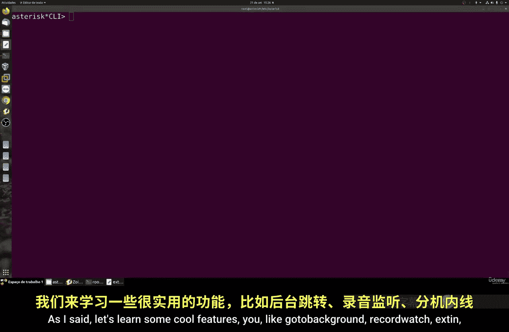
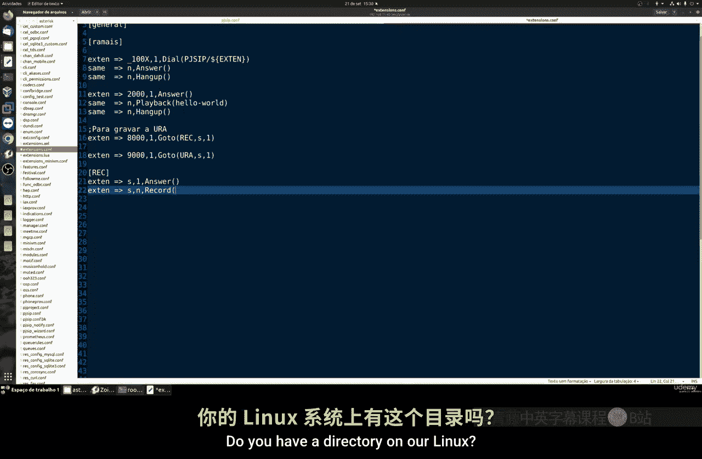
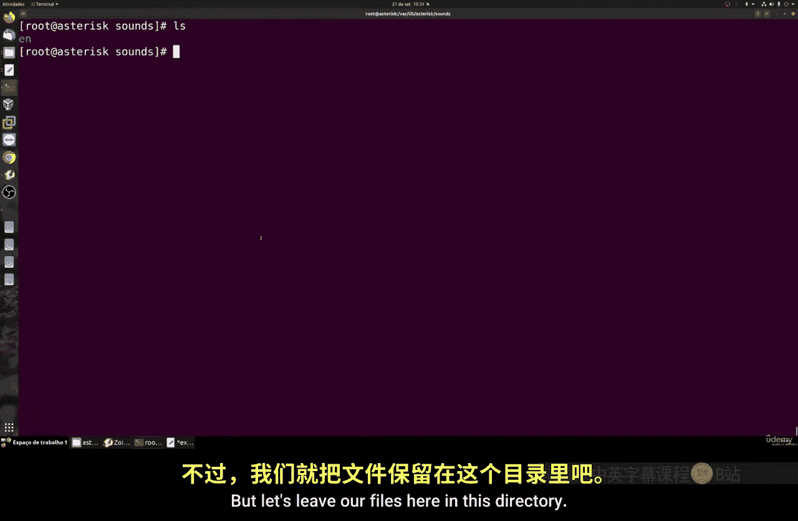
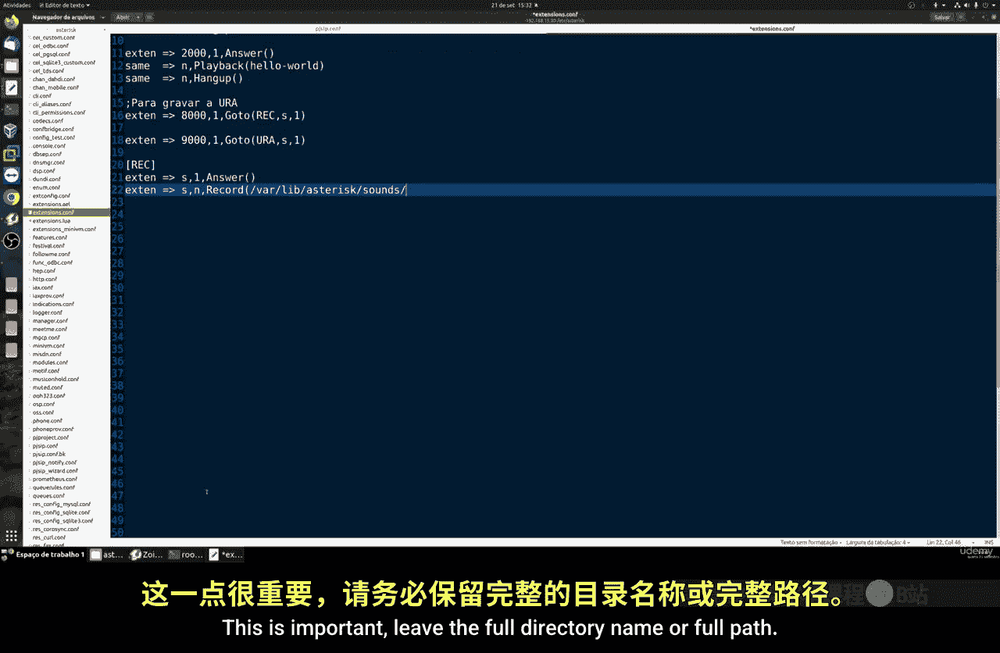
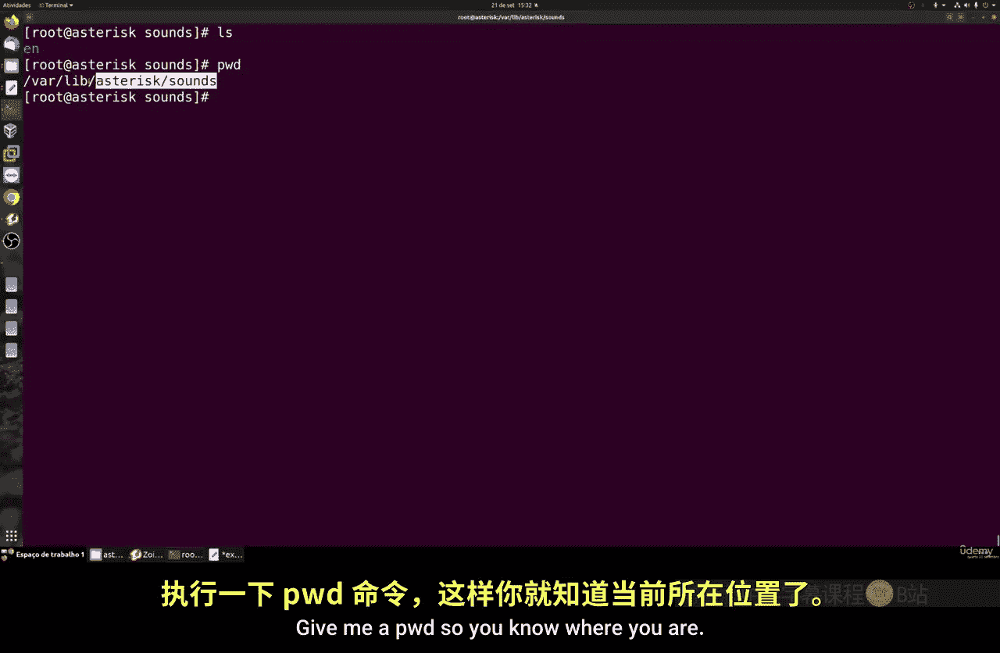
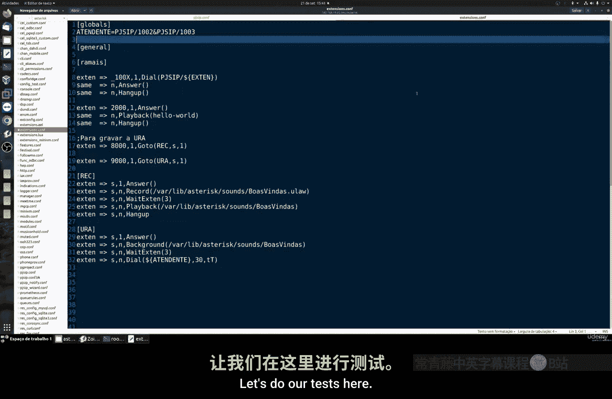
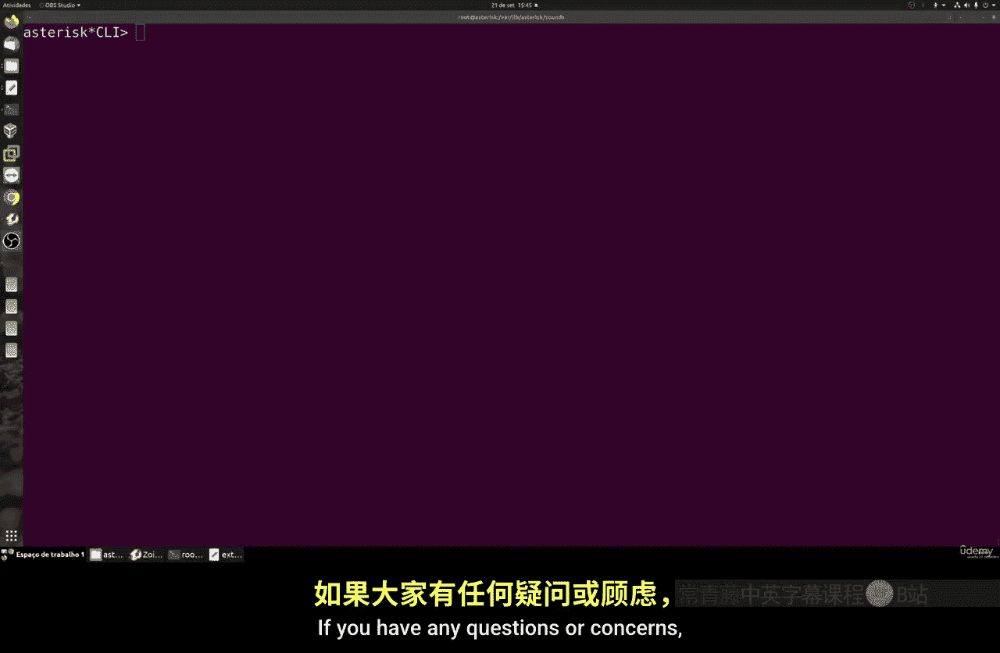

# 076：创建简单IVR系统 📞

在本节课中，我们将学习如何在Asterisk系统中创建一个简单的交互式语音应答系统。IVR系统是当你致电客服中心时，自动接听并引导用户的机器人语音系统。我们将通过配置拨号计划来实现录音、播放和呼叫转接功能。

---

## 概述

我们将创建一个包含两个主要功能的IVR系统：一个用于录制欢迎语音的上下文，另一个用于播放该语音并引导用户操作的IVR上下文。核心步骤包括使用`GoTo`函数进行跳转、使用`Record`函数录音，以及使用`Background`函数播放可中断的语音提示。

---



## 创建拨号计划

首先，我们需要在Asterisk的拨号计划配置文件（通常是`/etc/asterisk/extensions.conf`）中定义我们的IVR逻辑。

上一节我们介绍了拨号计划的基本结构，本节中我们来看看如何构建IVR的各个部分。

### 使用GoTo函数进行跳转

`GoTo`函数用于将呼叫重定向到拨号计划中的另一个部分。其基本语法如下：

```
GoTo(context,extension,priority)
```

以下是创建两个跳转扩展的示例，一个指向录音上下文，另一个指向IVR上下文。

```
exten => 8000,1,GoTo(record,s,1)

exten => 9000,1,GoTo(ivr,s,1)
```



*   **8000**：用户拨打此分机将进入录音流程。
*   **9000**：用户拨打此分机将进入IVR菜单流程。

---

### 创建录音上下文



现在，我们来创建名为`record`的上下文。当呼叫跳转至此，系统将引导用户录制一段语音。





```
[record]
exten => s,1,Answer()
exten => s,2,Record(/var/lib/asterisk/sounds/custom/welcome.gsm)
exten => s,3,Wait(3)
exten => s,4,Playback(/var/lib/asterisk/sounds/custom/welcome)
exten => s,5,Hangup()
```

以下是每一行命令的详细解释：

1.  `Answer()`：接听来电，这是必需的步骤。
2.  `Record(...)`：开始录音。需要指定完整的文件保存路径和文件名（如`welcome.gsm`）。用户录制完成后需按`#`键结束。
3.  `Wait(3)`：等待3秒，提供一个缓冲。
4.  `Playback(...)`：播放刚才录制的音频文件。注意，此处无需指定文件扩展名（如`.gsm`），Asterisk会自动根据终端使用的编解码器选择合适格式的文件。
5.  `Hangup()`：挂断电话。

**重要提示**：录音文件应保存在Asterisk的标准声音目录下，例如`/var/lib/asterisk/sounds/`。你可以使用`pwd`命令确认当前所在目录。

---

### 创建IVR上下文

接下来，我们创建名为`ivr`的上下文。这里使用`Background`函数播放欢迎语音，用户可以在语音播放过程中直接按键选择，无需等待播放完毕。

```
[ivr]
exten => s,1,Answer()
exten => s,2,Background(/var/lib/asterisk/sounds/custom/welcome)
exten => s,3,Wait(3)
exten => s,4,Dial(SIP/1002&SIP/1003,20)
exten => s,5,Hangup()
```

以下是每一行命令的详细解释：

1.  `Answer()`：接听来电。
2.  `Background(...)`：播放欢迎语音。与`Playback`不同，`Background`允许用户通过按键打断语音并进入下一步。
3.  `Wait(3)`：等待用户输入3秒。
4.  `Dial(...)`：呼叫坐席分机。这里示例同时呼叫分机1002和1003，超时时间为20秒。`&`符号表示同时振铃。
5.  `Hangup()`：挂断电话。

为了使配置更灵活，我们可以使用全局变量来定义坐席分机。

```
[globals]
ATTENDANT=SIP/1002&SIP/1003
```

然后，在`Dial`函数中引用这个变量：

```
exten => s,4,Dial(${ATTENDANT},20)
```

这样，如果需要修改坐席分机，只需在`[globals]`部分更改一次即可。

---



## 测试系统

配置完成后，需要重新加载Asterisk的拨号计划以使更改生效。

1.  保存配置文件。
2.  在Asterisk CLI中执行命令：`dialplan reload`。
3.  使用软电话或硬件话机进行测试：
    *   拨打**8000**，根据提示录制语音，按`#`键结束，系统会回放录音。
    *   拨打**9000**，系统会播放录制好的欢迎语音，并提示你进行选择（本例中直接转接到坐席）。

如果录音成功，你可以在指定的目录（如`/var/lib/asterisk/sounds/custom/`）找到生成的音频文件（如`welcome.gsm`）。你可以将此文件导出，使用音频编辑软件为其添加背景音乐或进行其他处理。

---

## 总结




本节课中我们一起学习了如何在Asterisk中构建一个基础的IVR系统。我们掌握了三个核心功能：使用`GoTo`实现上下文跳转；使用`Record`录制自定义语音提示；以及使用`Background`播放可中断的语音菜单并最终转接至坐席。通过定义清晰的上下文和利用全局变量，你可以创建出结构清晰、易于维护的交互式语音应答流程。