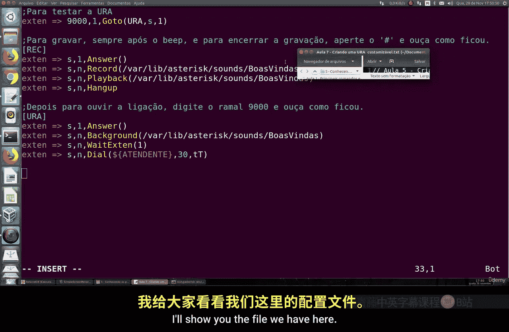
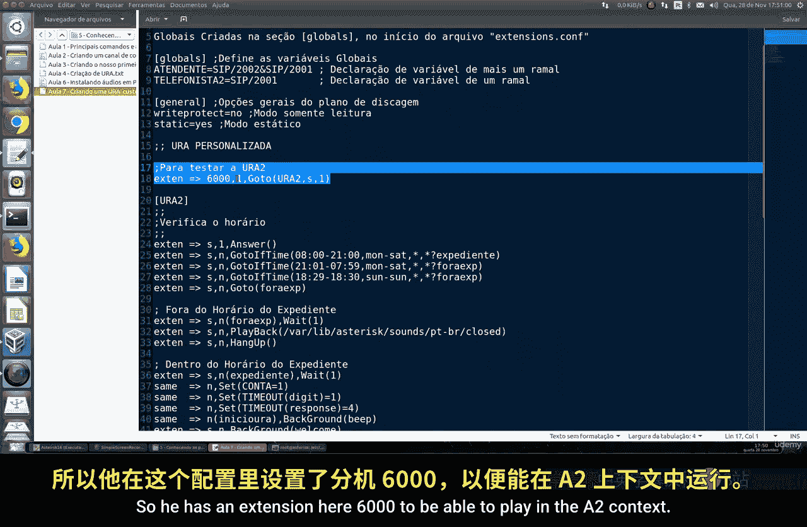
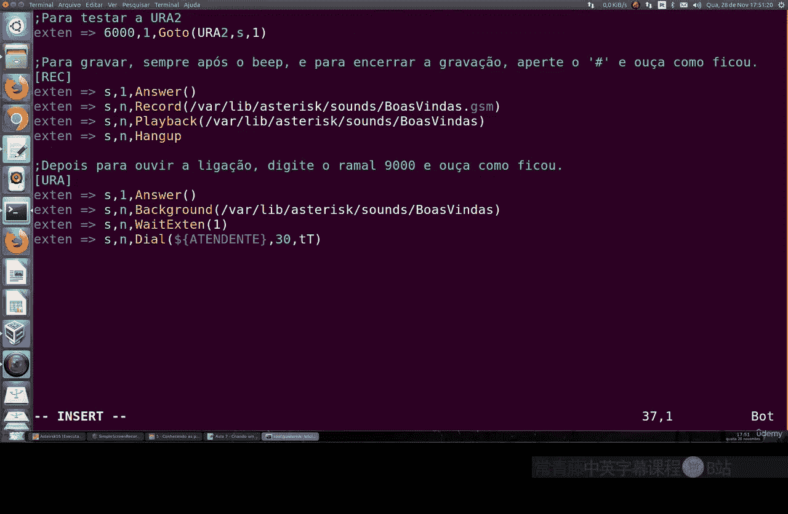
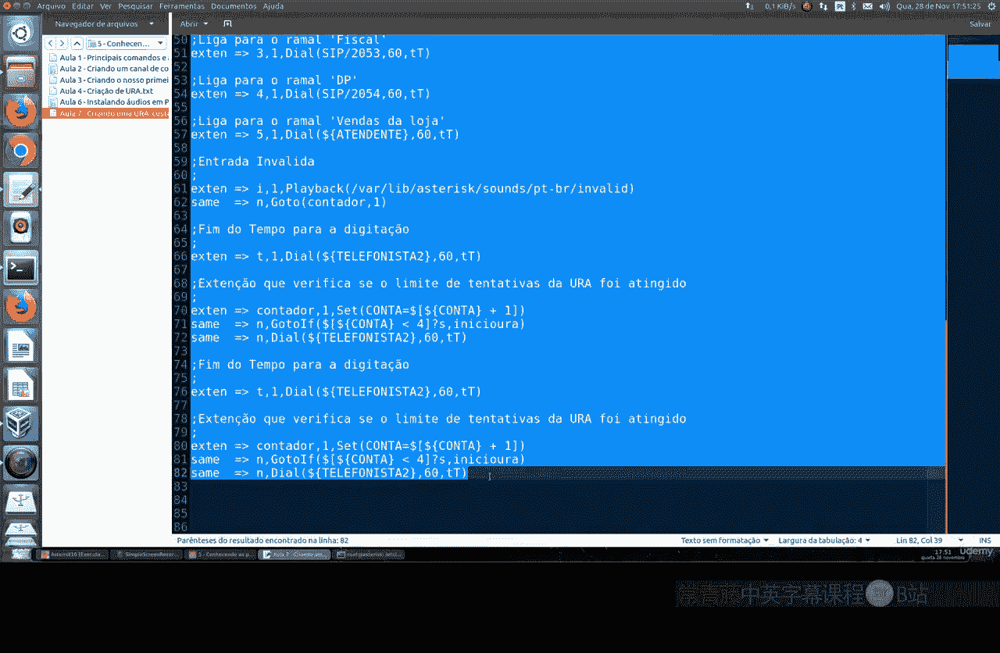
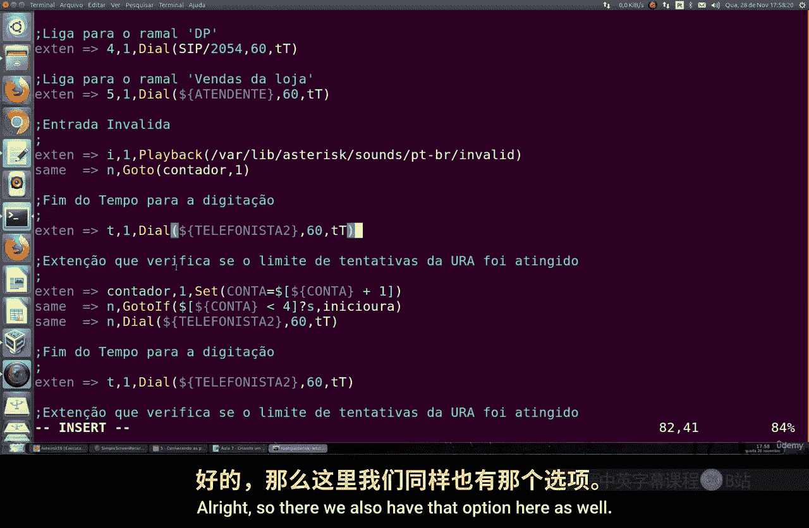
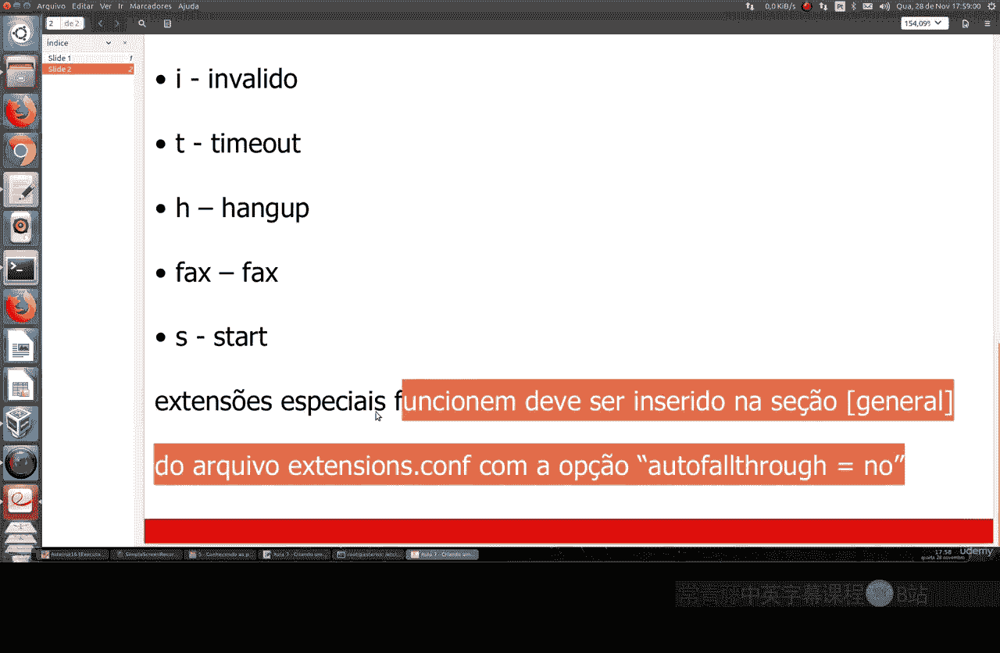
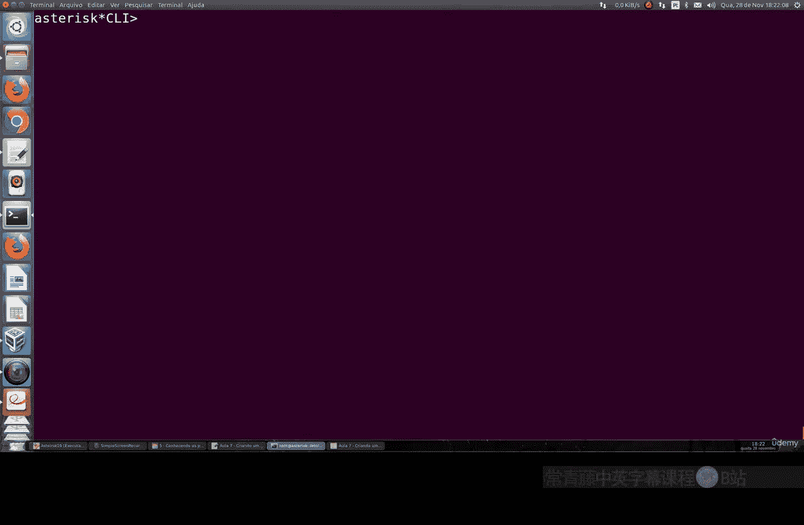

# 077：创建可自定义IVR 📞

在本节课中，我们将学习如何创建一个可自定义的IVR（交互式语音应答）系统。这个系统比上一节课创建的更高级，允许你根据公司的工作时间、不同的部门选项以及用户输入来定制呼叫流程。





---



上一节我们创建了一个简单的会议系统。本节中，我们将创建一个更复杂的、可自定义的IVR系统。



首先，我们需要回到我们的 `extensions.conf` 文件。在 `[conference]` 上下文之后，我们将创建一个新的、不同的上下文。

以下是我们要下载并使用的文件内容概览：


这是一个个性化的IVR配置。它包含一个分机号 `6000`，用于在 `A2` 上下文中播放。


在 `[extensions]` 上下文内部，我们将创建一个新的分机 `6000`。这个分机将指向另一个名为 `U2` 的上下文。


让我把配置复制到这里。虽然看起来很长，但我们会一步步解释每个部分的含义。理解后，你会发现它其实很简单，并且你可以根据需要自由扩展。


这个IVR的核心逻辑是首先检查时间。当外部电话呼入你的公司时，所有呼叫都会被强制路由到 `S` 上下文。在 `S` 上下文中，系统会检查当前是否属于办公时间。

以下是时间检查的逻辑：
*   如果你的公司是24小时营业，你可以将时间设置为 `08:00-00:00`，从周一到周日。
*   如果当前是周六、周日，或者在工作日的非标准时间（例如，我设置的晚上21点到次日早上7点），则被视为非办公时间。

系统使用 `if` 命令进行时间条件判断。根据判断结果，呼叫将被路由到不同的上下文：`business-hours`（办公时间）或 `out-of-office-hours`（非办公时间）。

如果处于非办公时间，IVR会播放一个提示音，例如：“公司目前已经下班，请稍后再试。” 你可以使用上一节课下载的音频文件，或者录制自己的提示音。

如果处于办公时间，IVR会进入 `business-hours` 上下文。这里，我们设置了一个计数器，用于记录同一呼叫者输入错误选项的次数，以防止用户因不熟悉操作而反复出错。

在 `business-hours` 上下文中，IVR会播放欢迎语背景音。例如：“欢迎致电XPTO公司，采购请按1...”。然后，根据用户按下的数字键（如1、2、3），将呼叫转接到相应的部门分机（例如 `2051`, `2052`, `2053`）。

如果用户输入了无效的选项（例如按了10），IVR会播放无效输入提示音，并增加错误计数器。如果错误次数达到4次，系统会将呼叫直接转接到总机（例如分机 `2001`）。

此外，IVR还处理超时情况（使用变量 `T`）。如果用户在提示后长时间没有输入，呼叫也会被转接到总机。




这里展示了Asterisk中一些特殊的扩展名：
*   `i`： 处理无效输入。
*   `fax`： 处理传真（如果配置了传真服务）。
*   `s`： 启动扩展（通常用于IVR的开始）。



这些特殊字符能帮助你更灵活地构建IVR逻辑。


配置中还包含了对尝试次数限制的检查逻辑。虽然初看有些复杂，但结构清晰，易于理解。

现在，让我们进行测试。保存配置文件后，我们需要在Asterisk CLI中重新加载配置：

```bash
asterisk -r
reload
```

我们可以使用命令 `dialplan show u2` 来查看 `U2` 上下文的拨号方案，确认配置已正确加载且结构清晰。

要测试IVR，我们可以呼叫分机 `6000`。现在，我用手机呼叫分机 `6000` 进行测试。IVR会播放我录制的欢迎语：“欢迎致电XPTO公司...”。我可以尝试按1（采购部），或者按一个不存在的选项（如5），来观察系统的反应。

你也可以测试超时情况：呼叫 `6000` 后，等待8秒不进行任何操作，看看呼叫是否会被转接到总机。

请多做测试，尝试更换音频文件，并输入无效选项来熟悉整个IVR的工作流程。我将这个配置作为学习材料留给你们，可以在自己的生产环境中研究和修改。




本节课中我们一起学习了如何构建一个功能完整的可自定义IVR系统。我们了解了如何根据时间路由呼叫、设置部门选项、处理无效输入和超时，以及使用特殊扩展来增强IVR功能。你可以根据自己公司的具体需求，自由地修改和扩展这个模板。