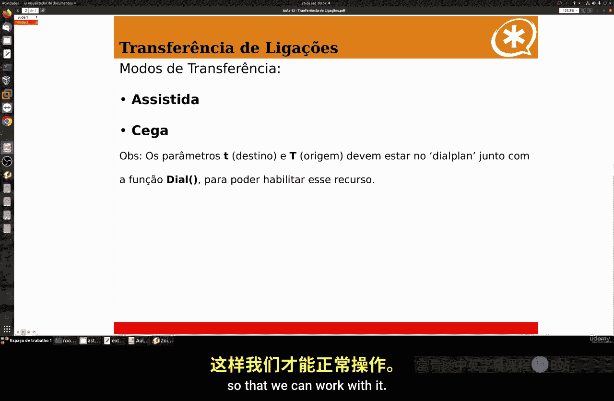
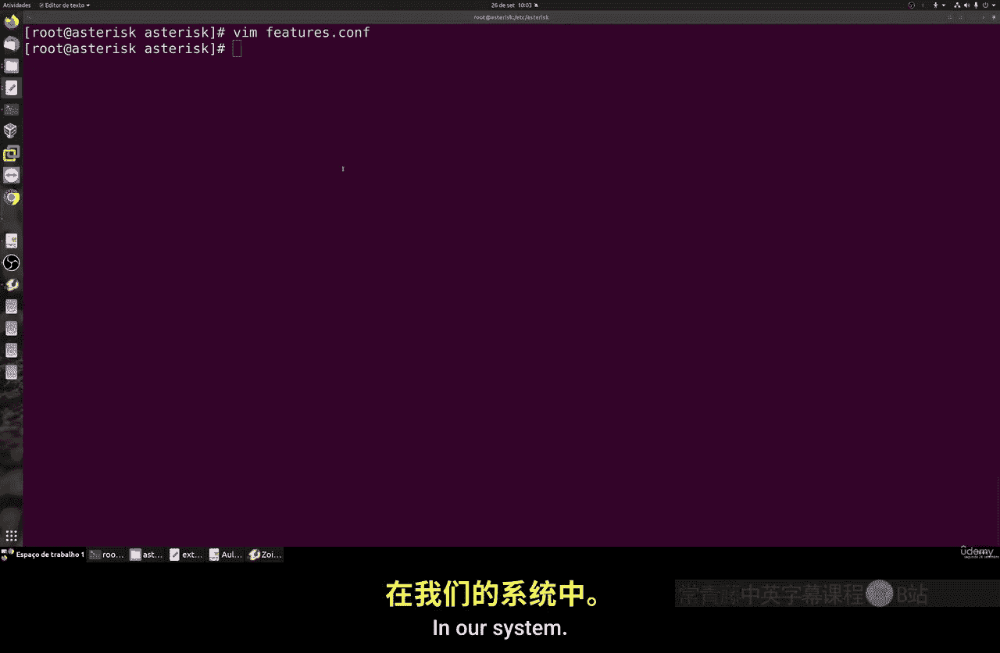
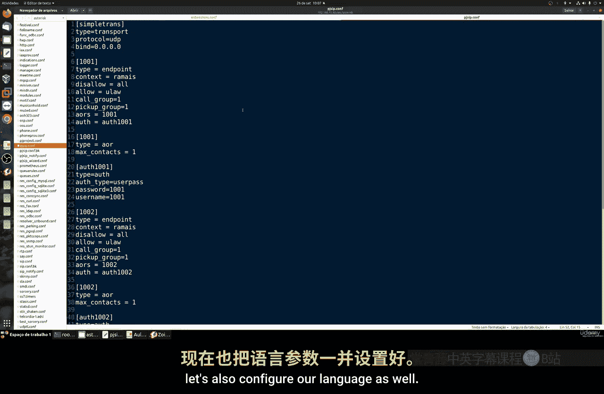
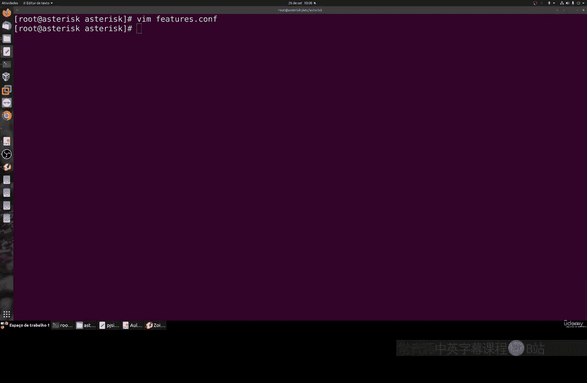
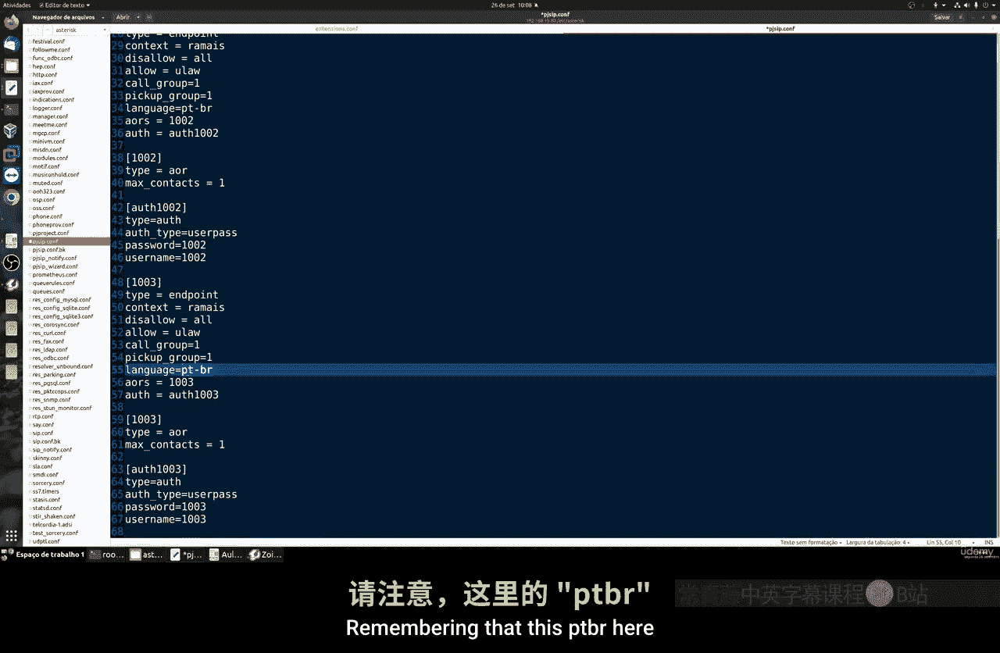
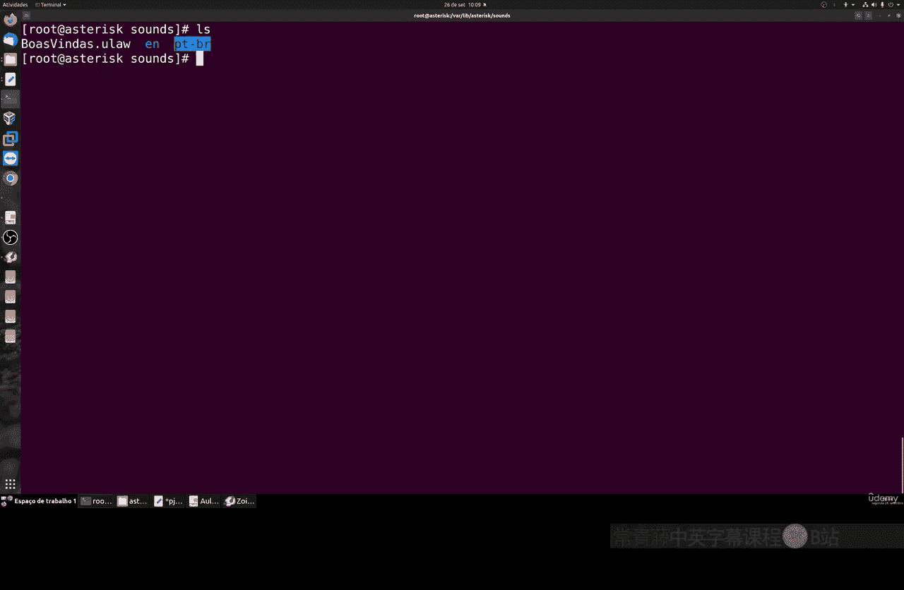
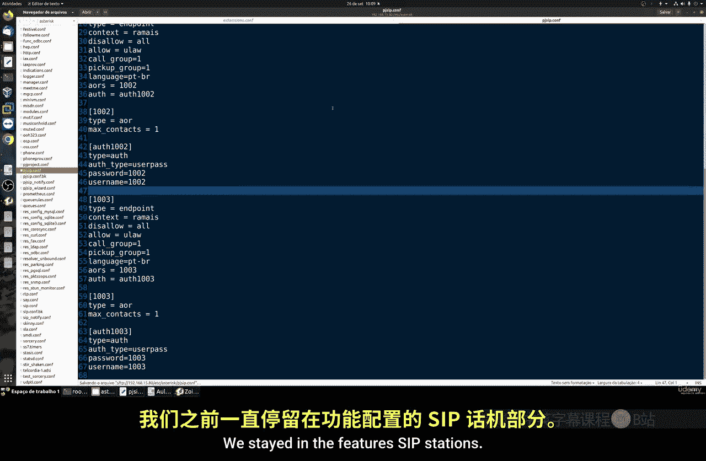
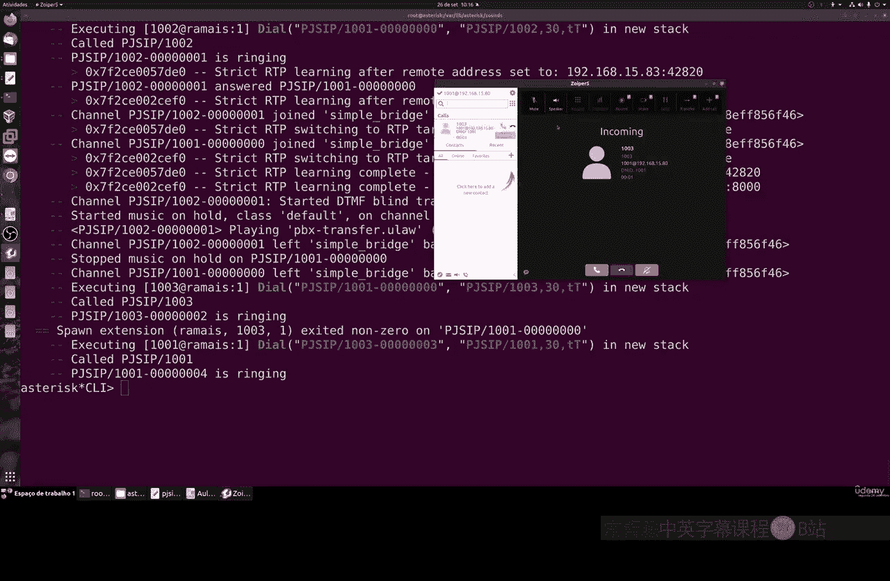

# 078：配置Asterisk呼叫转移

在本节课中，我们将学习如何在Asterisk系统中配置两种主要的呼叫转移功能：辅助转移和盲转。这是构建电话网络、呼叫中心或简单PBX服务的重要技能。



## 概述

呼叫转移允许将正在进行的通话从一个分机转移到另一个分机。这对于企业内部转接、部门间协作或客户服务场景至关重要。我们将配置两种转移方式，并了解它们的工作原理和适用场景。

## 配置转移功能

首先，我们需要编辑Asterisk的功能配置文件来启用和配置转移参数。

上一节我们介绍了课程目标，本节中我们来看看具体的配置文件修改步骤。

1.  打开终端，导航到Asterisk配置目录。
    ```bash
    cd /etc/asterisk
    ```
2.  编辑 `features.conf` 文件。
    ```bash
    nano features.conf
    ```
3.  在文件中，我们需要关注两个关键参数：
    *   **盲转**：通常由按键 `#` 触发，默认已配置。
    *   **辅助转移**：需要手动启用。找到 `atxfer` 相关行，取消注释（移除行首的`;`）并进行配置。例如，可以将其设置为 `*2` 作为触发码。
4.  此外，可以调整其他设置，如 `transfertimeout`（转移超时时间）和启用成功/失败的提示音（`transferdigittimeout`, `atxferdropcall`, `atxfercallback` 等）。
5.  保存并关闭文件。

## 配置分机文件

接下来，我们需要在分机拨号方案中启用转移功能。



上一节我们配置了功能文件，本节中我们来看看如何修改分机配置文件。

1.  编辑 `extensions.conf` 文件。
    ```bash
    nano extensions.conf
    ```
2.  在相应的分机配置段落中（例如分机1000），在 `Dial` 应用的参数中添加 `Tt` 选项。`T`（大写）允许发起转移，`t`（小写）允许接收转移。同时可以设置呼叫等待时间。
    ```asterisk
    exten => 1000,1,Dial(PJSIP/1000,30,Tt)
    ```
3.  保存并关闭文件。

## 配置PJSIP与分组

为了使分机之间能够互相转移和代接，我们需要在PJSIP配置中设置呼叫代接组。





以下是配置PJSIP分机组的关键步骤：





*   编辑 `pjsip.conf` 文件。
*   为每个分机（如1001, 1002, 1003）配置 `pickupgroup` 和 `callgroup` 参数。将它们的值设为相同的数字（例如都设为1），表示它们属于同一个代接组。
    ```asterisk
    [1001]
    type=endpoint
    ...
    pickupgroup=1
    callgroup=1

    [1002]
    type=endpoint
    ...
    pickupgroup=1
    callgroup=1
    ```
*   保存并关闭文件。



## 设置系统语言

为了在转移过程中听到母语提示音，我们需要设置系统语言。

上一节我们配置了网络和分组，本节中我们确保提示音语言正确。

1.  在 `pjsip.conf` 的每个分机配置中，添加 `language` 参数，例如设置为 `pt_BR`（巴西葡萄牙语）。请确保此名称与 `/var/lib/asterisk/sounds/` 目录下的语言文件夹名称完全一致。
    ```asterisk
    [1001]
    type=endpoint
    ...
    language=pt_BR
    ```
2.  保存并关闭文件。

## 重载配置与测试

完成所有配置后，需要重载Asterisk以使更改生效。

以下是重载配置并进行测试的步骤：



*   在Asterisk CLI中执行重载命令：
    ```asterisk
    asterisk -rx “core restart now”
    ```
    或分别重载模块：
    ```asterisk
    module reload
    ```
*   重载后，可以使用 `features show` 命令查看已启用的功能，确认 `blindxfer` 和 `atxfer` 已列出。
*   **进行测试**：
    *   **盲转测试**：用分机A呼叫分机B并接通。在分机B上按 `#`，然后输入目标分机C的号码。此时分机B与A的通话会立即结束，呼叫被转移到C并开始振铃。如果C未接听，呼叫会中断。
    *   **辅助转移测试**：用分机A呼叫分机B并接通。在分机B上按配置的触发码（如`*2`），然后输入目标分机C的号码。此时分机B会听到C的振铃音，但B与A的通话保持连接。直到C接听，三方可以短暂通话后B挂断，完成转移；如果C未接听，B可以取消转移，继续与A通话。

## 总结


本节课中我们一起学习了Asterisk呼叫转移的配置。我们掌握了两种转移方式：**盲转**（直接、快速，但若无人接听则呼叫失败）和**辅助转移**（可控、可靠，确保接通前不中断原通话）。关键配置涉及 `features.conf`、`extensions.conf` 和 `pjsip.conf` 文件，并理解了 `Tt` 参数、代接组和语言设置的作用。请注意，网络延迟和NAT类型可能影响转移功能。