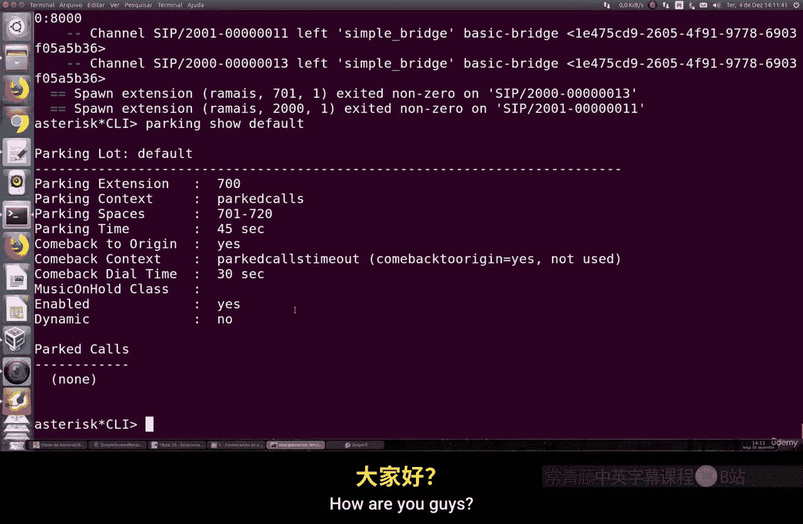

# 079：通话驻留功能详解 🎧

在本章中，我们将学习 Asterisk 通话系统中的“通话驻留”功能。当话务员暂时无法接听，而客户需要等待时，我们可以使用此功能。它本质上是一种将呼叫者置于虚拟等待区（类似于呼叫中心的等待队列）的方法，直到有可用的话务员接听。

## 概述

通话驻留功能允许系统将呼叫转移到一条不存在的虚拟分机上，使其在“等待室”中保持连接。在此期间，呼叫者通常会听到音乐或其他预先设置的音频。此功能在 Asterisk 中默认已启用并配置好，我们主要需要了解其工作原理并进行简单测试。

## 核心配置文件

上一节我们介绍了通话驻留的概念，本节中我们来看看其核心配置文件。

配置文件位于 `res_parking.conf`。该文件包含了所有与通话驻留相关的设置。其中最关键的部分是 `parkeddynamic` 参数。

以下是该配置文件中几个重要的配置项：

*   **`parkeddynamic`**: 此参数设置为 `yes` 时，系统会动态管理等待室中的连接。
*   **`parkext`**: 定义用于触发驻留功能的拨号前缀，默认为 `700`。
*   **`parkpos`**: 定义驻留位（即虚拟等待室）的号码范围，默认为 `701-720`。你可以根据需要修改此范围，无需手动创建这些分机。
*   **`context`**: 定义驻留功能的上下文（context）名称，默认为 `parkedcalls`。这个上下文需要在分机配置中被引用。
*   **`parkingtime`**: 设置通话允许被驻留的最长时间（秒）。你可以根据服务质量要求，将其设置为例如5分钟或10分钟。

此外，文件中还包含其他高级设置，例如 `parkedcalltransfers`（允许从驻留状态恢复后进行呼叫转移）以及一些其他上下文配置示例。这些示例展示了如何创建自定义的驻留逻辑，例如从800到850寻找空位。对于基础使用，通常无需修改这些默认配置。

## 启用通话驻留功能

了解了配置文件后，我们需要在分机配置中启用此功能。

我们需要编辑分机配置文件（例如 `extensions.conf`），在相应的分机上下文（context）中包含（include）驻留上下文。我们之前已经创建并启用了呼叫系统。

以下是具体的配置步骤：

1.  找到你正在使用的分机上下文（例如 `[internal]`）。
2.  使用 `include` 命令引入驻留上下文。`include` 是 Asterisk 中用于引用其他配置文件或上下文的指令。
3.  同时，确保在该上下文中启用了呼叫驻留功能。这通常通过一个特定的应用（如 `ParkedCall`）或拨号方案实现，但在我们的基础配置中，包含上下文即已足够。

配置示例如下：
```ini
[internal]
; 其他分机配置...
include => parkedcalls
```
配置完成后，保存文件。

## 验证与测试

配置完成后，让我们进入 Asterisk 命令行界面（CLI）进行验证和测试。

首先，重新加载拨号方案以使更改生效：
```bash
dialplan reload
```
接着，使用以下命令查看当前的驻留设置：
```bash
parking show settings
```
该命令将显示信息，例如：使用 `700` 前缀触发驻留，上下文为 `parkedcalls`，可用位置为19个（701-720），最大容纳人数为45方（参与者），以及播放的音乐类别等。

你还可以使用以下命令查看当前已被驻留的通话：
```bash
parking show parkedcalls
```

现在，让我们进行一个实际测试：
1.  从分机 2000 呼叫分机 2001。
2.  在通话中，按下 `*700`（或你配置的前缀）。这将把当前通话驻留。
3.  系统会提示你通话已被驻留到某个位置（例如 701）。
4.  从任何分机（例如 2001）直接拨打驻留位号码 `701`。
5.  接起电话，即可与之前被驻留的呼叫者（分机 2000）恢复通话。

在整个过程中，密切关注 Asterisk CLI 中输出的日志信息至关重要。它能告诉你呼叫被驻留到了哪里、由谁接起、等待期间播放了何种音乐等所有细节。例如，日志会显示类似 `Call from 2000 parked at 701` 和 `2001 answered parked call from 2000` 的信息。

为了获得更好的体验，建议下载并配置所有需要的语音提示文件（例如巴西葡萄牙语提示音），这能确保呼叫者听到清晰、正确的指引。

## 总结

本节课中我们一起学习了 Asterisk 的通话驻留功能。我们了解了其基本概念是创建一个虚拟等待区，查看了核心配置文件 `res_parking.conf` 中的关键参数，学会了如何在分机配置中通过 `include` 命令启用该功能，并最终通过命令行验证和实际通话测试了整个流程。

配置和使用该功能非常简单。关键在于理解配置项的含义，并通过测试（尤其是在动态模式下）观察通话的流向，使用 `parking show` 系列命令监控驻留状态。如有任何问题，请在课程论坛中提出。

---



*（示意图：通话驻留流程）*


*（示意图：Asterisk CLI 中的驻留信息显示）*