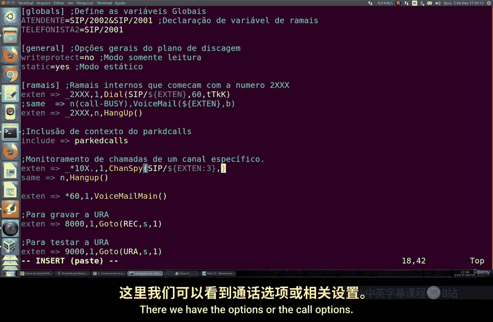
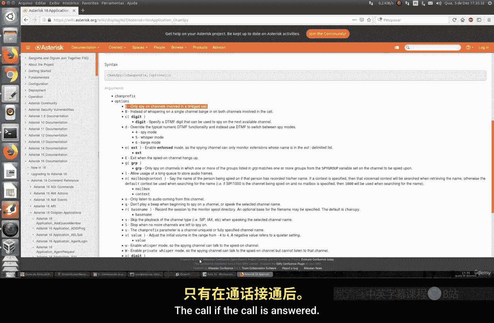
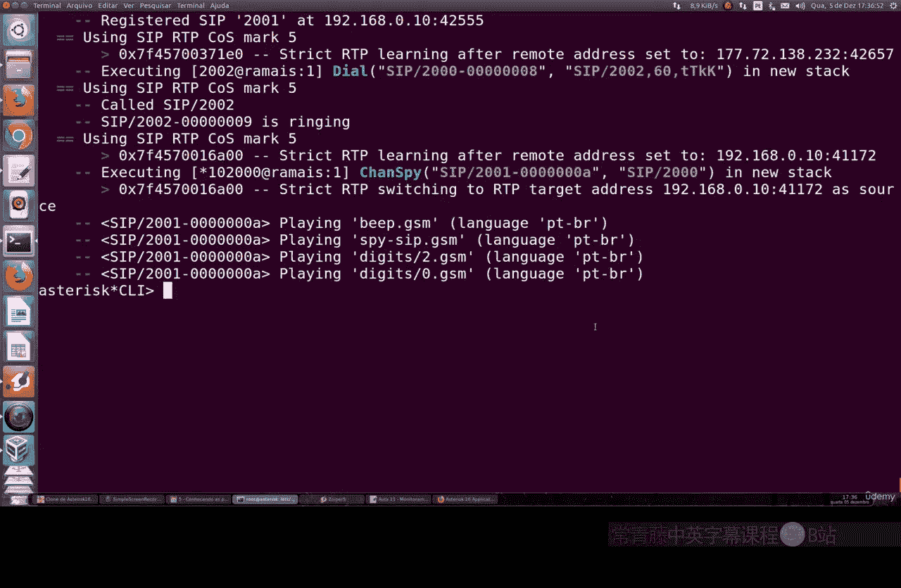

# 080：通话监控 - Chanspy

在本节课中，我们将学习Asterisk中的通话监控功能，特别是如何使用`Chanspy`来监听通话。我们将了解如何设置通用的监听规则，以及如何针对特定分机进行监听。

上一节我们介绍了基础的呼叫功能，本节中我们来看看如何实现通话监听。

## 创建通用监听分机

首先，我们需要在`extensions.conf`文件中创建一个用于监听的分机。我们将创建一个分机`40`，用于监听当前最活跃的通话。

以下是创建通用监听分机的步骤：

1.  打开`extensions.conf`文件。
2.  添加以下配置：
    ```
    exten => 40,1,Answer()
    same => n,Chanspy()
    same => n,Hangup()
    ```
3.  保存文件并重新加载拨号方案。

配置完成后，当您拨打分机`40`时，系统将自动监听当前最长的活跃通话。如果有新的通话变得最活跃，监听会自动切换到新的通话上。

## 监听特定分机

通用监听虽然方便，但有时我们需要监听一个特定的分机。为此，我们可以创建一个更精确的监听规则。



以下是创建监听特定分机规则的步骤：

1.  再次编辑`extensions.conf`文件。
2.  添加一个使用模式匹配的扩展，例如监听以`*10`开头的分机号：
    ```
    exten => _*10X.,1,Answer()
    same => n,Chanspy(SIP/${EXTEN:3})
    same => n,Hangup()
    ```
    *   这里的`_*10X.`是一个模式，匹配任何以`*10`开头，后跟任意数字的分机号。
    *   `${EXTEN:3}`是一个变量，它去掉了分机号码的前三位（即`*10`），剩下的部分就是我们要监听的实际分机号（例如`2000`）。
3.  保存并重新加载配置。

现在，如果您想监听分机`2000`，只需拨打`*102000`。系统会自动去掉`*10`，并对`SIP/2000`这个通道启动监听。



## Chanspy的应用选项

`Chanspy`应用程序提供了一些选项，可以改变监听的行为。您可以在官方文档中找到这些选项。

以下是几个关键的选项：



*   **b**：在开始监听时，不播放任何提示音。
*   **w**：允许监听者（间谍通道）与被监听通道进行单向通话（可以说，但听不到对方）。
*   **W**：允许监听者与被监听通道进行双向通话。
*   **q**：仅监听来自被监听通道的音频。
*   **B**：仅在通话被接听后开始监听。

您可以在`Chanspy()`中指定这些选项，例如`Chanspy(SIP/2000, w)`来启用单向通话功能。

本节课中我们一起学习了Asterisk中`Chanspy`的基本用法。我们首先创建了一个通用的监听分机`40`，用于监听最活跃的通话。接着，我们学习了如何通过模式匹配（如`*10X.`）来创建监听特定分机的规则，并使用`${EXTEN:3}`变量来提取目标分机号。最后，我们简要介绍了`Chanspy`的一些功能选项，如`b`、`w`、`q`等，它们可以为您提供更灵活的通话监控方式。