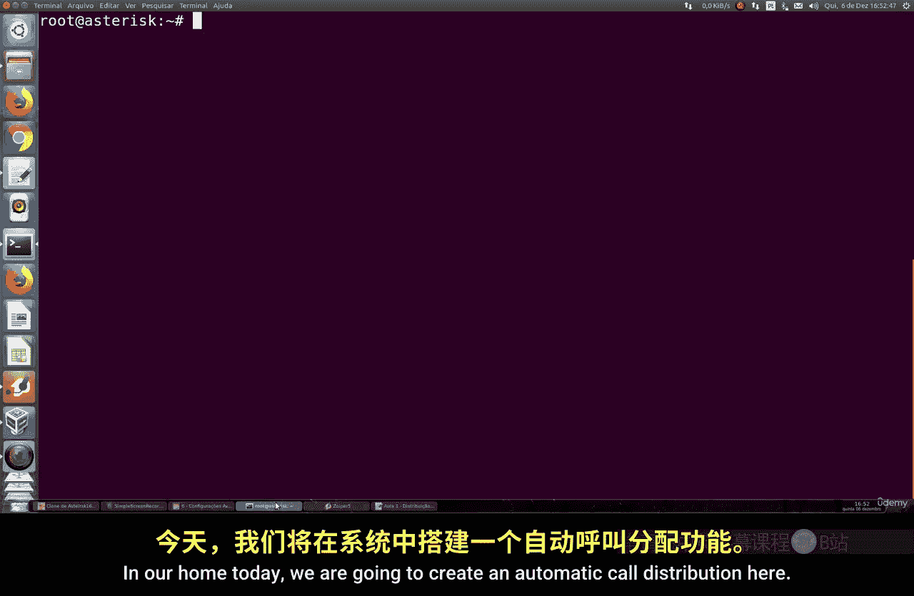
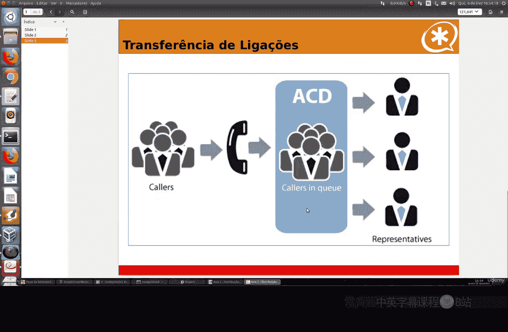
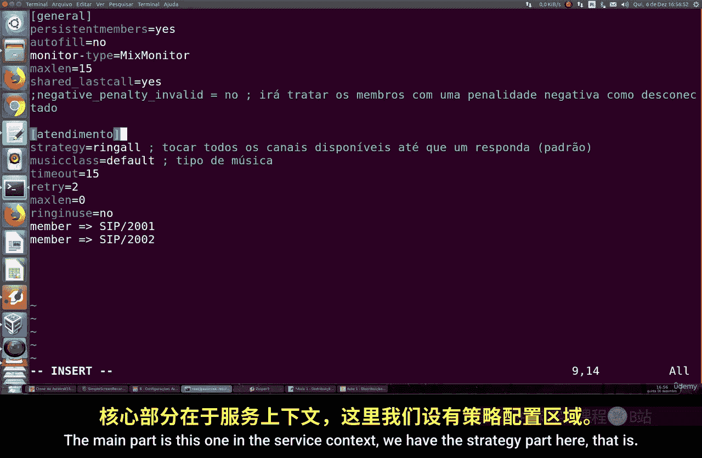
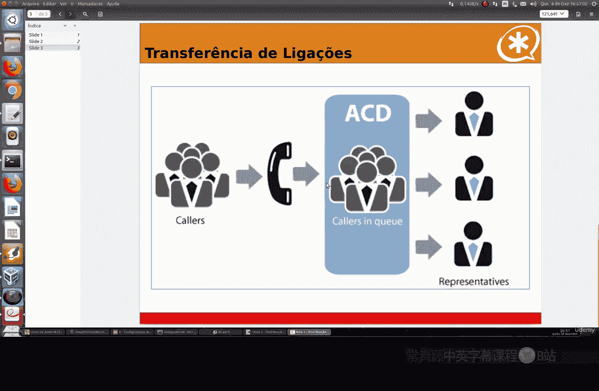
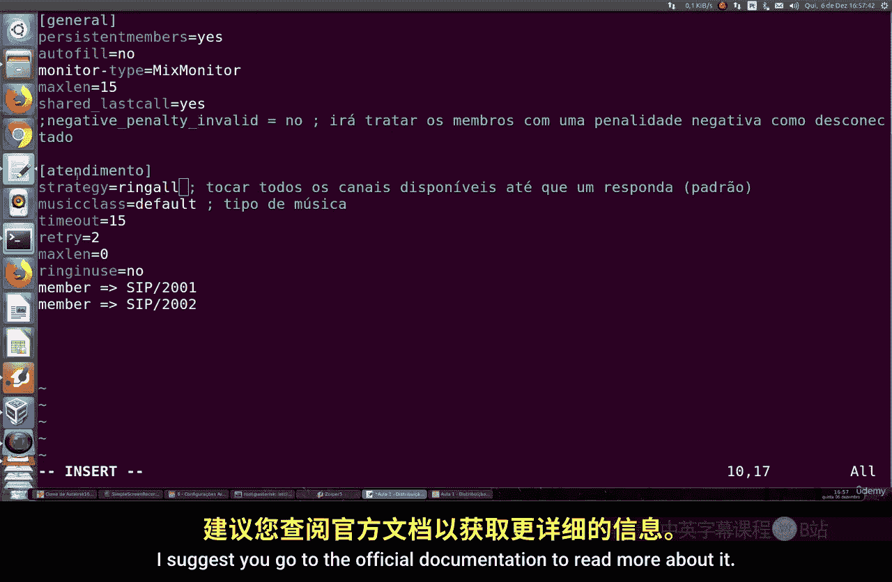
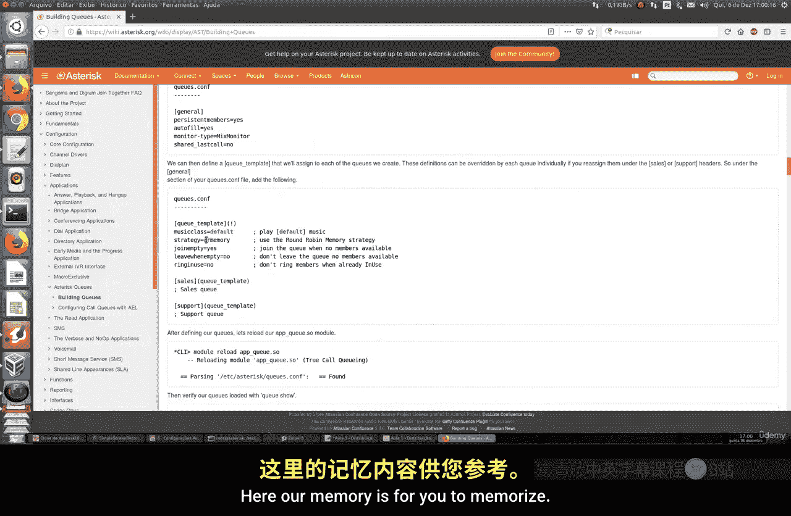
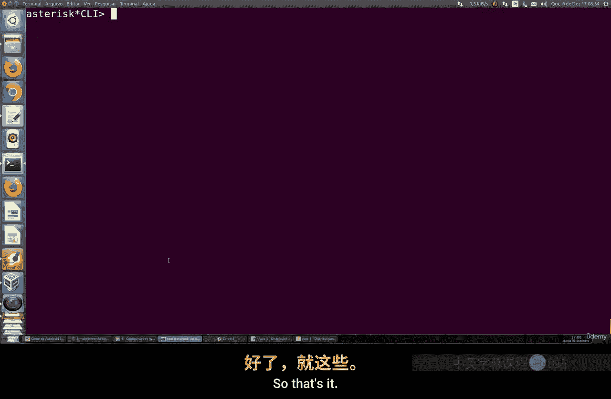

# 081：自动呼叫分配（ACD）📞



在本节课中，我们将学习如何在Asterisk系统中创建和配置自动呼叫分配（ACD）队列。ACD是呼叫中心的核心功能，用于自动将呼入或呼出的电话均匀地分配给客服坐席。

## 概述

自动呼叫分配（ACD）是Asterisk用于自动分配呼入或呼出电话的方式。它广泛应用于呼叫中心，主要分为主动服务和接收服务两种类型。接收服务是最常见的功能，负责处理所有呼入的连接。

为了帮助理解其工作原理，请看下面的示意图。当多个呼叫同时到达时，ACD会将其均匀地分配给不同类型的通道或分机，例如SIP分机、IAX分机或任何其他类型的通道。




## 配置ACD队列

接下来，我们将进入Asterisk终端，开始配置我们的ACD队列。

首先，我们进入Asterisk的配置目录。在`/etc/asterisk`目录下，可以看到已有的配置文件。我们不会修改现有的其他分配规则配置文件，而是创建一个全新的队列配置文件。

我们将创建一个名为`queues.conf`的文件。在此之前，建议将现有的示例文件备份以供将来参考。

在配置文件中，主要包含两个部分。第一部分是`[general]`选项卡，用于设置通用参数。第二部分是具体的服务上下文（`[context-name]`），这是配置的核心。





在服务上下文中，最重要的设置之一是`strategy`，它定义了呼叫分配的策略。


## 分配策略详解



分配策略决定了当呼叫进入队列后，如何将其分配给坐席。



以下是几种主要的策略类型：
*   **`ringall`**：这是默认策略。它会同时振铃所有可用通道，直到有人接听。
*   **`random`**：随机选择一个可用坐席振铃。
*   **`leastrecent`**：振铃最近空闲时间最长的坐席或分机。
*   **`fewestcalls`**：振铃当前通话数量最少的坐席。
*   **`rrmemory`**：轮询坐席，但会记住上一次呼叫的坐席，从下一个开始。

建议查阅官方文档以获取所有策略的详细说明。


## 队列参数配置

除了策略，队列还有其他重要参数需要配置。

以下是队列配置中的关键参数：
*   `musicclass`：设置等待接听时播放的音乐类型。
*   `timeout`：设置振铃超时时间，例如15秒。
*   `ringinuse`：定义是否在坐席忙时也振铃。
*   `member`：添加属于该队列的成员（坐席分机）。务必确保只添加属于该特定服务的成员。

一个有用的选项是`penaltymemberslimit`。如果启用，系统会将具有高惩罚值的成员视为不可用，这对于处理长时间未响应或工作异常的坐席很有用。

配置完成后，保存并退出文件。

## 集成到拨号方案

现在，我们需要将队列集成到主拨号方案文件`extensions.conf`中。

在`[default]`上下文中添加以下内容：
```asterisk
exten => 70,1,Answer()
 same => n,Queue(service)
 same => n,Hangup()
```
这段代码表示，当拨打分机70时，首先接听电话，然后将其送入名为`service`的队列中等待分配，最后挂断。请确保队列名称与`queues.conf`中定义的上下文名称一致。

## 测试与验证

配置完成后，在Asterisk CLI中重新加载配置。

使用命令`show dialplan`检查分机70的配置是否正确。
使用命令`queue show service`可以查看名为`service`的队列状态，包括接听率、总呼叫数、各成员状态等有用信息。

现在进行测试。拨打分机70，观察呼叫如何被分配。使用默认的`ringall`策略时，所有可用坐席会同时振铃。

我们可以更改策略，例如改为`leastrecent`（振铃空闲时间最长的坐席）。重启服务后再次测试，会发现系统会优先呼叫最近接听最少的坐席。

还可以测试`rrmemory`策略，它会轮询坐席并记住上一次呼叫的位置。

通过`queue show`命令，可以实时跟踪当前正在处理的呼叫和被振铃的坐席。

## 总结



本节课中，我们一起学习了如何在Asterisk中配置自动呼叫分配（ACD）队列。我们了解了ACD的基本概念、配置文件的创建、各种分配策略（如`ringall`、`leastrecent`）的含义与设置方法，以及如何将队列集成到拨号方案并进行测试验证。ACD的配置过程直接明了，为构建呼叫中心功能提供了基础。