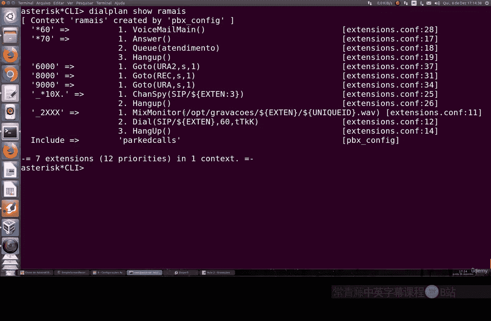
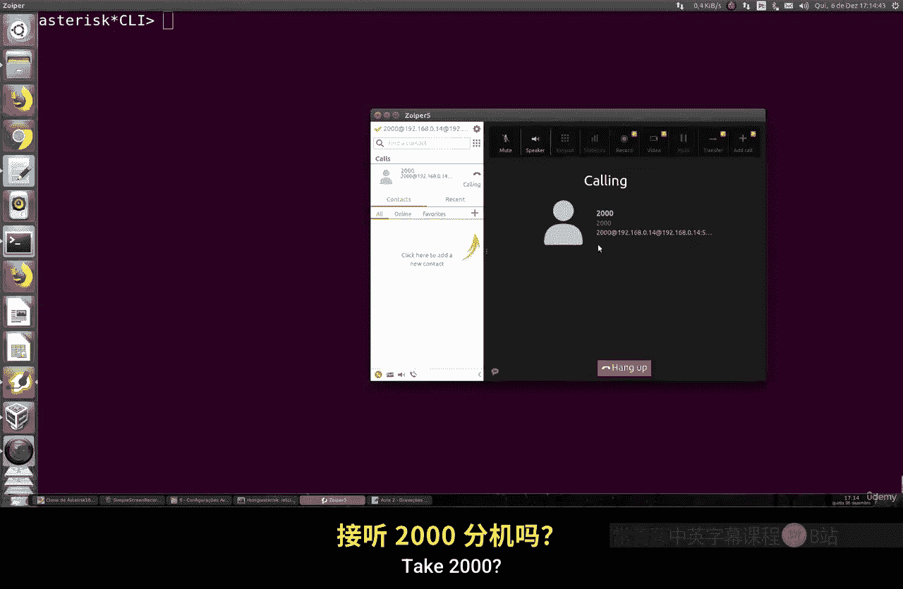
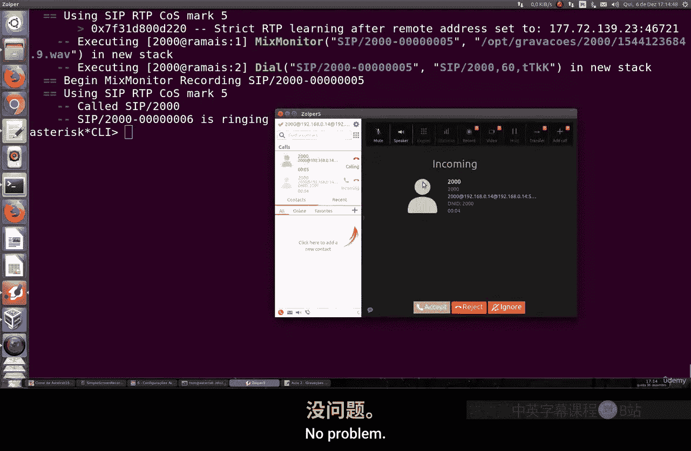
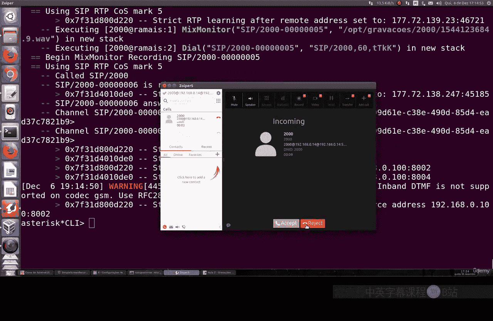
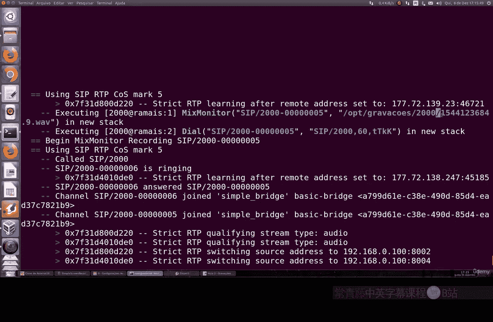
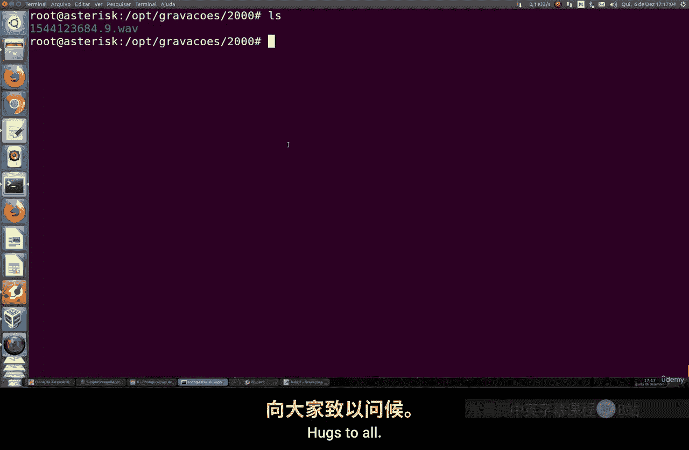

# 082：通话录音 📞

在本节课中，我们将学习如何在Asterisk系统中配置通话录音功能。这是一个非常实用的功能，可以帮助您保存重要的通话记录。

## 概述

通话录音是电话系统中的一个常见需求。在Asterisk中，我们可以通过简单的配置，自动录制所有拨打到特定分机的通话。本节将指导您完成这一配置过程。

## 配置录音功能

上一节我们介绍了分机的基本配置，本节中我们来看看如何为分机添加录音功能。

要启用录音，我们需要编辑分机的配置文件。具体来说，我们将修改拨打到分机2000的通话处理逻辑。

以下是配置录音的具体步骤：

1.  打开分机配置文件 `extensions.conf`。
2.  找到分机2000对应的配置段落。
3.  在配置中添加一行 `MixMonitor` 命令。

`MixMonitor` 是Asterisk中用于录制通话的命令。其基本语法格式如下：

```
MixMonitor(文件保存路径/${EXTEN}-${UNIQUEID}.wav)
```

在这个命令中：
*   **文件保存路径**：指定录音文件的存储目录。
*   **`${EXTEN}`**：这是一个变量，代表被呼叫的分机号码（例如2000）。
*   **`${UNIQUEID}`**：这是一个由系统生成的唯一标识符，确保每个录音文件都有独一无二的名字，即使在同一秒内有多个通话也不会冲突。
*   **`.wav`**：指定录音文件的格式为WAV。您也可以根据需要选择其他格式，如GSM或MP3，但需要注意格式兼容性和系统是否安装了相应模块。

## 录音文件管理

配置好录音命令后，我们需要考虑录音文件的存储和管理。

录音文件会占用硬盘空间，并且随着通话数量的增加，也会消耗更多的CPU和内存资源。因此，选择一个合适的存储路径并定期管理这些文件非常重要。





关于文件格式，WAV格式具有较好的兼容性，方便在其他设备上播放或通过邮件发送。虽然MP3格式文件更小，但需要Asterisk系统安装额外的编码模块。





## 测试录音功能

配置完成后，我们需要测试录音功能是否正常工作。



首先，在Asterisk命令行界面（CLI）中重新加载分机配置，使更改生效。命令如下：

```
reload
```

然后，拨打分机2000进行一通测试通话。通话结束后，系统会自动执行 `MixMonitor` 命令。

最后，我们可以切换到之前配置的录音文件存储目录，查看是否生成了新的录音文件。文件名应包含分机号（2000）和一个唯一的ID。

## 总结



本节课中我们一起学习了如何在Asterisk中配置基础的通话录音功能。我们介绍了使用 `MixMonitor` 命令，讲解了文件路径、变量和格式的设置，并完成了从配置到测试的完整流程。掌握这个功能后，您就可以轻松保存重要的通话记录了。在后续更高级的课程中，我们还可以探讨如何通过网页界面来管理和收听这些录音文件。