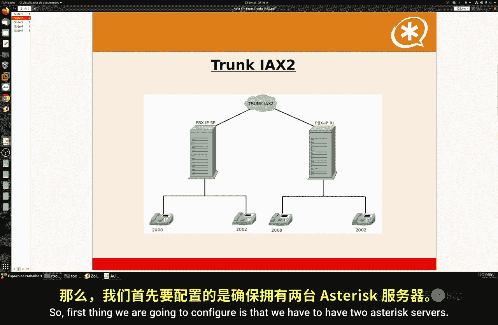
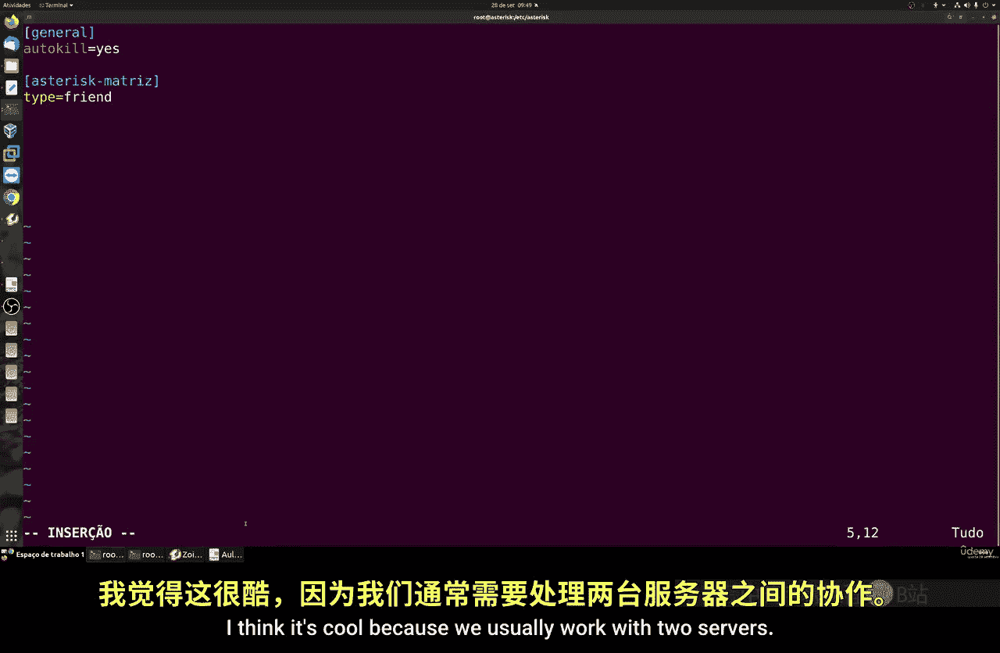
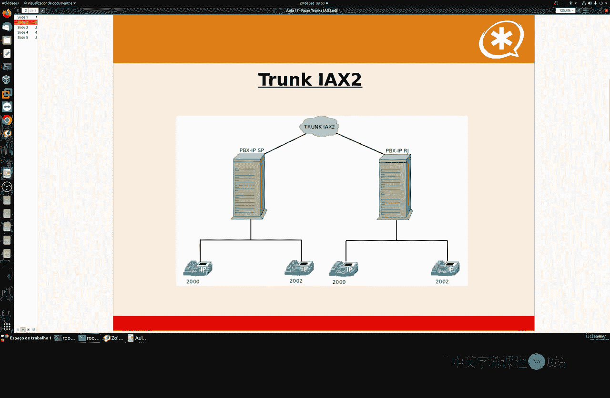
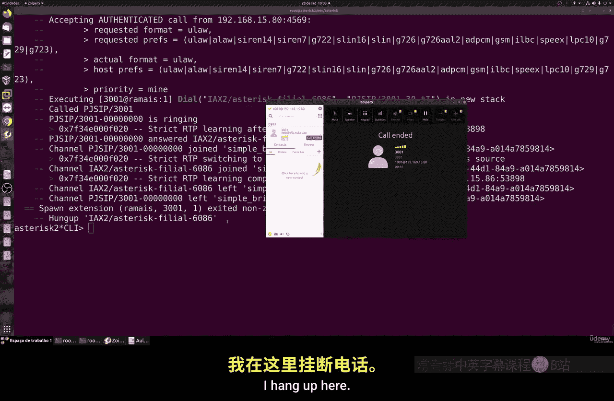
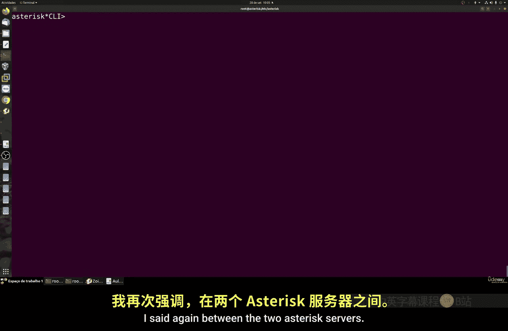

# 083：创建IAX中继 🔗

在本节课中，我们将学习如何配置IAX协议，以实现两个Asterisk服务器之间的互联。IAX是一个专为连接Asterisk服务器而设计的开放协议，能有效节省带宽并抵抗网络延迟。

## 概述



IAX（Inter-Asterisk eXchange）协议，基于RFC 5456标准，主要用于在多个物理上独立的Asterisk服务器之间建立连接。通过配置IAX中继，不同服务器上的分机可以相互拨打电话。

## 配置前的准备

上一节我们介绍了Asterisk的基本概念，本节中我们来看看如何具体配置服务器间的连接。首先，需要确保你有两个已安装并运行在不同IP地址上的Asterisk服务器。两个服务器之间的网络连接质量至关重要，建议使用VPN以确保稳定和安全的通信。

以下是配置IAX中继的核心步骤：



1.  **编辑`iax.conf`配置文件**：在两个服务器上分别配置。
2.  **定义对等点（Peer）**：设置连接类型、认证密码、上下文（Context）和允许连接的IP地址。
3.  **配置注册（Registration）**：使服务器能相互发现并认证。
4.  **设置拨号计划（Dialplan）**：在`extensions.conf`中创建规则，使分机能通过IAX中继呼叫另一台服务器上的分机。
5.  **重载配置并测试**：应用配置并进行通话测试。



## 详细配置步骤

### 1. 在服务器A（总部）上配置

首先，我们登录到第一台Asterisk服务器（称为“总部”或“matrix”）。

*   **进入配置目录并备份文件**
    ```bash
    cd /etc/asterisk
    cp iax.conf iax.conf.backup
    ```

*   **创建新的`iax.conf`文件**
    使用文本编辑器（如`nano`或`vim`）创建或编辑`iax.conf`文件。
    ```bash
    nano iax.conf
    ```
    在文件中输入以下配置：
    ```ini
    [general]
    
    [matrix]
    type=friend
    host=dynamic
    secret=your_secure_password_123
    context=from-internal
    encryption=yes
    permit=192.168.1.81
    
    register => filial:your_secure_password_123@192.168.1.81
    ```
    **配置项说明**：
    *   `[matrix]`: 定义本服务器的对等点名称。
    *   `type=friend`: 表示既能呼出也能接听。
    *   `secret`: 认证密码，需与对端服务器一致。
    *   `context`: 来电进入的上下文。
    *   `encryption=yes`: 启用加密。
    *   `permit`: 仅允许指定IP（服务器B的地址）连接。
    *   `register`: 向服务器B（IP: 192.168.1.81）注册，对等点名称为`filial`。

### 2. 在服务器B（分支）上配置

接着，登录到第二台Asterisk服务器（称为“分支”或“filial”）。

*   **执行相同的备份操作**。
*   **编辑`iax.conf`文件**，内容如下：
    ```ini
    [general]
    
    [filial]
    type=friend
    host=dynamic
    secret=your_secure_password_123
    context=from-internal
    encryption=yes
    permit=192.168.1.80
    
    register => matrix:your_secure_password_123@192.168.1.80
    ```
    **关键点**：
    *   对等点名称`[filial]`必须与服务器A注册语句中的名称一致。
    *   `secret`密码必须相同。
    *   `permit`和`register`中的IP地址需指向服务器A（192.168.1.80）。

### 3. 配置拨号计划

配置完中继后，需要告诉Asterisk如何路由呼叫。

*   **在服务器A上编辑`extensions.conf`**
    ```bash
    nano extensions.conf
    ```
    在适当的上下文（例如`[from-internal]`）中添加：
    ```ini
    exten => _3XXX,1,NoOp(呼叫分支服务器分机)
    same => n,Dial(IAX2/matrix/${EXTEN})
    same => n,Hangup()
    ```
    这条规则表示：拨打以3开头的4位数分机（如3001），将通过名为`matrix`的IAX2中继路由出去。

*   **在服务器B上编辑`extensions.conf`**
    添加对应的规则：
    ```ini
    exten => _1XXX,1,NoOp(呼叫总部服务器分机)
    same => n,Dial(IAX2/filial/${EXTEN})
    same => n,Hangup()
    ```
    这条规则表示：拨打以1开头的4位数分机（如1001），将通过名为`filial`的IAX2中继路由出去。

### 4. 应用配置并测试

*   **在两个服务器上重载IAX和拨号计划配置**
    ```bash
    asterisk -rx “iax2 reload”
    asterisk -rx “dialplan reload”
    ```

*   **检查注册状态**
    在服务器A上执行：
    ```bash
    asterisk -rx “iax2 show peers”
    ```
    应能看到对等点`filial`的状态为`OK`或`Registered`。在服务器B上同样检查`matrix`的状态。



*   **进行通话测试**
    1.  在注册到服务器A的分机（如1001）上，拨打服务器B的分机号（如3001）。
    2.  在注册到服务器B的分机（如3001）上，拨打服务器A的分机号（如1001）。
    如果配置正确，双方应能正常振铃并建立通话。

## 总结



本节课中我们一起学习了IAX中继的配置。我们了解了IAX协议的作用，逐步完成了在两个Asterisk服务器上配置`iax.conf`和`extensions.conf`文件，实现了服务器间的互联和分机互拨。记住，稳定的网络连接（如VPN）和一致的配置细节（如对等点名称、密码、IP地址）是成功的关键。通过此配置，你可以构建更复杂、分布式的VoIP系统。