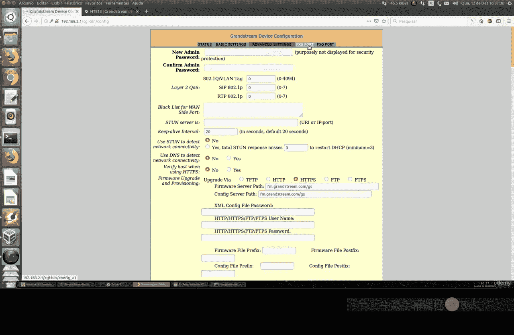
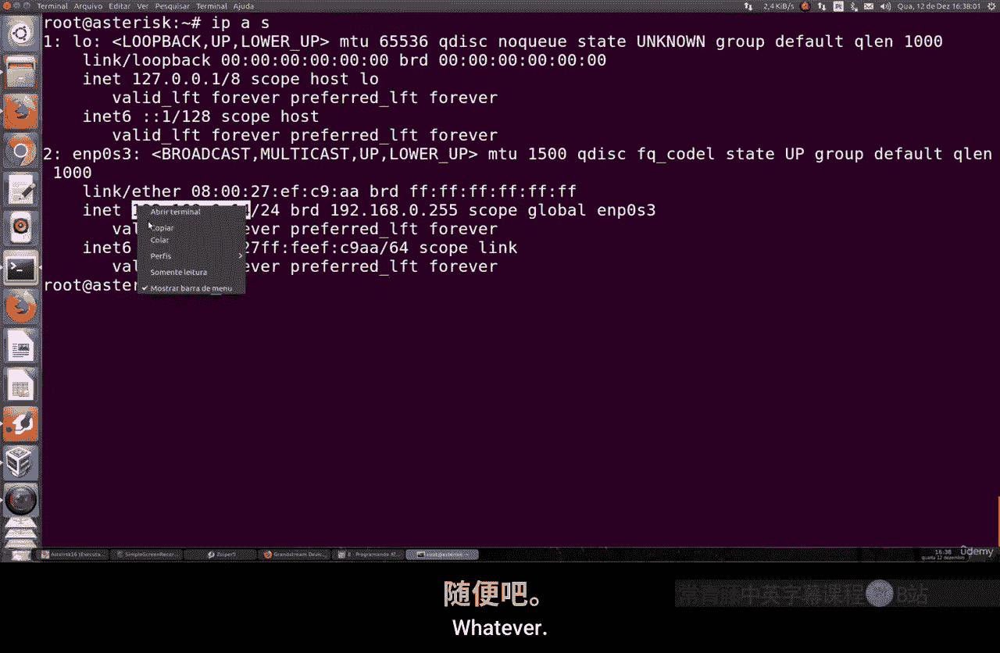
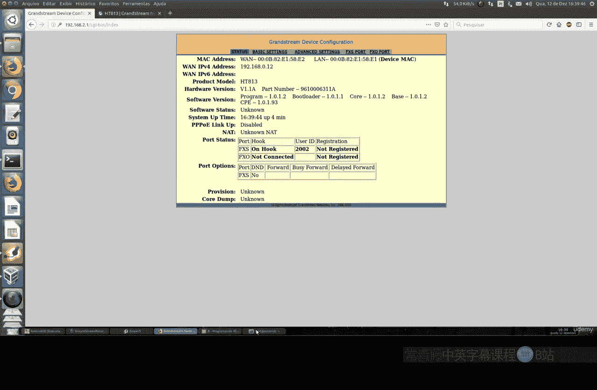
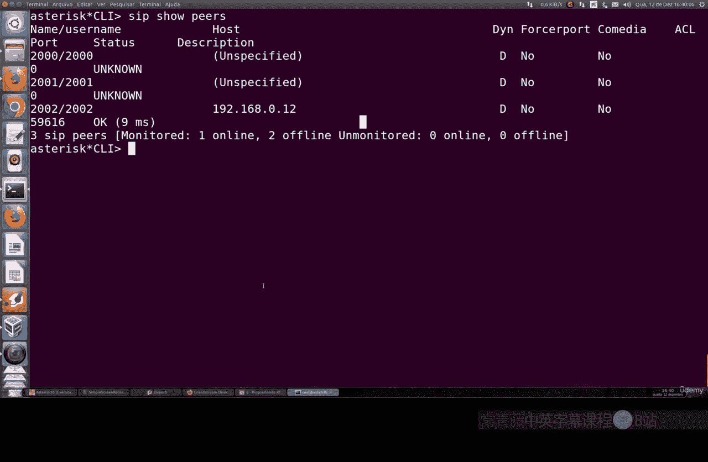
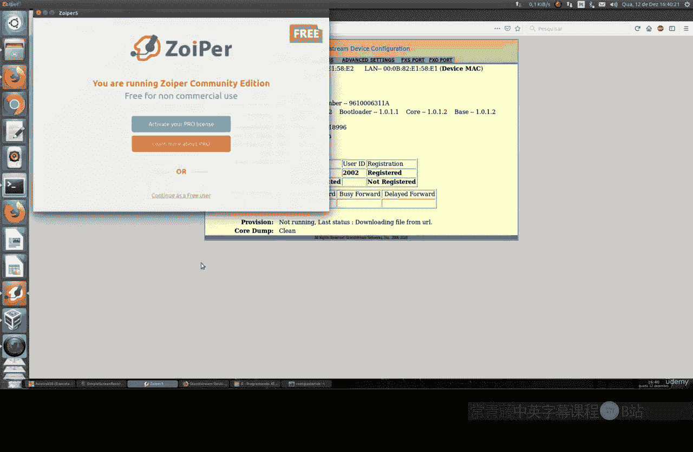
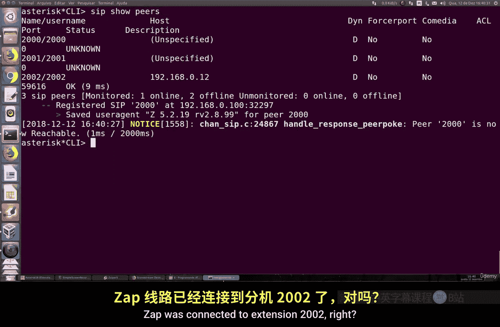
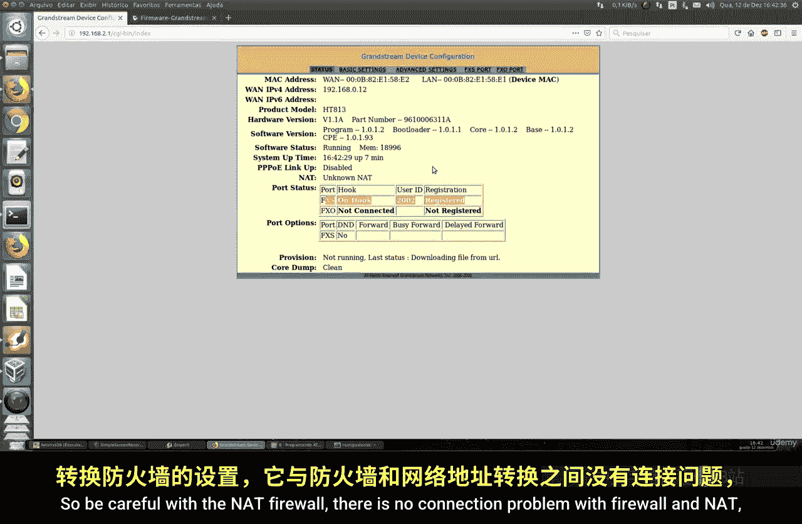

# 084：配置HT813网关 🚀

在本节课中，我们将学习如何配置HT813语音网关，将其连接到Asterisk服务器，并完成基本的FXS端口注册。HT813是一款集成了FXS和FXO端口的实用设备，适用于连接模拟电话或电话线路到IP语音系统。

---

## 概述与设备介绍

HT813是HT 503型号的升级版，它修复了一些错误并带来了多项改进。该设备支持双互联网连接，兼容0.38规格的传真，并在硬件和软件层面提供了更好的安全性，支持通过Web和SSH进行加密管理。

上一节我们介绍了网络基础，本节中我们来看看如何将这台硬件设备接入我们的语音系统。

---

## 初始登录与基本设置

首先，我们需要通过LAN口连接HT813设备。其默认IP地址是`192.168.1.1`。使用浏览器访问该地址，并使用默认凭据登录：
*   **用户名**: `admin`
*   **密码**: `admin`

登录后，您将看到设备状态页面，其中显示了运行内存、系统运行时间、WAN口IP地址（支持IPv4和IPv6）、MAC地址以及FXS/FXO端口在Asterisk的注册状态。

以下是基础系统设置项：
*   **终端用户密码**： 此处设置的是非管理员用户的密码。
*   **访问端口**： 默认是HTTP的80端口，可以更改为HTTPS端口以启用加密访问。
*   **管理协议**： 新版本支持SSH，而过去仅支持Telnet。
*   **网络配置**： 支持IPv4（包括PPPoE和静态IP）和IPv6。
*   **时区与语言**： 请根据您所在地区进行设置。
*   **Ping响应**： 建议启用“Reply ICMP”功能，便于网络监控。

完成基本设置后，点击保存并重启设备。

---

## 配置FXS端口连接Asterisk

设备重启后，我们需要配置FXS端口，使其注册到Asterisk服务器。

在相应的配置页面，填写以下关键信息：
*   **服务器地址**： 您的Asterisk服务器的IP地址。
*   **主机名**： 可选项，可填写服务器主机名。
*   **端口**： 默认SIP端口是`5060`，如果您的服务器使用其他端口，请在此修改。
*   **备用服务器**： 可以设置一个备用Asterisk服务器地址，用于故障转移。
*   **传输协议**： 选择 **SIP UDP**。
*   **分机号与密码**： 例如，分机号为`2002`，密码为`12345`。
*   **注册超时**： 设备会尝试注册，默认过期时间为2分钟。

关于出口端口，有一个重要概念：
> 本地端口是设备向外发起连接的端口，不要与Asterisk服务器的监听端口混淆。建议启用“随机端口支持”，让设备自动寻找空闲端口，这在涉及NAT的网络环境中尤其有效。

保存配置后，设备将开始向Asterisk注册。

---

## 验证注册与测试通话

配置完成后，我们需要验证注册是否成功。

您可以在HT813的Web界面查看注册状态，通常显示为“已注册”。同时，在Asterisk服务器的命令行界面，使用 `asterisk -rvvv` 命令进入CLI，然后输入 `sip show peers` 命令。如果配置正确，您应该能看到分机`2002`及其对应的IP地址出现在已注册的对等端列表中。

注册成功后，即可进行通话测试。从其他分机（例如分机`2005`）呼叫`2002`，如果HT813设备连接的模拟电话振铃，则表示配置成功，通话链路已建立。

---

## 其他配置与维护要点

FXO端口的配置逻辑与FXS类似，需要填写Asterisk服务器地址、用户ID和密码等。此外，设备还有一些高级设置需要注意：

以下是需要关注的重要设置部分：
*   **呼叫路由**： 配置在多少次拨号后转接到PSTN（公共电话交换网），或者设置PSTN来电是否转移到FXS端口。
*   **安全设置**： 务必修改默认的`admin`用户密码。
*   **固件升级**： 可以通过“固件升级”按钮上传从官网下载的最新固件文件（通常为.zip格式），以保持设备更新。

最后，请确保您的网络防火墙和NAT设置允许SIP和RTP流量通过，以避免出现连接或通话问题。

---

## 总结

本节课中我们一起学习了HT813语音网关的完整配置流程。我们从设备登录和基本设置开始，逐步完成了FXS端口连接Asterisk服务器的关键配置，并学会了如何验证注册状态和进行通话测试。最后，我们还了解了设备维护和安全方面的一些要点。整个过程遵循了清晰的步骤，只要注意网络设置和细节参数，就能顺利完成配置。