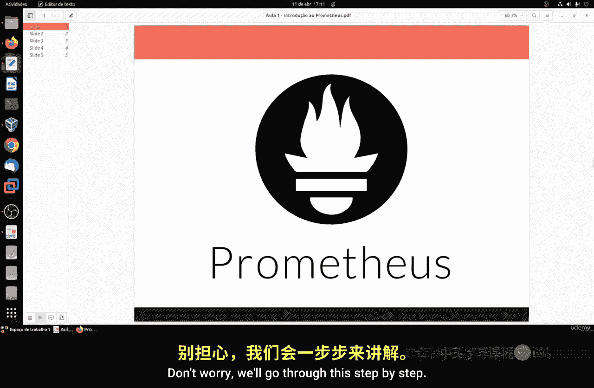
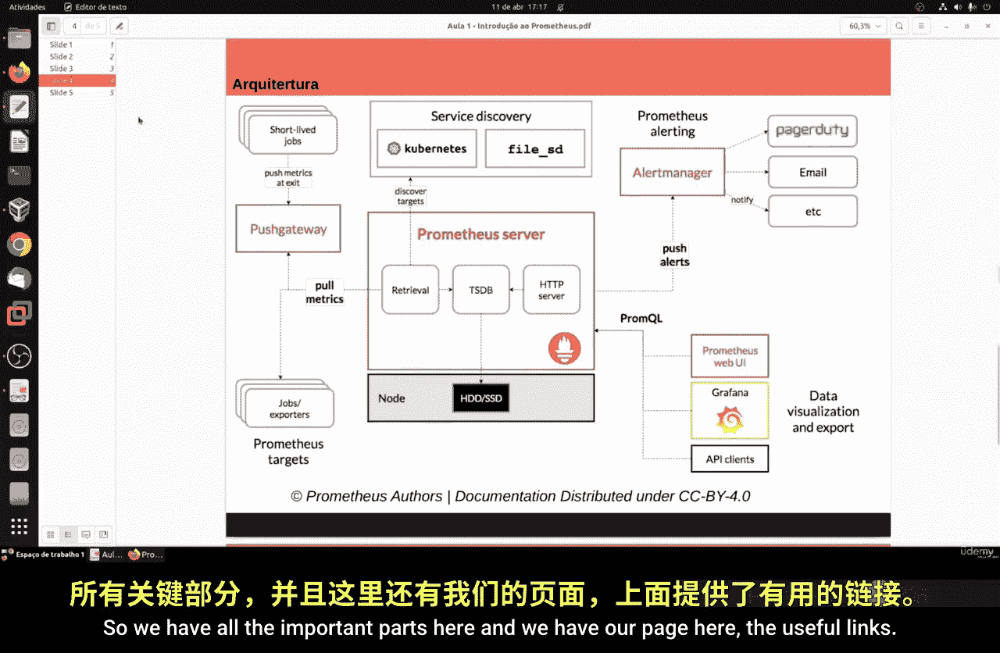
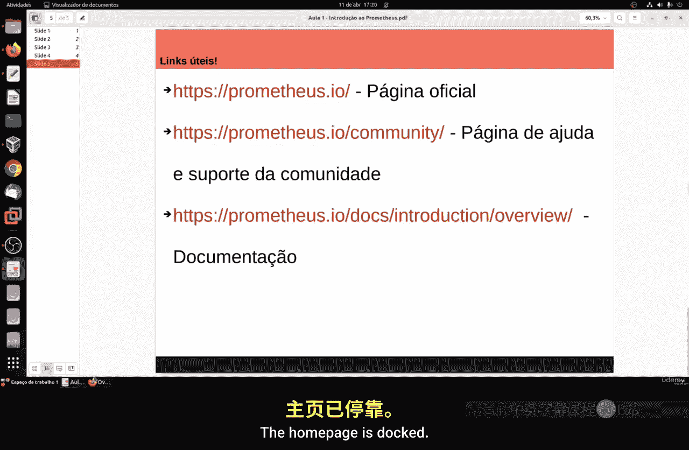
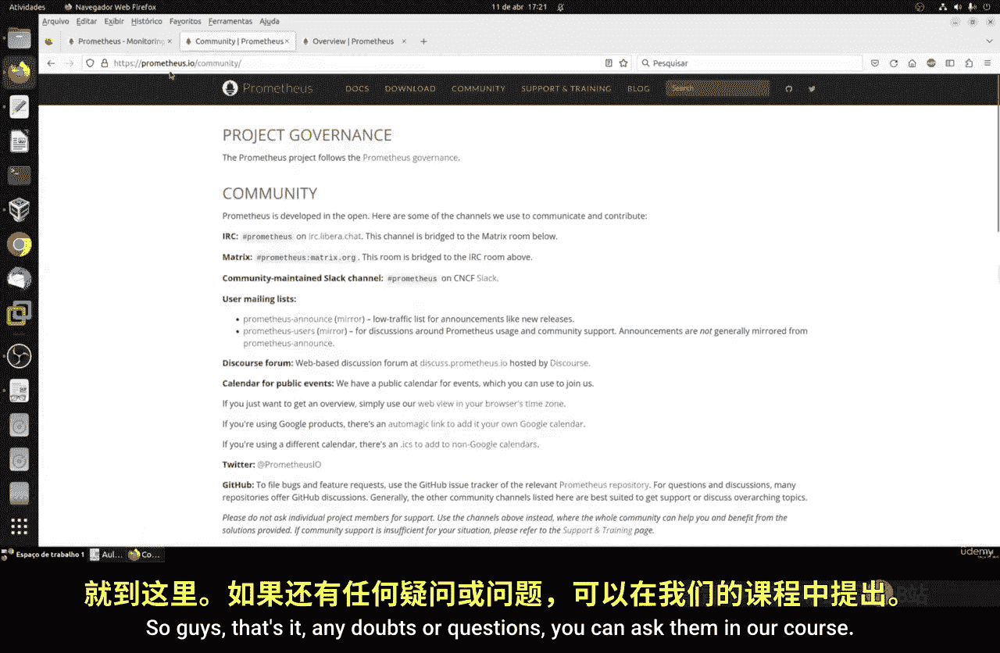
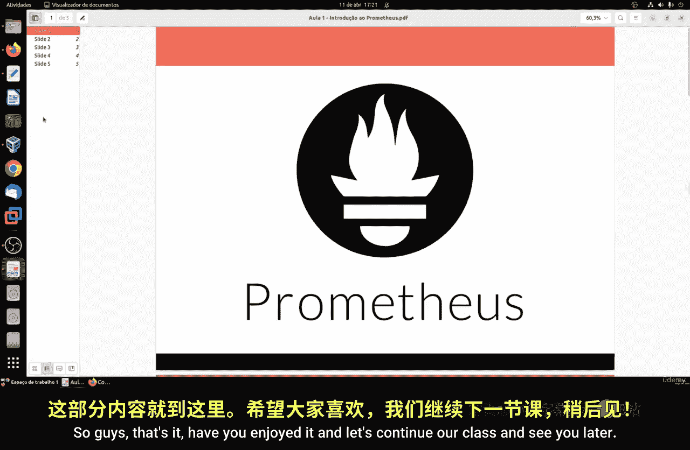

# 085：Prometheus介绍 🚀

在本节课中，我们将要学习一个在市场中越来越重要的监控系统——Prometheus。我们将了解它是什么、它的核心特性、工作原理以及为什么它是一个值得推荐的监控工具。

## 概述

Prometheus是一个100%开源且免费的监控系统，由社区维护，没有单一公司在背后控制。它是一个独立的开源项目，主要通过收集和存储时间序列数据来工作。

## 什么是Prometheus？

Prometheus是一个监控系统。它的核心工作是收集和存储你的指标数据，这些数据是时间序列数据。这意味着信息会与它被记录的时间戳一起存储。数据以“键值对”的形式组织，这些键值对是可选的，我们称之为“标签”。

## 主要特性与用途

上一节我们介绍了Prometheus的基本定义，本节中我们来看看它的主要特性和用途。

Prometheus主要用于处理多维数据，这些数据带有时间序列信息，并通过指标名称和键值对进行标识。它使用一种灵活的查询语言（PromQL）来利用其功能。

以下是Prometheus的一些核心特性：
*   **独立服务器**：节点是自主的，不依赖于分布式存储、网络或其他远程服务。
*   **拉取模型**：时间序列数据的收集通过基于HTTP的拉取模型进行。
*   **推送网关**：支持通过一个中间网关来提交时间序列数据。
*   **目标发现**：可以通过网络服务发现或静态配置来发现监控目标。
*   **图形支持**：它自带一个简单的Web界面，也可以与其他图形化监控系统（如Grafana）集成，以更美观地展示数据。

## 理解指标（Metrics）

我们已经了解了Prometheus能做什么，现在我们来深入理解其监控的核心对象——指标。

用通俗的话来说，指标就是数值测量。时间序列意味着记录随时间推移而发生的变化。随着时间一分一秒地过去，数据被持续收集。例如，用户可能想测量一个应用程序的性能。

以下是几个指标的例子：
*   对于一个Web服务器，**请求的响应时间**可以是一个指标。
*   对于一个数据库，**活跃连接数**或**活跃查询数**都可以是指标。

这些指标对于理解你的应用程序或系统为何以某种方式运行起着至关重要的作用。例如，如果你发现一个网站访问很慢，你可能需要数据来找出原因。应用程序可能在请求数量很高时变慢。如果你有一个**请求计数**指标，你就可以识别出这个问题，并增加服务器数量来处理负载。

## 架构与工作原理

了解了指标的概念后，我们来看看Prometheus的系统架构是如何工作的，它可能初看有些复杂，但其实不然。

Prometheus的大部分组件是用Go语言编写的。Go是一门新兴的、拥有众多追随者且相对简单易用的语言。

以下是其架构的核心工作流程：
1.  **Prometheus服务器**：这是我们安装的核心组件。它从被监控的“任务”中直接或通过推送网关拉取指标。
2.  **数据存储**：服务器将收集到的样本数据存储在本地硬盘上。
3.  **规则处理**：服务器对这些数据执行规则，以聚合或从现有数据生成新的时间序列。
4.  **警报生成**：它还可以利用这些数据生成警报。
5.  **数据可视化**：收集的数据可以通过Grafana等工具进行可视化，使得查看数据更加直观和美观。

整个系统还包括警报管理器、推送网关、服务发现组件等，共同协作完成监控任务。

## 为什么推荐使用Prometheus？

最后，我们来总结一下Prometheus的优势。

Prometheus非常适合记录任何类型的时间序列数据。它既适用于以机器为中心的监控，也适用于监控高度动态的、面向服务的架构（例如微服务世界）。它对数据收集和查询的支持是一个非常大的亮点。

Prometheus被设计得非常可靠，是一个可以用来监控任何重要部分的系统，并能帮助你快速诊断和解决问题。正如之前强调的，它是一个独立的服务器，不依赖于任何类型的网络存储或其他远程服务。

## 资源与社区

Prometheus拥有丰富的资源和活跃的社区支持。
*   **官方网站**：提供全面的文档，包括最佳实践和教程。
*   **社区渠道**：包括IRC聊天、Twitter和GitHub仓库，你可以在那里获得帮助、报告问题或参与贡献。

## 总结

本节课中我们一起学习了监控系统Prometheus。我们了解了它是一个开源、免费、由社区维护的时间序列监控工具。我们探讨了它的核心概念“指标”，查看了其架构图和工作原理，并列举了它独立、灵活、可靠等主要优点。在接下来的课程中，我们将进行实际安装和操作，一步步掌握如何使用Prometheus。