# 086：安装与配置Prometheus 📊

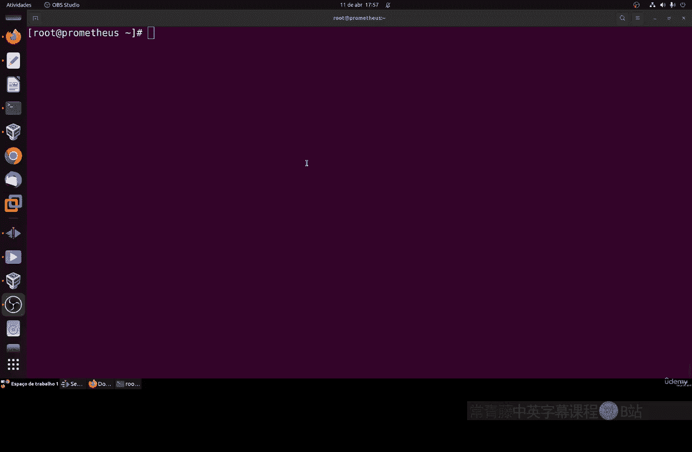

在本节课中，我们将学习如何在Linux系统上手动安装和配置Prometheus监控系统。我们将从准备工作开始，逐步完成下载、安装、配置以及创建系统服务的过程，确保Prometheus能够稳定运行。

---

## 概述

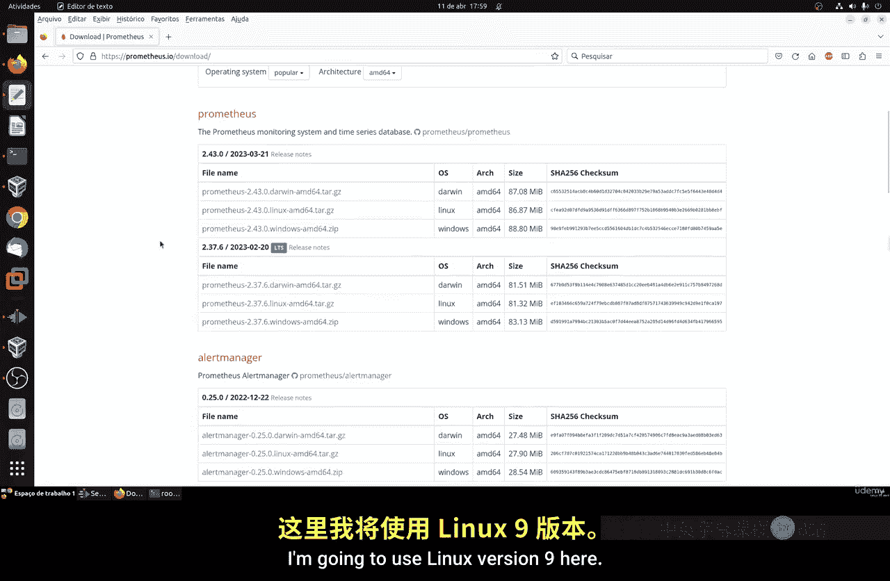

Prometheus是一个开源的系统监控和警报工具包。本次教程将指导你完成从零开始安装Prometheus的完整步骤，包括环境准备、软件包下载、配置文件设置以及将其配置为系统服务。

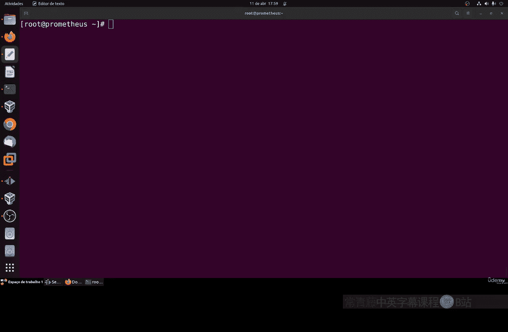

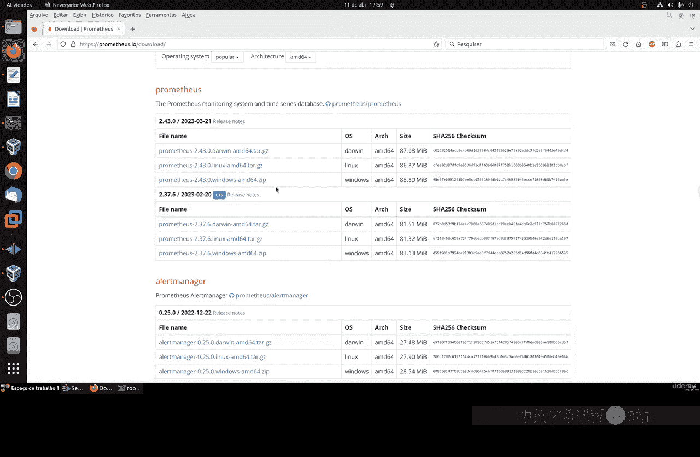

---

## 准备工作 🛠️

上一节我们介绍了Prometheus的基本概念，本节中我们来看看安装前的准备工作。首先，你需要一个现代的Linux操作系统，例如Ubuntu Server或Red Hat系列。本教程以Linux 9为例。

以下是安装前需要执行的系统更新和工具安装步骤：

1.  **安装必要的工具**：首先安装Vim文本编辑器、WGet下载工具以及开发工具包。
    ```bash
    sudo dnf install vim wget -y
    sudo dnf groupinstall "Development Tools" -y
    ```

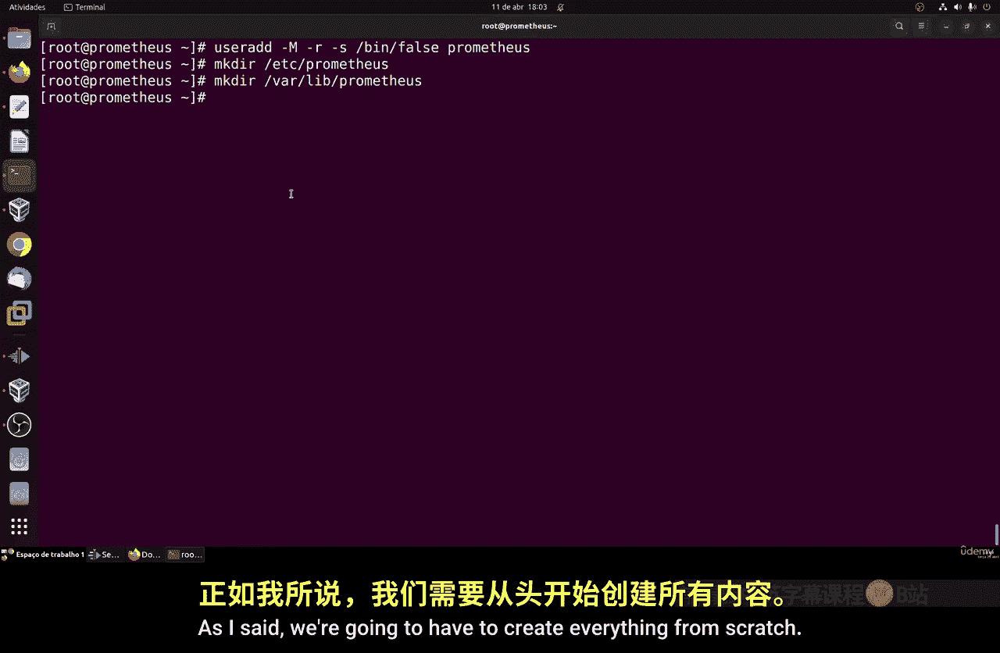

2.  **创建专用用户**：为了安全和管理方便，创建一个专用于运行Prometheus的系统用户。
    ```bash
    sudo useradd --no-create-home --shell /bin/false prometheus
    ```

3.  **创建必要的目录**：创建用于存放配置文件和库文件的目录。
    ```bash
    sudo mkdir /etc/prometheus
    sudo mkdir /var/lib/prometheus
    ```

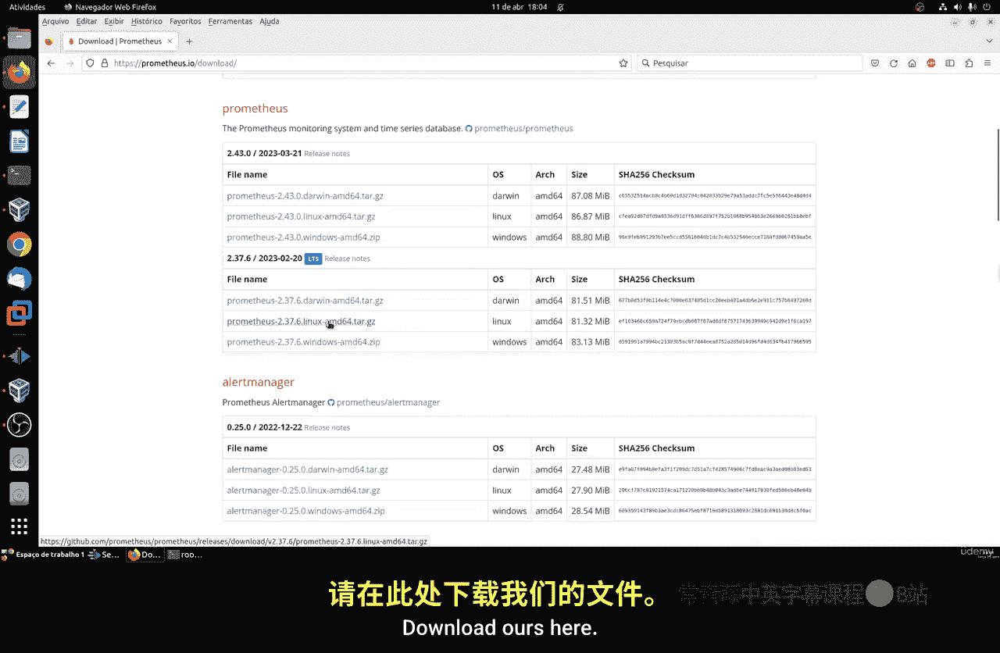

---

## 下载与安装 Prometheus ⬇️

准备工作完成后，我们现在开始下载和安装Prometheus软件本身。

1.  **访问下载页面**：前往Prometheus官方网站的下载页面。建议选择**LTS（长期支持）版本**，以获得更好的稳定性和支持。
2.  **下载压缩包**：复制适用于Linux的`.tar.gz`文件的下载链接，并使用`wget`命令下载到临时目录。
    ```bash
    cd /tmp
    wget https://github.com/prometheus/prometheus/releases/download/v2.37.0/prometheus-2.37.0.linux-amd64.tar.gz
    ```
    *注意：版本号请以官网最新LTS版本为准。*
3.  **解压文件**：解压下载的压缩包。
    ```bash
    tar -xvf prometheus-*.tar.gz
    ```
4.  **复制关键文件**：进入解压后的目录，将二进制文件和配置文件复制到系统合适的位置。
    ```bash
    cd prometheus-*
    # 复制主程序
    sudo cp prometheus /usr/local/bin/
    # 复制控制台文件
    sudo cp -r consoles/ console_libraries/ /etc/prometheus/
    # 复制配置文件
    sudo cp prometheus.yml /etc/prometheus/
    ```

---

## 配置与初步测试 ⚙️

文件就位后，我们需要进行初步配置并测试Prometheus是否能正常运行。

1.  **编辑配置文件**：使用文本编辑器查看默认配置文件。
    ```bash
    sudo vim /etc/prometheus/prometheus.yml
    ```
    配置文件中包含几个关键部分：
    *   `global`： 全局设置，如数据抓取间隔（`scrape_interval`）。
    *   `rule_files`： 告警规则文件路径。
    *   `scrape_configs`： 定义Prometheus要监控的目标。默认配置会监控Prometheus自身。
    *   Prometheus服务默认运行在**9090端口**，你可以在此文件中修改。

2.  **配置防火墙**：如果系统防火墙开启，需要放行9090端口。
    ```bash
    sudo firewall-cmd --permanent --add-port=9090/tcp
    sudo firewall-cmd --reload
    ```

3.  **设置目录权限**：将相关目录的所有权更改给之前创建的`prometheus`用户，以确保安全。
    ```bash
    sudo chown -R prometheus:prometheus /etc/prometheus
    sudo chown -R prometheus:prometheus /var/lib/prometheus
    sudo chown prometheus:prometheus /usr/local/bin/prometheus
    ```

4.  **手动启动测试**：以`prometheus`用户身份手动启动服务进行测试。
    ```bash
    sudo -u prometheus /usr/local/bin/prometheus \
        --config.file /etc/prometheus/prometheus.yml \
        --storage.tsdb.path /var/lib/prometheus/
    ```
    如果终端显示服务器已启动的日志信息，说明运行成功。

5.  **访问Web界面**：打开浏览器，访问 `http://<你的服务器IP地址>:9090`。如果能看到Prometheus的Web界面，说明安装和初步配置成功。

---

## 创建系统服务 🚀

上一节我们通过命令行手动启动了Prometheus，本节中我们来看看如何将其配置为系统服务，实现开机自启和便捷管理。

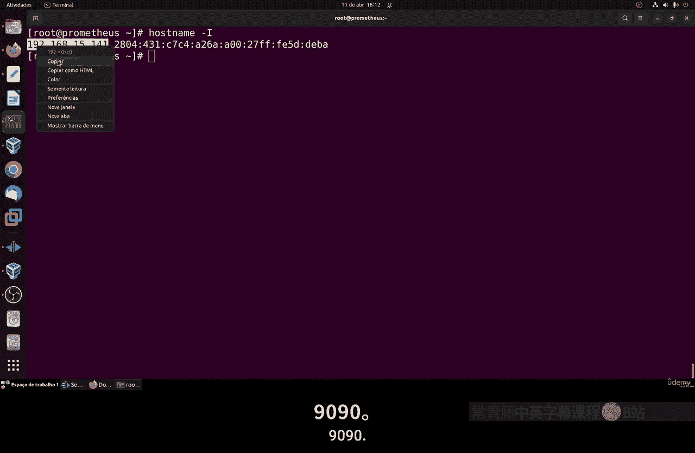

手动启动的方式不适合生产环境，我们需要创建一个Systemd服务单元文件。

1.  **创建服务文件**：使用`vim`或`nano`创建服务配置文件。
    ```bash
    sudo vim /etc/systemd/system/prometheus.service
    ```

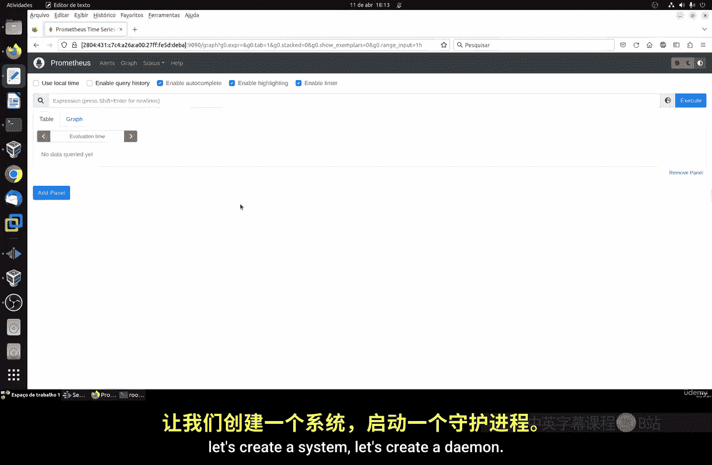

2.  **编写服务配置**：将以下内容写入上述文件。这个配置定义了服务运行的用户、执行命令、数据目录等关键信息。
    ```ini
    [Unit]
    Description=Prometheus
    Wants=network-online.target
    After=network-online.target

    [Service]
    User=prometheus
    Group=prometheus
    Type=simple
    ExecStart=/usr/local/bin/prometheus \
        --config.file /etc/prometheus/prometheus.yml \
        --storage.tsdb.path /var/lib/prometheus/

    [Install]
    WantedBy=multi-user.target
    ```

3.  **启用并启动服务**：重新加载Systemd配置，启用服务（使其开机自启），然后立即启动服务。
    ```bash
    sudo systemctl daemon-reload
    sudo systemctl enable prometheus
    sudo systemctl start prometheus
    ```

4.  **检查服务状态**：使用以下命令确认服务是否正在运行。
    ```bash
    sudo systemctl status prometheus
    ```
    如果状态显示为`active (running)`，则表示服务已成功启动。

5.  **再次验证**：再次通过浏览器访问 `http://<你的服务器IP地址>:9090`，确认服务可以通过系统服务正常提供访问。

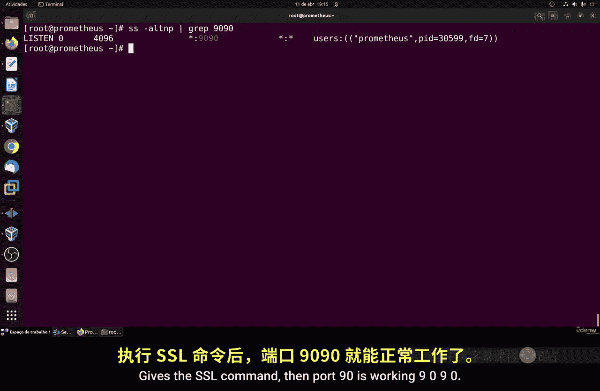

---

## 总结

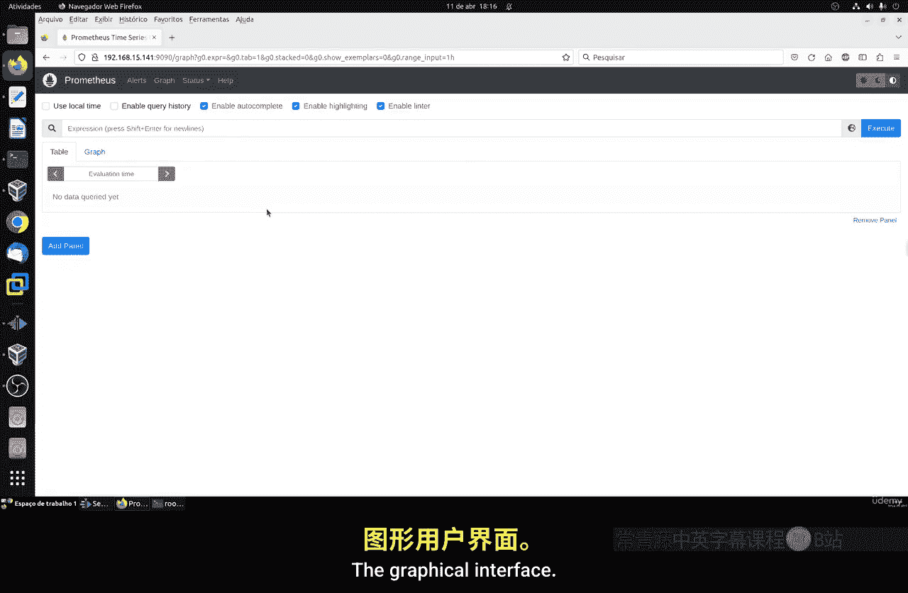

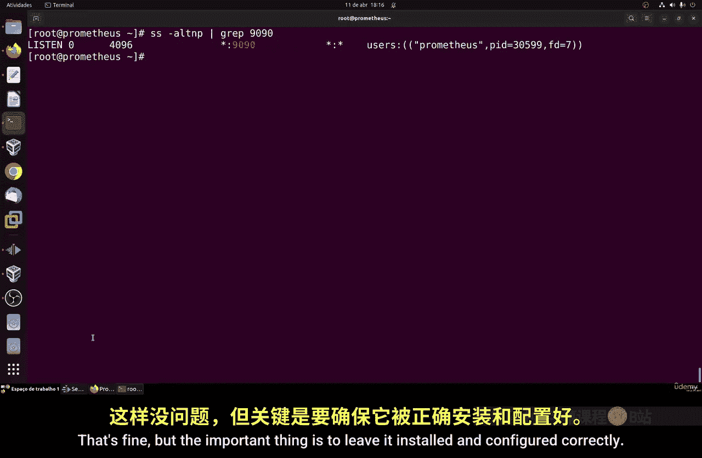

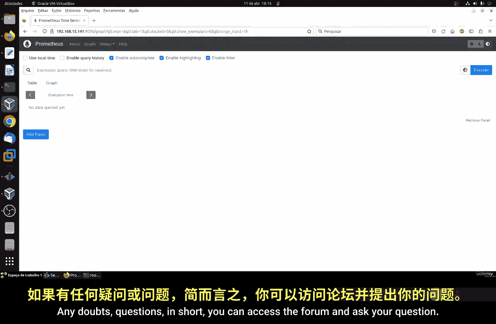

本节课中我们一起学习了在Linux系统上完整安装和配置Prometheus的流程。我们从系统准备开始，逐步完成了软件下载、文件部署、权限配置、手动测试，最终将其配置为可靠的系统服务。现在，你的Prometheus已经安装就绪，在后续课程中，我们将学习如何使用其Web界面、配置监控目标和设置警报规则。

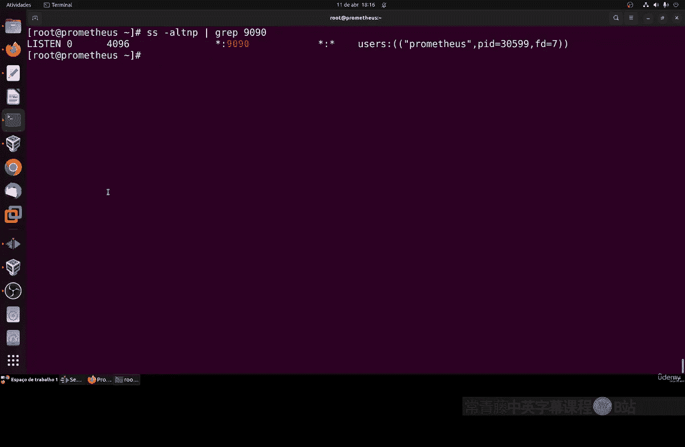

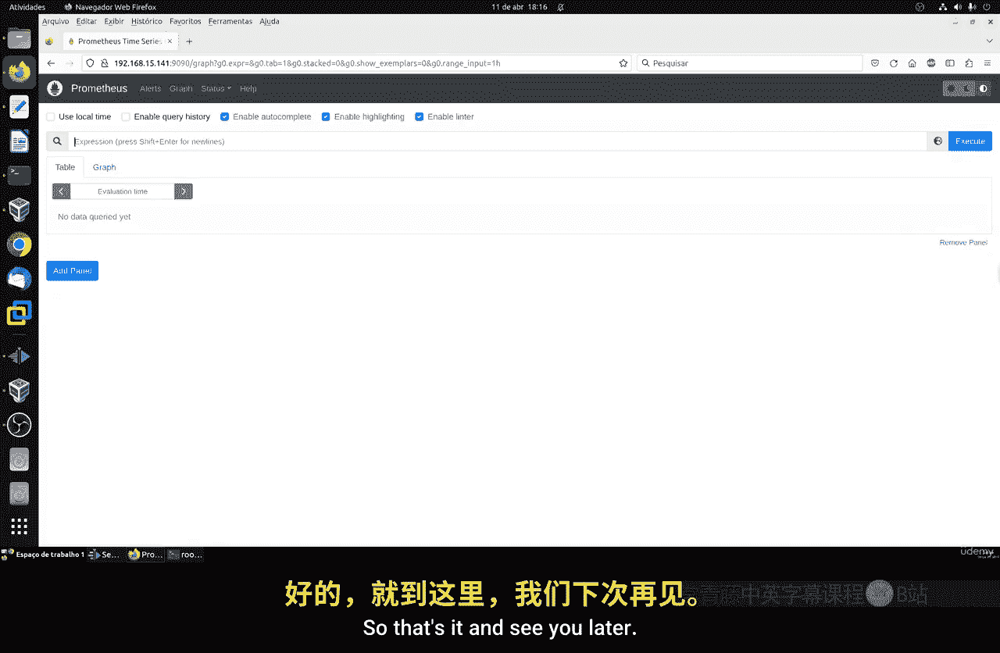

所有在本教程中使用的命令和创建的服务文件内容，都已包含在课程资料中，供你复习和参考。如有任何疑问，欢迎在课程论坛中提出。