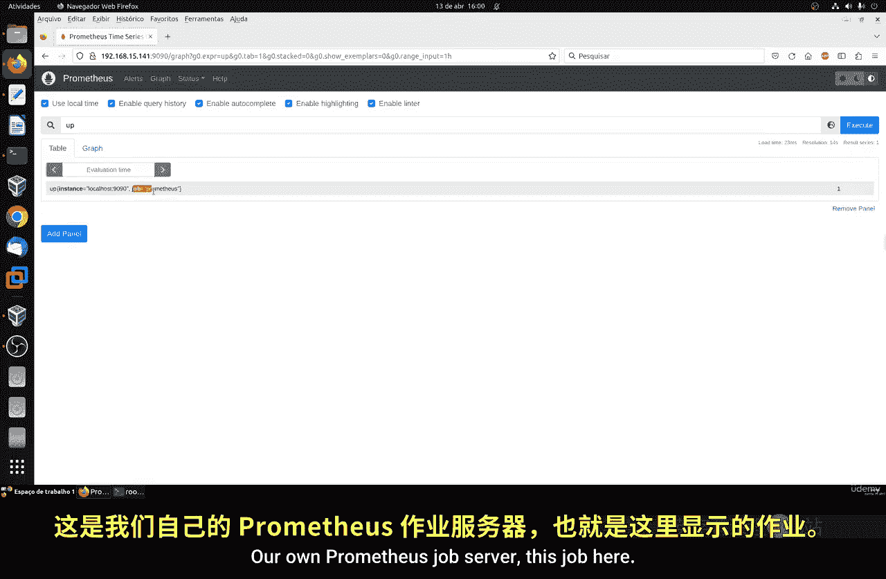
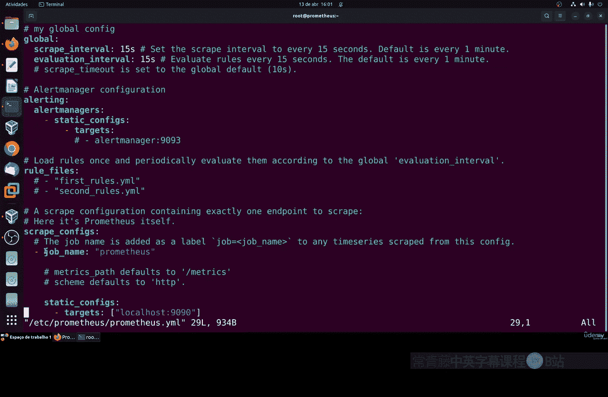
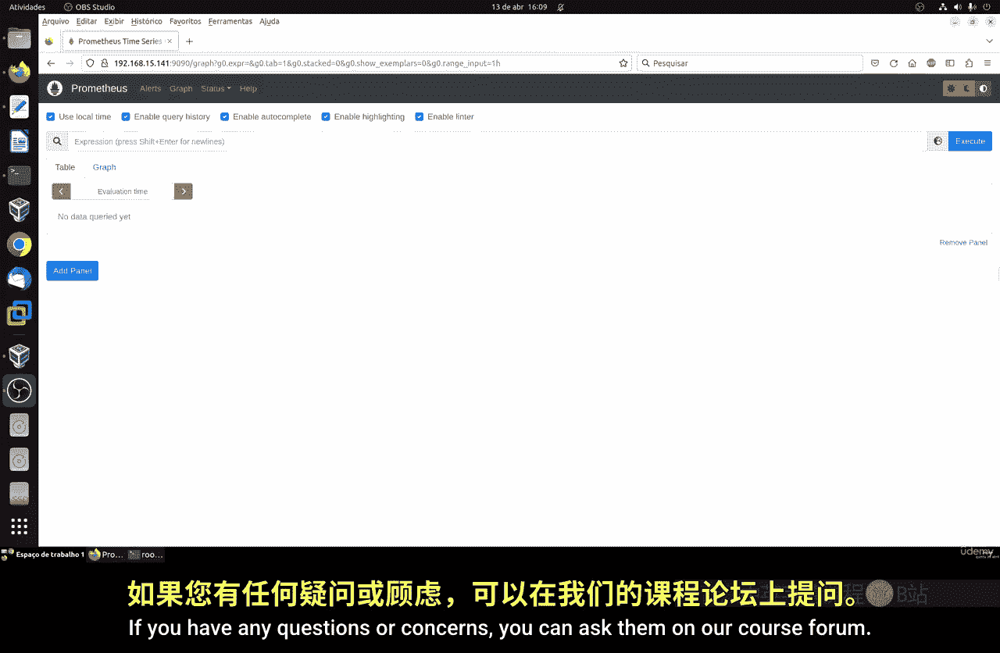

# 087：使用Prometheus表达式字段 📊

在本节课中，我们将学习如何在Prometheus系统中使用表达式字段来查询和监控指标。我们将从最简单的“up”指标开始，逐步探索其他类型的指标，如内存使用量和样本摄取速率，并学习如何使用`rate`函数来获取更有意义的速率数据。

---

## 概述

表达式是Prometheus查询语言的核心。通过表达式，我们可以从Prometheus服务器中提取特定的监控指标数据。本节将介绍如何访问表达式字段、执行基本查询以及理解不同类型的指标（如Gauge和Counter）。





---

## 访问表达式字段

首先，我们进入Prometheus的表达式查询界面。为了获得更好的体验，建议开启自动补全、查询历史记录，并使用本地时间显示。

以下是推荐的设置步骤：
*   开启自动补全功能。
*   打开查询历史记录。
*   将时间显示设置为使用本地服务器时间。

这些设置有助于更准确、高效地编写和回顾查询。

---

## 基础查询：检查服务状态

上一节我们介绍了如何访问表达式界面，本节中我们来看看最基础的查询。在Prometheus中，检查一个服务是否在线的最基本指标是`up`。

在表达式字段中输入 `up` 并执行。查询结果会显示所有被监控实例的状态。例如，你可能会看到：
```
up{instance="localhost:9090", job="prometheus"} 1
```
这里的值`1`表示该实例（即Prometheus服务器本身）处于活动状态。如果值为`0`，则表示该实例下线。

这个指标来源于Prometheus配置文件（`prometheus.yml`）中定义的`job_name`。如果你在配置文件中修改了任务名称，这里的`job`标签也会相应改变。

由于`up`指标是二进制的（非0即1），其图表视图只会显示一条在1和0之间变化的线。

---

## 查询进程内存使用量

除了服务状态，我们还可以监控特定进程的资源使用情况。现在，让我们查询Prometheus服务器进程自身的内存消耗。

在表达式字段中输入以下指标：
```
process_resident_memory_bytes
```
执行后，右侧会显示一个数值，例如`87000000`，这表示该进程当前占用了约87兆字节（MiB）的物理内存。Prometheus默认返回的是原始字节数，为了获得更易读的单位（如MB、GB），通常需要借助外部的可视化工具或API进行转换。

切换到图表视图，你可以看到内存使用量随时间变化的曲线。它可能显示内存使用在70 MiB到90 MiB之间波动，这直观地反映了Prometheus进程在Linux系统上的内存消耗情况。这种随时间变化、可增可减的指标类型称为**Gauge**。

---

## 使用Counter与rate函数

上一节我们查看了表示瞬时值的Gauge指标，本节中我们来看看另一种重要类型：Counter。Counter是一个只增不减的累计值，常用于表示请求总数、错误总数等。

例如，查询Prometheus已摄取的样本总数：
```
prometheus_tsdb_head_samples_appended_total
```
在图表上，你会看到这条线始终向右上方增长，显示一个不断累加的总数。对于Counter，观察其绝对值往往意义不大，我们更关心它在单位时间内的增长速率。

以下是使用`rate`函数计算每秒增长率的示例：
```
rate(prometheus_tsdb_head_samples_appended_total[1m])
```
这个查询会计算该Counter在过去一分钟内的平均每秒增长率。执行后，图表将显示速率的变化曲线，例如在25到39之间波动，这比单纯看累计值更能反映系统的实时负载变化。`rate`函数是处理Counter类型指标的关键工具。

---

## 状态页面与后续计划

目前，我们的监控目标只包含了Prometheus自身，这在状态页面的“Targets”部分可以看到。在接下来的课程中，我们将扩展监控范围，添加新的监控目标（Target），以收集Linux服务器本身的CPU、内存、网络等系统级指标。

---

## 总结




本节课中我们一起学习了Prometheus表达式的基本用法。我们掌握了如何查询`up`指标来检查服务状态，如何查看`process_resident_memory_bytes`等Gauge指标来监控资源使用，以及如何使用`rate()`函数处理`prometheus_tsdb_head_samples_appended_total`这类Counter指标以获得有意义的速率信息。记住，无需一次性记住所有表达式，随着实践会逐渐熟悉。这些查询结果可以进一步导出到Grafana等可视化工具中创建仪表盘和设置告警。