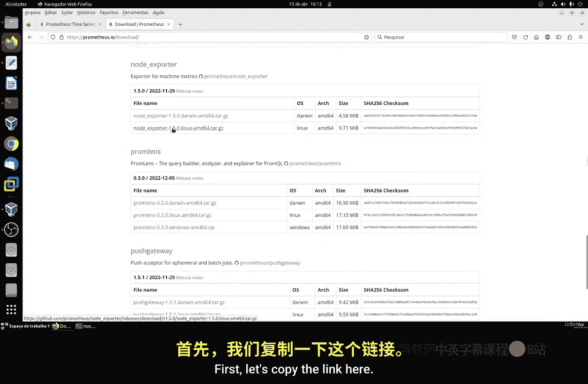
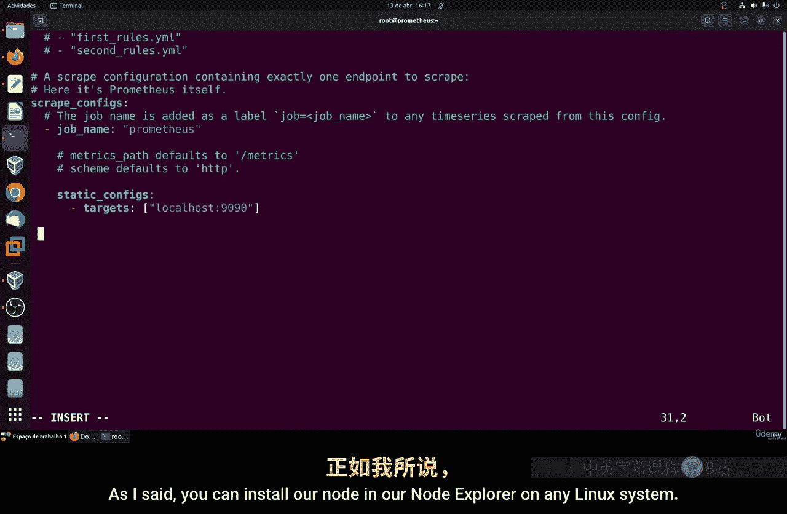
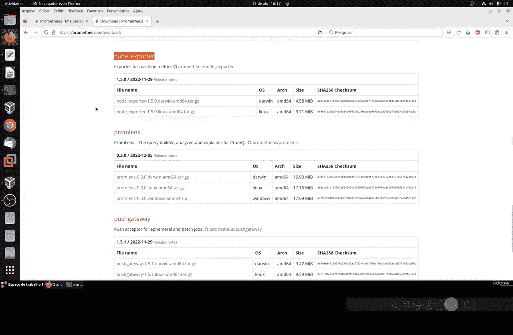
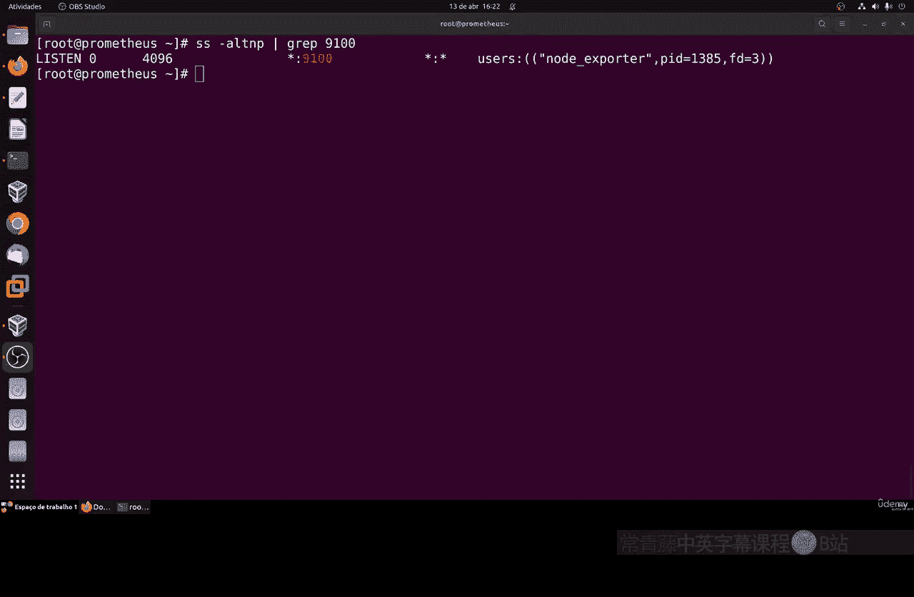
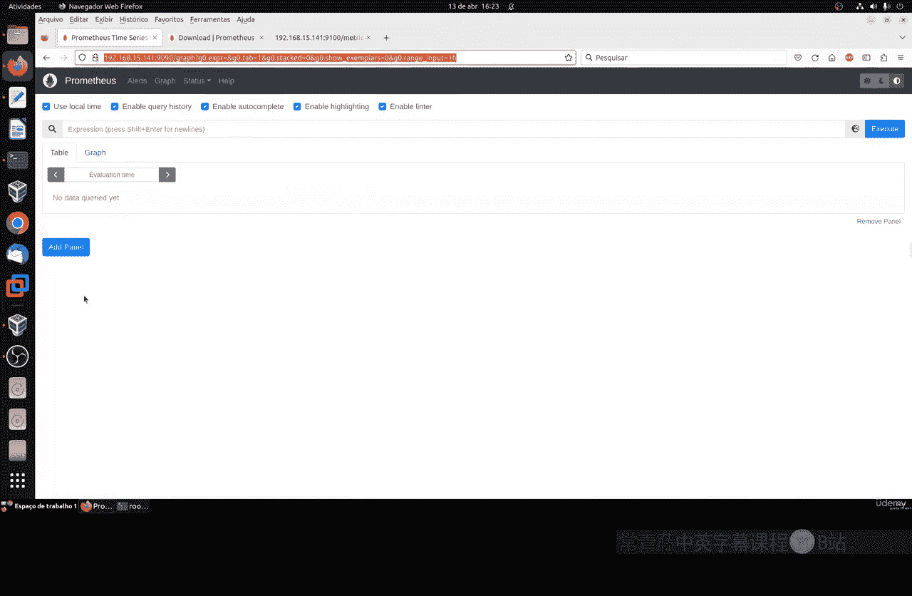
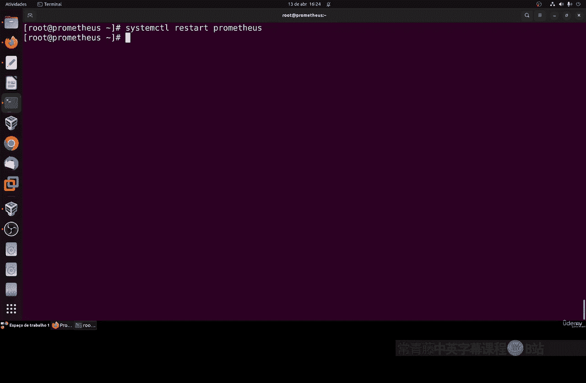
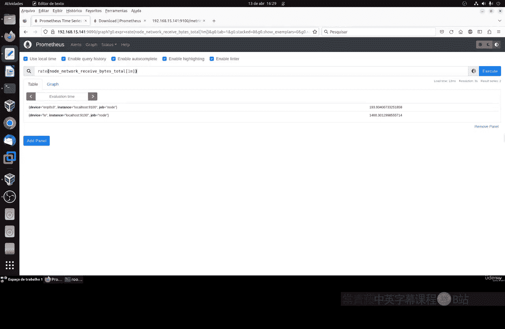

# 088：使用Node Exporter监控系统 📊

在本节课中，我们将学习如何使用Node Exporter来监控Linux系统的各项指标。Node Exporter是一个用于收集硬件和操作系统指标的Prometheus导出器，它能提供CPU、内存、磁盘、网络等丰富的数据。

---

## 概述

上一节我们介绍了Prometheus的基本安装与配置。本节中，我们将安装并配置Node Exporter，以扩展Prometheus的监控能力，使其能够收集Linux服务器本身的详细运行指标。

---

## 下载与安装Node Exporter

首先，我们需要下载Node Exporter的二进制文件。这个过程与安装Prometheus类似。

1.  从Prometheus官网下载页面找到Node Exporter的下载链接。
2.  使用 `wget` 命令下载压缩包。
3.  解压文件，并将其中的二进制文件移动到系统目录。

以下是具体操作命令：

```bash
# 下载Node Exporter（请替换为实际的最新版本链接）
wget https://github.com/prometheus/node_exporter/releases/download/v1.5.0/node_exporter-1.5.0.linux-amd64.tar.gz

# 解压下载的文件
tar -xzf node_exporter-1.5.0.linux-amd64.tar.gz



# 进入解压后的目录
cd node_exporter-1.5.0.linux-amd64/

# 将二进制文件复制到系统目录
sudo cp node_exporter /usr/local/bin/
```

---

## 设置文件权限与所有者

为了保证安全性和一致性，我们需要将Node Exporter二进制文件的所有者设置为之前为Prometheus创建的用户和组。

执行以下命令：

```bash
# 更改文件所有者为prometheus用户和组
sudo chown prometheus:prometheus /usr/local/bin/node_exporter
```

现在，你可以通过在任何位置输入 `node_exporter` 命令来启动它。启动后，它将在端口9100上运行，并开始收集系统指标。

---

## 配置Prometheus以抓取Node Exporter数据

为了让Prometheus能够收集Node Exporter提供的指标，我们需要修改Prometheus的配置文件。

1.  编辑Prometheus的配置文件 `prometheus.yml`。
2.  在 `scrape_configs` 部分添加一个新的抓取任务（job）。





以下是需要添加的配置内容。**请特别注意缩进和空格，错误的格式会导致Prometheus启动失败。**

```yaml
  - job_name: 'node'
    static_configs:
      - targets: ['localhost:9100']
```

**配置说明：**
*   `job_name: 'node'`： 为此监控任务命名，你可以根据被监控服务器的角色（如 `web-server`、`db-server`）自定义名称。
*   `targets: ['localhost:9100']`： 指定Node Exporter的地址和端口。因为我们安装在同一台服务器上，所以使用 `localhost`。如果要监控网络中的其他Linux服务器，请将其替换为那台服务器的IP地址。

保存并退出配置文件。

---

## 配置防火墙与系统服务

为了确保服务能持续运行且可通过网络访问，我们需要开放防火墙端口并将Node Exporter配置为系统服务。

### 开放防火墙端口

如果系统启用了防火墙，需要开放Node Exporter使用的9100端口。

```bash
# 对于使用firewalld的系统（如CentOS/RHEL）
sudo firewall-cmd --add-port=9100/tcp --permanent
sudo firewall-cmd --reload

# 对于使用ufw的系统（如Ubuntu）
sudo ufw allow 9100
```

### 创建Systemd服务

将Node Exporter设置为系统服务，可以保证它在系统启动时自动运行，并且易于管理（启动、停止、重启）。

1.  创建服务配置文件。

```bash
sudo nano /etc/systemd/system/node_exporter.service
```

2.  将以下内容复制到文件中：

```ini
[Unit]
Description=Node Exporter
After=network.target

[Service]
User=prometheus
Group=prometheus
Type=simple
ExecStart=/usr/local/bin/node_exporter



[Install]
WantedBy=multi-user.target
```

3.  保存文件后，重新加载systemd配置并启动服务。

```bash
# 重新加载systemd配置
sudo systemctl daemon-reload



# 启用Node Exporter服务（开机自启）
sudo systemctl enable node_exporter

# 启动Node Exporter服务
sudo systemctl start node_exporter



# 检查服务运行状态
sudo systemctl status node_exporter
```

如果状态显示为 `active (running)`，说明服务已成功启动。

---

## 验证与测试

完成以上步骤后，我们可以进行验证。

1.  **验证Node Exporter指标**： 在浏览器中访问 `http://你的服务器IP:9100/metrics`，你应该能看到大量以 `node_` 开头的指标文本，这证明Node Exporter正在工作。
2.  **验证Prometheus配置**： 由于我们修改了 `prometheus.yml` 文件，必须重启Prometheus服务以使配置生效。

```bash
sudo systemctl restart prometheus
sudo systemctl status prometheus
```

3.  **在Prometheus Web界面查看目标**： 浏览器访问Prometheus Web UI（默认端口9090），导航到 **Status -> Targets**。你应该能看到一个名为 `node` 的任务，其状态应为 **UP**。这表示Prometheus正在成功抓取Node Exporter的数据。

---

## 使用新指标进行查询

现在，Prometheus中已经拥有了丰富的系统指标。我们可以在Prometheus的 **Graph** 页面尝试查询。

以下是几个简单的示例：

*   **查询系统内存使用量**：
    在查询框中输入 `node_memory_MemTotal_bytes`，可以查看系统总内存。
    输入 `node_memory_MemAvailable_bytes`，可以查看可用内存。

*   **查询CPU空闲时间**：
    输入 `rate(node_cpu_seconds_total{mode=“idle”}[1m])`，可以计算最近一分钟的平均CPU空闲率。

*   **查询网络接收流量**：
    输入 `rate(node_network_receive_bytes_total[1m])`，可以查看各网络接口每分钟的平均接收流量。

通过这些查询，你可以开始绘制图表，直观地监控系统的CPU、内存、磁盘IO和网络带宽等核心资源的使用情况。

---

## 总结

本节课中我们一起学习了如何安装和配置Node Exporter。我们完成了以下关键步骤：
1.  下载并安装Node Exporter二进制文件。
2.  修改Prometheus配置文件，添加新的抓取任务来收集节点指标。
3.  配置防火墙并创建Systemd服务，确保Node Exporter持续稳定运行。
4.  验证安装结果，并在Prometheus中初步使用新的系统指标进行查询。




现在，你的监控系统不仅能够监控Prometheus自身，还能深入监控Linux服务器的详细运行状态。在下一节课中，我们将学习如何基于这些丰富的指标设置告警规则，以便在系统出现问题时及时获得通知。