# 089：使用警报系统 🚨

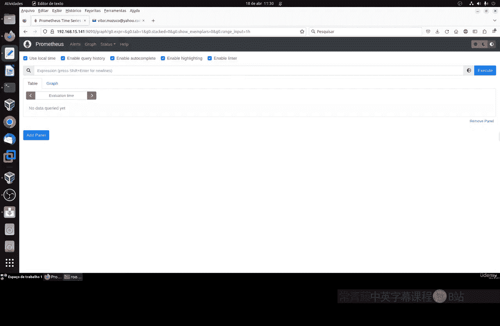

在本节课中，我们将学习如何在Prometheus监控系统中配置和使用警报功能。当被监控的系统或服务出现故障时，例如目标主机无法访问，我们将设置一个警报规则来触发通知。本教程将引导你完成从创建警报规则到配置Alertmanager并通过电子邮件接收警报的完整流程。

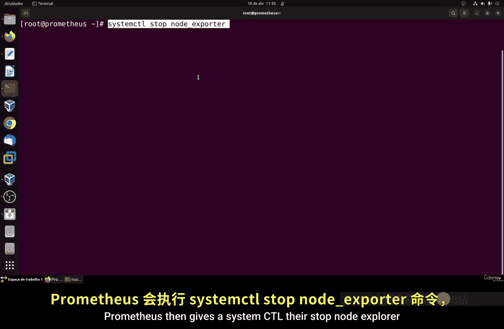

---

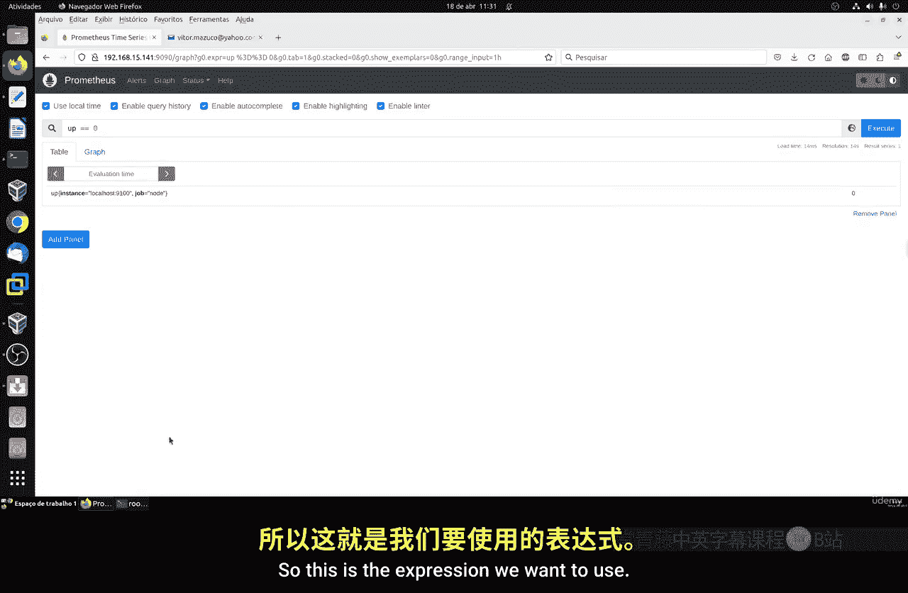

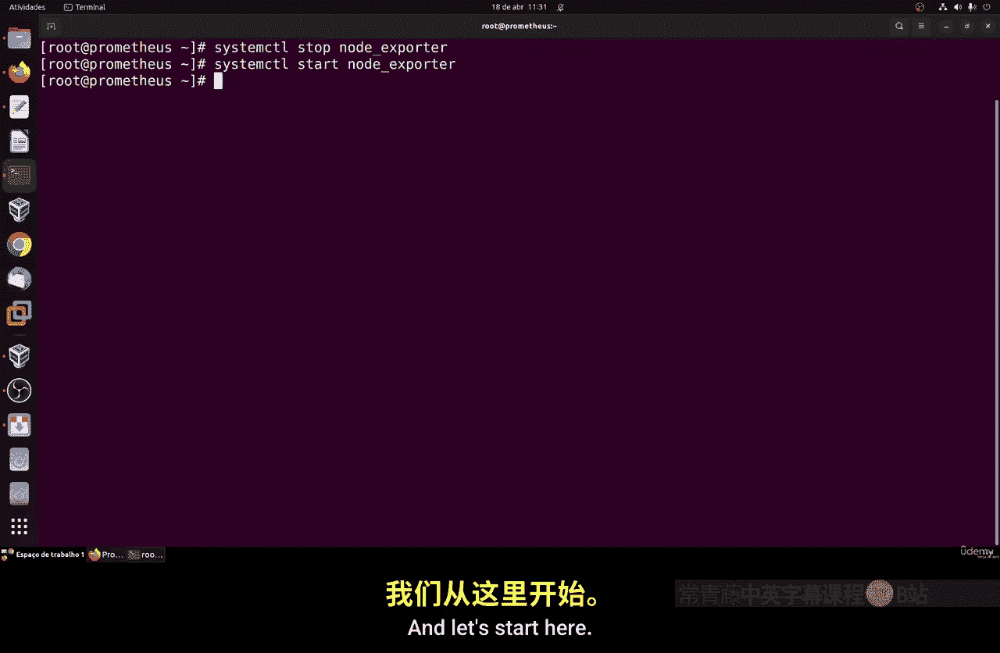

## 配置Prometheus警报规则

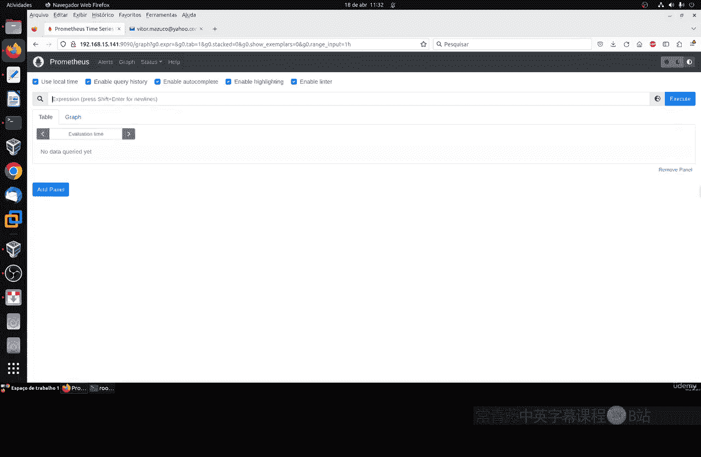

上一节我们介绍了Prometheus的基本监控。本节中，我们来看看如何定义警报规则。

首先，我们需要编辑Prometheus的主配置文件，以引入警报规则文件。

```bash
sudo nano /etc/prometheus/prometheus.yml
```

在配置文件的 `rule_files` 部分，添加你的警报规则文件路径。例如：

```yaml
rule_files:
  - "alerts.yml"
```

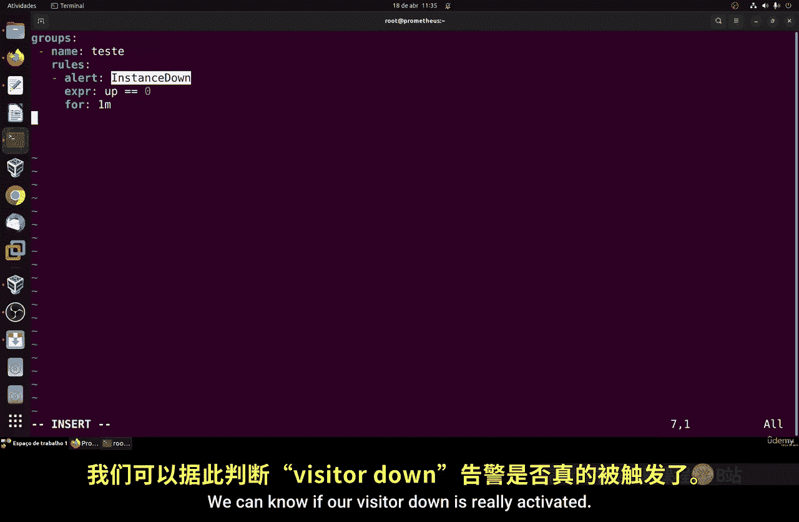

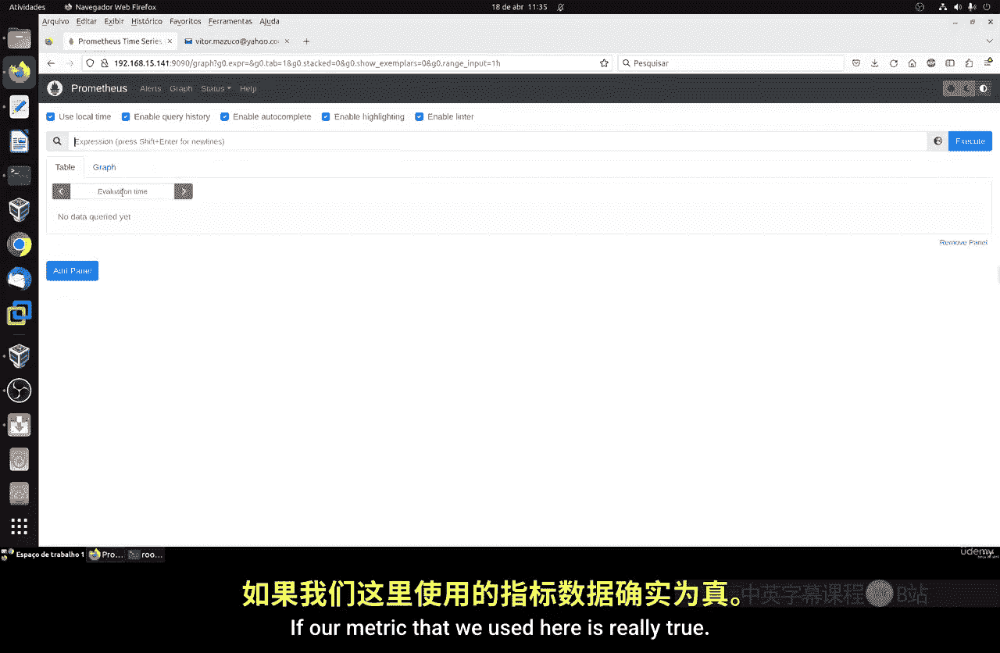

保存并退出编辑器。

接下来，我们创建这个警报规则文件。

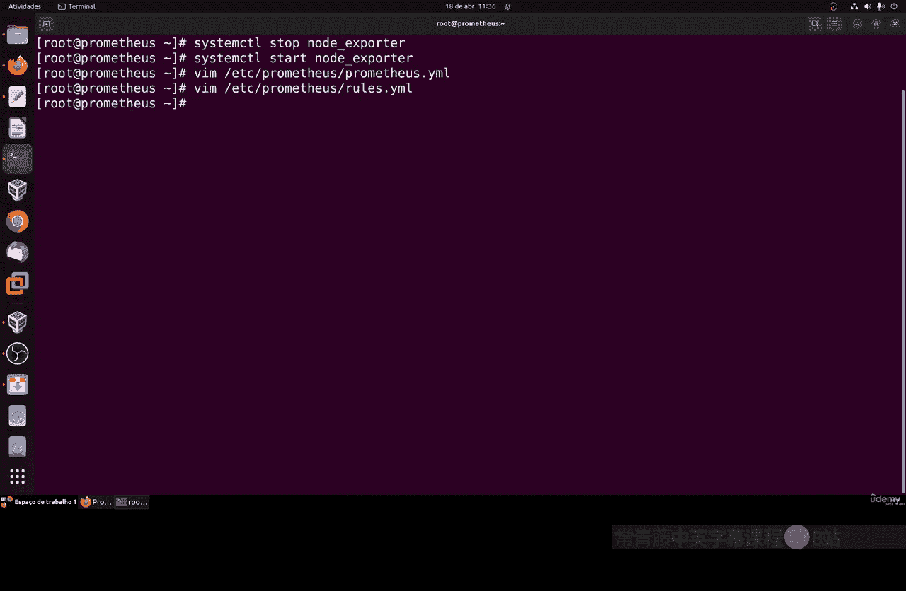

```bash
sudo nano /etc/prometheus/alerts.yml
```

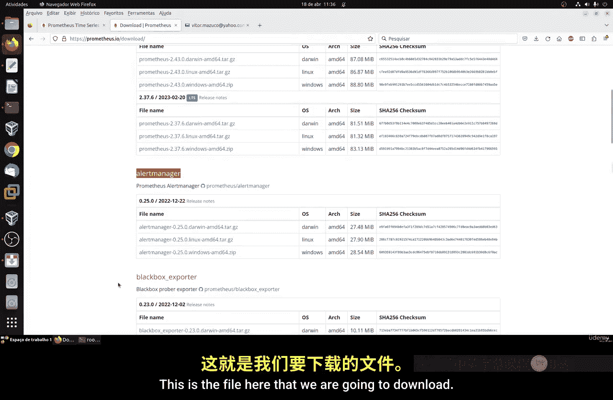

以下是该文件的内容。**请注意，YAML格式对缩进（空格）非常敏感，必须严格遵循。**

```yaml
groups:
  - name: host_monitoring
    rules:
      - alert: InstanceDown
        expr: up == 0
        for: 1m
        labels:
          severity: critical
        annotations:
          summary: "Instance {{ $labels.instance }} down"
          description: "{{ $labels.instance }} of job {{ $labels.job }} has been down for more than 1 minute."
```

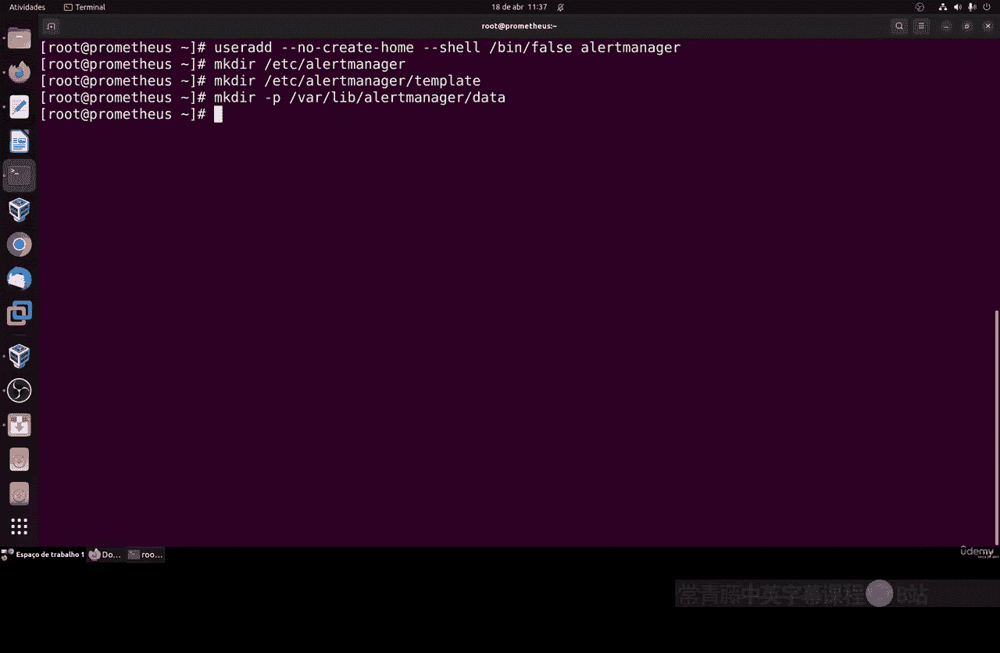

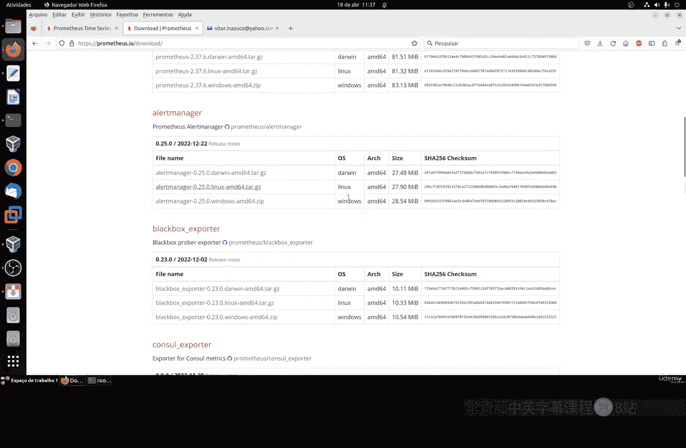

**核心概念解释：**
*   `expr: up == 0`：这是警报触发条件。`up` 是Prometheus的内置指标，`== 0` 表示目标不可用。
*   `for: 1m`：表示条件持续满足1分钟后才触发警报，用于避免瞬时故障导致的误报。

配置完成后，重启Prometheus服务以使更改生效。

```bash
sudo systemctl restart prometheus
```

---

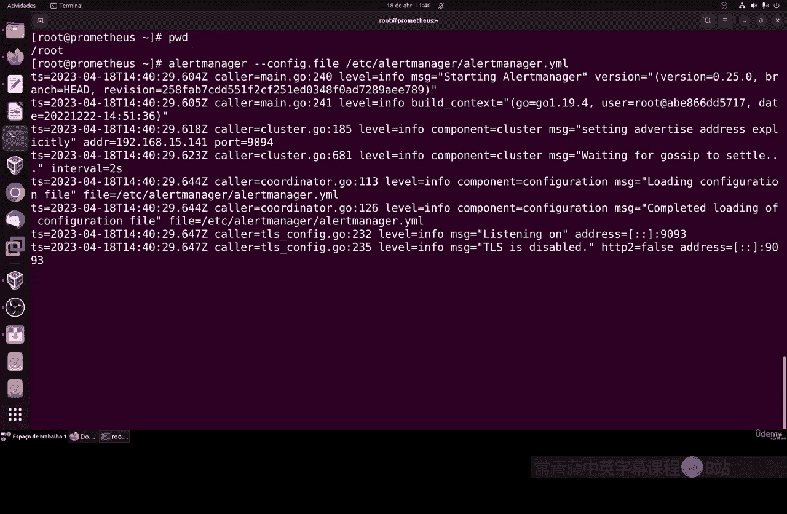

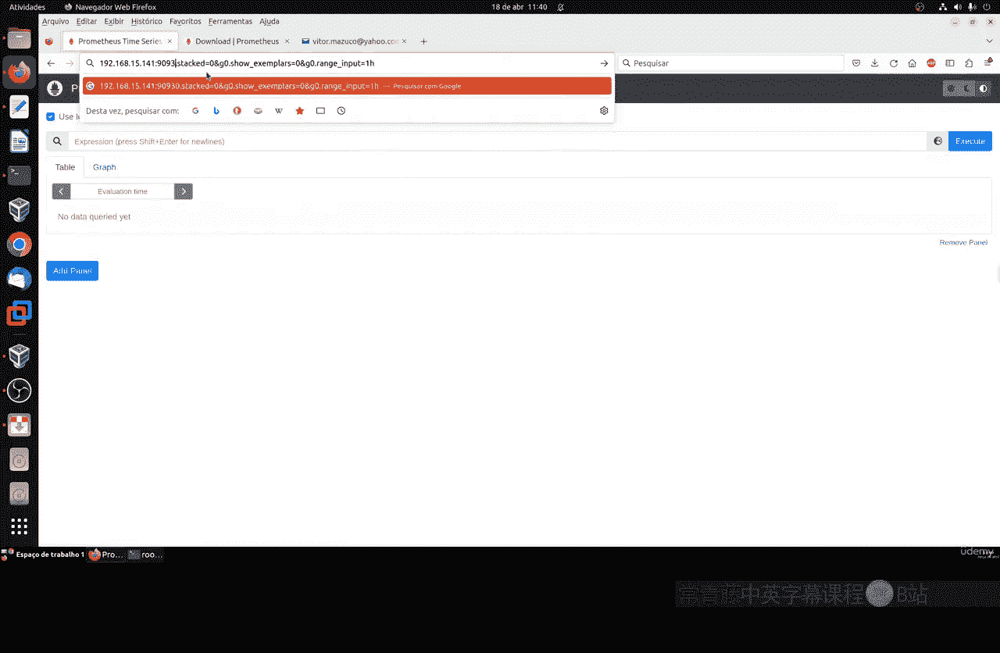

## 安装与配置Alertmanager

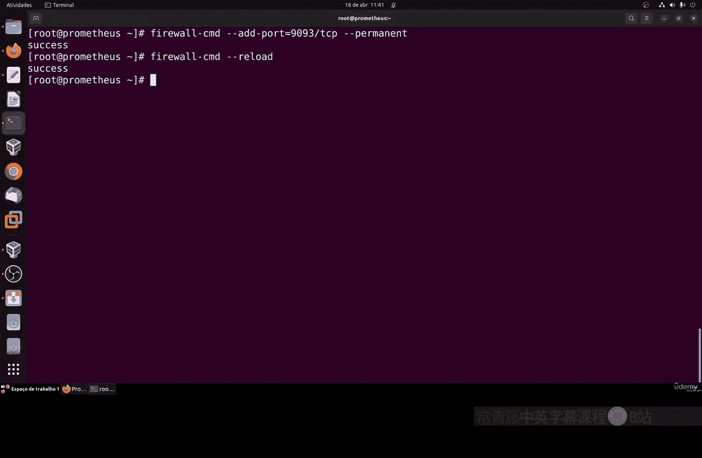

现在，警报规则已就位，但我们需要一个专门的服务来管理这些警报并发送通知，这就是Alertmanager。

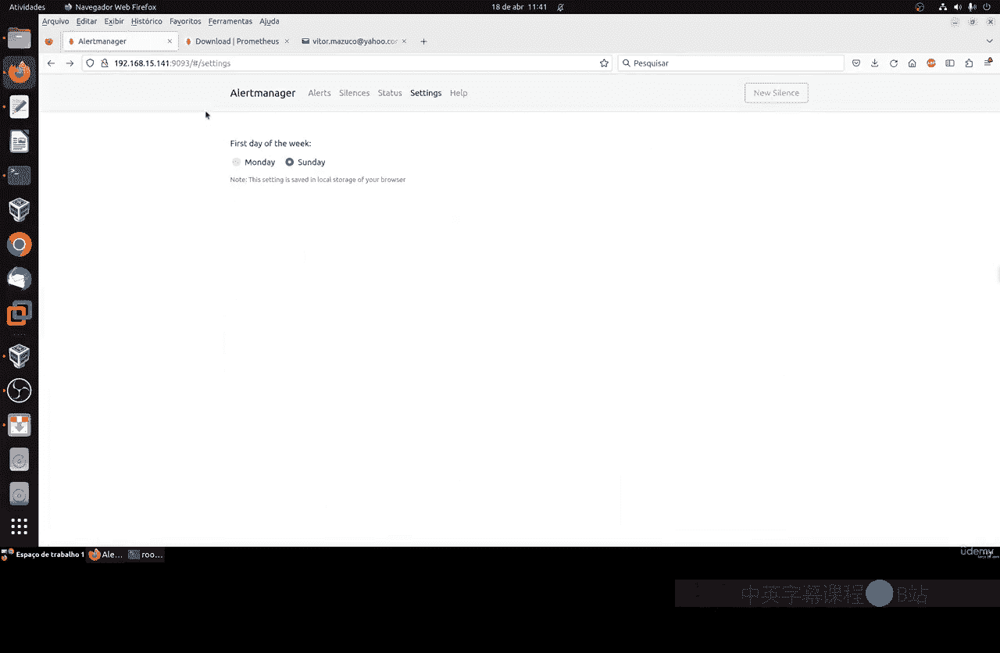

以下是安装和配置Alertmanager的步骤。

1.  **创建系统用户和目录**
    为Alertmanager创建一个专用的系统用户和必要的目录结构。

    ```bash
    sudo useradd --no-create-home --shell /bin/false alertmanager
    sudo mkdir /etc/alertmanager
    sudo mkdir /etc/alertmanager/templates
    sudo mkdir -p /var/lib/alertmanager/data
    ```

2.  **下载并安装Alertmanager**
    从Prometheus官网下载最新版本的Alertmanager，解压并安装二进制文件。

    ```bash
    wget https://github.com/prometheus/alertmanager/releases/download/v0.25.0/alertmanager-0.25.0.linux-amd64.tar.gz
    tar xvf alertmanager-0.25.0.linux-amd64.tar.gz
    sudo cp alertmanager-0.25.0.linux-amd64/alertmanager /usr/local/bin/
    sudo cp alertmanager-0.25.0.linux-amd64/amtool /usr/local/bin/
    sudo cp alertmanager-0.25.0.linux-amd64/alertmanager.yml /etc/alertmanager/
    ```

3.  **设置权限**
    将相关目录和文件的所有权赋予之前创建的 `alertmanager` 用户。

    ```bash
    sudo chown -R alertmanager:alertmanager /etc/alertmanager
    sudo chown -R alertmanager:alertmanager /var/lib/alertmanager
    sudo chown alertmanager:alertmanager /usr/local/bin/alertmanager
    sudo chown alertmanager:alertmanager /usr/local/bin/amtool
    ```

4.  **创建Systemd服务**
    创建一个Systemd服务单元文件，以便管理Alertmanager服务。

    ```bash
    sudo nano /etc/systemd/system/alertmanager.service
    ```

    将以下内容粘贴到文件中：

    ```ini
    [Unit]
    Description=Alertmanager
    Wants=network-online.target
    After=network-online.target

    [Service]
    User=alertmanager
    Group=alertmanager
    Type=simple
    ExecStart=/usr/local/bin/alertmanager \
        --config.file=/etc/alertmanager/alertmanager.yml \
        --storage.path=/var/lib/alertmanager/data
    Restart=always

    [Install]
    WantedBy=multi-user.target
    ```

    保存并退出。然后重新加载Systemd并启动服务。

    ```bash
    sudo systemctl daemon-reload
    sudo systemctl enable alertmanager
    sudo systemctl start alertmanager
    sudo systemctl status alertmanager
    ```

    使用 `ss -tulnp | grep 9093` 命令可以验证Alertmanager是否在默认的9093端口上成功运行。

---

## 配置电子邮件警报

Alertmanager已安装，接下来我们将其配置为通过电子邮件发送警报。我们需要修改两个配置：让Prometheus知道Alertmanager的位置，并设置Alertmanager的邮件发送参数。

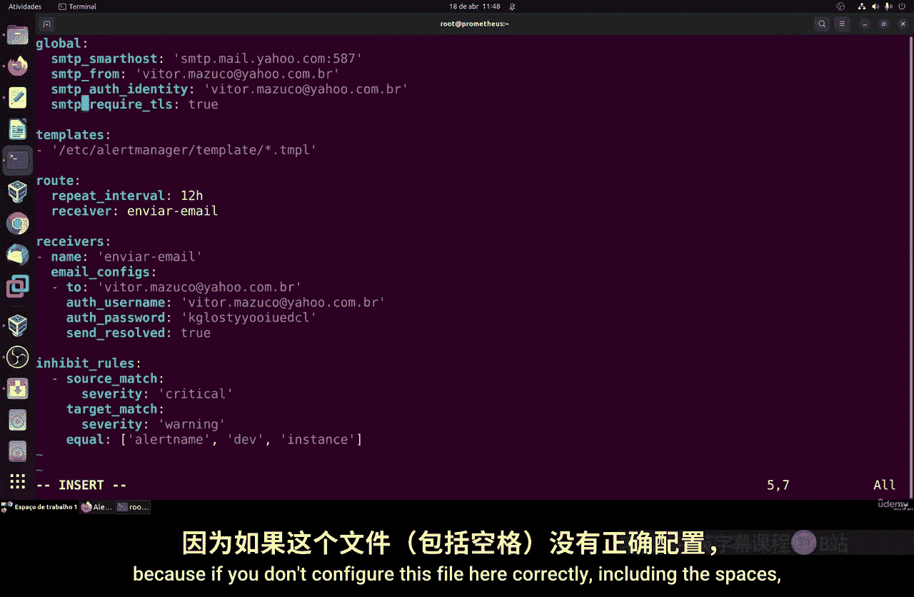

1.  **配置Prometheus连接Alertmanager**
    再次编辑Prometheus的主配置文件。

    ```bash
    sudo nano /etc/prometheus/prometheus.yml
    ```

    找到 `alerting` 部分，配置Alertmanager的地址（本例在同一台机器，故使用localhost）。

    ```yaml
    alerting:
      alertmanagers:
        - static_configs:
            - targets:
               - localhost:9093
    ```

    保存并重启Prometheus。

    ```bash
    sudo systemctl restart prometheus
    ```

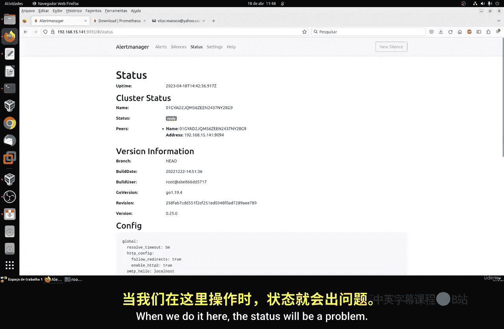

2.  **配置Alertmanager发送邮件**
    编辑Alertmanager的配置文件。这里以配置Yahoo邮箱为例，你需要替换为自己的邮箱服务器信息。

    ```bash
    sudo nano /etc/alertmanager/alertmanager.yml
    ```

    用以下配置替换原有内容（**请仔细核对缩进**）：

    ```yaml
    global:
      smtp_smarthost: 'smtp.mail.yahoo.com:587'
      smtp_from: 'your-email@yahoo.com'
      smtp_auth_username: 'your-email@yahoo.com'
      smtp_auth_password: 'your-app-specific-password' # 注意：使用应用专用密码，而非邮箱登录密码
      smtp_require_tls: true

    route:
      group_by: ['alertname']
      group_wait: 10s
      group_interval: 10s
      repeat_interval: 12h
      receiver: 'email-notifications'

    receivers:
      - name: 'email-notifications'
        email_configs:
          - to: 'your-email@yahoo.com'
            send_resolved: true
    ```

    **重要提示**：对于Gmail、Yahoo等邮箱，通常需要使用“应用专用密码”而非常规登录密码。请在你的邮箱账户设置中生成并获取该密码。

    保存配置后，重启Alertmanager服务。

    ```bash
    sudo systemctl restart alertmanager
    ```

    你可以通过浏览器访问 `http://<你的服务器IP>:9093` 来查看Alertmanager的Web界面，并确认配置是否加载成功。

---

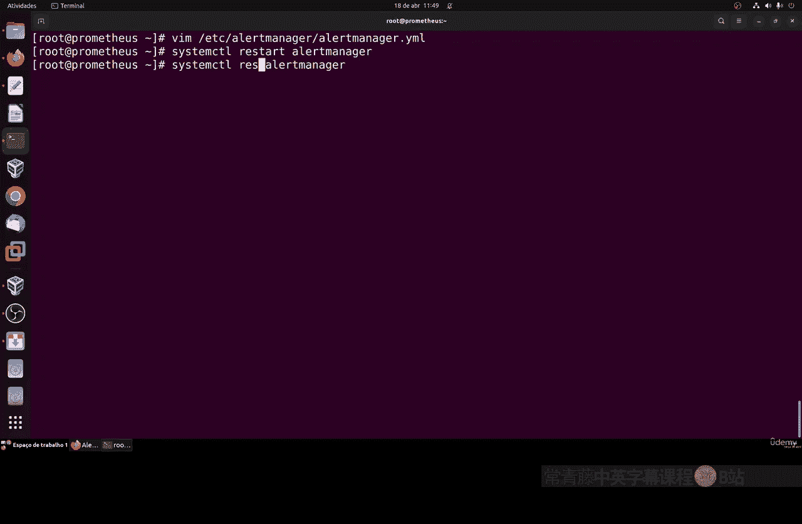

## 测试警报系统

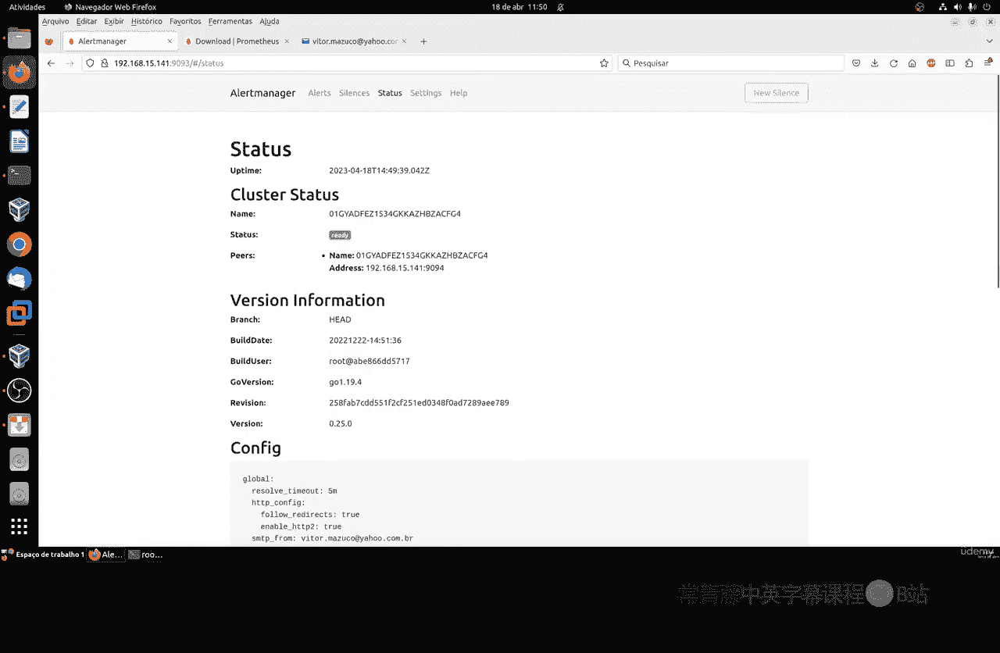

所有配置已完成，现在让我们测试整个警报链路是否正常工作。

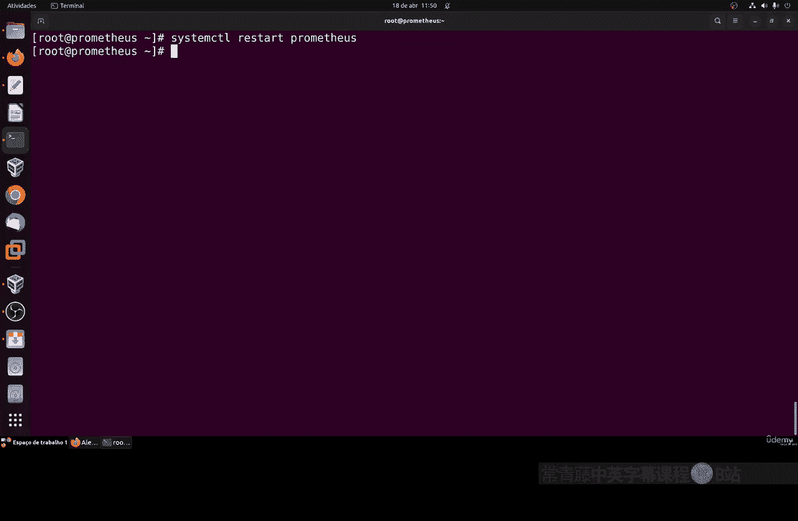

1.  **模拟故障**
    我们手动停止被Prometheus监控的 `node_exporter` 服务来模拟一次故障。

    ```bash
    sudo systemctl stop node_exporter
    ```

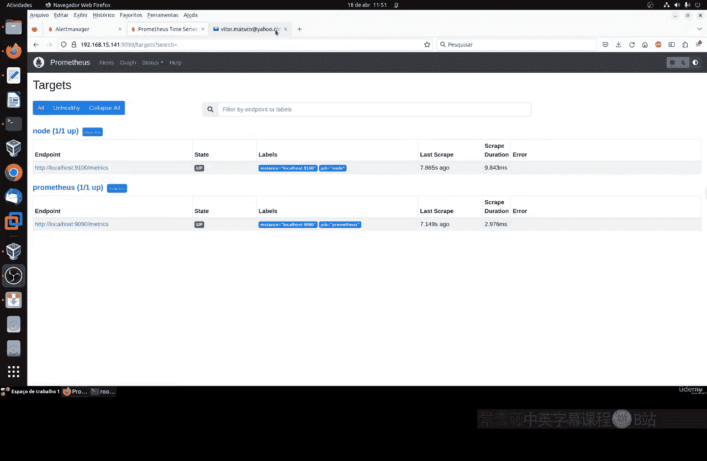

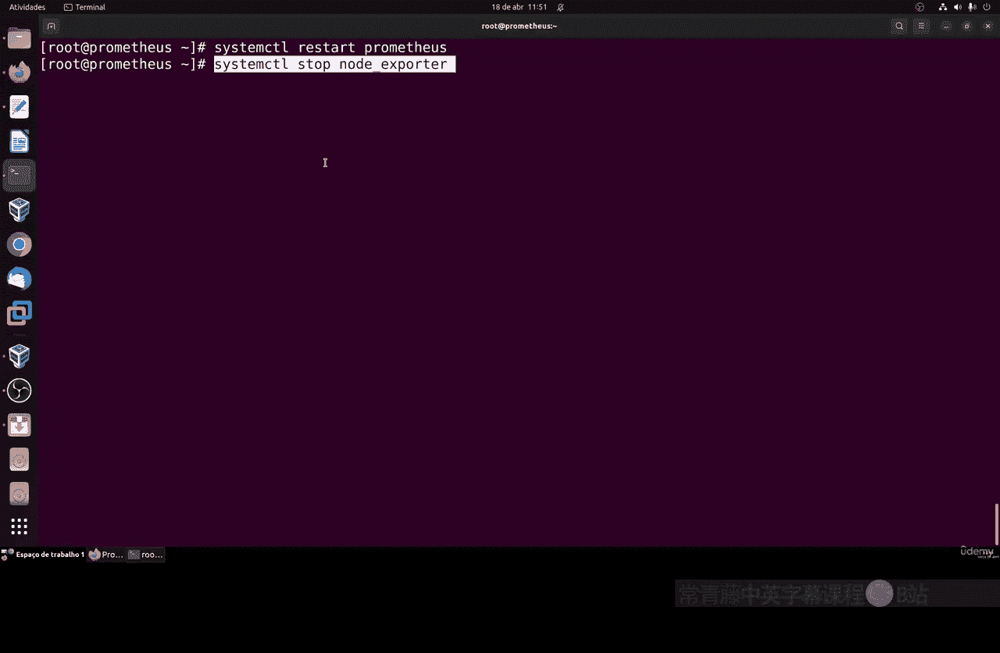

2.  **观察警报触发**
    *   等待约1分钟后（我们在规则中设置了 `for: 1m`），在Prometheus的Web界面（`http://<你的服务器IP>:9090/alerts`）中，你应该能看到 `InstanceDown` 警报的状态变为 **“Firing”**。
    *   同时，在Alertmanager的Web界面（`http://<你的服务器IP>:9093`）中，你也会看到触发的警报。
    *   最终，你应该会在配置的接收邮箱中收到一封警报邮件。

3.  **恢复服务**
    测试完成后，重新启动服务，警报状态将自动恢复为“已解决”（Resolved），你可能还会收到一封问题已解决的通知邮件。

    ```bash
    sudo systemctl start node_exporter
    ```

---

## 总结

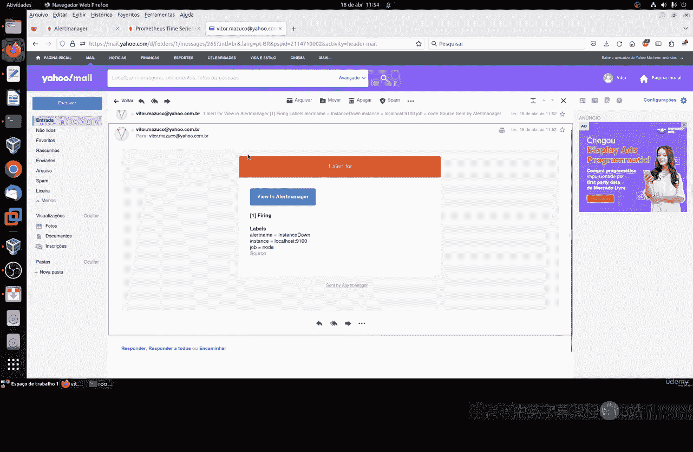

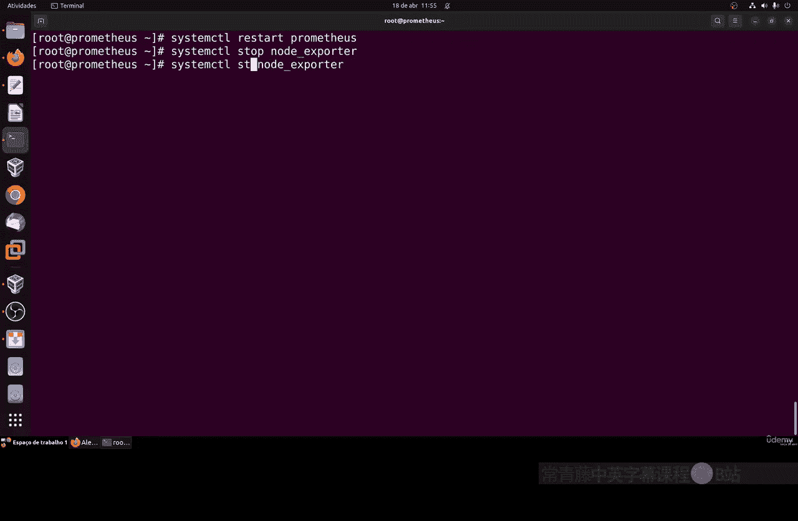

本节课中我们一起学习了如何在Linux环境下搭建一个基础的监控警报系统。我们完成了以下关键步骤：
1.  在Prometheus中定义了基于 `up == 0` 条件的警报规则。
2.  安装并配置了Alertmanager作为警报管理中心。
3.  将Alertmanager配置为通过SMTP协议发送电子邮件通知。
4.  通过模拟服务中断，成功测试了从故障检测到邮件接收的完整警报流程。

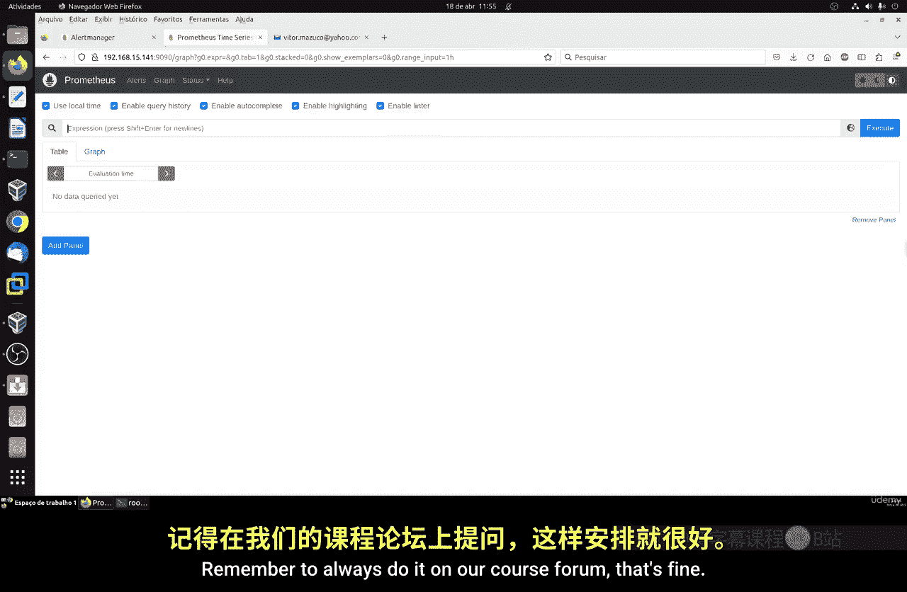

这个系统为你监控服务器和服务状态提供了一个自动化的通知机制，是运维工作中非常实用的工具。你可以在此基础上，定义更复杂的警报规则（如CPU使用率过高、磁盘空间不足等），并配置其他接收器（如Slack、Webhook等）。