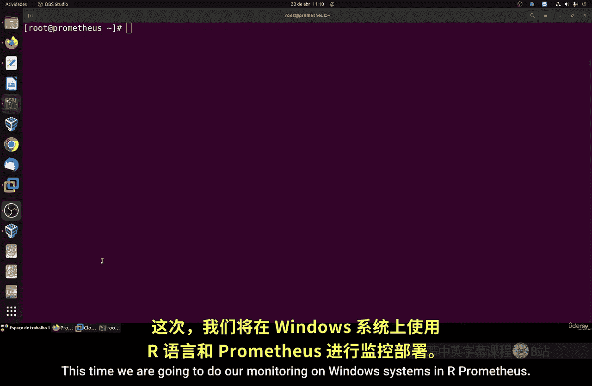
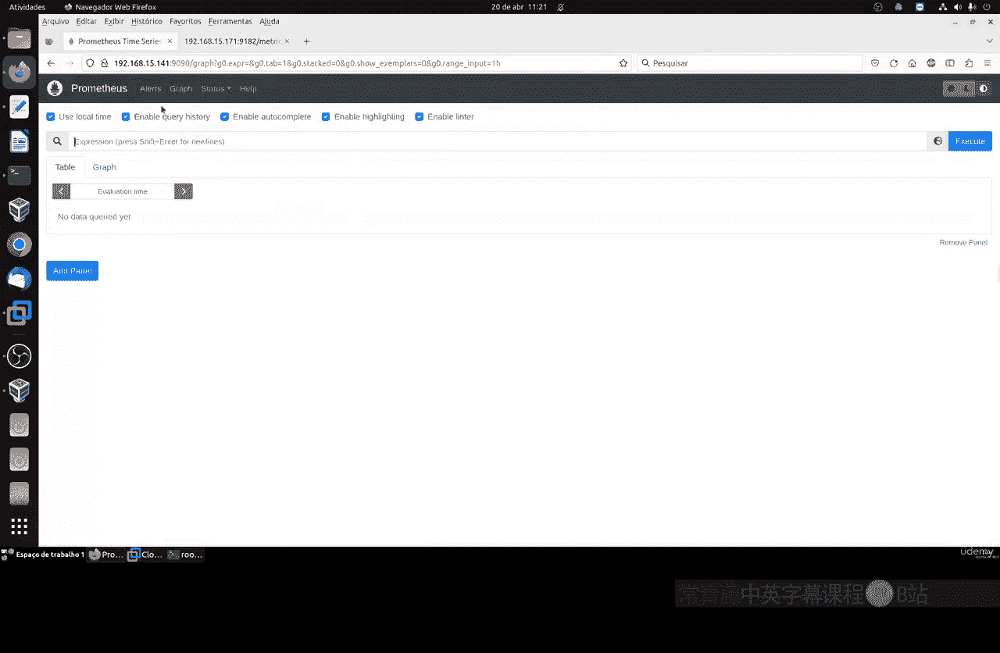
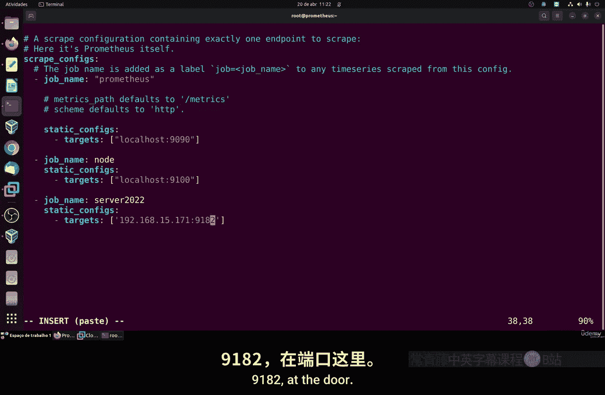
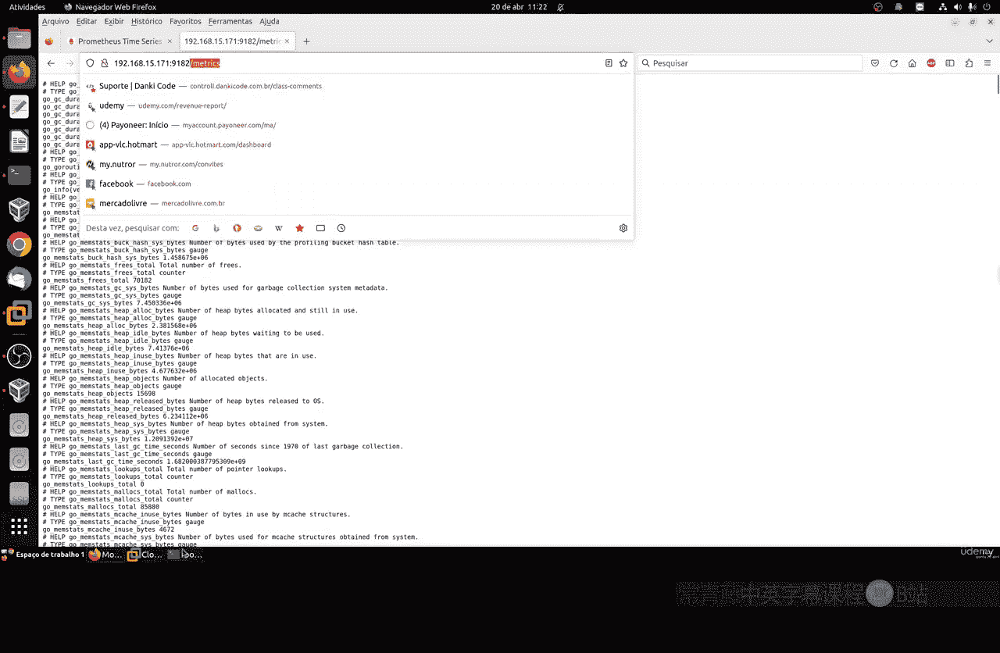
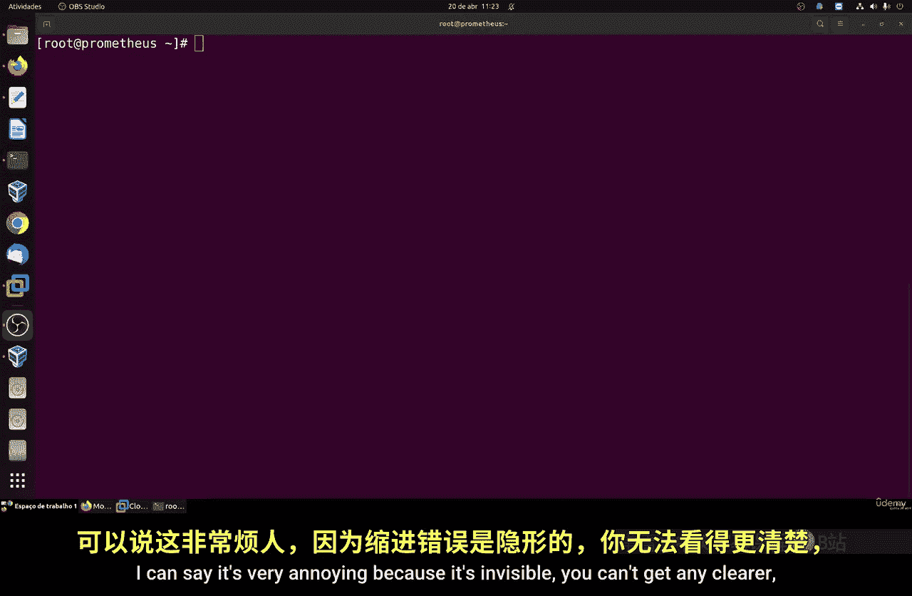
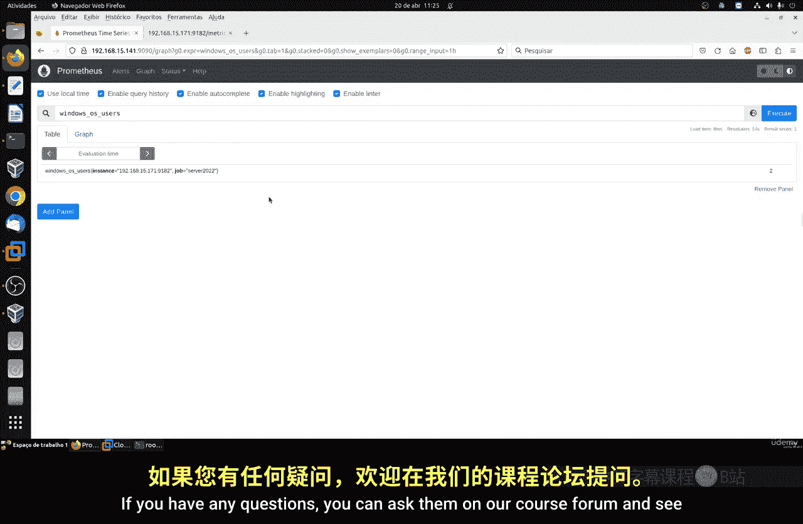

# 090：监控Windows系统 🖥️



在本节课中，我们将学习如何在Prometheus监控系统中添加对Windows系统的监控。我们将安装一个简单的Windows导出器（exporter），配置Prometheus来抓取其指标，并验证监控是否正常工作。

## 概述

上一节我们介绍了如何在Linux系统上配置监控。本节中，我们来看看如何将Windows系统纳入到同一个Prometheus监控体系中。我们将使用一个名为“Windows Exporter”的工具，它是一个独立的可执行文件，能够收集Windows系统的各种性能指标。

## 安装Windows Exporter

以下是安装Windows Exporter的步骤。

1.  **访问GitHub发布页面**：首先，你需要访问Windows Exporter的GitHub发布页面。该页面列出了所有可用的版本。
2.  **下载最新版本**：建议下载最新的稳定版本，因为它通常包含了错误修复和更新。你可以选择下载`.exe`（可执行文件）版本或`.msi`（Windows安装程序）版本。
3.  **运行安装程序**：
    *   如果你下载的是`.exe`文件，直接双击运行即可。它会启动一个控制台窗口并开始提供服务。
    *   如果你下载的是`.msi`文件，同样双击运行。它会将Windows Exporter安装为系统服务，并在后台自动运行。这种方式更为方便，因为服务会在系统启动时自动运行。
4.  **配置防火墙**：安装完成后，你需要在Windows系统的防火墙（以及任何第三方杀毒软件的防火墙）中开放端口`9182`。这是Windows Exporter提供指标的默认端口，必须允许Prometheus服务器访问此端口。

## 验证Exporter运行

安装并配置好防火墙后，你可以验证Windows Exporter是否正常运行。

1.  在Windows系统上打开浏览器。
2.  访问地址：`http://localhost:9182`。
3.  如果页面成功打开并显示大量以`# HELP`和`# TYPE`开头的文本行，最后是具体的指标数据（如`windows_cpu_time_total{...}`），则说明Exporter运行正常。这些就是Prometheus将要抓取的指标。

## 配置Prometheus

现在，我们需要告诉Prometheus去抓取这个新Windows主机的指标。这通过编辑Prometheus的配置文件来实现。



1.  **找到Prometheus配置文件**：通常位于`/etc/prometheus/prometheus.yml`。
2.  **编辑配置文件**：在`scrape_configs`部分添加一个新的任务（job）。配置内容如下：

    ```yaml
    - job_name: 'windows-server-2022'  # 给你的Windows任务起一个唯一的名字
      static_configs:
        - targets: ['192.168.1.100:9182']  # 替换为你的Windows服务器的实际IP地址
          labels:
            instance: 'MyWindowsServer'  # 可选的标签，用于标识
    ```

    **重要提示**：
    *   YAML格式对缩进（空格）非常敏感。请确保`static_configs`前面的缩进是两个空格，`targets`前面的缩进是四个空格。
    *   `job_name`必须在整个配置文件中是唯一的。
    *   `targets`中的IP地址和端口（`9182`）必须确保能从Prometheus服务器访问。

3.  **保存并重启Prometheus**：保存配置文件后，需要重启Prometheus服务以使更改生效。在Linux上，通常使用以下命令：

    ```bash
    sudo systemctl restart prometheus
    ```



4.  **检查服务状态**：重启后，检查Prometheus服务是否正常运行：

    ```bash
    sudo systemctl status prometheus
    ```

    如果状态显示为`active (running)`，则说明重启成功。如果失败，请检查配置文件的缩进和语法是否正确。



## 验证监控数据



最后，我们可以在Prometheus的Web界面中验证是否能够成功获取Windows系统的指标。

1.  打开Prometheus的Web UI（默认地址是`http://<prometheus-server-ip>:9090`）。
2.  导航到 **Status -> Targets** 页面。你应该能看到新添加的`windows-server-2022`任务，并且其状态应为 **UP**。这表示Prometheus能够成功连接到Windows Exporter。
3.  切换到 **Graph** 页面，在查询框中输入`up`并执行。在结果中，你应该能看到一个`job="windows-server-2022"`的指标，其值为`1`，这进一步确认了监控目标处于健康状态。
4.  你可以尝试查询一些Windows特有的指标，例如`windows_cpu_time_total`来查看CPU时间，或者使用`{job="windows-server-2022"}`来过滤出所有来自该Windows主机的指标。

## 总结



本节课中我们一起学习了如何将Windows系统集成到Prometheus监控中。关键步骤包括：下载并运行Windows Exporter、在防火墙中开放相应端口、在Prometheus配置文件中添加新的抓取任务。整个过程独立且简单，无需在Windows端进行复杂的代理配置。现在，你的Prometheus监控体系已经可以同时覆盖Linux和Windows环境了。