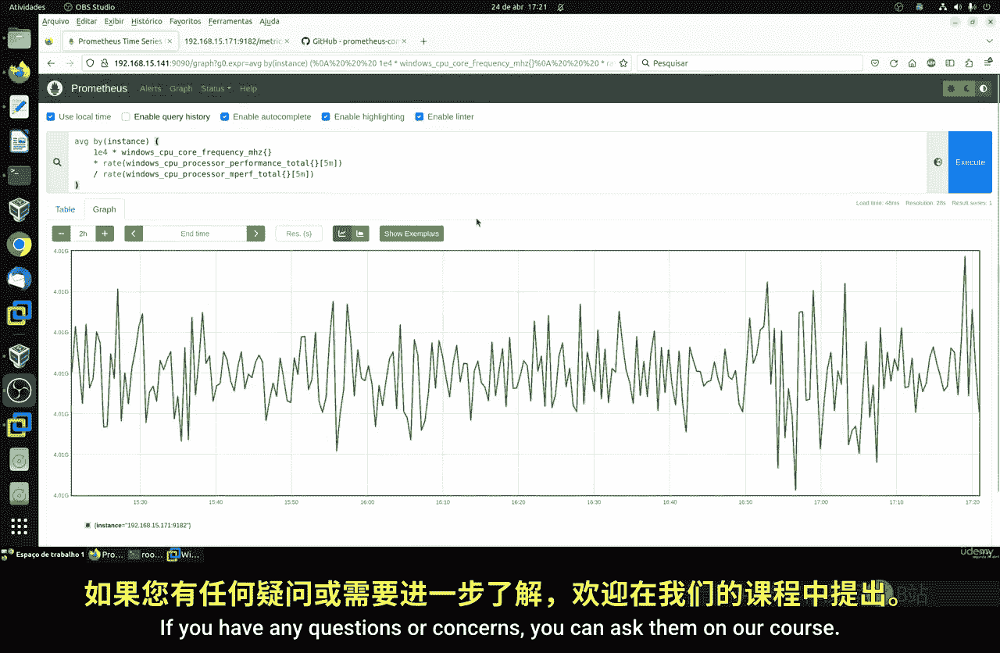

# 091：理解指标 📊

在本节课中，我们将详细探讨系统监控中的核心指标。我们将逐一介绍CPU、内存、磁盘和文件系统等基本指标，这些是监控服务器或计算机的基础知识，对于后续在Prometheus等监控系统中应用至关重要。

## CPU监控 🖥️

上一节我们介绍了监控的基本概念，本节中我们来看看最重要的指标之一：CPU。

CPU监控是一项关键指标。在Linux系统中，我们主要关注的是`node_cpu_seconds_total`这个指标。它记录了CPU在各种模式下（如空闲、系统、用户等）花费的总时间（以秒为单位）。如果你的系统有多个CPU核心，该指标会分别监控每个核心（例如CPU0、CPU1）。

以下是该指标的核心查询示例：
```
node_cpu_seconds_total
```

直接查看原始数据意义不大，通常我们会计算其平均值。例如，我们可以计算过去一分钟内所有CPU核心在空闲模式下的平均时间：
```
avg(rate(node_cpu_seconds_total{mode="idle"}[1m]))
```

这个查询的含义是：计算在过去一分钟内，所有CPU核心处于空闲状态的时间比率（即每秒的空闲时间）。结果值很低，说明当前系统负载很轻。

我们也可以计算所有模式下的CPU总使用率。以下查询计算过去一分钟内非空闲时间的平均比率，这更接近通常所说的“CPU使用率”：
```
100 - (avg(rate(node_cpu_seconds_total{mode="idle"}[1m])) * 100)
```

此外，`guest`模式指标值得关注，它反映了虚拟机对CPU的占用情况。如果系统没有运行虚拟机，该值通常为零。

## Windows系统的CPU监控 💻

在Windows系统中，CPU监控的原理类似，但指标名称和部分细节有所不同。

Windows系统有一些特有的指标，例如`DPC`（延迟过程调用），这是Windows内核用于协调请求的一种机制。另一个有用的指标是`node_cpu_time_total`，它显示了CPU在各种空闲和中断模式下花费的总时间。

以下是Windows系统CPU使用率的一个查询示例，它按模式（空闲、用户、特权、中断等）展示：
```
sum(rate(node_cpu_time_total{mode=~"idle|user|privileged|interrupt|dpc"}[5m])) by (mode)
```

我们还可以监控每个处理器的使用率。以下查询计算每个CPU核心的使用率：
```
rate(node_cpu_time_total{mode!="idle"}[5m]) / ignoring(mode) group_left rate(node_cpu_time_total[5m])
```

频率监控在Windows上也很有用。以下查询显示每个主机CPU核心的平均运行频率（以赫兹为单位）：
```
avg(node_cpu_frequency_hertz) by (instance)
```

通过这个指标，你可以比较不同服务器或新旧处理器的性能差异。

## 总结 📝

本节课我们一起学习了系统监控的核心——CPU指标。

我们首先介绍了Linux系统下的`node_cpu_seconds_total`指标，学习了如何计算CPU的平均使用率、空闲时间以及如何按核心和模式进行筛选。关键点在于理解`rate()`函数用于计算变化率，`avg()`函数用于求平均值，以及时间范围选择（如`[1m]`）的重要性。

接着，我们探讨了Windows系统下的CPU监控。虽然核心目标相同——了解CPU的忙碌程度，但Windows提供了如`node_cpu_time_total`、`DPC`等特有指标。我们同样学习了如何查询不同模式下的CPU时间、计算使用率以及监控CPU运行频率。




掌握这些基础CPU指标查询，是构建有效监控告警系统、进行性能分析和容量规划的第一步。无论是Linux还是Windows，理解这些指标的含义和查询方式，都能帮助你更好地洞察系统的运行状态。