# 092：理解指标 - 第二部分 🖥️📊

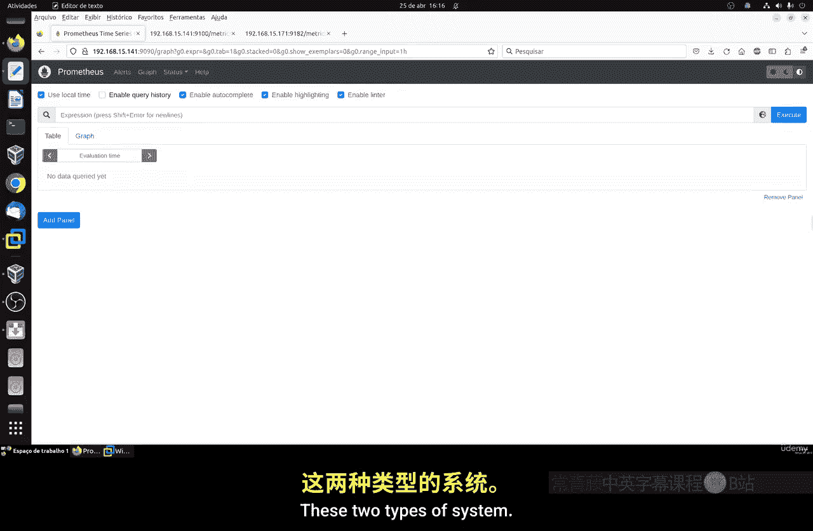

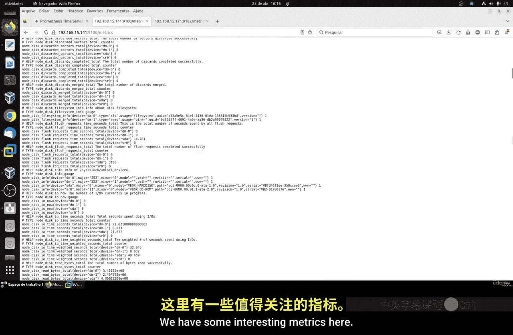

在本节课中，我们将继续学习系统指标，重点聚焦于磁盘和文件系统的监控。我们将学习如何在Linux和Windows系统中查看磁盘空间、输入输出（I/O）操作等关键指标，并理解其含义。


---

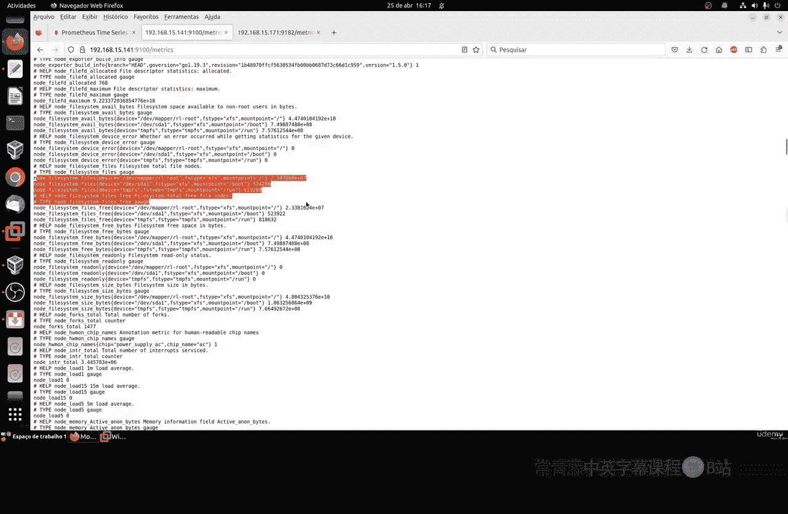

上一节我们介绍了系统监控的基础概念，本节中我们来看看与磁盘相关的具体指标。

## 文件系统指标 📁

在Linux系统中，我们可以监控文件系统的使用情况。文件系统本质上管理着磁盘上的数据。以下是一些关键指标。

以下是主要的文件系统指标列表：
*   **文件系统类型**：例如 `ext4`、`xfs` 等。
*   **挂载点**：如根分区 `/`、`/boot`、`/run` 等。
*   **设备名**：如 `sda1`、`sda2`、`sdb` 等，代表不同的物理或虚拟磁盘。


最重要的通常是根分区 `/`，它包含了系统的大部分数据。我们可以使用 `node_filesystem_avail_bytes` 这个指标来查询可用磁盘空间。

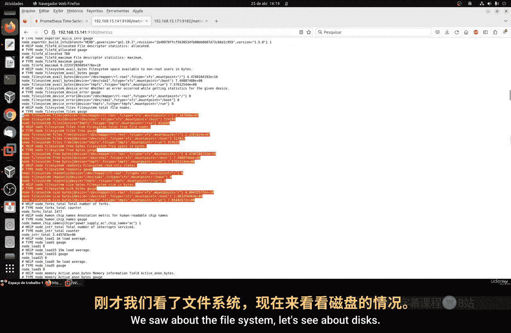

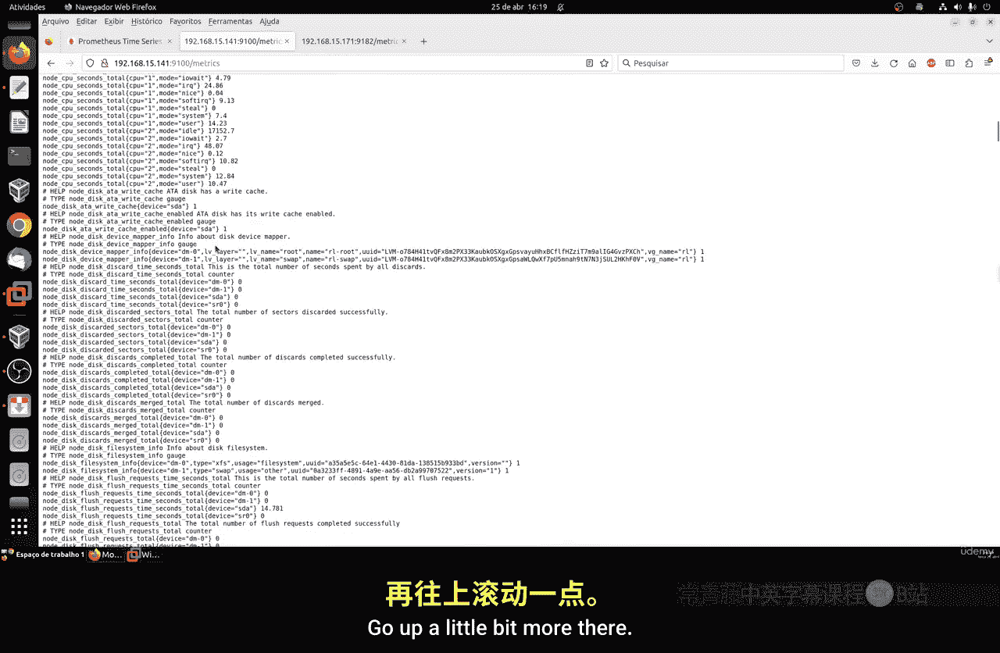

**示例查询**：
```promql
node_filesystem_avail_bytes{mountpoint="/"}
```
此查询将返回根分区 `/` 的可用字节数。例如，一个44GB的磁盘可能会显示约40GB的可用空间。Linux系统会为root用户保留一部分空间（通常在 `/boot` 分区），但这部分通常较小。

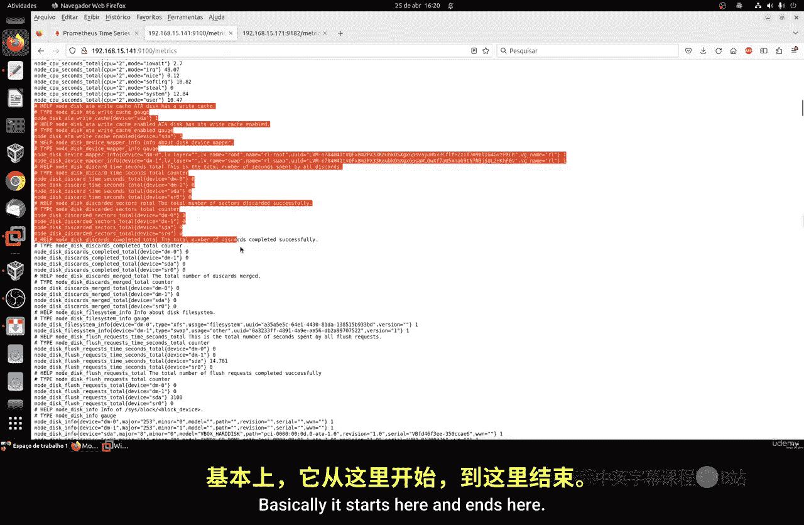

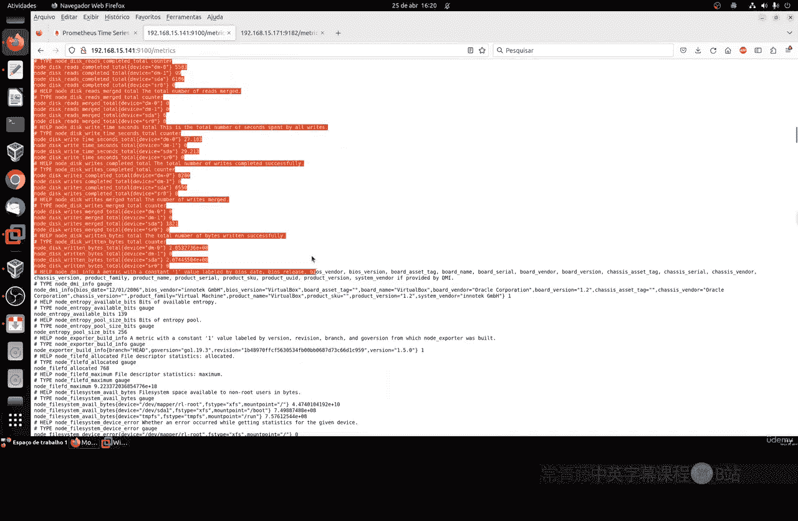


我们还可以查看 `node_filesystem_size_bytes` 来获取文件系统的总大小。这些指标能帮助我们了解磁盘的空间使用状况。

---

了解了文件系统的空间使用情况后，接下来我们看看磁盘的I/O性能指标。

## 磁盘I/O指标 ⚡

磁盘I/O指标反映了磁盘的读写活动性能，对于诊断系统瓶颈至关重要。

以下是关键的磁盘I/O指标列表：
*   **磁盘I/O操作时间**：`node_disk_io_time_seconds_total`，表示磁盘忙于处理I/O请求的总时间。
*   **读写字节数**：`node_disk_written_bytes_total` 和 `node_disk_read_bytes_total`，分别表示写入和读取的总字节数。
*   **I/O操作速率**：使用 `rate()` 函数计算每秒的I/O操作数，例如 `rate(node_disk_io_time_seconds_total[10m])`。
*   **平均I/O时间**：`node_disk_read_time_seconds_total` 和 `node_disk_write_time_seconds_total`，表示读写的平均耗时。

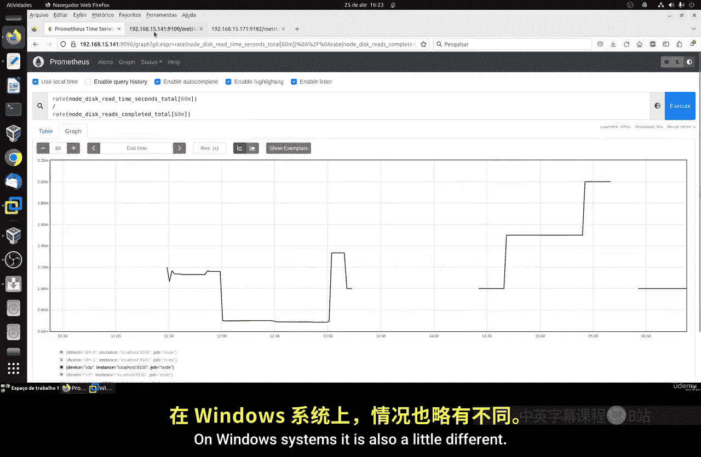

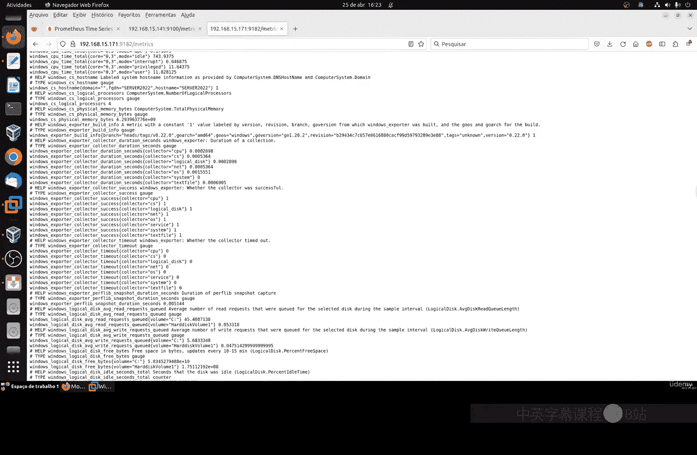

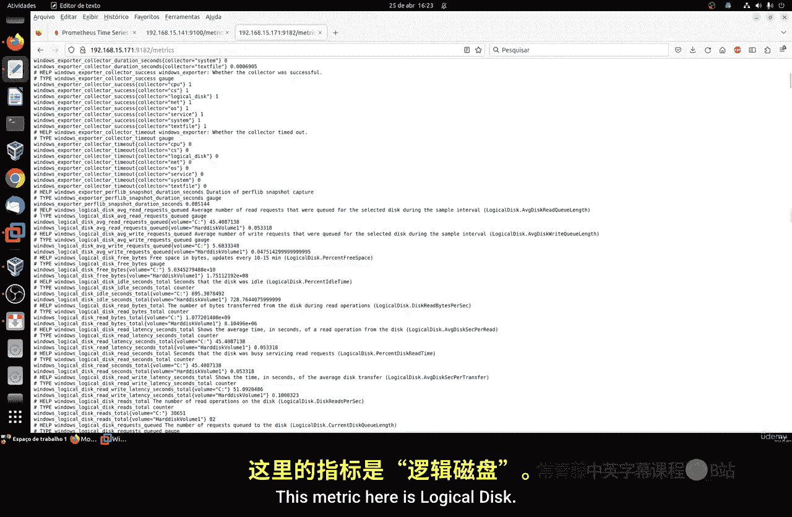

通过比较读写速率，可以了解磁盘的工作负载模式。例如，数据库应用通常会产生大量的写入操作。监控这些指标的走势图（如过去10分钟或1小时）可以帮助我们发现异常峰值或持续高负载。

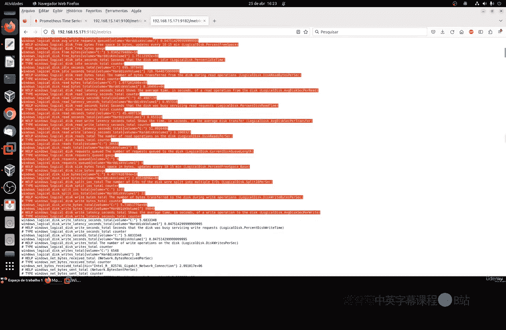

---

Linux和Windows的监控逻辑相似，但指标名称有所不同。现在，我们来看看Windows系统下的磁盘监控。

## Windows系统下的磁盘监控 🪟

在Windows系统中，对应的概念是“逻辑磁盘”。其监控逻辑与Linux一致，但使用的指标名称不同。

以下是Windows中的主要磁盘指标列表：
*   **逻辑磁盘总大小**：`logical_disk_size_bytes`，用于查询如C盘的总容量。
    **示例查询**：`logical_disk_size_bytes{volume="C:"}`
*   **逻辑磁盘可用空间**：`logical_disk_free_bytes`，监控可用空间的变化趋势。
*   **平均读写请求**：`logical_disk_avg_read_seconds` 和 `logical_disk_avg_write_seconds`。
*   **磁盘操作速率**：`rate(logical_disk_read_seconds_total[2m])` 和 `rate(logical_disk_write_seconds_total[2m])`。

一个非常有用的综合指标是计算磁盘的总IOPS（每秒输入输出操作数）。这可以通过将一段时间内的读写操作速率相加得到，反映了磁盘的整体繁忙程度。持续的高IOPS可能表明磁盘是系统性能的瓶颈。

---

## 总结 📝

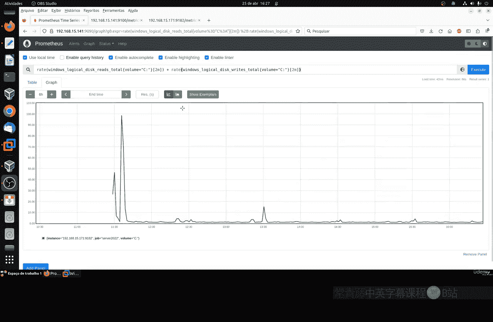

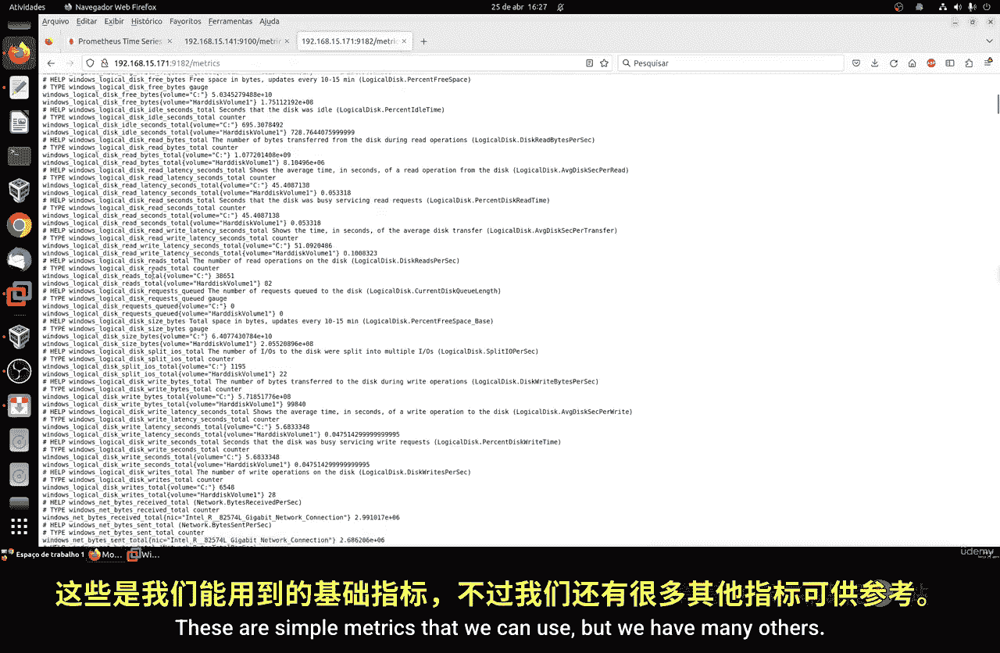

本节课中我们一起学习了磁盘和文件系统监控的核心指标。
我们首先探讨了Linux下如何查看文件系统的空间使用情况，例如总容量和可用空间。
接着，我们深入了解了磁盘的I/O性能指标，包括读写时间、字节数和操作速率。
最后，我们对比了Windows系统下的逻辑磁盘监控，其核心思想与Linux相通。
虽然可监控的指标非常多，但在实践中，我们通常只需关注与当前性能问题最相关的少数关键指标，并进行过滤和聚焦。


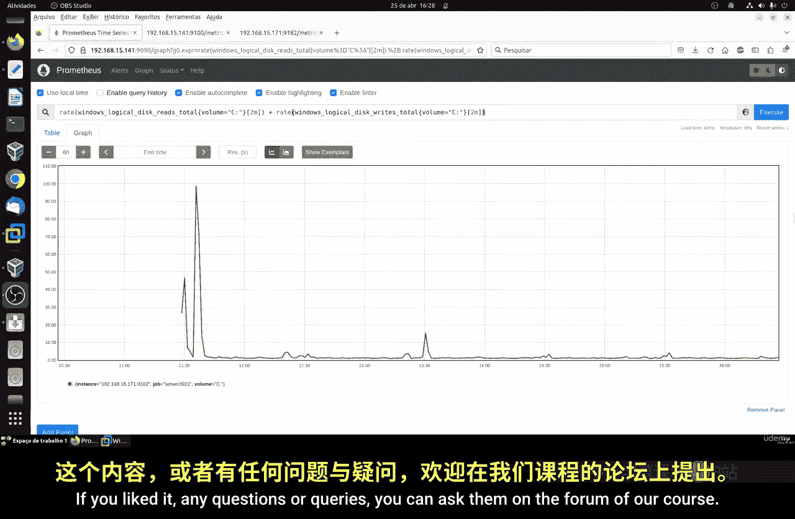

通过掌握这些指标，你可以有效地评估系统的磁盘健康状况和性能表现。