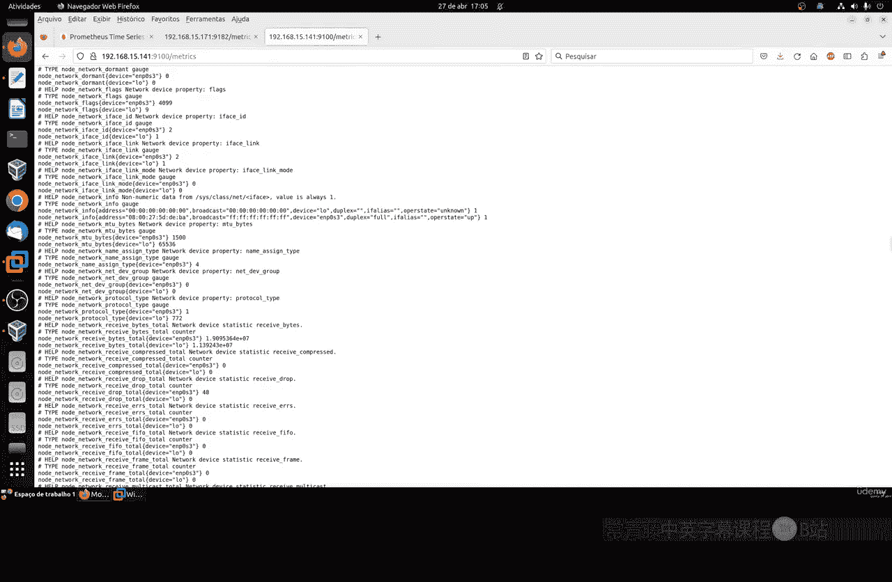
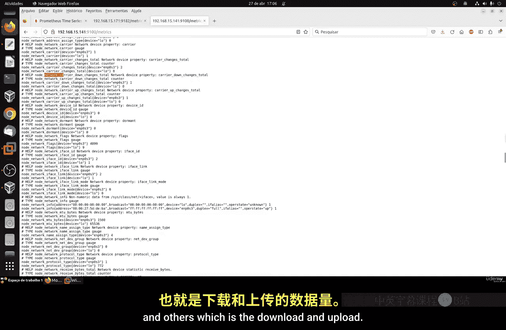
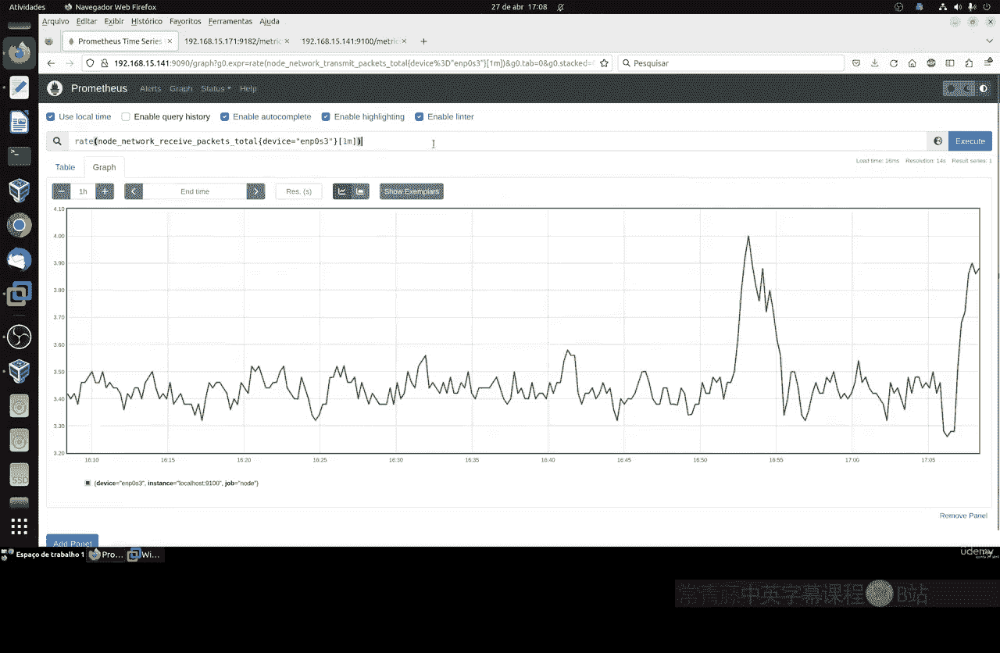
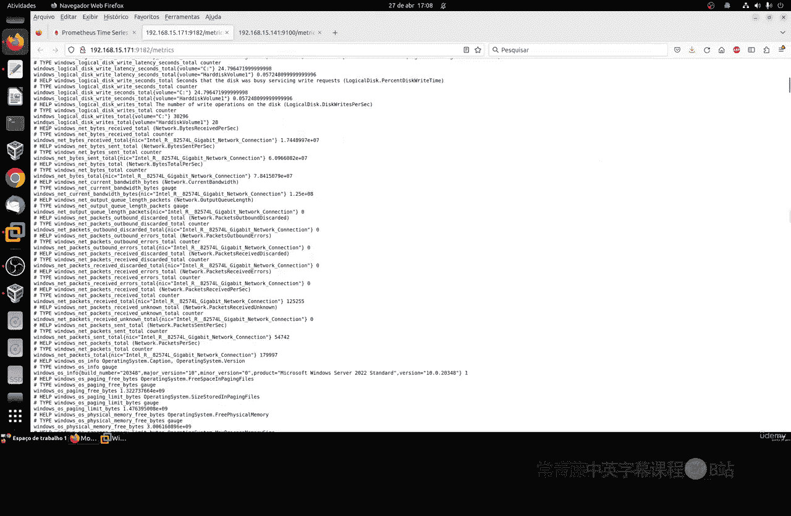
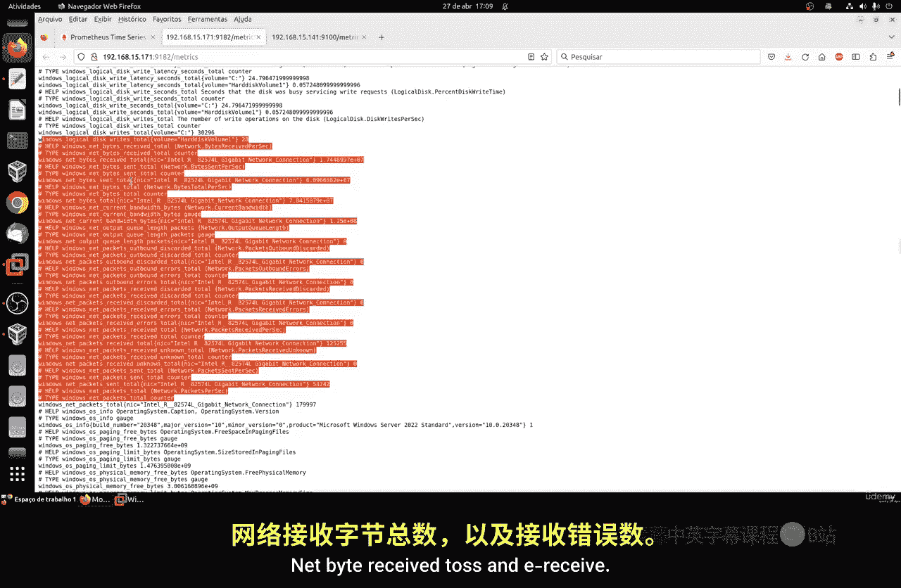
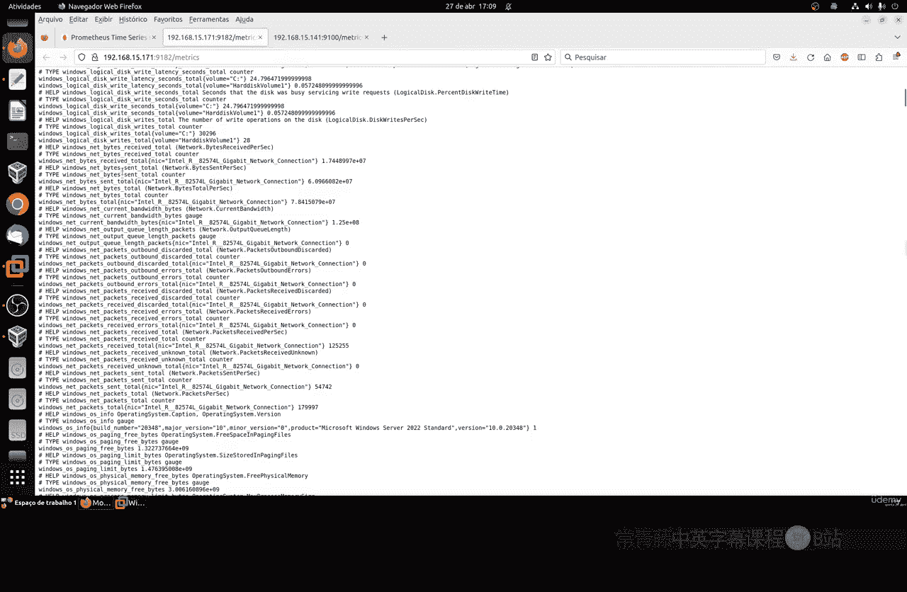
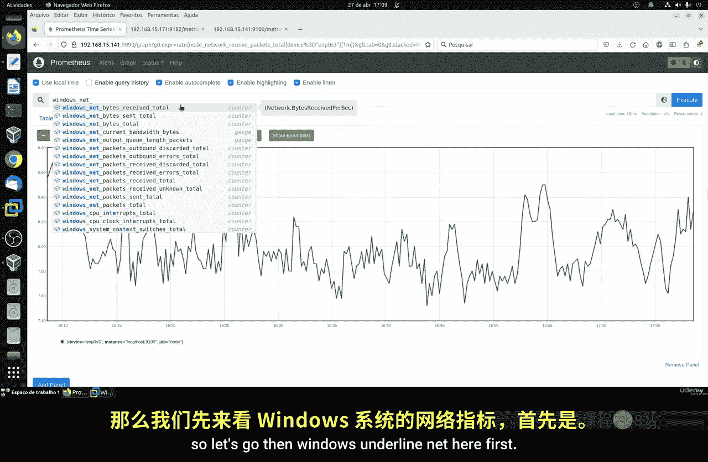
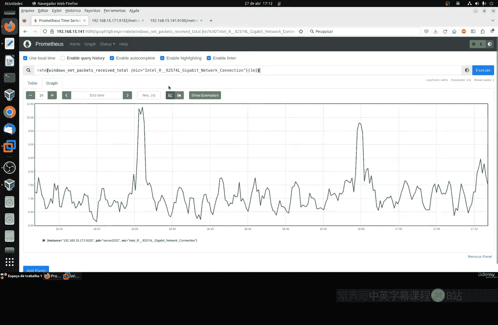
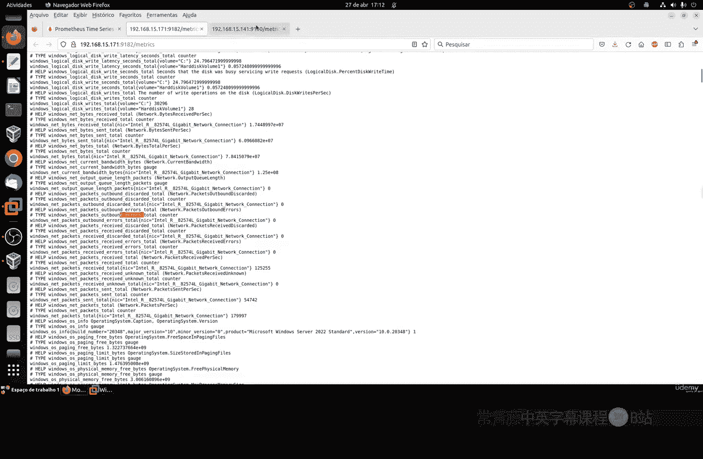

# 093：理解指标 - 网络部分 🌐

在本节课中，我们将学习如何监控和理解Linux系统中的网络指标。网络监控对于了解服务器的带宽使用情况和网络接口的健康状况至关重要。

上一节我们介绍了系统资源监控，本节中我们来看看网络相关的核心指标。

## 网络指标概述

在Linux系统中，网络指标主要通过`node_network`系列指标来收集。这些指标提供了关于网络接口接收和发送数据量的详细信息。

以下是网络监控中最重要的两类指标：

*   **接收数据量**：`node_network_receive_bytes_total`，用于监控下载流量。
*   **发送数据量**：`node_network_transmit_bytes_total`，用于监控上传流量。

## Linux网络指标详解

在Linux上，网络指标以`node_network`为前缀。每个网络接口（如eth0、wlan0）都会有对应的指标。

### 核心字节流量指标

最重要的指标是字节总数，它反映了网络接口的实际数据吞吐量。

*   **接收字节总数**：`node_network_receive_bytes_total{device="<接口名>"}`
*   **发送字节总数**：`node_network_transmit_bytes_total{device="<接口名>"}`

> **注意**：直接使用这些累计值意义不大，通常需要使用`rate()`函数计算速率，以了解每分钟或每秒的带宽使用情况。例如：`rate(node_network_receive_bytes_total[1m])`。

### 数据包流量指标

除了字节数，监控数据包数量也能帮助诊断网络问题。

*   **接收数据包总数**：`node_network_receive_packets_total`
*   **发送数据包总数**：`node_network_transmit_packets_total`

## Windows系统网络指标

对于Windows系统，网络指标的命名方式略有不同，但逻辑是相通的。

Windows的核心网络指标如下：

*   **发送字节总数**：`windows_net_bytes_sent_total`
*   **接收字节总数**：`windows_net_bytes_received_total`

与Linux类似，也需要使用`rate()`函数来计算流量速率，以获得有意义的监控数据。

## 其他相关网络指标

除了流量指标，Prometheus还提供了其他用于诊断的网络指标。

以下是一些有用的附加指标：

*   **错误计数**：`node_network_receive_errs_total`, `node_network_transmit_errs_total`，用于监控网络错误。
*   **丢包计数**：`node_network_receive_drop_total`, `node_network_transmit_drop_total`，用于监控数据包丢失情况。

## 指标筛选与使用

如果系统有多个网络接口，可以通过`device`标签进行筛选，只监控特定的接口。在可视化图表中，对指标应用`rate()`函数是标准做法，它能将累计计数器转换为易于理解的速率图。

本节课中我们一起学习了如何监控Linux和Windows系统的网络流量。我们了解了核心的接收和发送字节指标、数据包指标，以及如何通过`rate()`函数将它们转化为有意义的带宽图表。此外，还简要介绍了错误和丢包等诊断性指标。掌握这些指标能帮助你有效监控服务器的网络性能和健康状况。