# 094：创建自定义指标 📊

在本节课中，我们将学习如何在Prometheus监控系统中创建和使用自定义指标。与系统预定义的指标不同，自定义指标允许你根据自己的需求来监控特定的系统信息。

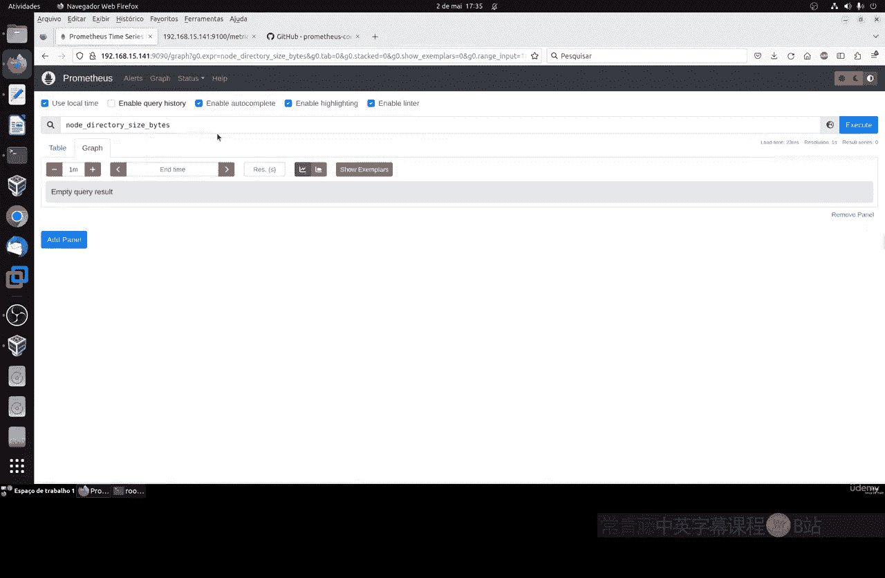

## 概述

上一节我们介绍了如何使用Node Exporter收集系统预定义指标。本节中，我们将学习如何创建自定义指标，并通过Node Exporter将其暴露给Prometheus进行收集和展示。

## 创建自定义指标文件

首先，我们需要为自定义指标创建一个专门的目录和文件。以下是具体步骤。

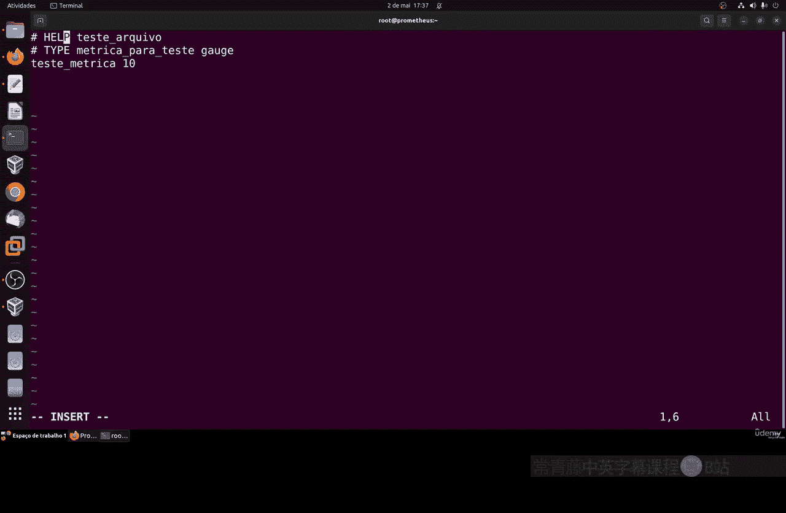

### 1. 创建指标文件目录

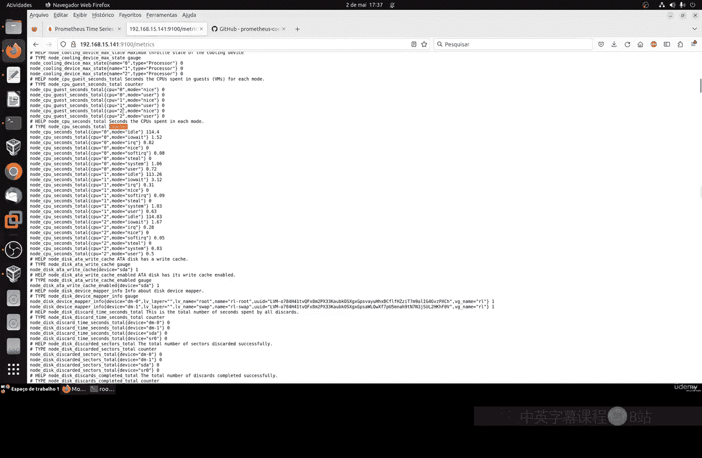

我们需要创建一个目录来存放自定义指标文件，并设置正确的权限，以便Prometheus能够读取。

```bash
sudo mkdir -p /var/lib/prometheus/textfile
sudo chown -R prometheus:prometheus /var/lib/prometheus/textfile
```

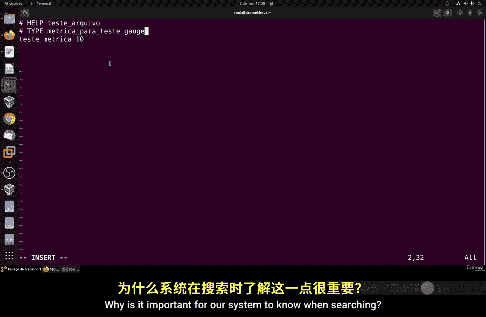

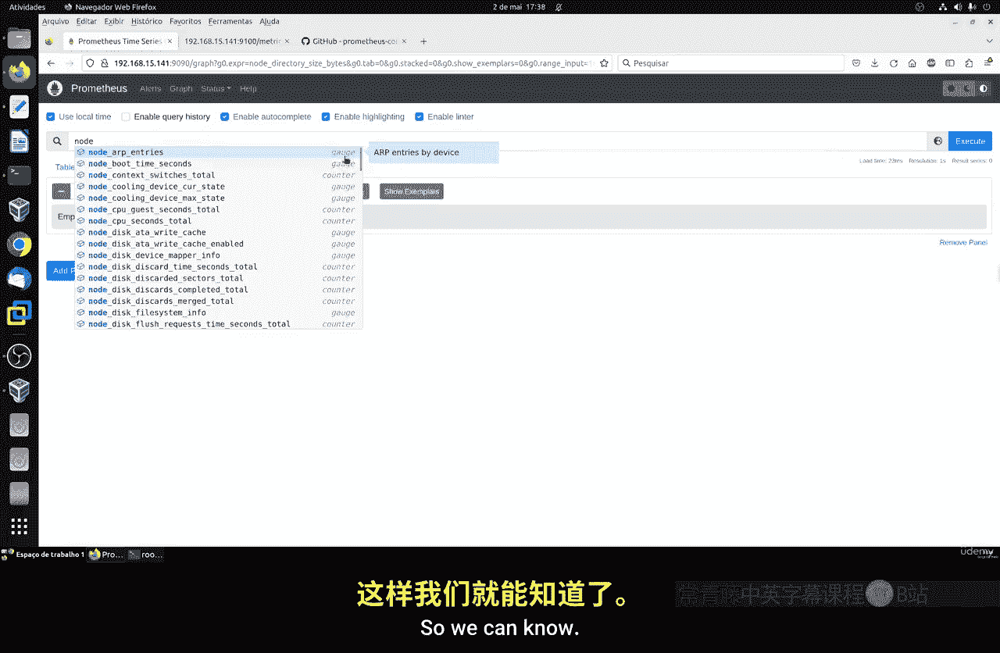

### 2. 创建指标文件

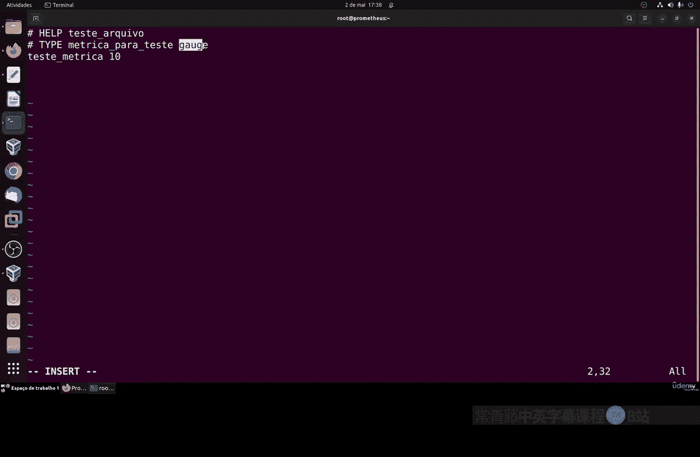

自定义指标文件需要遵循特定的格式。文件扩展名必须是`.prom`，并且内容需要包含帮助信息、类型和指标值。

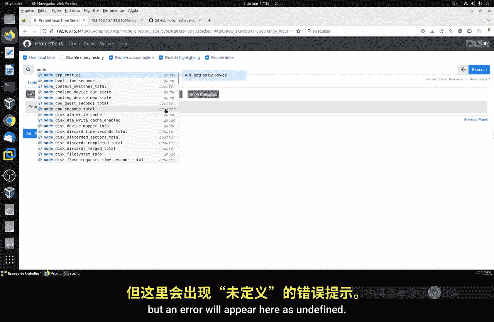

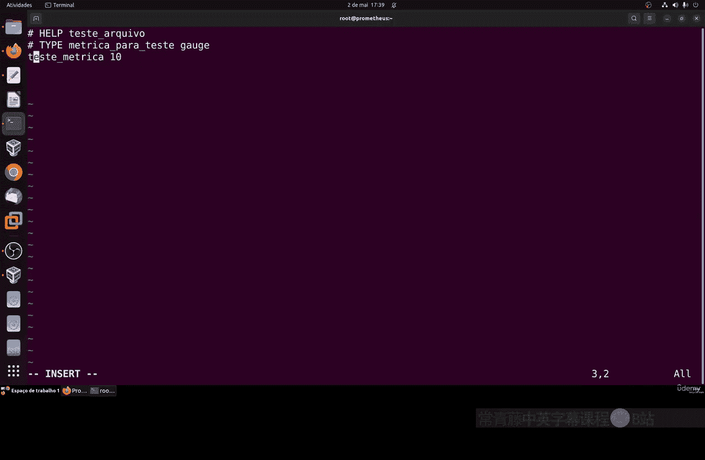

以下是创建一个简单测试指标文件的示例：

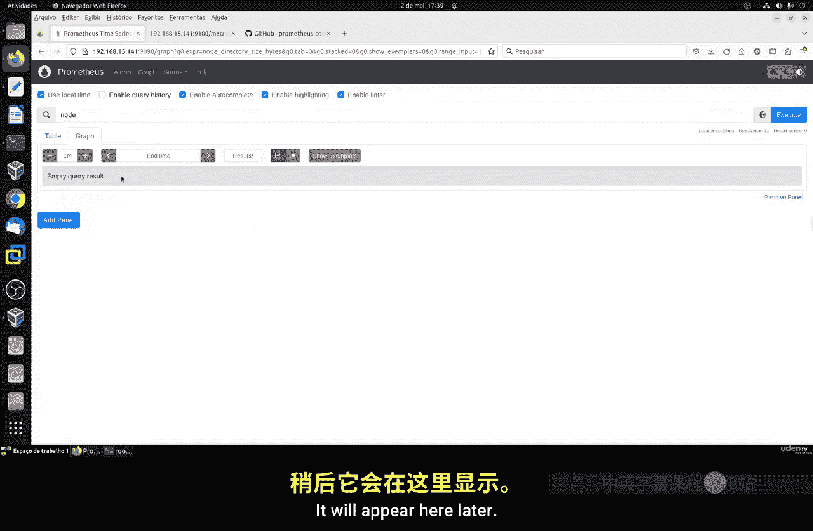

```bash
sudo nano /var/lib/prometheus/textfile/test.prom
```

在文件中输入以下内容：

```
# HELP test_metric A custom metric for testing.
# TYPE test_metric gauge
test_metric 10
```

**格式说明：**
*   `# HELP`： 描述指标的含义。
*   `# TYPE`： 定义指标的类型（例如 `gauge` 或 `counter`）。
*   `test_metric 10`： 指标名称和其当前值。

保存并退出文件。

## 配置Node Exporter

创建好指标文件后，我们需要配置Node Exporter，让它知道从哪个目录读取这些自定义文件。

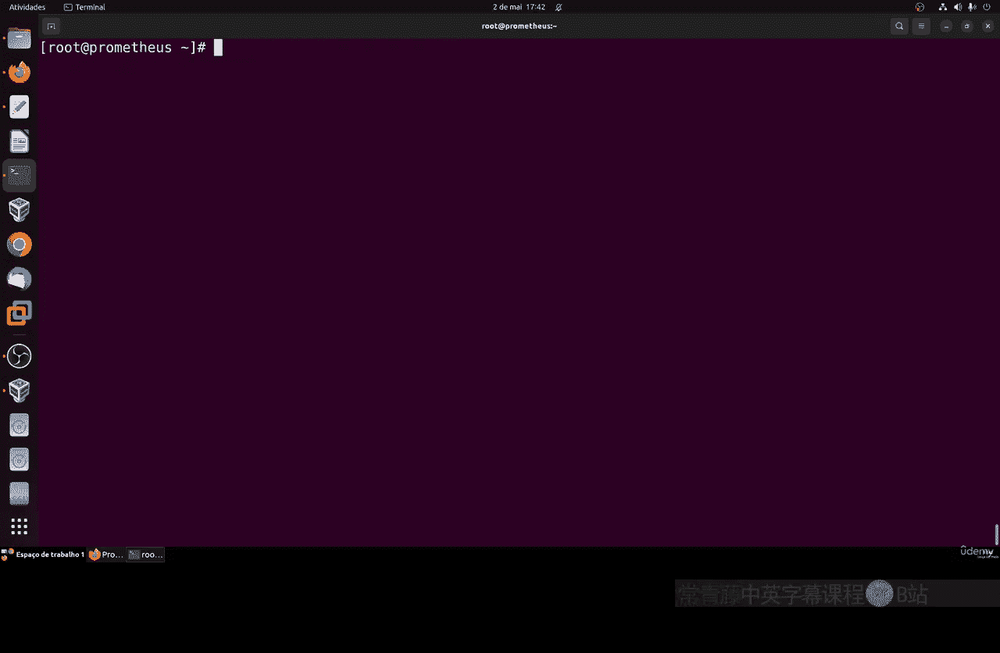

### 1. 编辑Node Exporter服务

我们需要修改Node Exporter的启动参数，添加 `--collector.textfile.directory` 选项。

```bash
sudo systemctl edit node-exporter
```

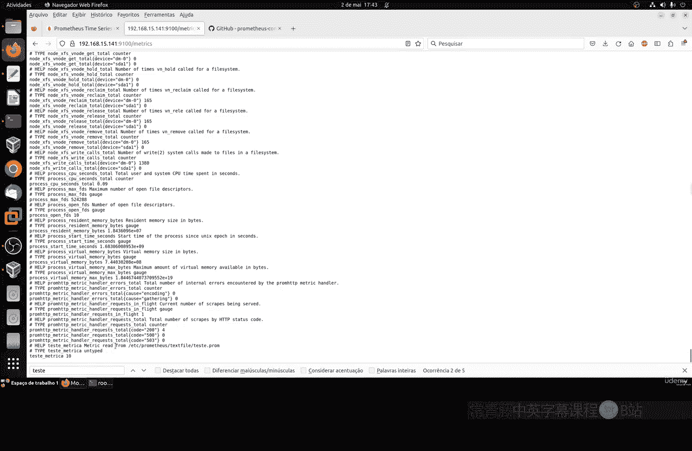

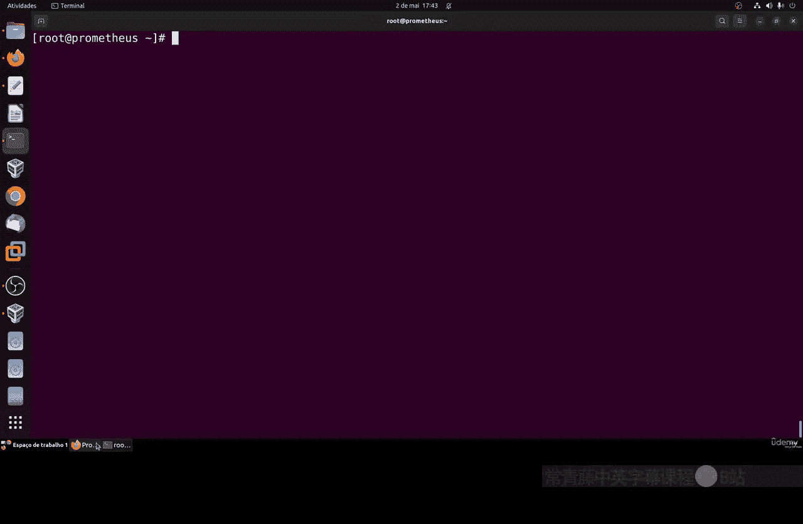

在打开的编辑器中，添加以下内容（请根据你的实际安装路径调整）：

```
[Service]
ExecStart=
ExecStart=/usr/local/bin/node_exporter --collector.textfile.directory=/var/lib/prometheus/textfile
```

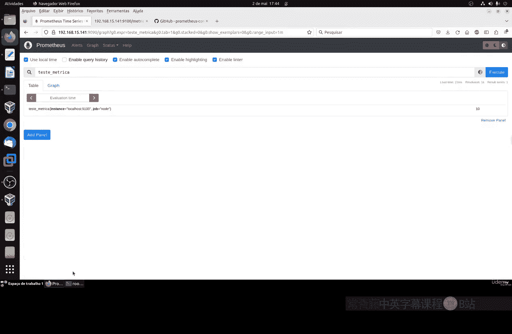

### 2. 重启Node Exporter服务

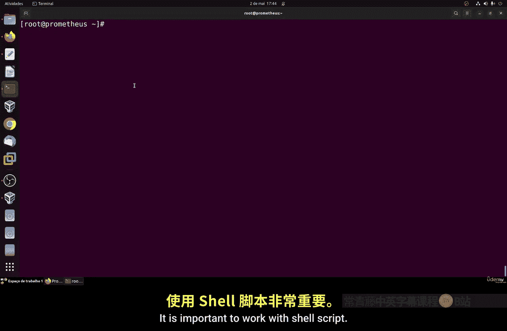

配置修改后，需要重启服务使其生效。

```bash
sudo systemctl daemon-reload
sudo systemctl restart node-exporter
sudo systemctl status node-exporter
```

## 验证自定义指标

现在，我们可以验证自定义指标是否已被成功收集。

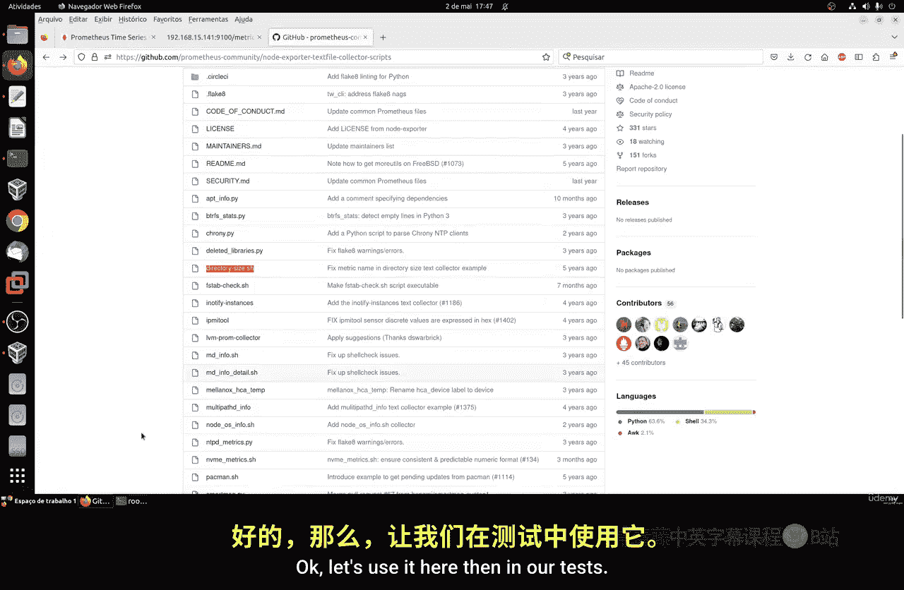

1.  在浏览器中访问Node Exporter的指标页面（通常是 `http://<服务器IP>:9100/metrics`）。
2.  在页面中搜索 `test_metric`。
3.  你应该能看到类似下面的输出，这证明自定义指标已被成功抓取：

```
# HELP test_metric A custom metric for testing.
# TYPE test_metric gauge
test_metric 10
```

## 创建动态自定义指标（使用Shell脚本）

静态指标文件的值是固定的。为了监控动态变化的信息（如目录大小），我们可以结合Shell脚本和Cron任务来定期更新指标文件。

上一节我们创建了静态指标，本节中我们来看看如何创建动态更新的指标。

### 1. 准备Shell脚本

首先，我们创建一个Shell脚本，用于计算指定目录的大小，并将结果格式化为Prometheus可读的指标。

```bash
sudo mkdir -p /opt/prometheus/scripts
sudo nano /opt/prometheus/scripts/directory_size.sh
```

将以下脚本内容粘贴进去（这是一个示例脚本，用于监控 `/var/lib/prometheus` 目录的大小）：

```bash
#!/bin/bash

# 定义要监控的目录
DIRECTORY="/var/lib/prometheus"

# 计算目录大小（以字节为单位）
SIZE=$(du -sb $DIRECTORY | awk '{print $1}')

# 输出Prometheus格式的指标
cat << EOF
# HELP prometheus_directory_size_bytes Disk space used by the Prometheus data directory.
# TYPE prometheus_directory_size_bytes gauge
prometheus_directory_size_bytes $SIZE
EOF
```

保存后，赋予脚本执行权限：

```bash
sudo chmod +x /opt/prometheus/scripts/directory_size.sh
```

### 2. 安装必要工具并测试脚本

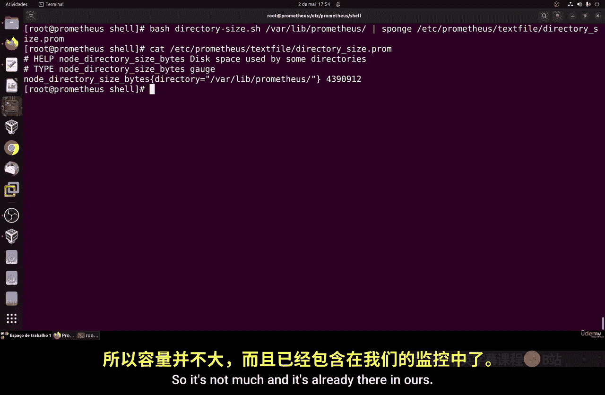

脚本中使用了 `sponge` 命令来安全地写入文件。如果你的系统没有这个命令，需要先安装它。

*   **对于Ubuntu/Debian系统：**
    ```bash
    sudo apt-get update
    sudo apt-get install moreutils
    ```
*   **对于RHEL/CentOS/Fedora系统：**
    ```bash
    # 启用EPEL仓库（如果尚未启用）
    sudo yum install epel-release
    sudo yum install moreutils
    ```

现在测试脚本，并将输出写入自定义指标目录：

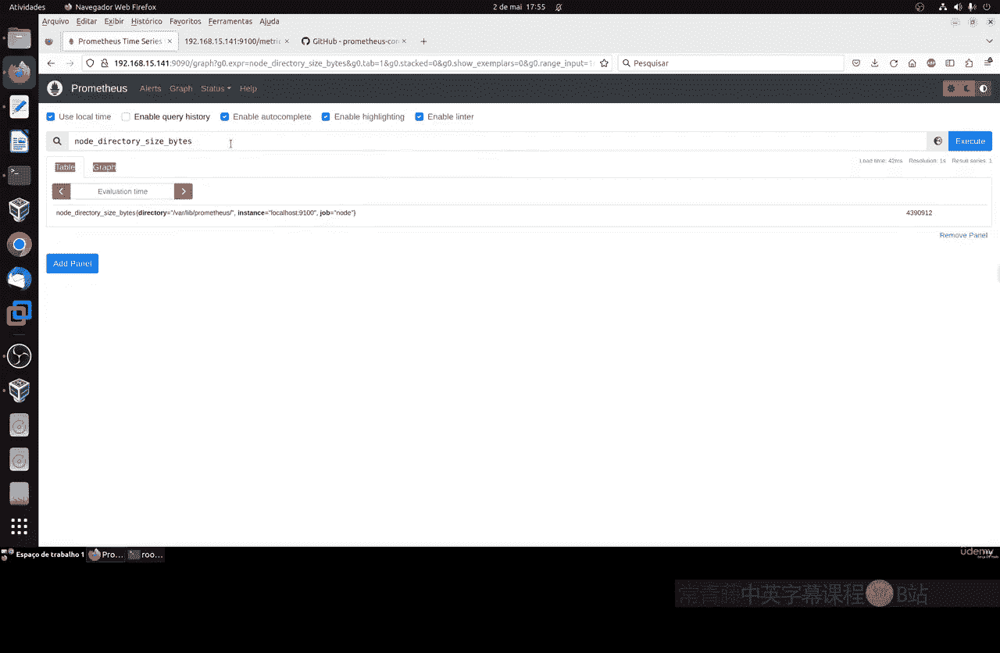

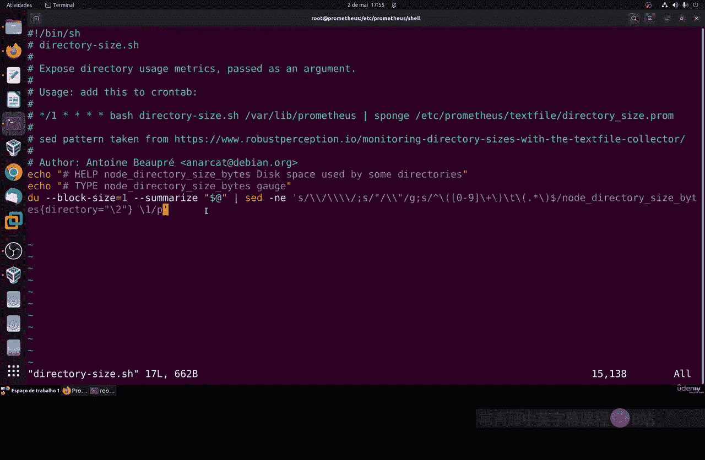

```bash
/opt/prometheus/scripts/directory_size.sh | sudo sponge /var/lib/prometheus/textfile/directory_size.prom
```

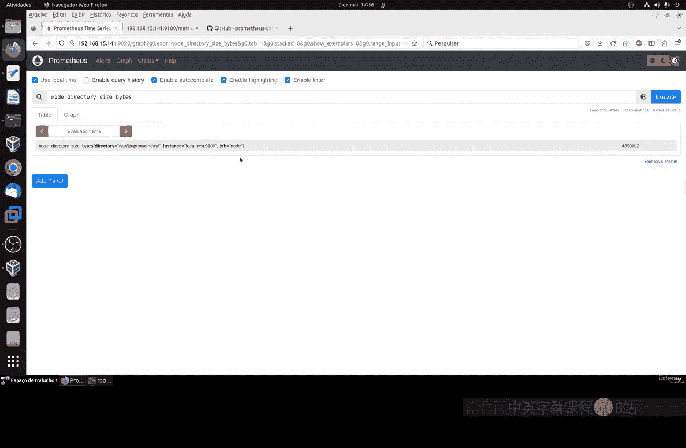

检查生成的文件：
```bash
sudo cat /var/lib/prometheus/textfile/directory_size.prom
```
你应该能看到包含目录大小指标的 `.prom` 文件。

### 3. 设置Cron任务自动更新

为了让指标定期自动更新，我们需要设置一个Cron任务。

编辑当前用户的Cron表：
```bash
crontab -e
```

在文件末尾添加以下行，让脚本每分钟运行一次：
```
* * * * * /opt/prometheus/scripts/directory_size.sh | sponge /var/lib/prometheus/textfile/directory_size.prom
```

保存并退出。现在，该脚本会每分钟运行一次，并更新 `directory_size.prom` 文件中的指标值。

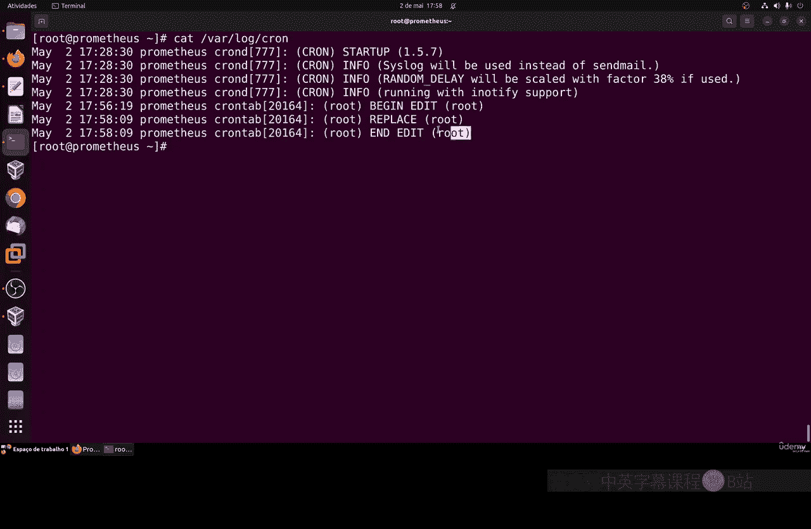

## 在Prometheus中查看指标

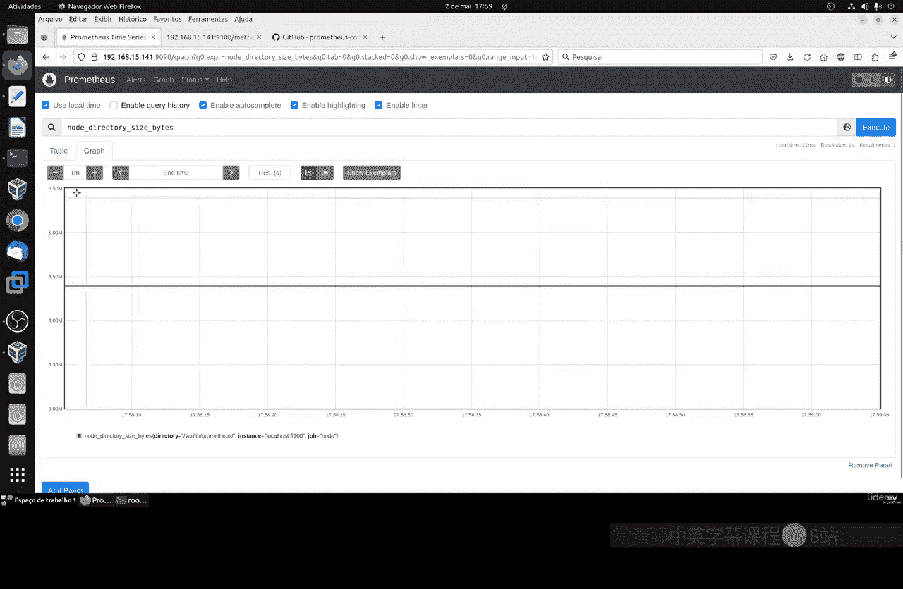

完成以上步骤后：

1.  等待几分钟，让Cron任务运行几次。
2.  在Prometheus的Web界面（`http://<Prometheus服务器IP>:9090`）的查询框中，输入 `prometheus_directory_size_bytes` 进行查询。
3.  你应该能看到一个随时间变化的图表，展示了 `/var/lib/prometheus` 目录大小的历史数据。

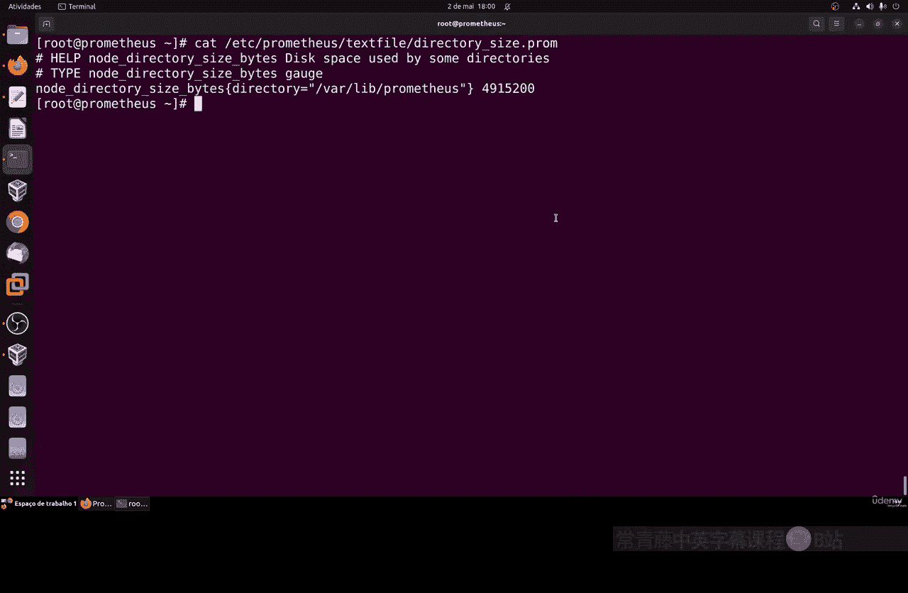

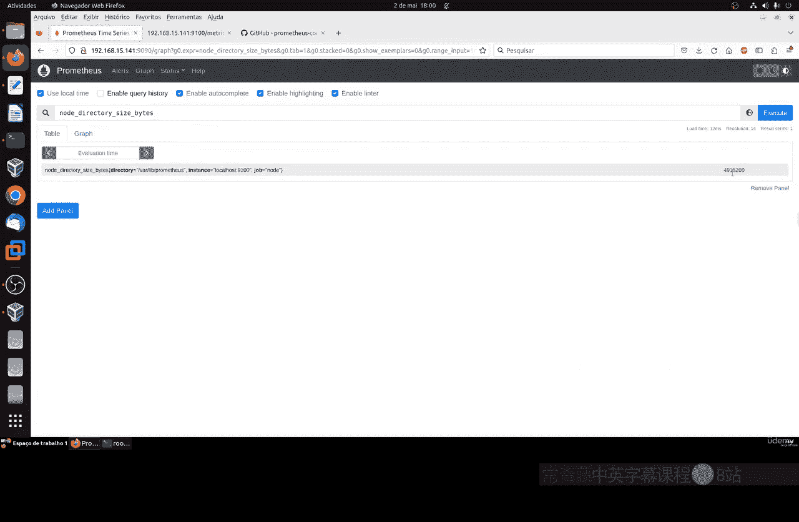

## 总结

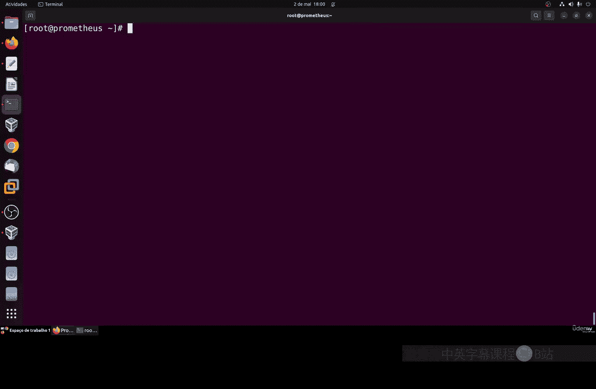

本节课中我们一起学习了如何在Linux系统中为Prometheus创建自定义指标。我们掌握了以下核心技能：

1.  **创建静态自定义指标**：通过编写格式正确的 `.prom` 文件来定义静态指标。
2.  **配置Node Exporter**：通过 `--collector.textfile.directory` 参数使其能够收集自定义指标。
3.  **创建动态自定义指标**：结合Shell脚本和Cron任务，定期生成和更新反映系统动态状态（如目录大小）的指标。

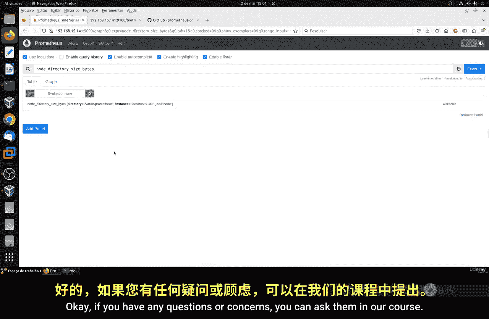

通过自定义指标，你可以灵活地监控任何你关心的系统或应用状态，极大地扩展了Prometheus的监控能力。你可以从互联网上找到或自己编写更多有用的监控脚本，并将其集成到你的监控体系中。