# 095：ICMP监控教程 🖥️

## 概述
在本节课中，我们将学习如何使用Ping Exporter工具，通过ICMP协议监控IP地址、主机名等目标。由于Prometheus默认不提供ICMP监控功能，我们需要安装并配置这个第三方程序来实现网络可达性、延迟和丢包率的监控。

---

## 安装Ping Exporter 📦

上一节我们介绍了ICMP监控的重要性，本节中我们来看看如何安装Ping Exporter。

### 下载与解压
Ping Exporter是一个独立的二进制文件，适用于各种Linux发行版。

以下是下载与解压步骤：
1.  从GitHub Releases页面下载最新版本的压缩包。
2.  使用 `wget` 命令下载文件。
3.  创建一个专用目录并解压文件。

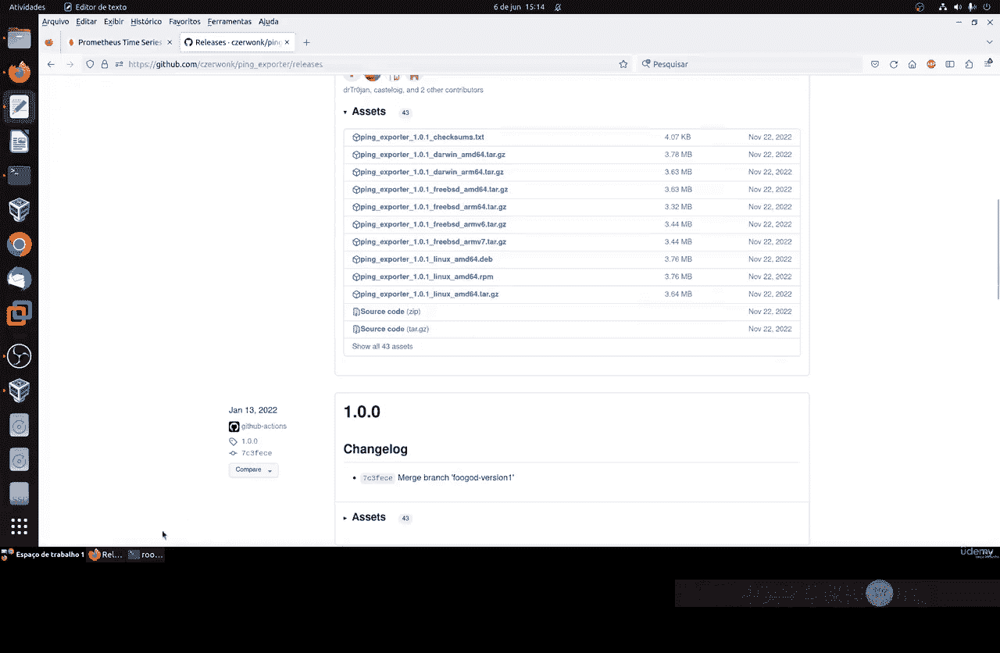

```bash
mkdir ping_exporter
wget [下载链接]
tar -xzf ping_exporter.tar.gz -C ping_exporter/
```

解压后，目录中仅包含一个名为 `ping_exporter` 的二进制文件。

### 部署二进制文件
将二进制文件复制到系统级的可执行文件目录。

```bash
sudo cp ping_exporter/ping_exporter /usr/local/bin/
```

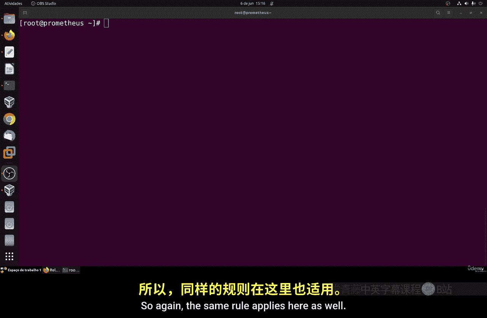

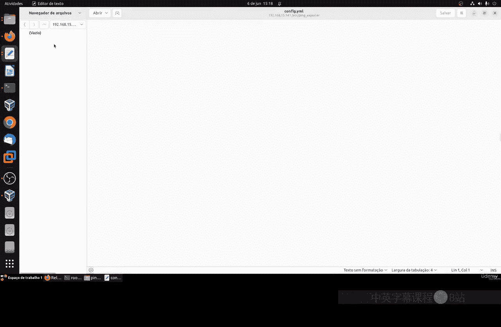

---

## 配置Ping Exporter ⚙️

安装完成后，我们需要创建配置文件来定义监控目标。

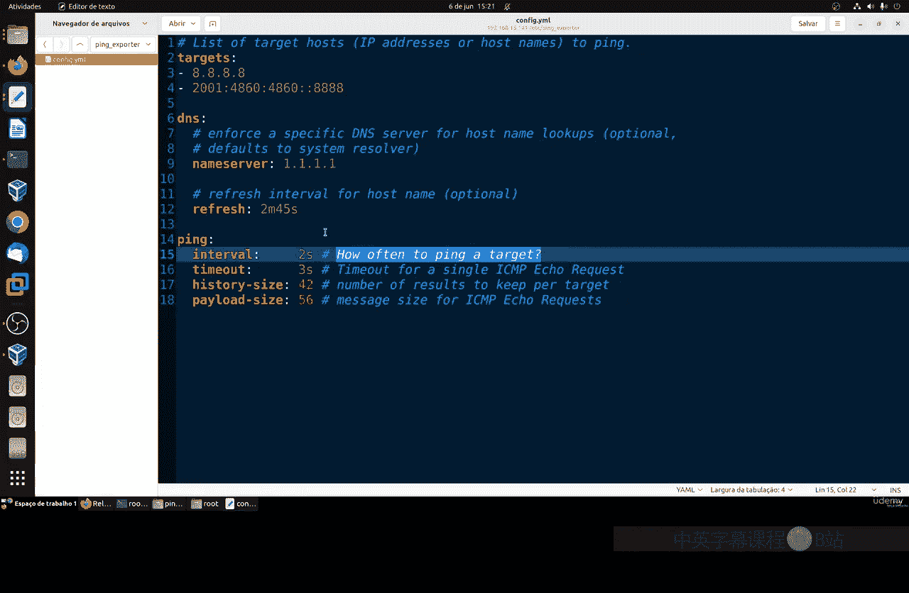

### 创建配置文件
配置文件采用YAML格式，需要特别注意缩进和语法。

以下是配置文件的核心结构：
```yaml
targets:
  - 8.8.8.8
  - example.com
ping:
  interval: 5s
  timeout: 3s
  history-size: 42
  payload-size: 120
```

配置文件说明：
*   **`targets`**: 定义要监控的目标列表，可以是IP地址（IPv4/IPv6）或主机名。
*   **`ping`**: 定义Ping探测的参数，如间隔、超时时间、历史记录大小和数据包大小。

**注意**：对于主机名监控，请确保系统或配置中指定的DNS服务器能正常解析。

### 测试运行
使用以下命令指定配置文件并启动Ping Exporter进行测试：

```bash
/usr/local/bin/ping_exporter --config.path=/path/to/your/config.yml
```

程序启动后，会默认在 **9427** 端口提供一个Web服务，用于暴露监控指标。

---

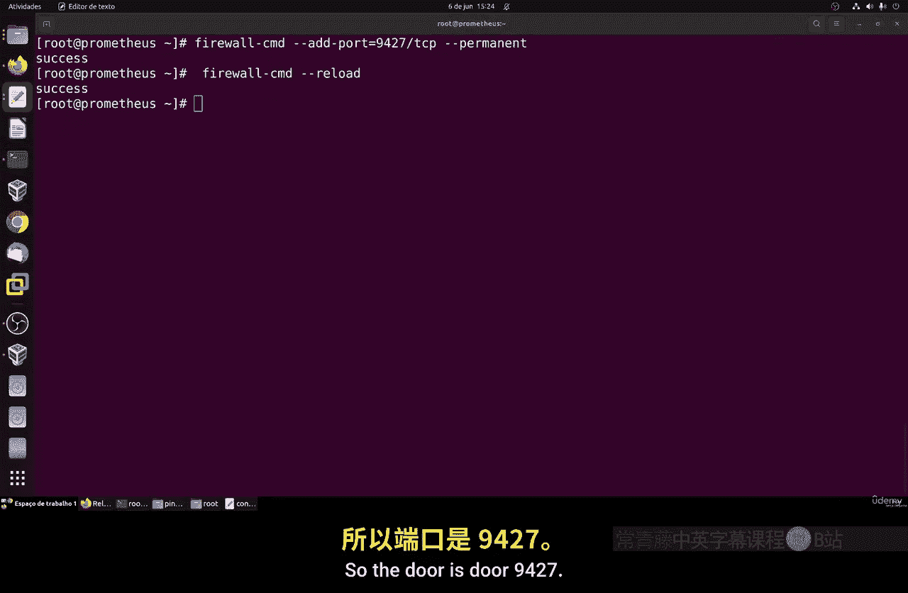

## 设置后台运行与防火墙 🔧

为了让监控持续运行，我们需要将其设置为后台服务。

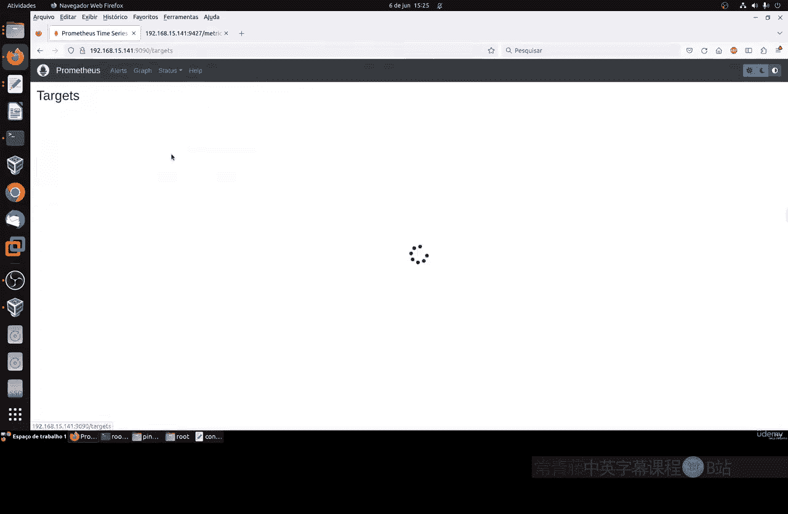

### 通过Crontab实现
由于创建系统服务（daemon）可能遇到问题，我们可以使用Crontab来定时重启任务，实现持续运行。

以下是操作步骤：
1.  编辑当前用户的Crontab：`crontab -e`
2.  添加一行配置，让命令在后台持续运行。例如：
    ```bash
    @reboot /usr/local/bin/ping_exporter --config.path=/path/to/your/config.yml >/dev/null 2>&1 &
    ```

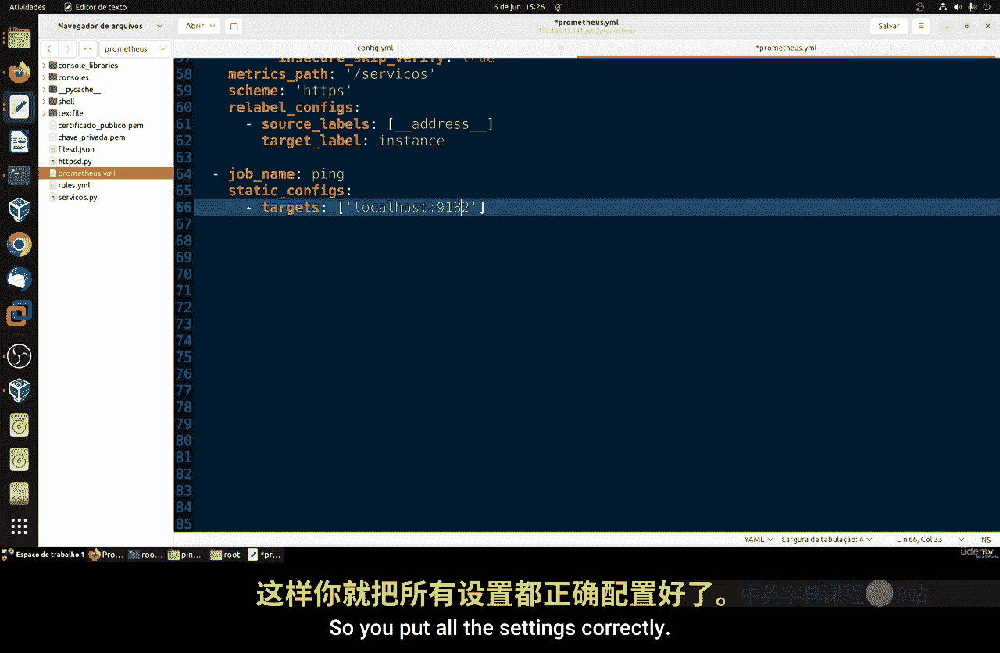

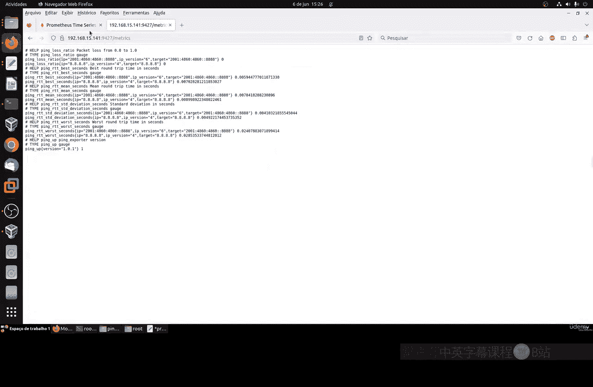

**注意**：修改配置文件后，需要手动终止旧的进程，Crontab会在下次任务执行时（或系统重启后）启动新的进程。

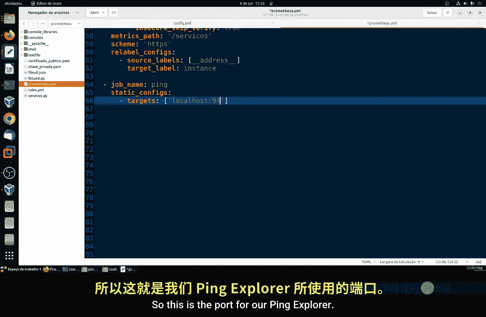

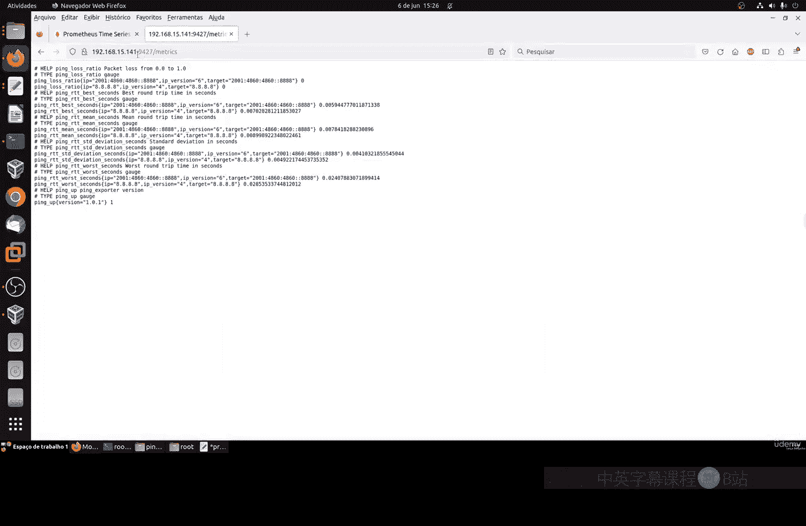

### 配置防火墙
如果系统启用了防火墙，需要开放9427端口。

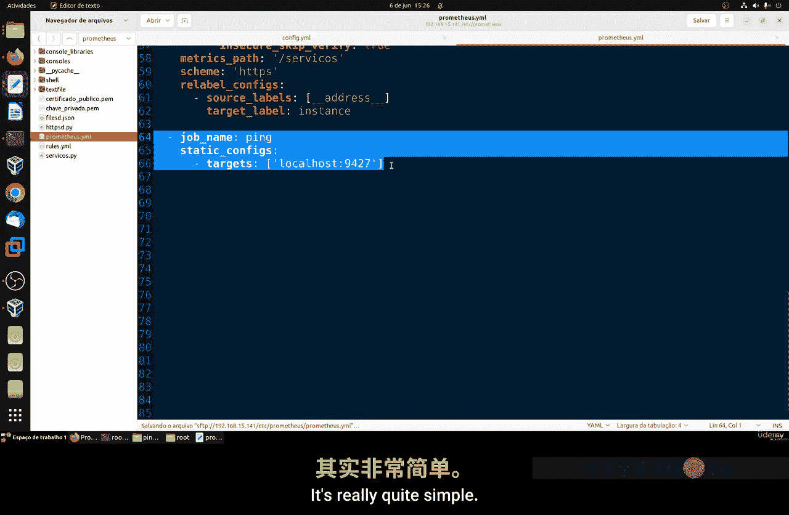

以下是针对firewalld的命令示例：
```bash
sudo firewall-cmd --permanent --add-port=9427/tcp
sudo firewall-cmd --reload
```

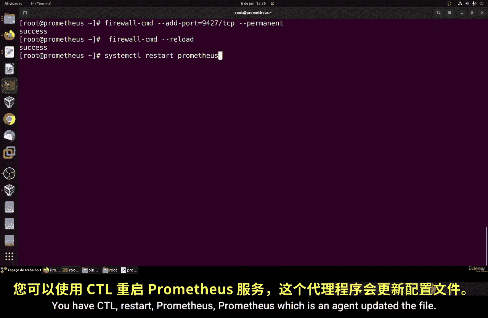

---

## 集成到Prometheus 🔗

现在，我们需要让Prometheus能够抓取Ping Exporter提供的指标。

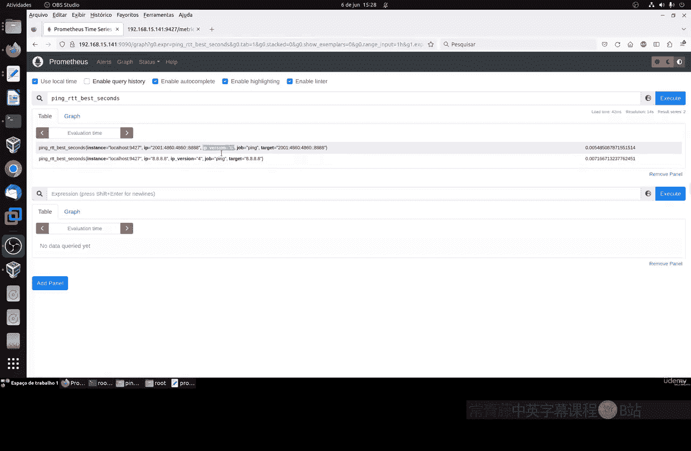

### 修改Prometheus配置
编辑Prometheus的主配置文件 `prometheus.yml`，添加一个新的抓取任务（job）。

以下是配置示例：
```yaml
scrape_configs:
  - job_name: 'ping'
    static_configs:
      - targets: ['localhost:9427'] # 如果Ping Exporter运行在其他主机，请替换IP
```

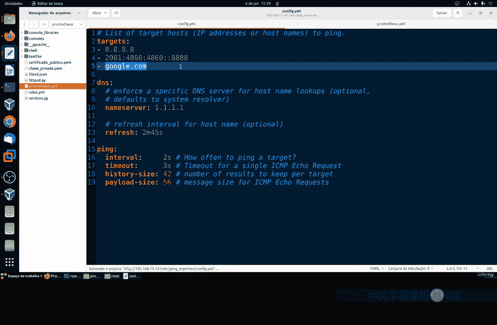

### 重启Prometheus
保存配置文件后，重启Prometheus服务以加载新配置。

```bash
sudo systemctl restart prometheus
```

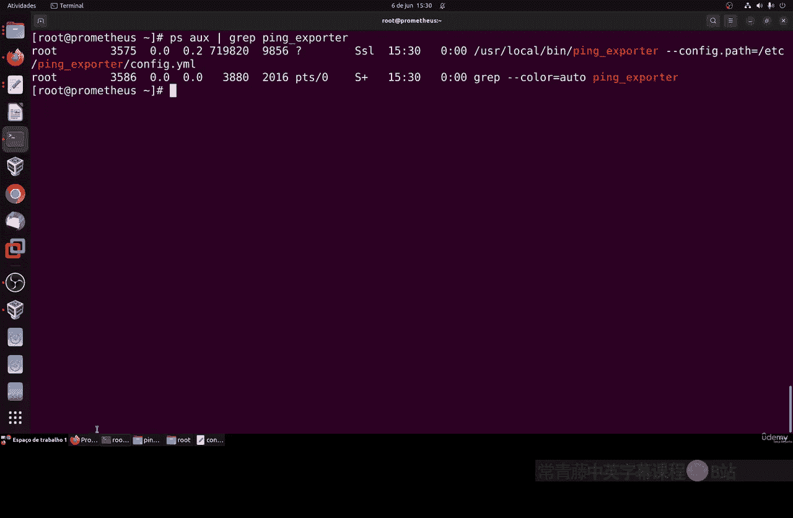

重启后，在Prometheus的Web界面（Targets页面）应能看到名为“ping”的任务状态为“UP”。

---

## 监控指标解读与分析 📊

集成成功后，我们来看看Ping Exporter提供了哪些关键指标。

### 核心监控指标
在Prometheus的表达式浏览器中，可以查询到以下主要指标：

*   **`ping_up`**: 探测目标是否可达。值为 `1` 表示可达，`0` 表示不可达。这是最基础的可用性指标。
*   **`ping_rtt_best_seconds`**: 最佳往返延迟（最低延迟）。
*   **`ping_rtt_worst_seconds`**: 最差往返延迟（最高延迟）。
*   **`ping_rtt_mean_seconds`**: 平均往返延迟。这个值通常更稳定，能排除极端值的影响。
*   **`ping_rtt_std_dev_seconds`**: 往返延迟的标准差，反映延迟的波动情况。
*   **`ping_loss_percent`**: 丢包率。值范围从 `0`（0%丢包）到 `1`（100%丢包）。

### 使用标签进行筛选
每个指标都附带有标签（如 `target`， `ip_version`），方便对特定目标或IP版本（IPv4/IPv6）进行筛选和聚合。

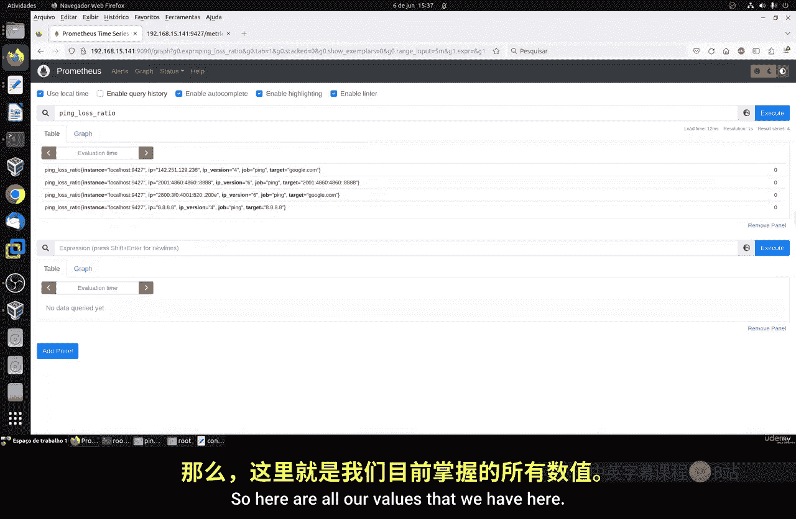

### 添加新监控目标
要监控新的IP或域名，只需编辑Ping Exporter的配置文件，在 `targets` 列表下新增条目，然后重启Ping Exporter进程即可。

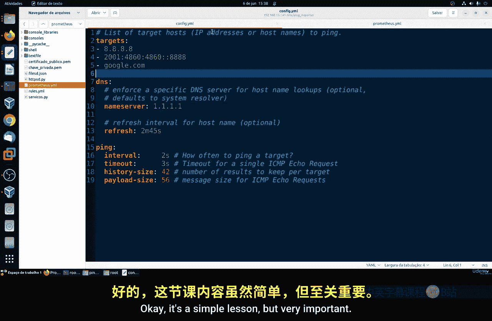

---

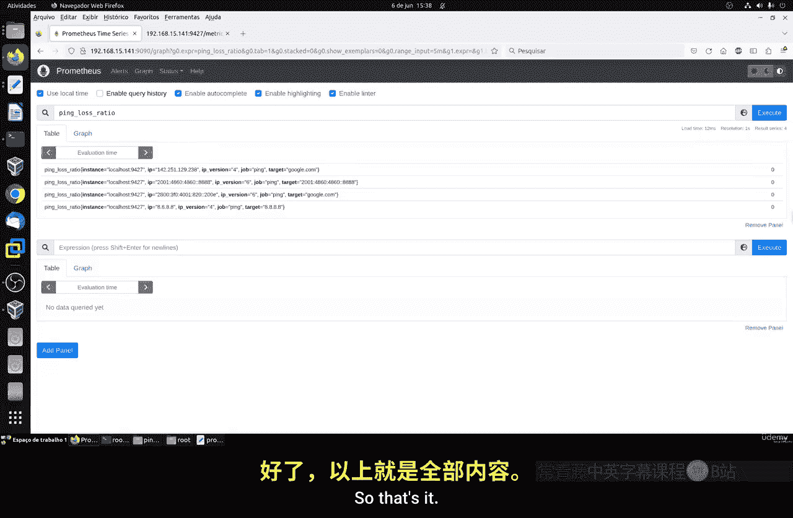


## 总结
本节课中我们一起学习了如何利用Ping Exporter实现ICMP网络监控。我们从安装和配置讲起，完成了将其设置为后台服务、集成到Prometheus以及解读核心监控指标的全过程。通过这套方案，你可以有效地监控网络中任意目标的可用性、延迟和丢包情况，为系统运维提供了重要的网络层观测数据。