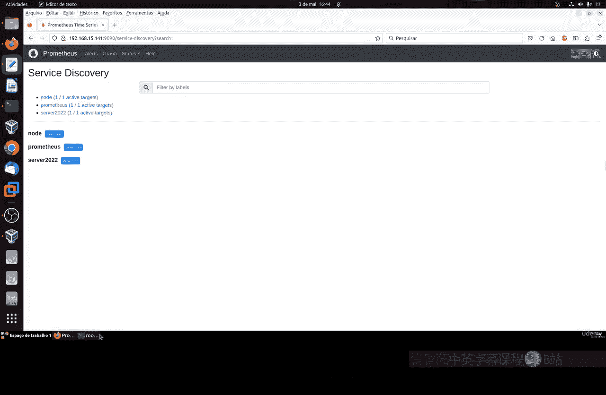
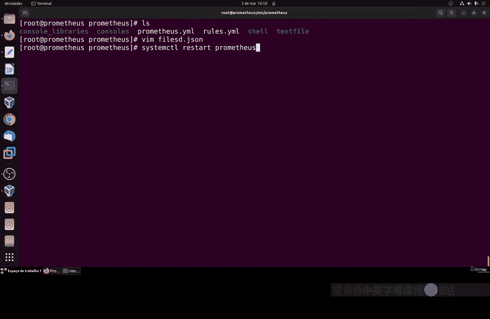
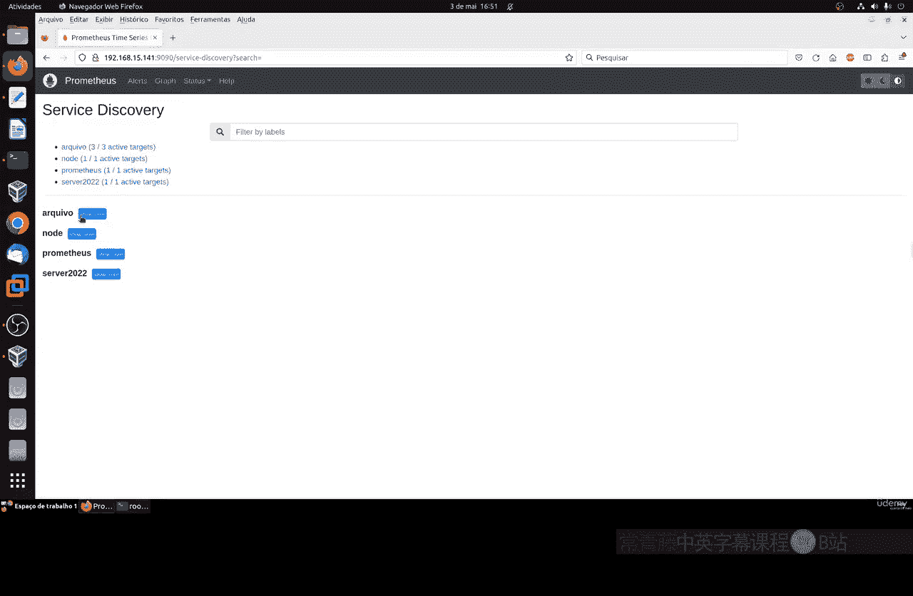
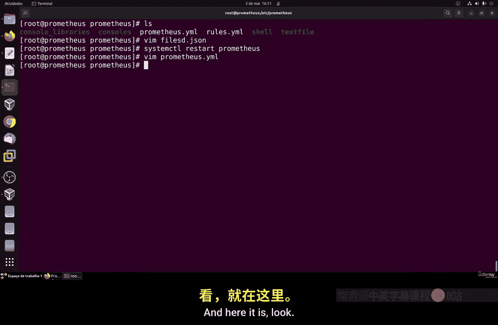
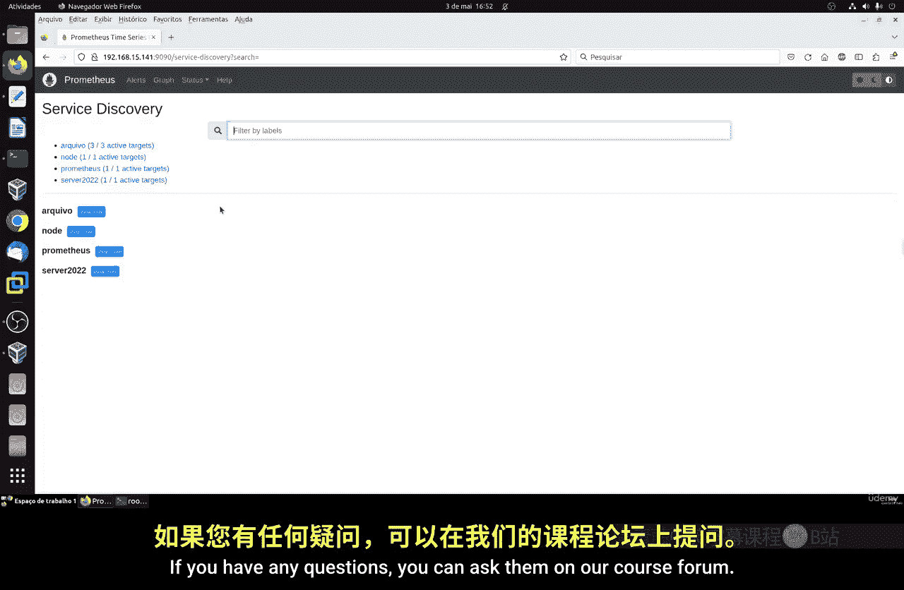

# 096：服务发现 🔍

在本节课中，我们将要学习Prometheus中的服务发现功能。服务发现能够自动搜索网络中的主机，这对于监控拥有大量服务器的系统至关重要。我们将介绍其基本概念，并演示一种简单的配置方法。

## 概述

服务发现允许我们自动化地在网络中搜索主机。它并非单一方法，而是提供了多种集成方式，例如与云服务、数据库、Docker、Kubernetes或基于HTTP的服务进行集成。其核心价值在于，它不仅仅是一个静态主机列表，还能帮助监控应用生命周期、通过标签组织架构，并进行灵活的配置。



上一节我们介绍了静态配置目标主机的方法，本节中我们来看看如何通过文件进行动态的服务发现。

## 配置基于文件的服务发现

之前，我们通过在`prometheus.yml`主配置文件中静态列出目标主机的方式进行配置。这对于主机数量少、变化不频繁的简单环境（如家庭网络）是可行的，但在管理多台服务器时并不实用。

一个更实用的方法是使用基于文件的服务发现。这种方法允许我们将目标配置写在独立的JSON或YAML格式文件中，Prometheus会自动读取这些文件并更新监控目标，无需频繁重启服务。

以下是配置步骤：

1.  **修改主配置文件**
    首先，我们需要在`prometheus.yml`配置文件的`scrape_configs`部分，添加一个基于文件的服务发现作业。核心配置如下：

    ```yaml
    scrape_configs:
      - job_name: 'file_sd_config'   # 作业名称
        file_sd_configs:
          - files:
            - '*.json'               # 指定Prometheus要读取的配置文件路径和模式，这里匹配所有.json文件
    ```

    这段配置告诉Prometheus去读取指定目录下所有以`.json`结尾的文件，并将其中的内容作为监控目标。

2.  **创建目标定义文件**
    接下来，我们在Prometheus能够访问的目录（例如与`prometheus.yml`同级的目录）创建JSON文件。文件内容是一个目标数组，每个目标包含地址和可选的标签。

    例如，创建一个`hosts.json`文件：

    ```json
    [
      {
        "targets": [ "192.168.1.10:9100" ],
        "labels": {
          "job": "node_exporter",
          "env": "production",
          "role": "web-server"
        }
      },
      {
        "targets": [ "192.168.1.11:9090" ],
        "labels": {
          "job": "prometheus",
          "env": "monitoring"
        }
      }
    ]
    ```

    在这个例子中，我们定义了两个监控目标，并为它们添加了诸如`job`、`env`、`role`等标签，便于在Prometheus UI中进行筛选和分类。

3.  **重启Prometheus服务**
    保存配置文件后，需要重启Prometheus服务以使更改生效。在Linux系统上，可以使用以下命令：

    ```bash
    sudo systemctl restart prometheus
    ```

    使用`sudo systemctl status prometheus`命令可以确认服务已成功重启并运行。

## 验证与查看



服务重启后，我们可以在Prometheus的Web界面（通常为`http://<prometheus-server>:9090`）的“Status” -> “Targets”页面查看监控目标。





如果配置正确，你将看到在“file_sd_config”这个作业下，列出了我们在`hosts.json`文件中定义的所有目标及其标签。Prometheus会自动开始抓取这些目标的指标数据。

## 总结



本节课中我们一起学习了Prometheus服务发现的基本概念，并实践了基于文件的动态服务发现配置方法。通过将目标信息从主配置文件中分离出来，我们能够更灵活、高效地管理大量监控目标，只需编辑独立的JSON文件即可，无需每次都修改主配置并重启服务。这只是服务发现的其中一种简单方式，Prometheus还支持更多与云平台和容器编排系统集成的发现机制。