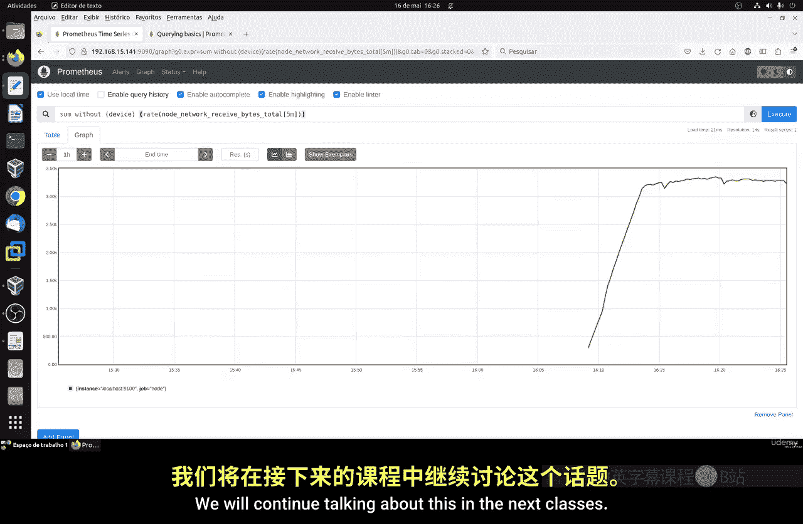

# 100：PromQL入门指南 🚀

在本节课中，我们将学习Prometheus查询语言（PromQL）的基础知识。PromQL是一种功能强大的查询语言，它允许你对监控系统收集的指标数据进行聚合、分析和数学运算，从而深入理解系统的性能表现。我们将通过实际操作，学习如何构建简单的查询和聚合。

## 概述

PromQL是Prometheus监控系统的核心查询语言。它主要用于查询时间序列数据，并支持多种操作，如过滤、聚合和计算。掌握PromQL对于有效利用Prometheus进行系统监控至关重要。

## 简单聚合查询

上一节我们介绍了PromQL的基本概念，本节中我们来看看如何进行简单的聚合查询。我们将从最常用的指标类型开始。

### 使用Gauge指标

Gauge指标用于测量瞬时状态，其数值会不断变化。对Gauge进行聚合时，我们通常希望得到总和、平均值、最小值或最大值等结果。

以下是一个使用文件系统大小指标的示例：

```promql
node_filesystem_size_bytes
```

这个指标显示了每个已挂载文件系统的大小，并附带一些标签，如`fstype`（文件系统类型）、`mountpoint`（挂载点）和`device`（设备）。

我们可以使用`sum`函数来计算每台机器上文件系统的总大小，同时排除某些标签：

```promql
sum without(device, fstype, mountpoint)(node_filesystem_size_bytes)
```

这条查询会排除`device`、`fstype`和`mountpoint`标签，只保留`instance`和`job`标签，从而显示所有硬盘存储的总和。

我们还可以进一步移除`instance`标签：

```promql
sum without(device, fstype, mountpoint, instance)(node_filesystem_size_bytes)
```

这样，结果将只按`job`进行聚合。

除了求和，我们还可以使用其他聚合函数。例如，使用`max`函数找出最大的文件系统大小：

```promql
max without(device, fstype, mountpoint, instance)(node_filesystem_size_bytes)
```

使用`avg`函数计算平均值。以下示例计算所有任务中打开文件描述符的平均数量：

```promql
avg without(instance, job)(process_open_fds)
```

这些函数（`sum`、`max`、`avg`、`min`）为我们分析Gauge指标提供了灵活的工具。

### 使用Counter指标

Counter是一种用于跟踪事件或特定事件发生次数的指标类型，其值随时间单调递增。它常用于监控如服务器接收的Web请求数量等。

Counter的累计总值本身通常不直观，我们更关心它在特定时间段内的增长量，例如每秒或每分钟的增量。为此，我们使用`rate`或`increase`函数。

以下示例计算网络接口每秒接收的网络流量：

```promql
rate(node_network_receive_bytes_total[5m])
```

`rate`函数计算时间范围内每秒的平均增长率。`[5m]`表示我们查看过去5分钟的数据。返回的值是一个估计的平均值，可能不是整数。

这个指标包含一个`device`标签，代表网络接口的名称。如果一台机器有多个网络接口，我们可以使用`sum`函数将它们相加，得到整台机器接收的总网络流量：

```promql
sum without(device)(rate(node_network_receive_bytes_total[5m]))
```

这条查询会汇总所有网络接口（包括本地接口）的流量，计算出每台机器的总网络带宽。

## 总结




本节课中我们一起学习了PromQL的基础知识，重点是简单的聚合操作。我们实践了如何使用`sum`、`max`、`avg`等函数对Gauge和Counter类型的指标进行查询，并学会了使用`without`关键字在聚合时排除特定的标签。这些是构建更复杂监控查询的基石。在接下来的课程中，我们将继续深入探讨PromQL的更多功能。