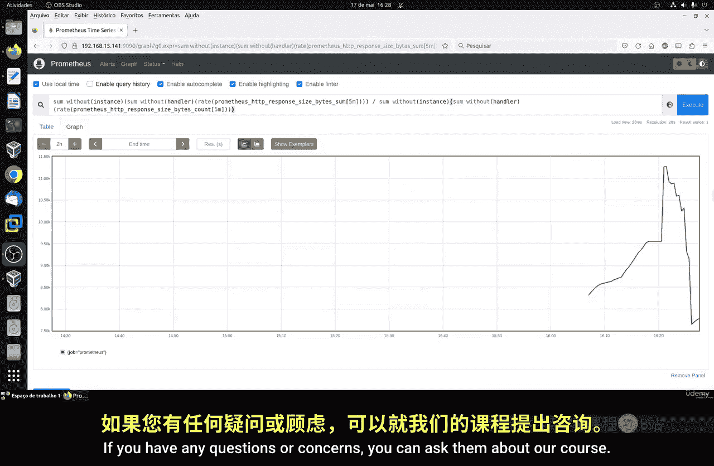

# 101：PromQL介绍第二部分

## 📊 课程概述

在本节课中，我们将要学习Prometheus中的摘要型指标。摘要型指标是一种用于表示特定时间段内事件观测样本的指标类型，常用于衡量和跟踪聚合量，例如请求持续时间或响应大小。我们将了解其构成、计算方法以及如何利用它来分析系统性能。

---

## 📈 摘要型指标详解

上一节我们介绍了Prometheus的基本概念，本节中我们来看看摘要型指标的具体构成。

摘要型指标通常包含两个底层指标：总和与计数。这两个指标都是计数器类型。

*   **总和指标**：记录监控值的累计总和。
*   **计数指标**：记录已收集的事件总数。

基于这两个指标，Prometheus可以计算出在您确定的时间间隔内的平均值、分位数等统计数据。这有助于我们获取关于系统性能和行为的有价值信息，例如操作的平均持续时间、最高和最低百分位数，甚至是响应时间的完整分布。

---

## 🔍 指标构成与示例

以下是摘要型指标的一个常见示例，用于追踪HTTP响应大小：

**指标名称**：`http_response_size_bytes`

该指标包含多个时间序列，例如 `sum`、`count` 和 `bucket`。这种指标显示了某个API返回的数据量。

我们将以 `prometheus_http_requests_total` 这个指标为例进行讲解。这个指标追踪的是请求数量。由于它只是一个计数器，其数值会一直增加。因此，我们需要使用 `rate()` 函数来查看其增长率。

我们最常使用的是 `rate()` 函数处理后的指标。让我们来看一个查询示例：

```promql
sum without(handler)(rate(prometheus_http_requests_total[1m]))
```

这个查询计算了过去1分钟内，所有请求处理器（handler）的总请求速率（每秒请求数）。这就是我们的节点导出器（node exporter）返回此类指标的方式。

---

## 🧮 计算方法与应用

除了计数，摘要型指标还包含总和（sum）。总和是所有监控值的累计相加。

我们可以使用以下查询来获取所有请求的总和速率：

```promql
sum without(handler)(rate(prometheus_http_requests_total[1m]))
```

摘要型指标允许您计算事件的平均值，例如每次响应返回的平均字节数。

计算方法是：先分别获取总和与计数的速率，然后用总和的速率除以计数的速率，从而得到指定时间段内的平均值。

以下是计算过去1分钟内平均响应大小的配置示例：

```promql
sum without(handler)(rate(prometheus_http_response_size_bytes_sum[1m]))
/
sum without(handler)(rate(prometheus_http_response_size_bytes_count[1m]))
```

这个查询将匹配我们的时间序列，并给出过去一分钟内的平均响应长度。您可以将时间范围调整为5分钟、2分钟或10分钟。

> **重要提示**：在计算平均值时，必须先对总和（sum）和计数（count）应用 `rate()` 函数，然后再进行除法运算。否则将无法得到正确结果。

---

## 🌐 跨实例聚合计算

如果我们想要获取所有作业实例的平均响应大小，该怎么做呢？

我们可以通过移除 `instance` 标签来聚合所有实例的数据。查询示例如下：

```promql
sum without(instance, handler)(
  rate(prometheus_http_response_size_bytes_sum[5m])
)
/
sum without(instance, handler)(
  rate(prometheus_http_response_size_bytes_count[5m])
)
```

这个查询将计算我们整个作业（job）中所有实例在最近5分钟内的平均响应大小。如果只有一个实例，结果不会变化。但如果您有多个实例（例如两个、三个等），这个查询会将它们全部汇总起来。

这样，您就可以在一个查询中嵌套进行筛选和聚合，非常灵活实用。

---

## 📝 课程总结




本节课中我们一起学习了Prometheus摘要型指标的核心概念与应用。我们了解到摘要型指标由总和（sum）与计数（count）两个计数器构成，并通过 `rate()` 函数和除法运算，可以计算出请求速率、平均响应大小等关键性能指标。我们还掌握了如何通过移除特定标签（如 `instance`、`handler`）来实现跨实例或全范围的聚合计算。这些是使用PromQL进行有效监控和分析的基础技能。