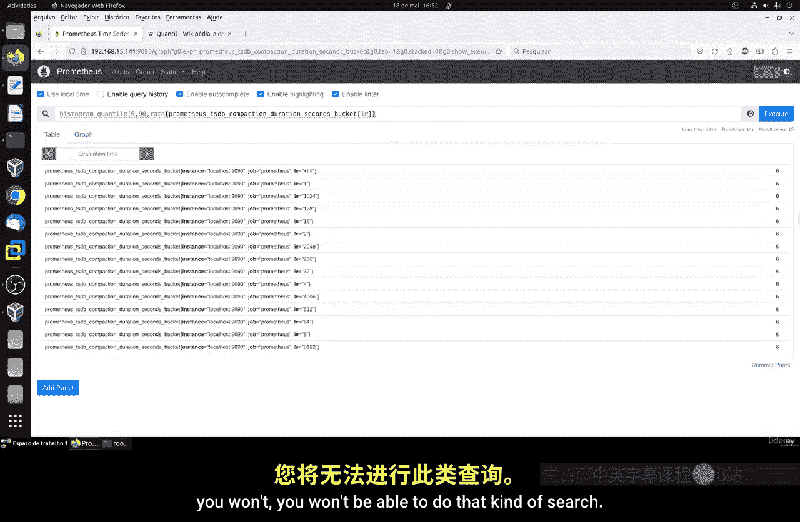
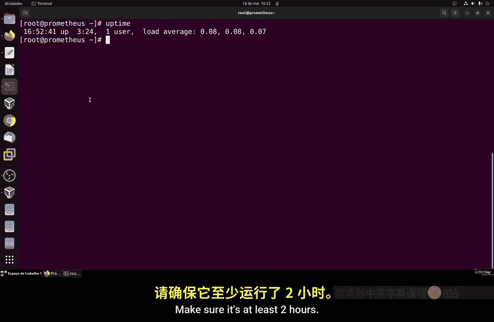
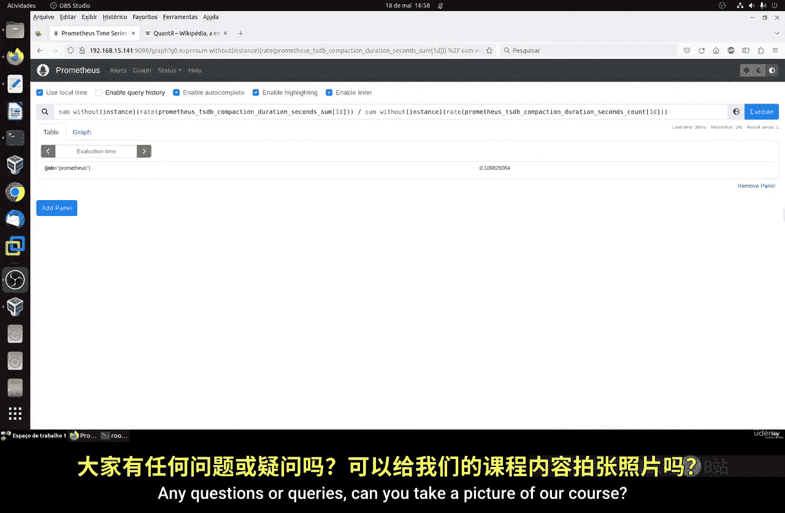

# 102：PromQL介绍第三部分 - 直方图 📊

在本节课中，我们将要学习Prometheus中的直方图（Histogram）类型指标。直方图主要用于收集和存储关于某个指标值随时间分布的信息。

## 什么是直方图？

上一节我们介绍了计数器与仪表盘，本节中我们来看看直方图。直方图是一种指标类型，它允许你收集特定范围内（称为桶或边界）数值出现频率的数据。通过分析一段时间窗口内的数据，直方图可以帮助我们了解指标值的分布情况，例如Web请求的持续时间或数据库的延迟。

## 直方图的工作原理

以下是直方图的核心概念：

*   **桶（Buckets）**：我们定义一系列边界值，Prometheus会自动将观测到的指标值归类到对应的桶中。例如，延迟的桶边界可以设置为 `[0.1, 0.5, 1, 2, 5]` 秒。
*   **统计计算**：基于桶内的计数，Prometheus可以自动计算各种统计数据，例如观测值的**总和**、**平均值**、**中位数**以及**百分位数**等。
*   **用途**：这些统计指标有助于理解数值随时间变化的分布，从而可能识别出数据中的异常或趋势。

一个常用的直方图指标是 `prometheus_tsdb_compaction_duration_seconds`，它追踪时序数据库压缩所花费的秒数。当我们查询这个指标时，会看到类似 `_bucket`、`_sum`、`_count` 的后缀。

## 使用直方图计算百分位数

百分位数（例如P90、P99）是监控中非常有用的概念。它表示有百分之多少的观测值小于或等于该数值。

以下是计算百分位数的步骤：

1.  **确认数据收集时间**：直方图数据需要一定的收集时间（例如视频中提到的约2小时）。请确保你的Prometheus服务器运行时间足够长。
2.  **使用 `histogram_quantile` 函数**：这是PromQL中用于从直方图计算百分位数的核心函数。



让我们以计算压缩时长的第90百分位数（P90）为例。其PromQL查询公式如下：



```promql
histogram_quantile(0.90, rate(prometheus_tsdb_compaction_duration_seconds_bucket[1d]))
```

这个查询的含义是：计算过去一天内，数据库压缩耗时的第90百分位值。如果结果是0.9秒，则意味着90%的压缩操作在0.9秒内完成，而10%的操作耗时超过0.9秒。

> **注意**：百分位数计算应该是查询的最后一步。从统计角度看，数据点本身不应在计算百分位数前进行聚合或算术运算。

## 聚合场景下的直方图查询

当我们希望对多个实例的直方图数据进行整体分析时，需要先进行聚合。

以下是处理聚合直方图的正确方法：

1.  首先，使用 `sum` 聚合运算符将多个实例的桶计数相加。
2.  然后，对聚合后的结果应用 `histogram_quantile` 函数。

例如，要计算所有服务器压缩时长的整体P90，查询公式如下：

```promql
histogram_quantile(
  0.90,
  sum without(instance) (
    rate(prometheus_tsdb_compaction_duration_seconds_bucket[1d])
  )
)
```

这个查询先通过 `sum without(instance)` 聚合了所有实例（去除`instance`标签）的数据，再计算整体的第90百分位数。如果你只有一个实例，结果将与单实例查询相同；但如果有多个实例，这能帮你衡量服务器的整体平均表现。

## 总结



本节课中我们一起学习了Prometheus直方图的核心知识。我们了解了直方图如何通过定义桶来记录值的分布，并掌握了使用 `histogram_quantile` 函数计算百分位数（如P90）的方法。最后，我们探讨了在对多个目标的数据进行聚合时，应先使用 `sum` 进行聚合，再计算百分位数的正确流程。理解直方图对于分析请求延迟、响应时间等指标的分布特征至关重要。