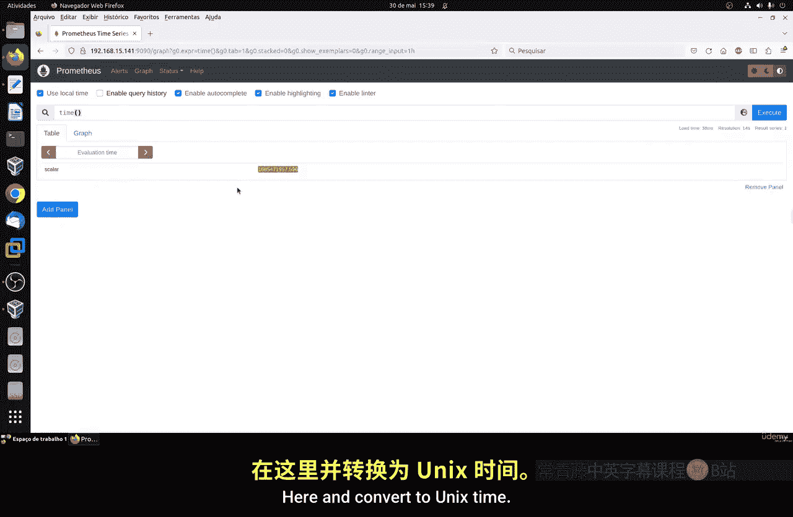
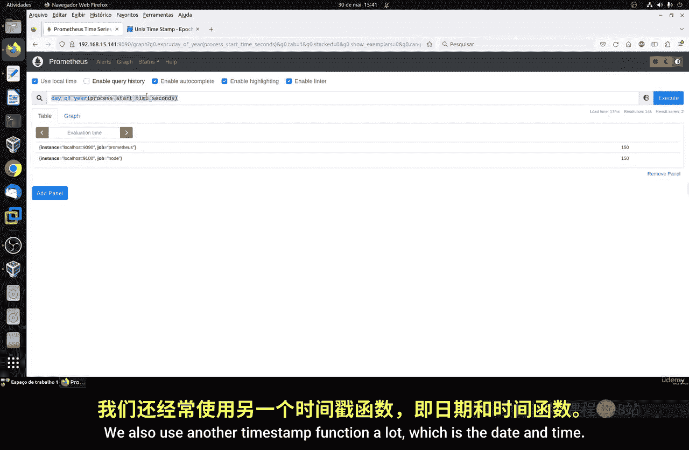
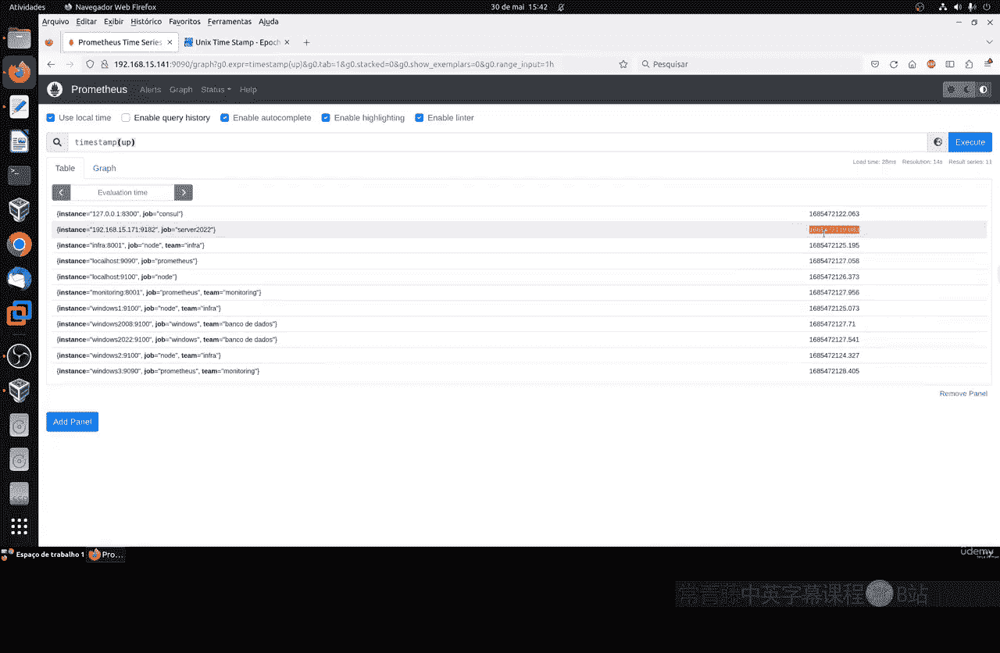
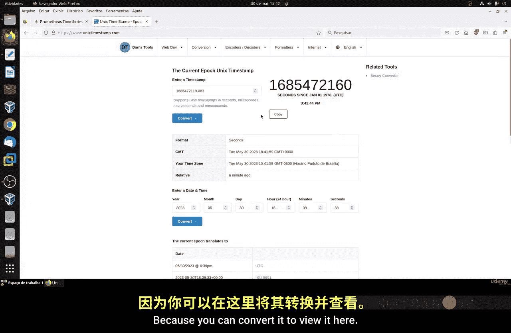
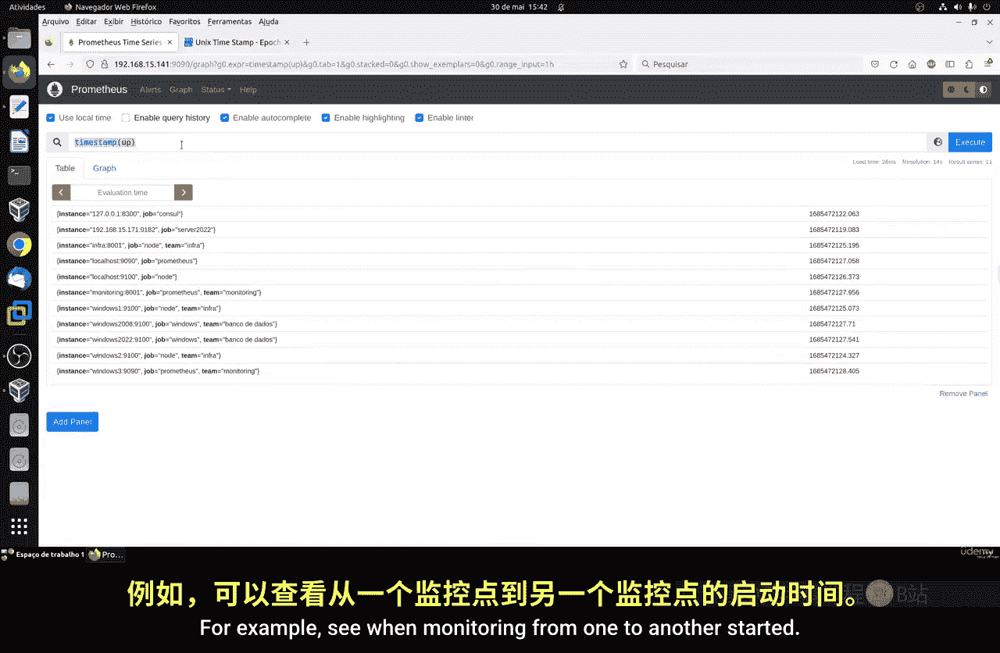
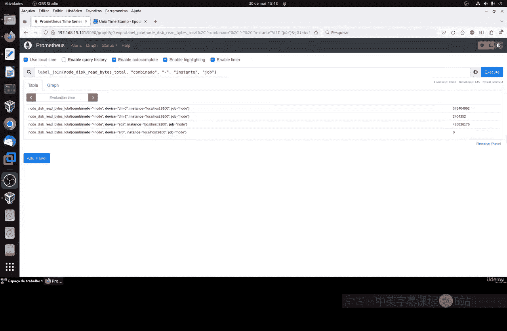

# 109：使用函数第二部分 ⏰

在本节课中，我们将继续学习Prometheus查询语言（PromQL）中的函数，重点是时间函数和标签操作函数。我们将了解如何获取和处理时间戳，以及如何修改和组合指标的标签。

## 时间函数



上一节我们介绍了函数的基本概念，本节中我们来看看PromQL中非常实用的时间函数。这些函数主要用于处理和转换时间戳数据。


### `time()` 函数

最基础的时间函数是 `time()`。此函数返回当前时间的Unix时间戳（以秒为单位）。Unix时间戳是一个表示自1970年1月1日（UTC）以来经过的秒数的数值。

**公式：**
```
time()
```

该函数返回一个时间戳类型的值。要理解这个数字代表的具体日期和时间，通常需要将其转换为可读格式。

例如，执行 `time()` 可能返回 `1698765432`。你可以通过在线Unix时间戳转换工具，将此数值转换为具体的日期和时间（如 `2023-10-31 10:17:12 UTC`）。

### 时间函数的应用

时间函数的一个常见用途是计算进程或主机的运行时长。

**代码示例：**
```
process_start_time_seconds
```

通过查询类似 `process_start_time_seconds` 的指标，你可以获得进程启动时刻的Unix时间戳。结合 `time()` 函数，就能计算出该进程已经运行了多长时间（当前时间减去启动时间）。虽然不同监控目标返回的时间可能存在微小延迟和差异，但这在分布式系统中是正常现象。



### 其他时间函数

PromQL提供了丰富的时间函数来处理年、月、日等时间维度。

以下是几个例子：
*   `year()`: 提取时间戳中的年份。
    *   **代码示例：** `year(process_start_time_seconds)` 可能返回 `2023`。
*   `month()`: 提取时间戳中的月份（1-12）。
*   `day_of_month()` / `day()`: 提取时间戳中的日期（月中的第几天）。
*   `day_of_year()`: 提取时间戳中的日期（年中的第几天）。





你可以自由组合这些函数，对时间数据进行灵活的分析和展示。



### `timestamp()` 函数

另一个常用的函数是 `timestamp()`。此函数可以将向量（一组带时间戳的数据点）中的每个样本的时间戳以Unix时间的形式返回。

**代码示例：**
```
timestamp(node_time_seconds)
```

这对于检查监控数据本身产生的时间、比较不同主机监控启动时间的差异非常有用。例如，你可以通过比较 `node_time_seconds` 和 `timestamp(node_time_seconds)` 来观察数据采集与当前时间的微小偏移。

## 标签操作函数

除了时间函数，PromQL还提供了强大的标签操作函数，用于修改查询结果中的标签。

### `label_replace()` 函数

`label_replace()` 函数用于替换或新增一个标签。它不会删除原有标签，而是执行类似“重命名”或“添加”的操作。

**函数原型：**
```
label_replace(v instant-vector, dst_label string, replacement string, src_label string, regex string)
```

*   `v`: 输入向量。
*   `dst_label`: 目标标签名（要创建或替换的标签）。
*   `replacement`: 替换内容。
*   `src_label`: 源标签名（从中提取值的标签）。
*   `regex`: 用于匹配源标签值的正则表达式。

**代码示例：**
假设有一个指标 `node_disk_read_bytes_total{device="sda"}`，我们想将标签 `device` 重命名为 `dev`。
```
label_replace(node_disk_read_bytes_total, "dev", "$1", "device", "(.*)")
```
执行后，结果中会包含一个新的标签 `dev="sda"`，同时原有的 `device="sda"` 标签仍然存在。

### `label_join()` 函数

`label_join()` 函数用于将多个现有标签的值合并，创建一个新的标签。

**函数原型：**
```
label_join(v instant-vector, dst_label string, separator string, src_label_1 string, src_label_2 string, ...)
```

*   `v`: 输入向量。
*   `dst_label`: 目标标签名（新创建的标签）。
*   `separator`: 连接源标签值时使用的分隔符。
*   `src_label_*`: 要合并的源标签名。

**代码示例：**
将 `instance` 和 `job` 两个标签的值用 `-` 连接起来，形成一个新的标签 `combined`。
```
label_join(node_disk_read_bytes_total, "combined", "-", "instance", "job")
```
如果 `instance="localhost:9100"` 且 `job="node_exporter"`，那么新标签将是 `combined="localhost:9100-node_exporter"`。

## 总结



本节课中我们一起学习了PromQL中两类重要的函数。
首先，我们探讨了**时间函数**，如 `time()` 和 `timestamp()`，它们帮助我们获取、处理和转换时间戳数据，用于计算运行时长、按时间维度分析等场景。
接着，我们学习了**标签操作函数**，包括 `label_replace()` 和 `label_join()`。这些函数允许我们在不改变核心指标数据的前提下，灵活地修改、重命名或组合标签，使得查询结果更符合我们的分析和展示需求。
掌握这些函数能让你更有效地利用Prometheus进行监控数据查询与分析。