# 111：记录规则 📝

在本节课中，我们将要学习Prometheus中的记录规则。记录规则是一种定期评估表达式并将结果自动存储为新时间序列的方法，这对于加速仪表盘查询和聚合数据非常有用。

上一节我们介绍了Prometheus的基本查询，本节中我们来看看如何通过记录规则来优化和简化这些查询。

## 记录规则概述

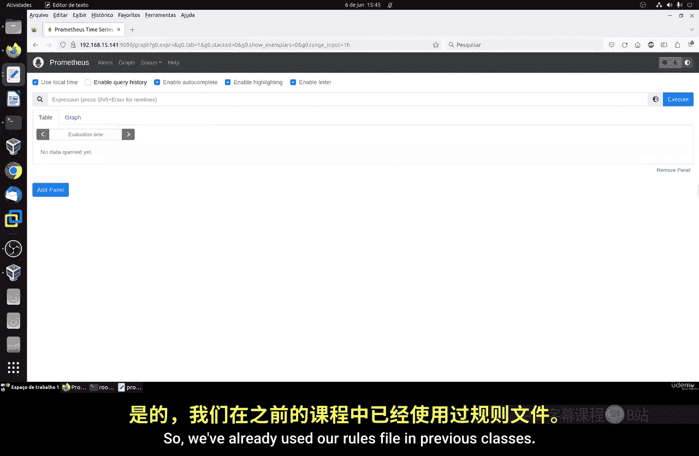

Prometheus的API并非访问其查询语言的唯一方式。我们还可以使用名为“记录规则”的功能。记录规则允许Prometheus定期评估我们定义的表达式，并自动将结果存储为新的时间序列。

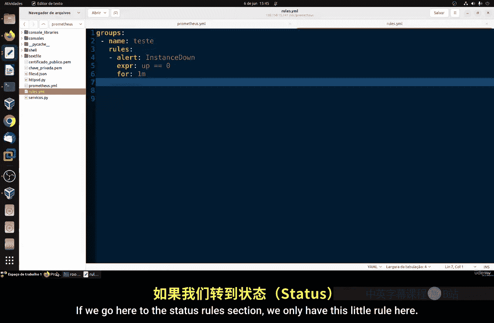

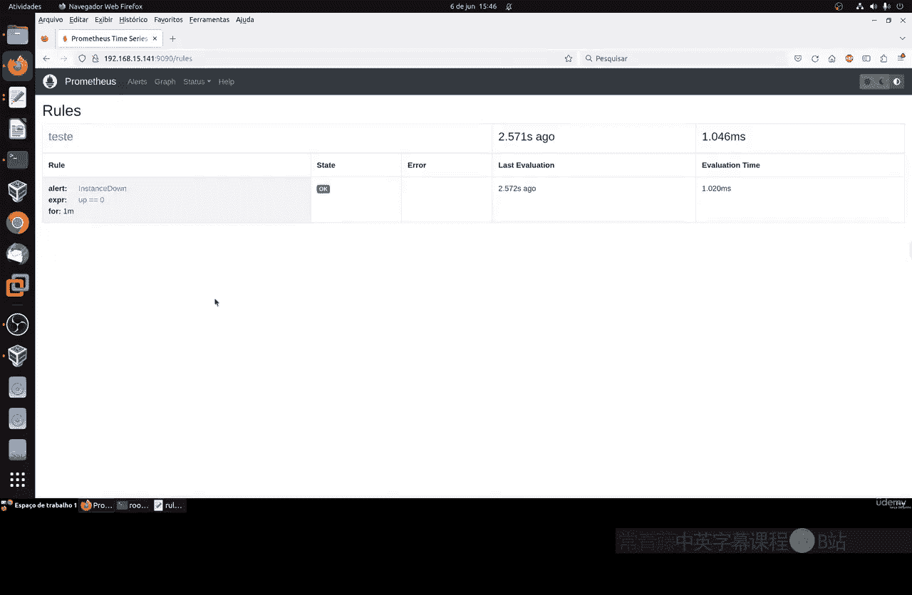

这种方法非常实用，例如，它可以显著加速使用Grafana等工具构建的仪表盘。它通过提供预聚合的结果来实现加速，这些结果可用于组合区间向量函数或在其他场景中使用。此外，其他监控系统也可以查询这些持久化的、预计算的结果，从而提升查询效率。

告警规则是记录规则的一个变体，其核心概念相似。本节课我们将重点展示如何创建记录规则。

## 配置记录规则

我们已经在之前的课程中使用过规则文件。回忆一下，我们甚至为此创建了一个单独的文件。我们将沿用这个文件进行配置。

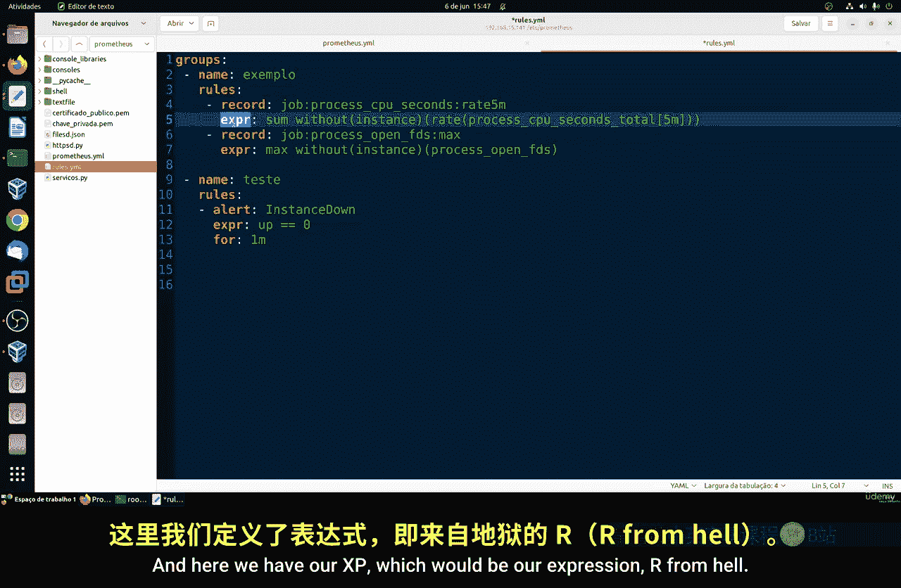

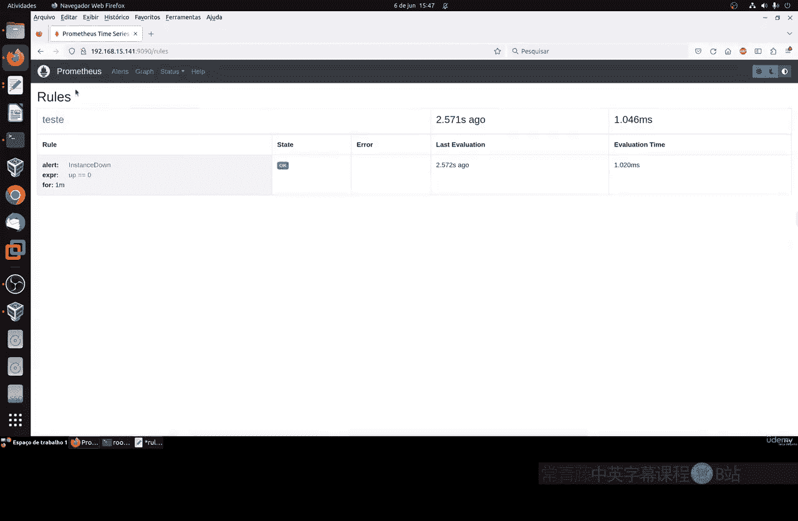

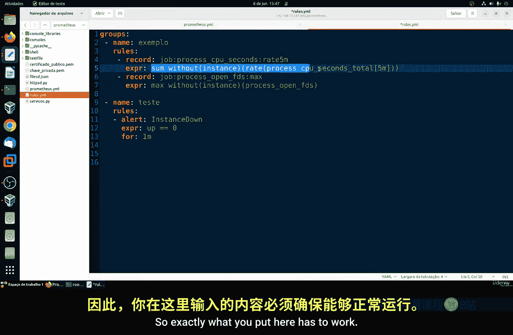

以下是配置记录规则的步骤：

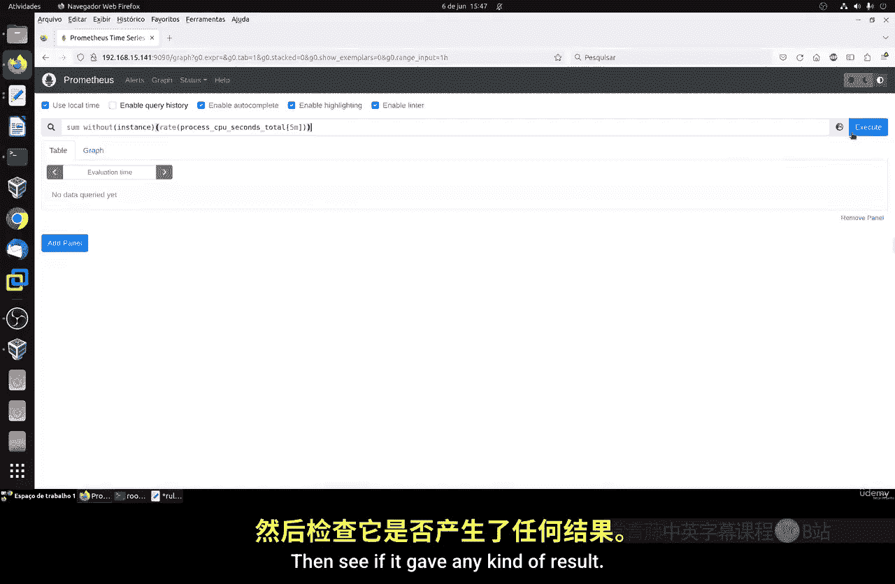

1.  **编辑规则文件**：我们使用一个独立的YAML文件来定义规则。其基本语法结构如下：
    ```yaml
    groups:
      - name: example
        rules:
          - record: <新时间序列的名称>
            expr: <PromQL表达式>
    ```
    其中，`name` 必须是唯一的，`expr` 是有效的PromQL表达式，`record` 定义了存储结果的新指标名称。

2.  **重新加载配置**：每当对规则文件进行更改后，都需要让Prometheus重新加载配置以生效。这通常通过向Prometheus发送SIGHUP信号或调用其`/-/reload` HTTP端点来完成。

3.  **验证规则**：可以在Prometheus的Web界面（Status -> Rules）中查看已加载的规则及其评估状态。

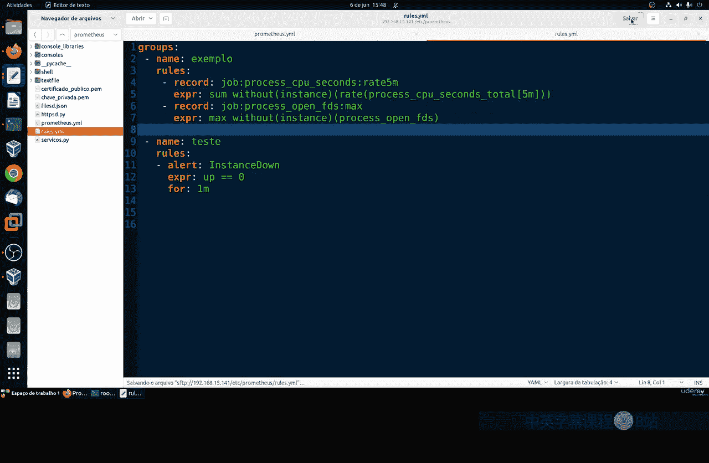

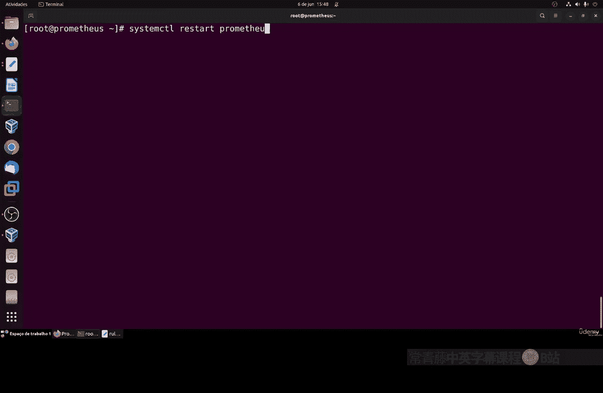

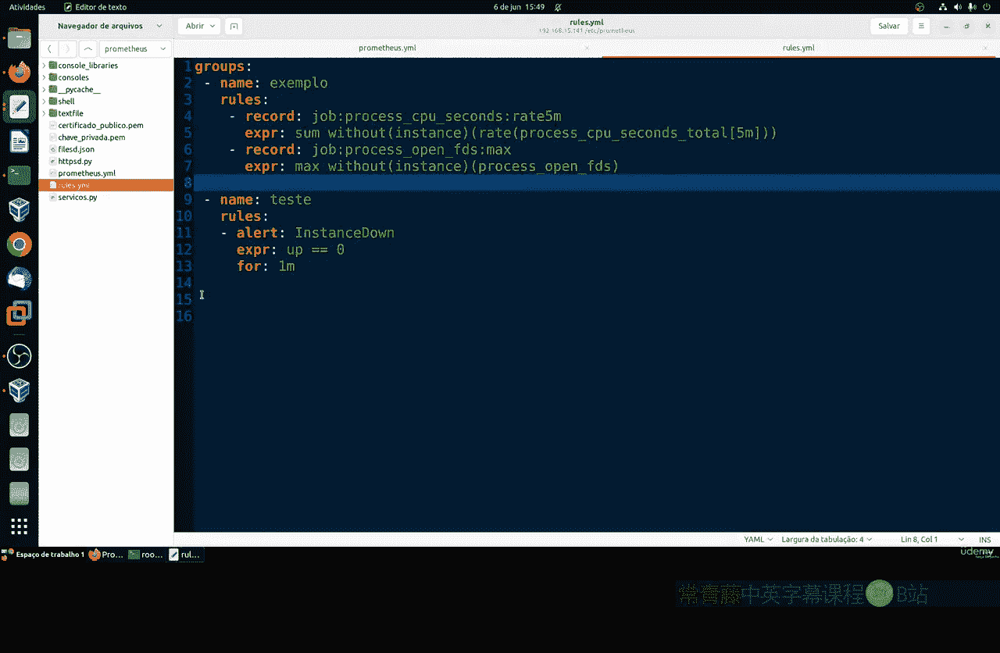

## 规则执行逻辑

理解规则组的执行顺序很重要：

*   在同一个规则组内，规则按顺序依次执行。
*   第一条规则的输出会临时存入数据库，然后第二条规则才被执行。这意味着后续规则可以引用前面规则生成的新时间序列。
*   不同的规则组会在不同的时间点并行执行，这有助于在Prometheus服务器上分散计算负载，避免所有规则同时评估对CPU和内存造成过大压力。

## 监控规则性能

Prometheus提供了监控规则本身性能的指标。一个关键的指标是 **`prometheus_rule_group_last_duration_seconds`**。

通过这个指标，我们可以查看每个规则组最后一次执行所花费的时间。这有助于我们发现和诊断哪些规则计算成本过高、执行时间异常长，从而需要进行优化。

如果某个规则组的执行时间显著高于其他组，就可能需要审查其表达式是否过于复杂或低效。

## 总结

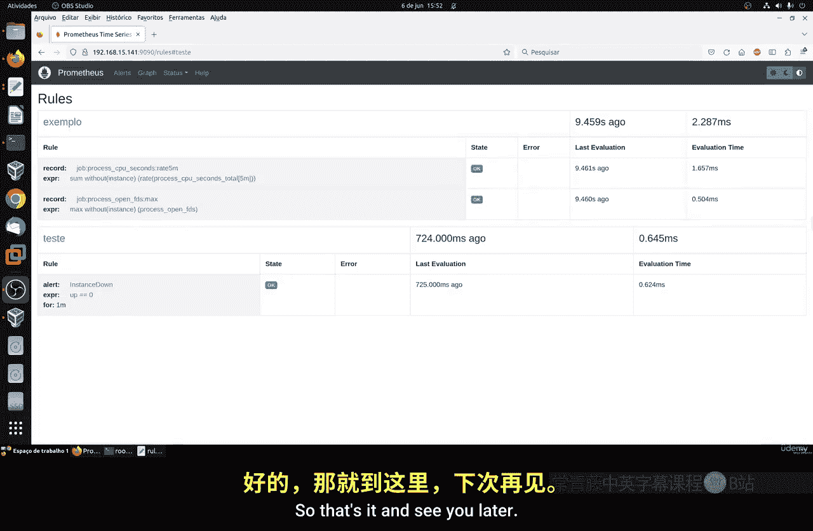

本节课中我们一起学习了Prometheus的记录规则。我们了解到记录规则可以预先计算并存储常用的查询结果，从而提升仪表盘查询速度和系统效率。我们掌握了如何配置规则文件、理解规则的执行顺序，并学会了使用`prometheus_rule_group_last_duration_seconds`指标来监控规则的性能。合理使用记录规则是构建高效、可扩展监控系统的重要一步。