# 112：使用指标重用规则 🎯

在本节课中，我们将学习如何在Prometheus中创建和重用记录规则。上一节我们介绍了如何创建基本的记录规则来降低基数负载。本节中我们来看看如何基于已存在的规则创建新的规则，实现指标的重用，从而构建更复杂的监控逻辑。

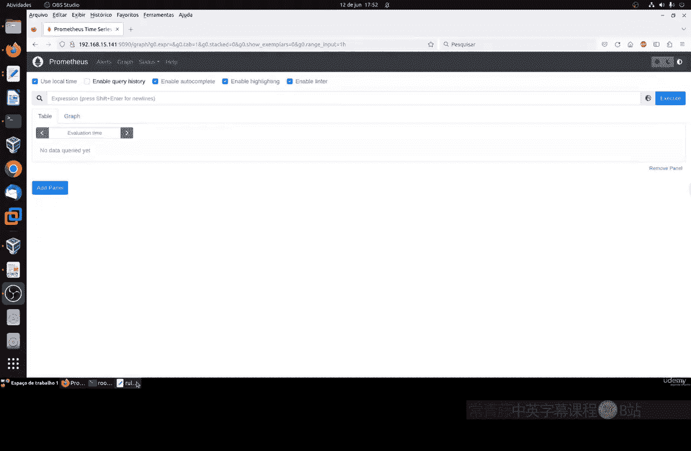

## 回顾上节课的规则

我们首先快速回顾一下上节课创建的规则。我们创建了一个记录规则，其本质是将一个复杂的PromQL表达式保存为一个新的指标名称。

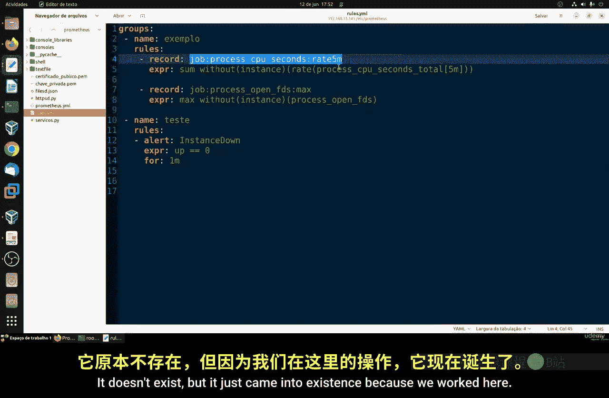

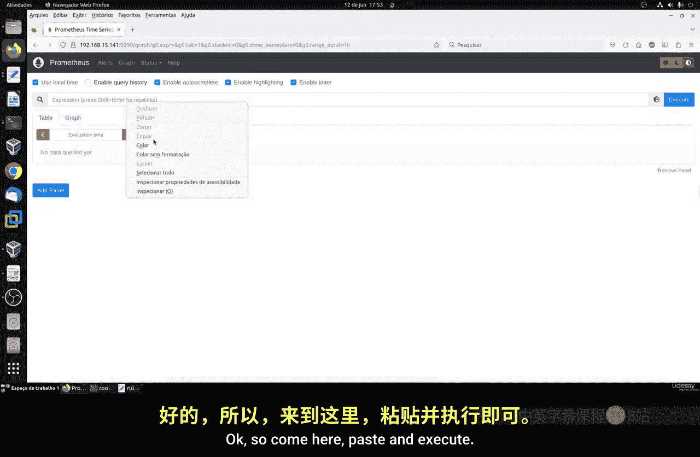

例如，我们创建了如下规则：
```yaml
- record: job_device:node_cpu_seconds:avg_idle
  expr: avg by (job, device) (rate(node_cpu_seconds_total{mode="idle"}[5m]))
```

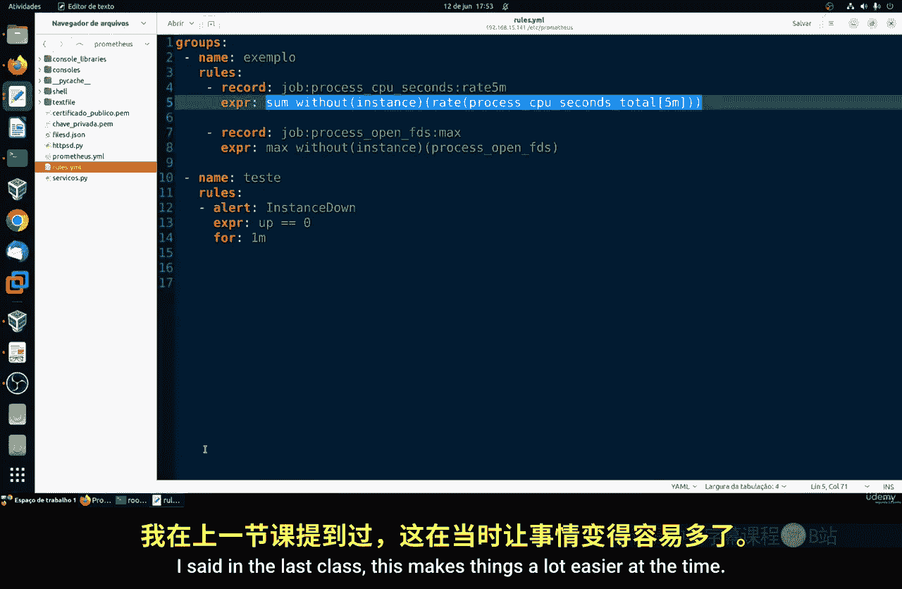

这条规则 `job_device:node_cpu_seconds:avg_idle` 等价于执行表达式 `avg by (job, device) (rate(node_cpu_seconds_total{mode="idle"}[5m]))`。这使得日常查询和仪表板配置变得更加简便。你可以在Prometheus的UI中直接查询这个新的指标名称。

## 创建可重用的规则

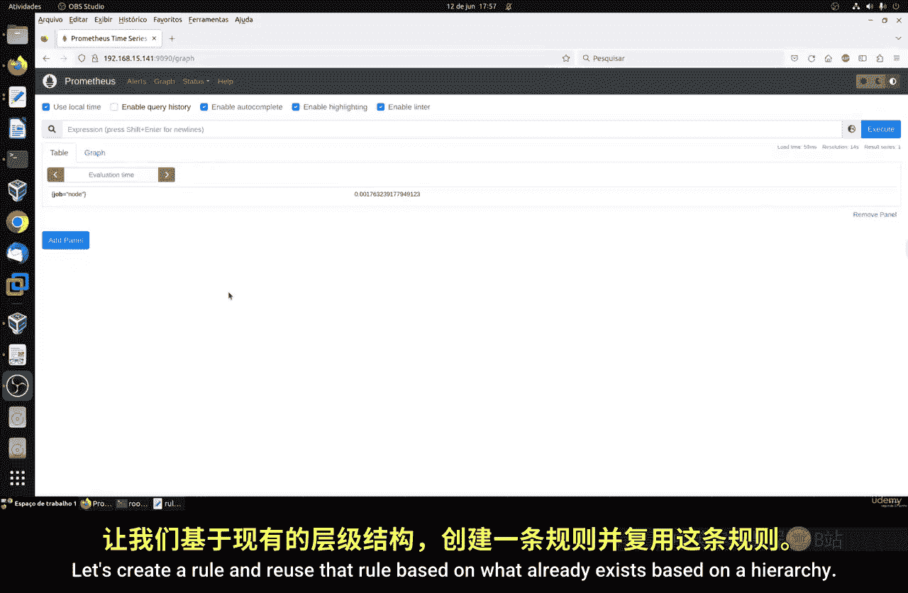

现在，让我们以不同的方式工作。我们将创建一个新规则，该规则将基于已存在的规则（即一个层级结构）进行构建。

以下是创建新规则组的步骤：

1.  在规则配置文件中，创建另一个规则组。
2.  在该组内，定义一条新规则。
3.  在新规则的表达式中，引用之前创建的记录规则指标，而不是原始的Prometheus指标。

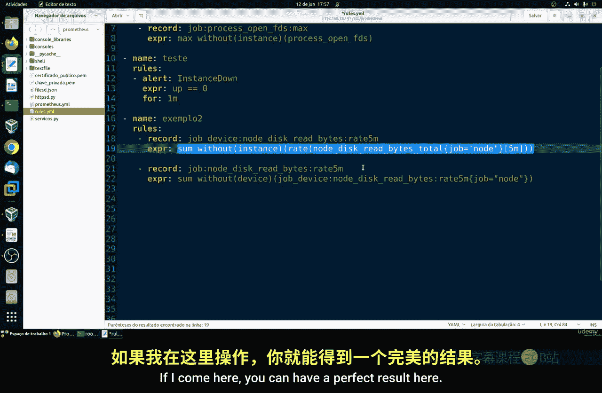

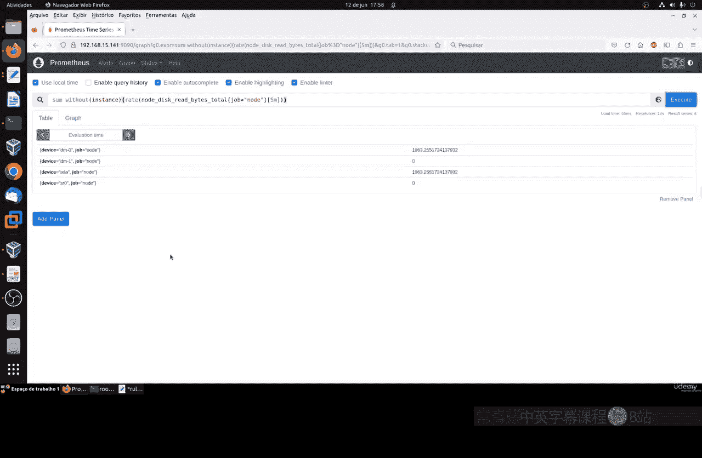

例如，我们创建第二条规则：
```yaml
- record: example2:high_idle_devices
  expr: job_device:node_cpu_seconds:avg_idle > 0.8
```

在这条规则中，`expr` 字段没有直接使用原始的 `node_cpu_seconds_total` 指标，而是调用了我们之前创建的 `job_device:node_cpu_seconds:avg_idle` 指标。这意味着我们在已有计算的基础上进行二次计算（例如筛选出空闲率高于80%的设备）。

## 应用与验证规则

每次编辑规则文件后，都需要重启Prometheus服务以使更改生效。
```bash
sudo systemctl restart prometheus
```

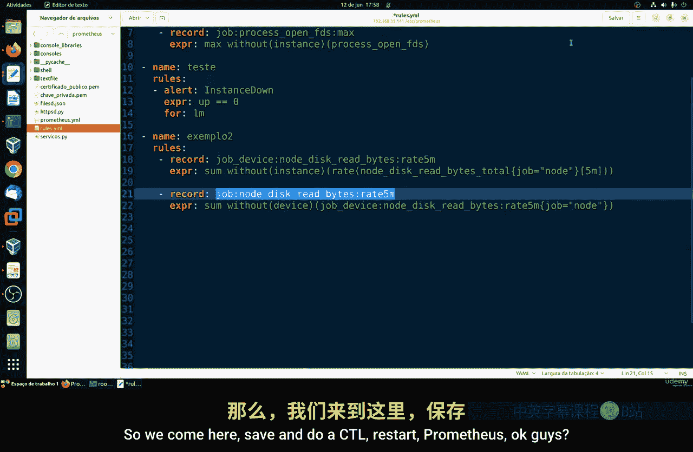

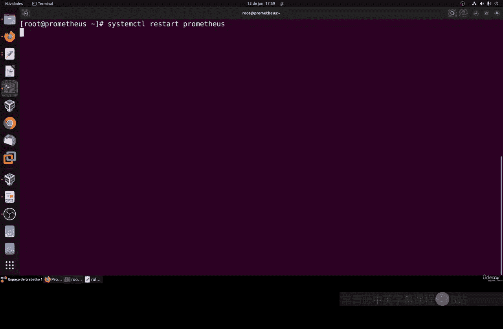

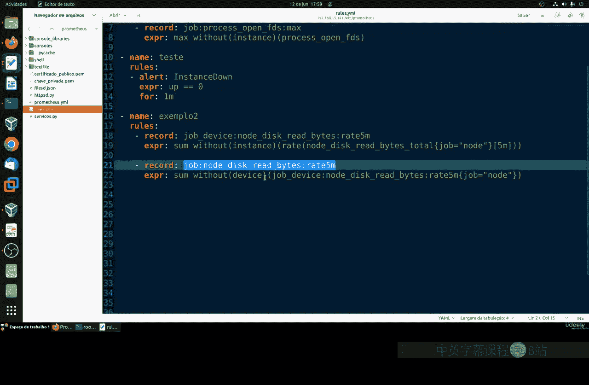

重启后，我们可以在Prometheus的“Status” -> “Rules”页面查看新规则 `example2:high_idle_devices` 的状态。你也可以在“Graph”页面直接查询这个新指标，验证它是否正常工作。该指标会引用并基于 `job_device:node_cpu_seconds:avg_idle` 的值进行计算。

## 规则文件的结构与顺序

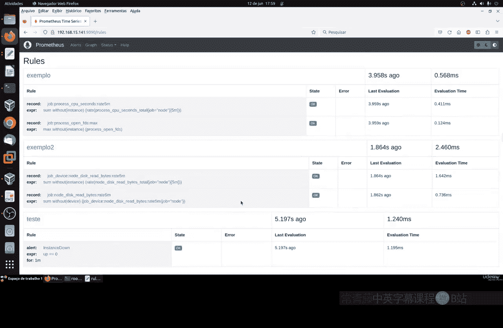

必须注意规则文件中的层级和顺序。Prometheus按顺序从上到下读取和评估规则文件。

因此，一个基本原则是：**将被引用的规则（基础规则）必须放在引用它的规则（衍生规则）之前**。

如果顺序颠倒，Prometheus在读取衍生规则时，会发现其引用的基础指标尚不存在于内存中，从而导致错误。正确的顺序确保了计算依赖的连贯性。

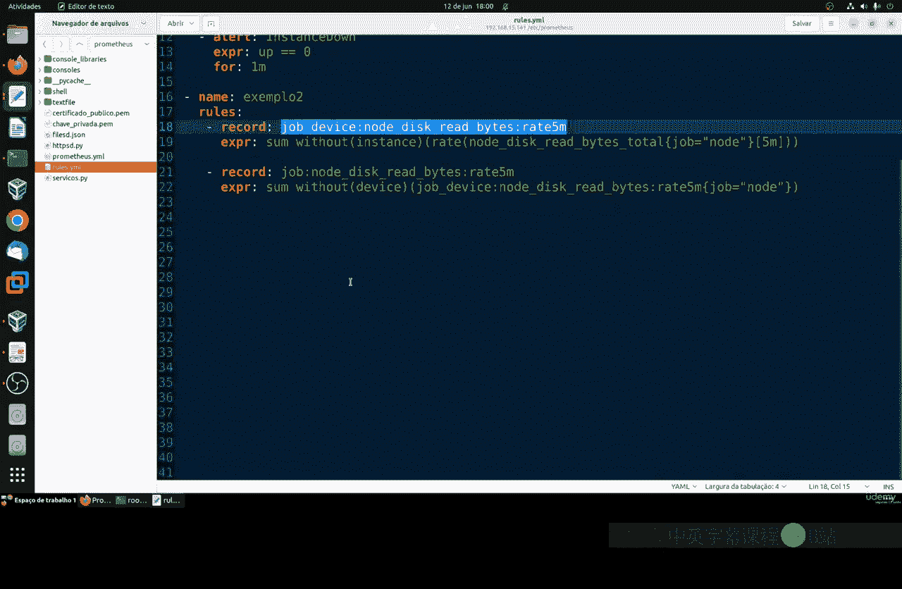

## 规则重用的优势与注意事项

通过重用规则，我们可以构建出无限多样的监控指标，这充分展示了Prometheus在监控方面的强大性、灵活性和多功能性。

然而，在享受其强大功能的同时，也需注意以下几点：

*   **系统资源**：创建大量复杂的规则会增加Prometheus服务器的计算和存储负载。需要根据服务器的处理能力来规划规则的复杂度和数量。
*   **命名唯一性**：确保每条记录规则具有唯一的名称，避免冲突。
*   **逻辑清晰**：合理的规则层级和复用可以使监控配置更易于管理和理解。

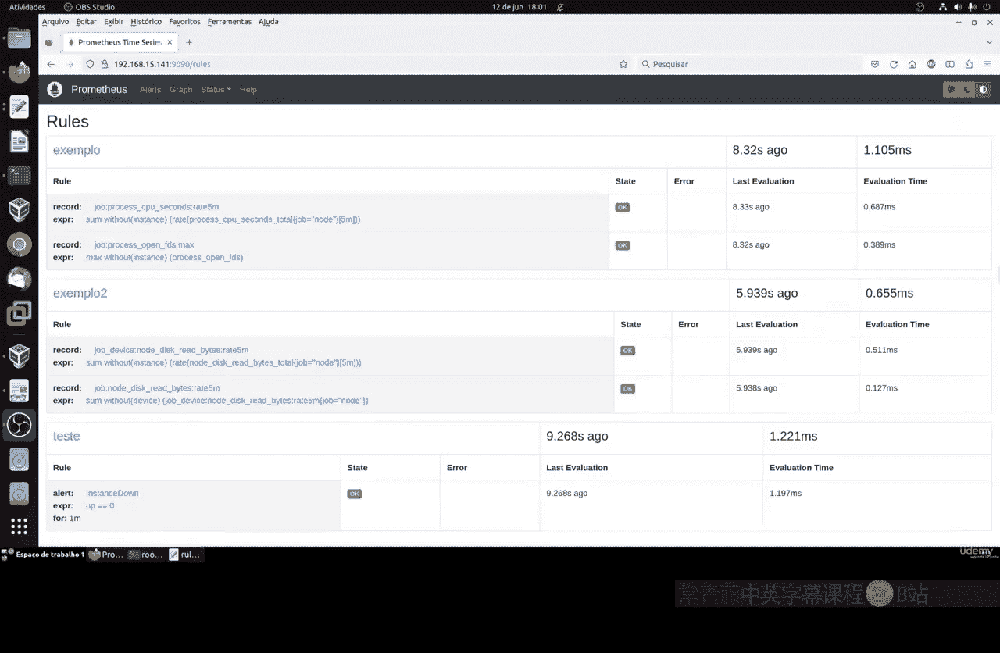

本节课中我们一起学习了如何在Prometheus中通过记录规则实现指标的重用。我们回顾了基础规则的创建，实践了基于现有规则构建新规则的方法，并理解了规则文件顺序的重要性以及资源管理的注意事项。掌握规则重用能让你更高效地构建强大而清晰的监控体系。