# 113：警报规则 🚨

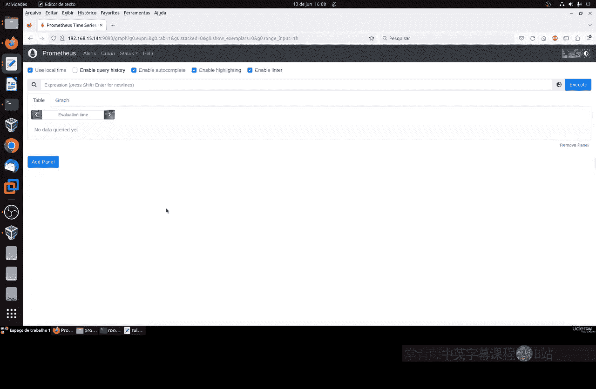

在本节课中，我们将学习如何创建和配置Prometheus的警报规则。警报规则允许我们基于特定的条件自动触发警报，这对于监控系统的健康状态至关重要。我们将结合使用记录规则和警报规则，并学习如何利用时间函数来限定警报的触发时间。

---

## 概述

警报规则用于定义在何种条件下应触发警报。它们与记录规则类似，但目的是在满足特定条件时发出通知。在本节中，我们将创建一个警报规则，监控主机是否处于非活动状态，并设置时间窗口，使警报仅在特定时间段内有效。

---

## 创建警报规则

上一节我们介绍了记录规则，本节中我们来看看如何创建警报规则。警报规则的语法与记录规则相似，但增加了触发条件。

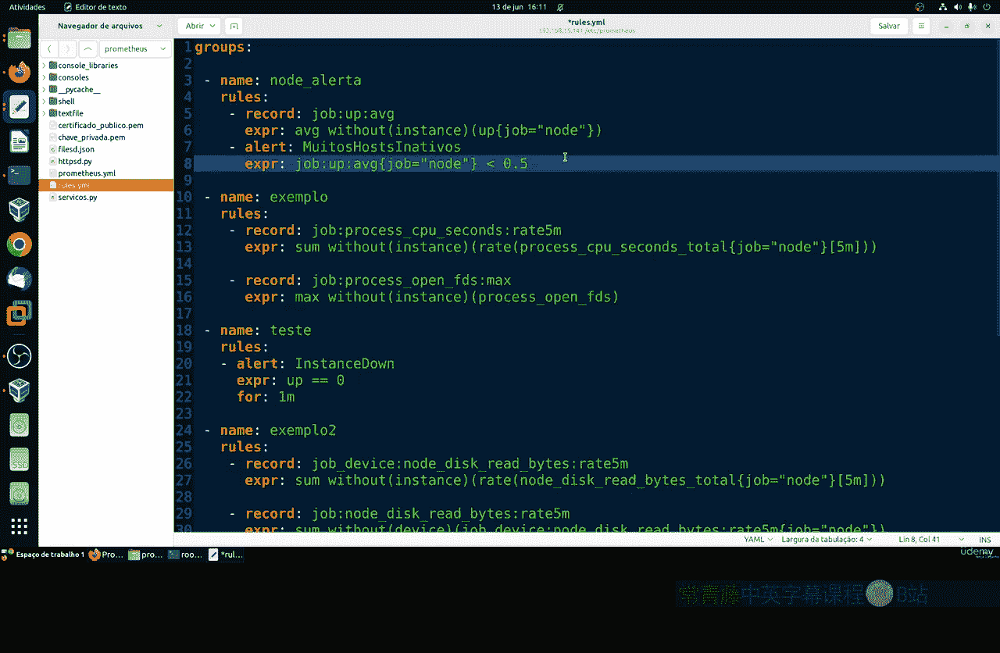

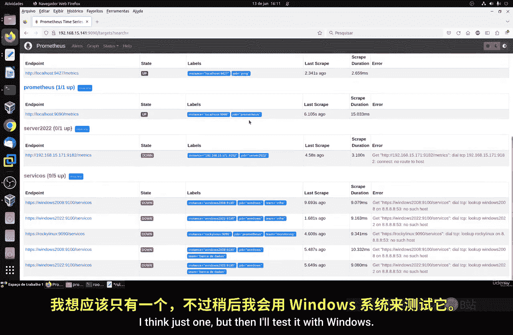

首先，我们打开规则文件。我们将创建一个新的警报规则，与已有的记录规则放在同一个组中。这是一种常见的做法。

以下是创建警报规则的步骤：

1.  **定义警报名称和表达式**：警报需要一个唯一的名称和一个用于评估的PromQL表达式。
2.  **设置触发条件**：当表达式的结果满足特定条件（例如，值低于某个阈值）时，警报将被触发。
3.  **添加标签和注释**（可选）：可以为警报添加额外的标签和注释，以便在通知中提供更多上下文信息。

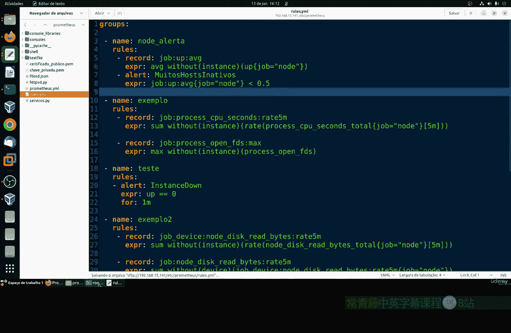

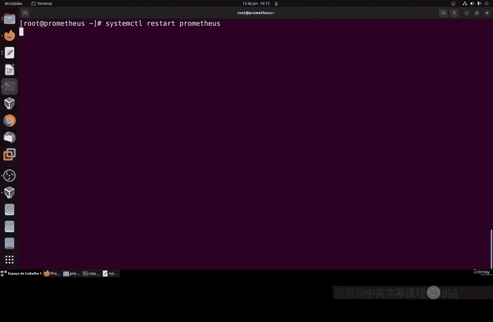

让我们创建一个名为“Too Many Inactive Hosts”的警报。该警报将在超过一半的节点导出器（node exporter）处于非活动状态时触发。

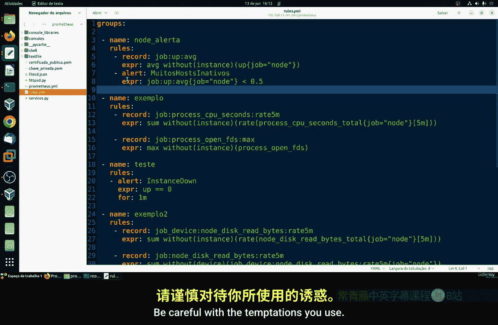

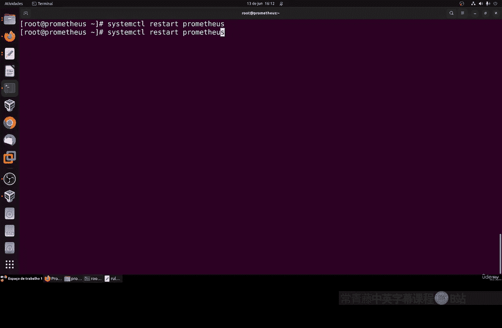

我们首先会使用一个记录规则来简化我们的指标查询。记录规则 `job_node:avg_instance_up` 计算了 `job="node"` 的 `up` 指标的平均值。

```yaml
groups:
  - name: example
    rules:
      # 记录规则
      - record: job_node:avg_instance_up
        expr: avg by (job) (up{job="node"})
      # 警报规则
      - alert: Too Many Inactive Hosts
        expr: job_node:avg_instance_up{job="node"} < 0.5
        for: 1m
        labels:
          severity: warning
        annotations:
          summary: "超过一半的节点处于非活动状态"
```

在这个例子中：
*   `expr: job_node:avg_instance_up{job="node"} < 0.5` 是警报条件。它使用了我们定义的记录规则 `job_node:avg_instance_up`，并过滤了特定的任务（`job="node"`）。当该平均值低于0.5时，条件成立。
*   `for: 1m` 表示该条件必须持续1分钟才会触发警报，这有助于避免因瞬时波动而产生误报。
*   `labels` 和 `annotations` 用于丰富警报信息。

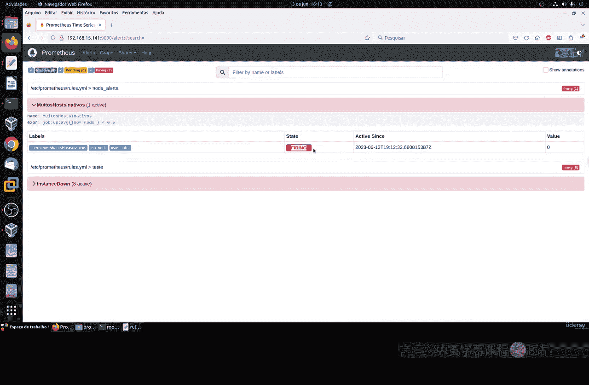

---


## 结合时间函数

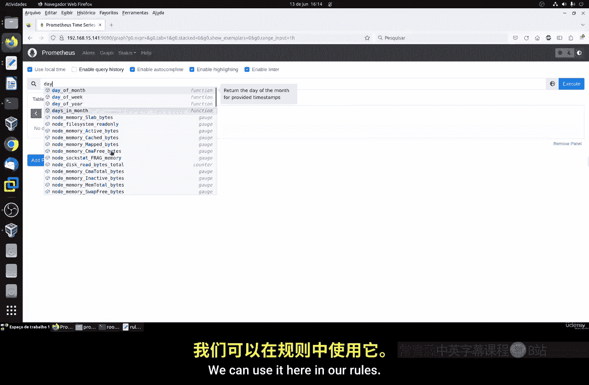

有时，我们可能希望警报只在特定时间段内生效。例如，在工作时间（如上午8点到下午6点）之外，公司的机器可能会关机，此时触发警报没有意义。

Prometheus提供了一些时间函数，可以用于在规则中判断时间。以下是几个常用的时间函数：

*   `hour()`: 返回UTC时间的小时（0-23）。
*   `minute()`: 返回UTC时间的分钟（0-59）。
*   `day_of_week()`: 返回一周中的第几天（0-6，其中0是星期日）。
*   `day_of_month()`: 返回一月中的第几天（1-31）。

我们可以修改之前的警报规则，使其仅在UTC时间8点到18点之间生效。

```yaml
      - alert: Too Many Inactive Hosts (Business Hours)
        expr: |
          job_node:avg_instance_up{job="node"} < 0.5
          and on()
          hour() >= 8 and hour() < 18
        for: 1m
        labels:
          severity: warning
        annotations:
          summary: "工作时间段内，超过一半的节点处于非活动状态"
```

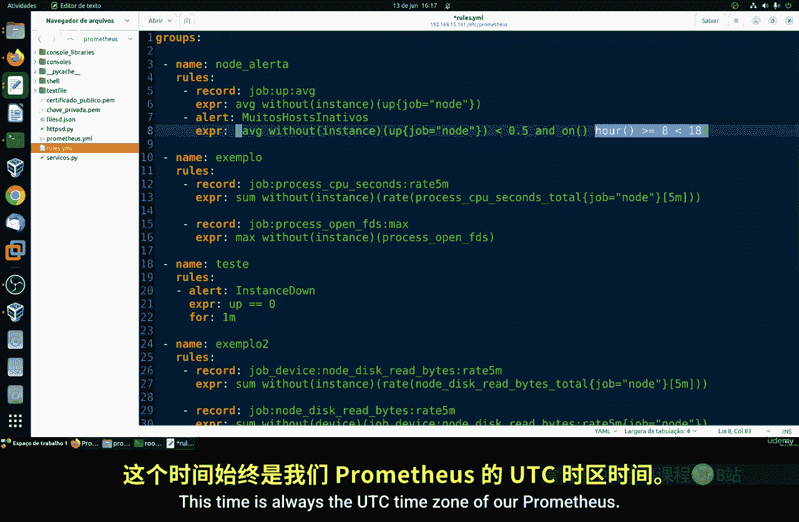

**关键修改**：
*   我们使用 `and` 操作符将原来的条件与时间条件连接起来。
*   `hour() >= 8 and hour() < 18` 确保了警报只在UTC时间8点至18点之间被评估。
*   `on()` 子句用于指定如何组合两个表达式的结果，这里表示不按任何标签进行分组匹配，直接进行逻辑“与”操作。

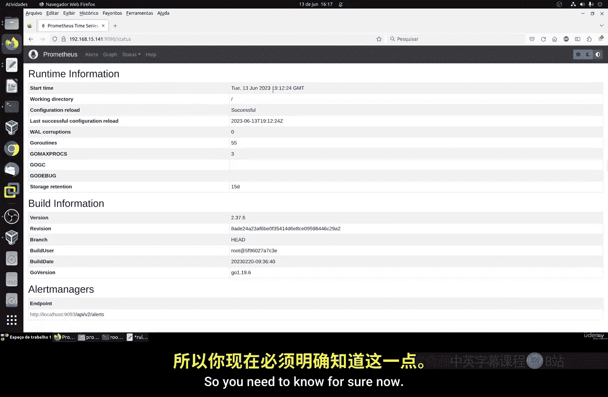

**重要提示**：Prometheus内部使用UTC时间。在配置时间窗口时，你需要考虑你所在时区与UTC的偏移量。你可以通过Prometheus Web UI的“Status” -> “Runtime & Build Information”页面查看其当前UTC时间。

---

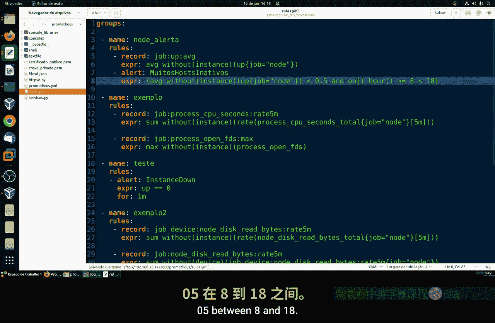

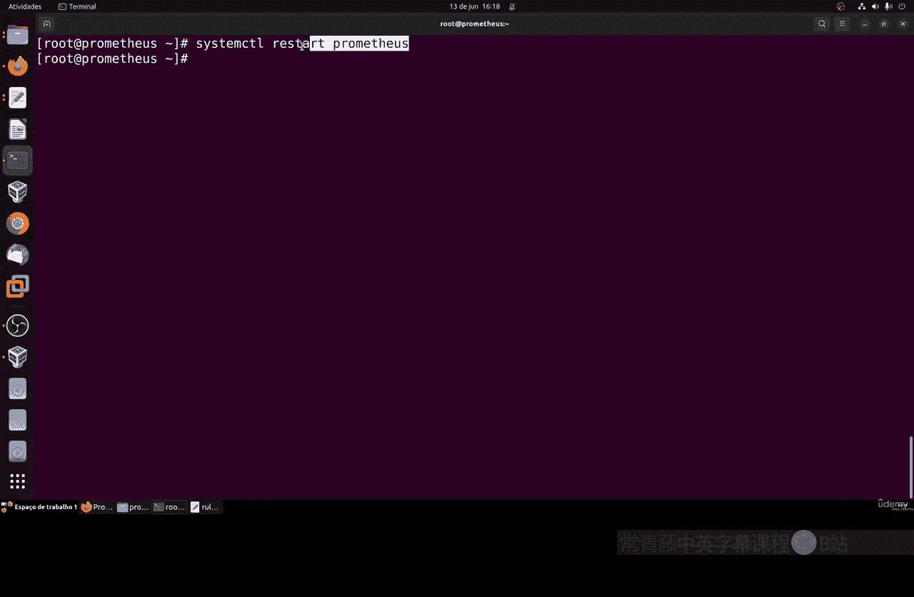

## 测试与验证

创建或修改规则文件后，需要重新加载Prometheus配置使其生效。

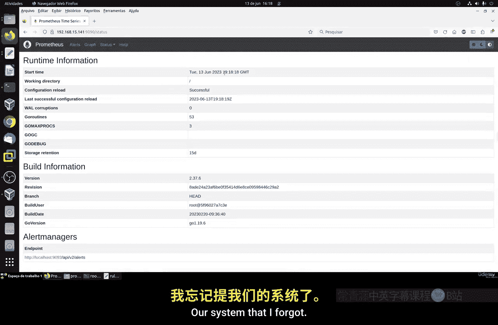

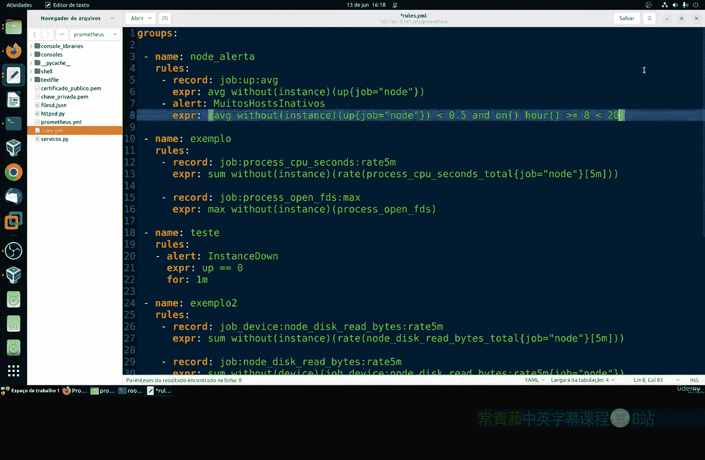

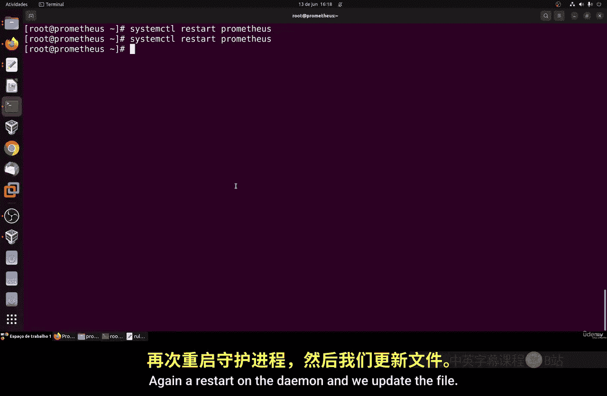

1.  保存规则文件（例如 `rules.yml`）。
2.  确保该文件路径已在Prometheus的主配置文件 `prometheus.yml` 的 `rule_files` 部分正确引用。
3.  通过发送SIGHUP信号或使用管理API重新加载Prometheus配置：
    ```bash
    # 方法一：发送SIGHUP信号（如果Prometheus以服务运行）
    sudo systemctl reload prometheus
    # 或
    kill -HUP <prometheus_pid>

    # 方法二：使用管理API（如果启用）
    curl -X POST http://localhost:9090/-/reload
    ```
4.  在Prometheus Web UI中导航到“Alerts”页面，查看新警报的状态。它应该显示为“Inactive”（未触发）或“Pending”（条件满足但未达`for`时长）或“Firing”（已触发）。
5.  你也可以在“Status” -> “Rules”页面查看所有已加载的规则。

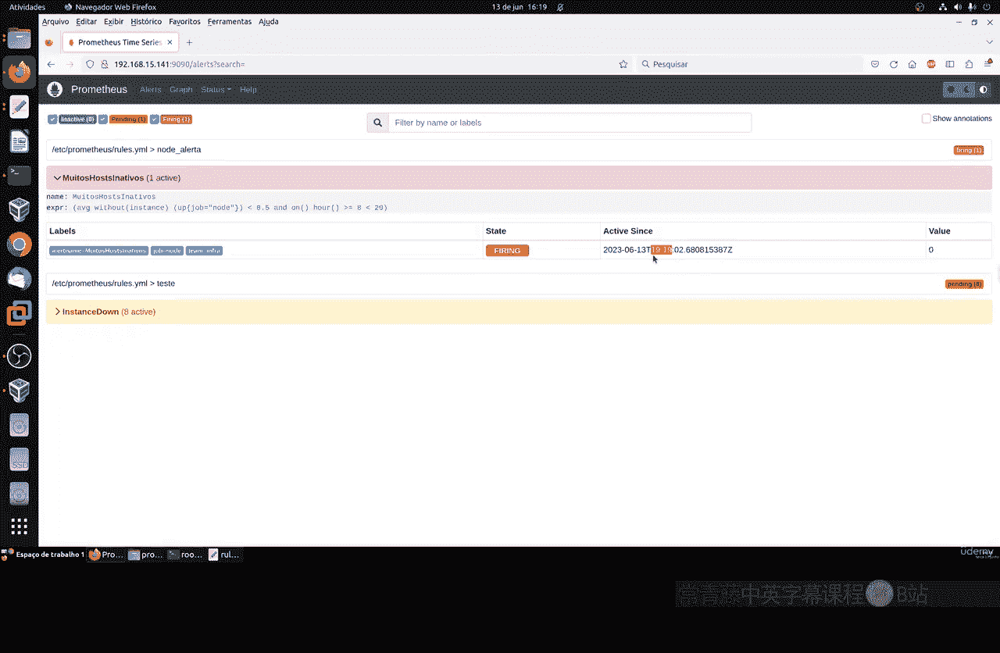

为了测试时间窗口功能，你可以临时修改规则中的时间条件（例如，改为包含当前UTC时间），重新加载配置后，观察警报状态是否会变为“Pending”或“Firing”。测试完成后，请记得将时间条件改回预期的业务时间。

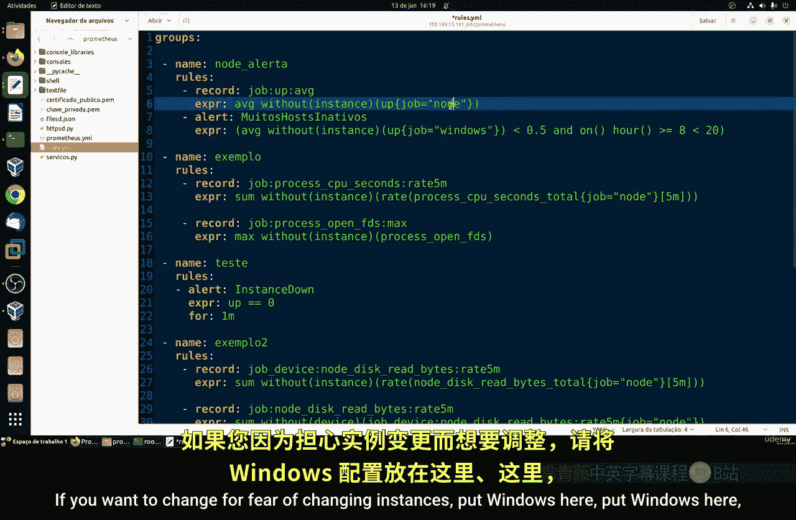

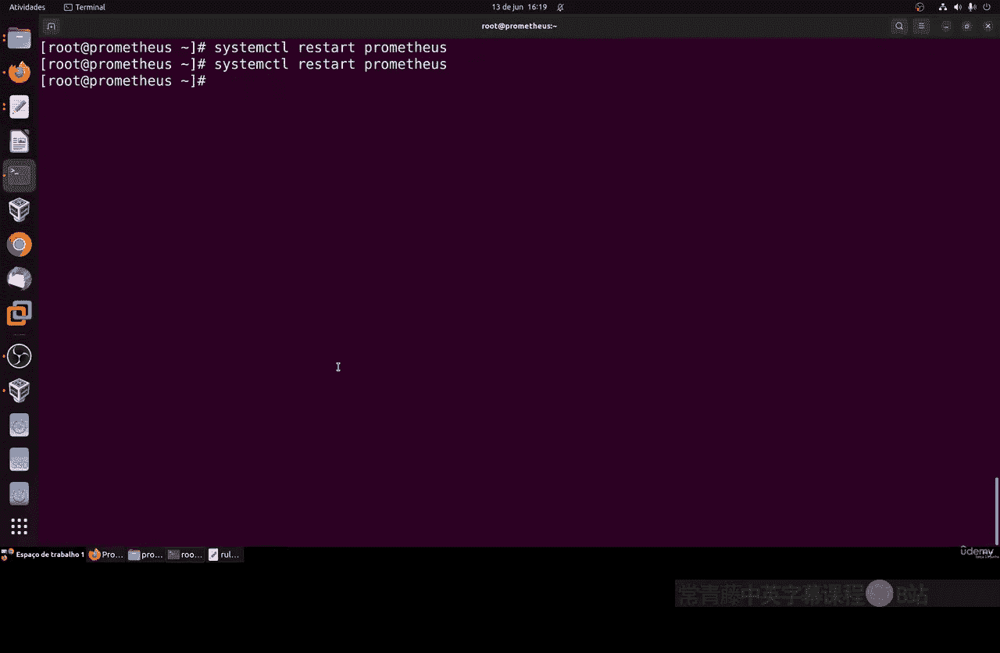

---

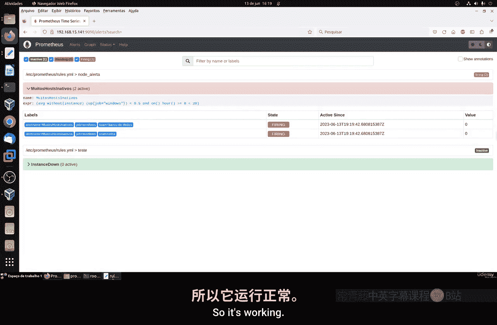

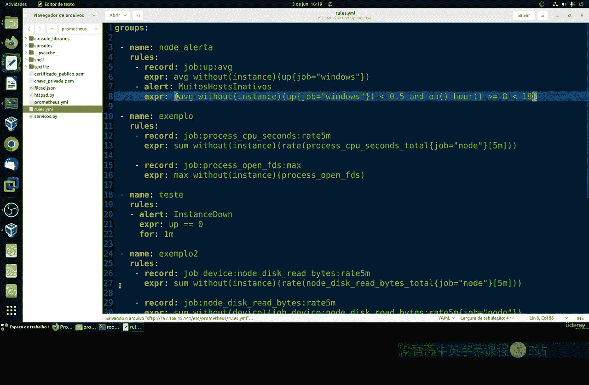

## 总结

本节课中我们一起学习了Prometheus警报规则的核心概念。我们首先创建了一个基本的警报规则，用于监控节点的活动状态。接着，我们深入探讨了如何将警报规则与记录规则结合使用，以简化查询表达式。最后，我们引入了时间函数，学会了如何限制警报仅在特定的时间窗口内触发，这使得警报管理更加智能和实用。

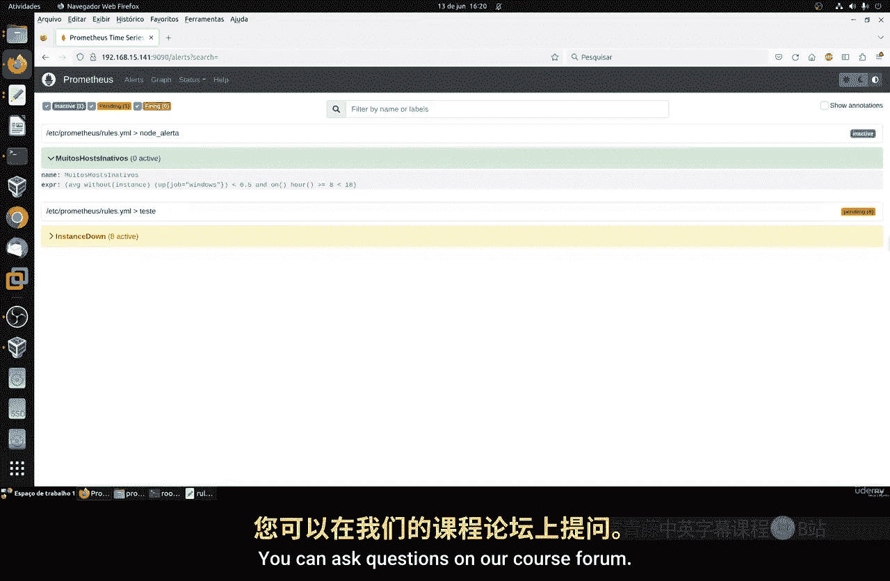

记住，有效的警报应该是可操作的、有明确含义的，并且避免在无需关注的时段产生噪音。通过合理设计警报规则，你可以构建一个高效可靠的监控系统。