Linux命令行基础：Part3：警报规则第二部分 🔔

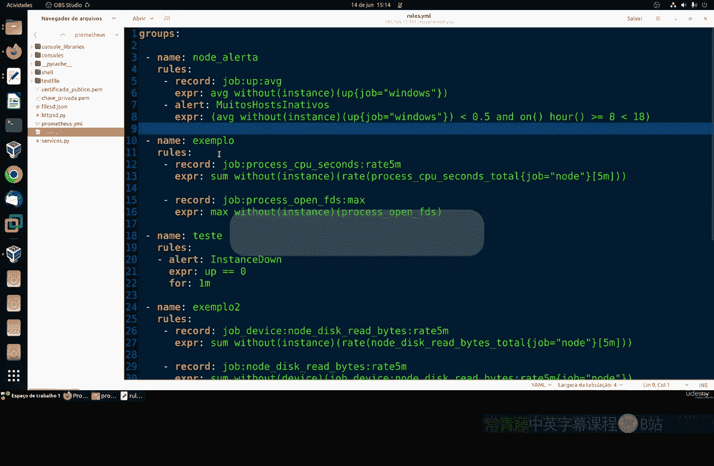

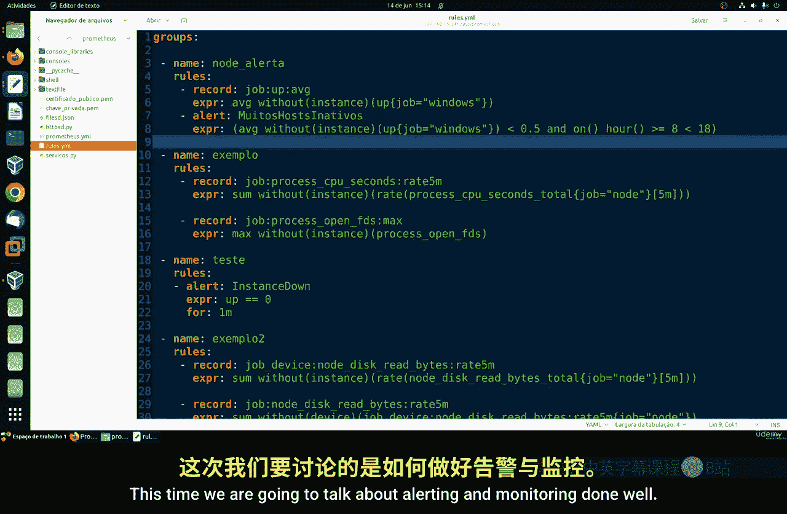

在本节课中，我们将要学习如何优化警报规则，以减少误报，实现更精准的监控。


上一节我们介绍了警报的基本概念，本节中我们来看看如何通过设置合理的条件来避免不必要的警报。

一个设计良好的监控系统应尽可能排除误报，避免生成不必要的警报。如果监控系统频繁发出错误的警报，会在网络中引起不必要的担忧，这表明监控方式存在问题。因此，消除著名的“误报”现象至关重要。

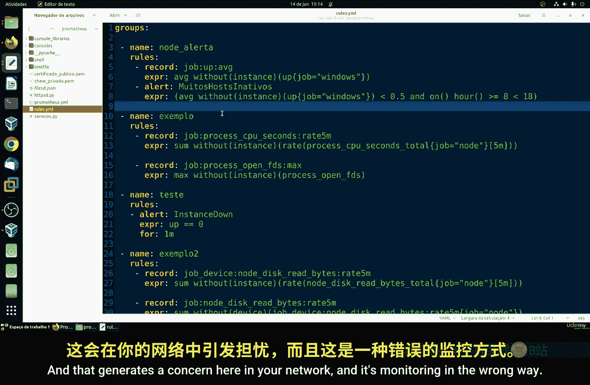

### 使用 `for` 字段减少误报

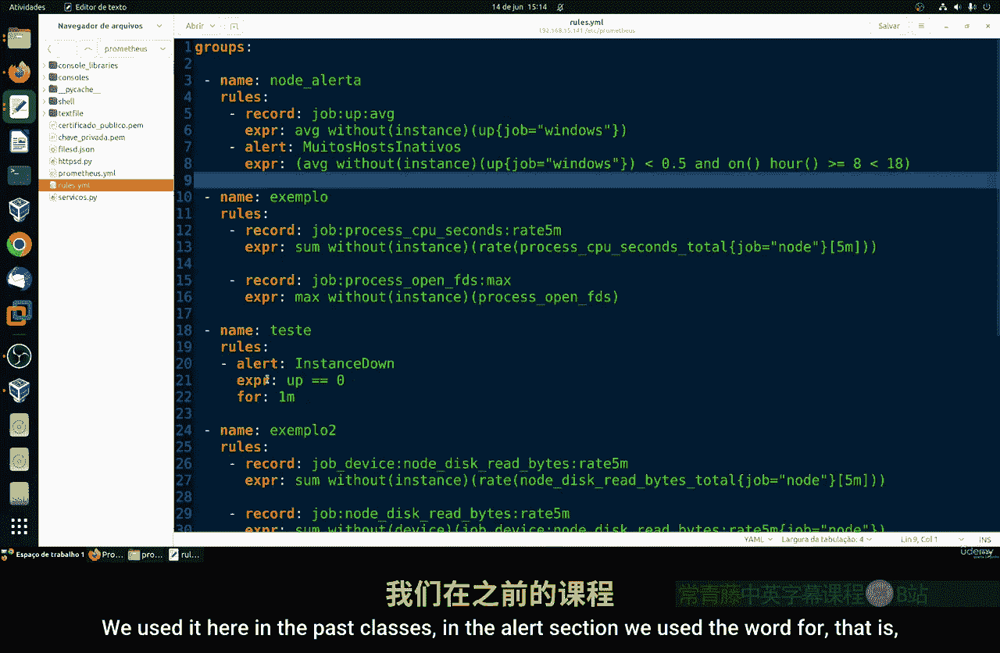

在之前的课程中，我们曾在警报部分使用过 `for` 字段。这个字段允许我们设置一个持续时间条件，从而在一定程度上缓解误报问题。

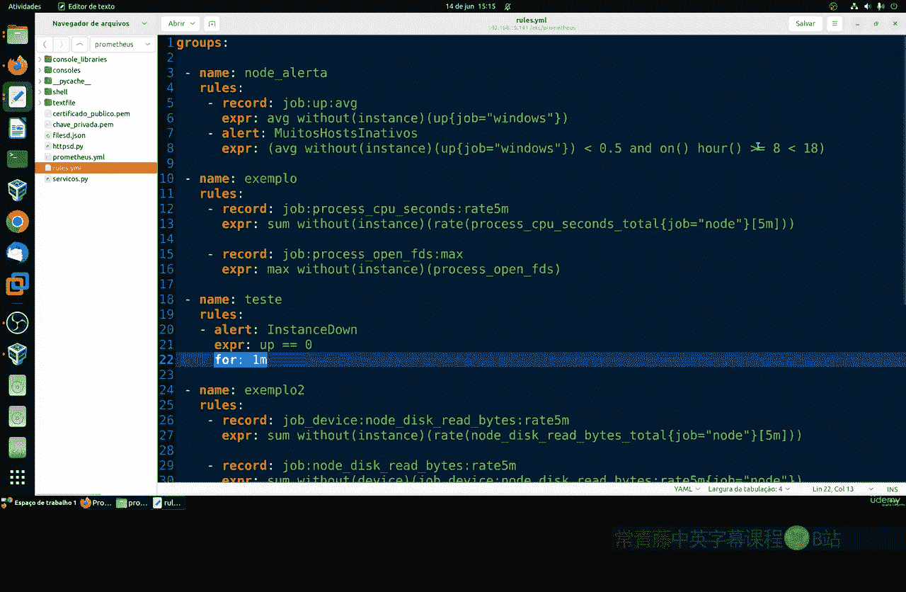

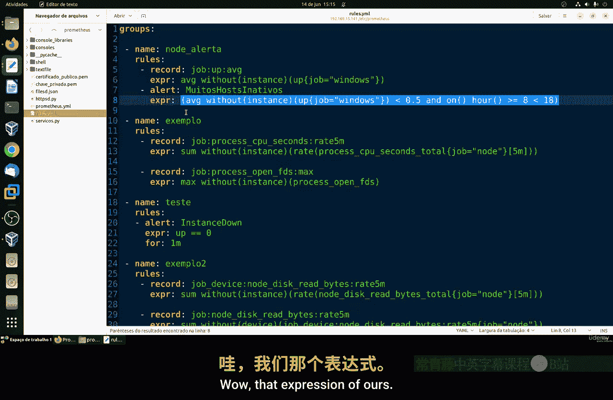

例如，我们可以设置这样一个规则：如果超过50%的Windows服务器在某个时间点处于非活动状态，则触发警报。

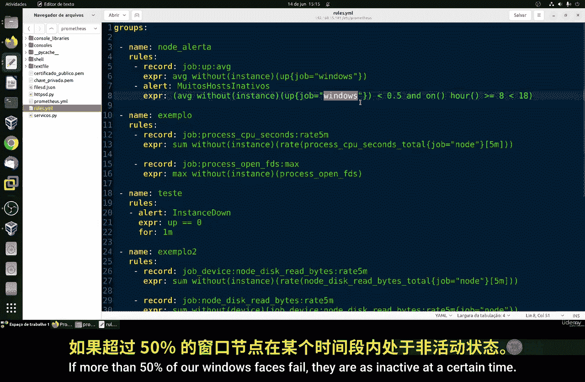

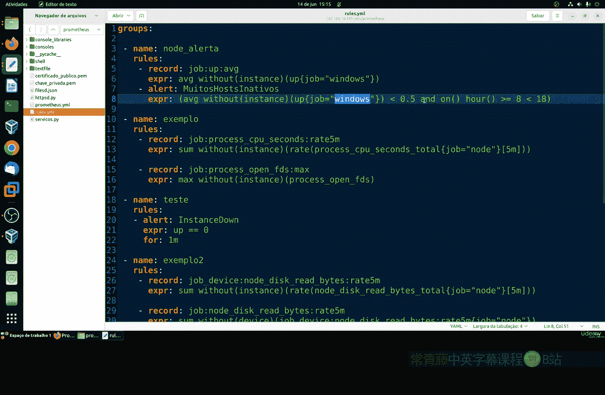

为了减少因短暂故障或重启导致的误报，我们可以为这个规则添加 `for` 条件。具体设置如下：

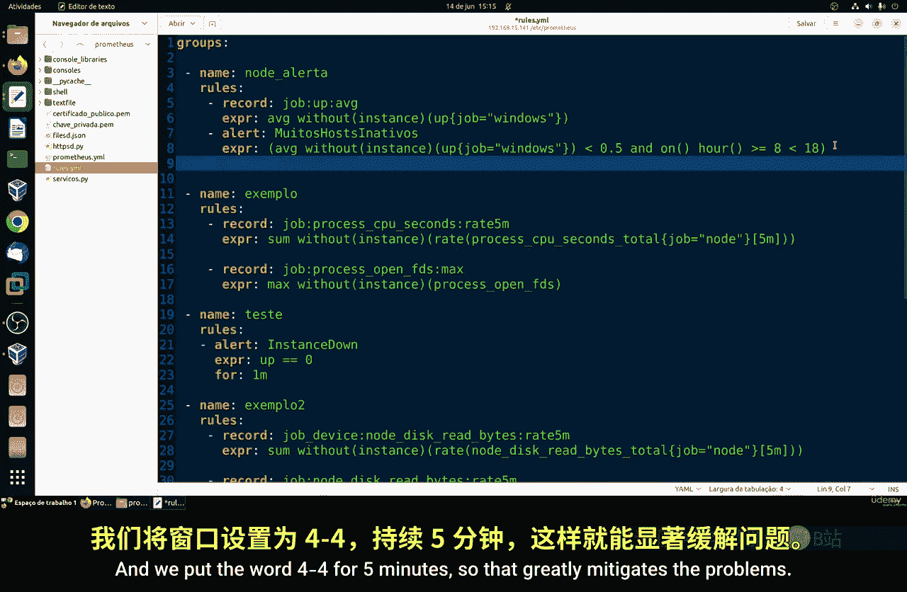

```yaml
expr: up{job="windows"} == 0 > 50%
for: 5m
```

上述配置意味着，只有当“超过50%的Windows服务器宕机”这个条件持续满足**5分钟**时，才会真正触发警报。这极大地缓解了因瞬时问题（例如快速重启一台机器）而触发警报的情况。

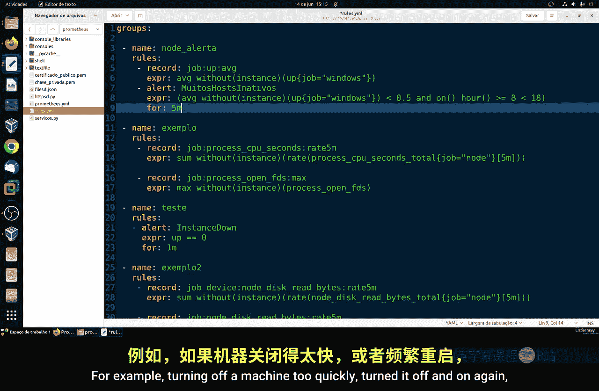

### 设定合理的阈值与时长

这允许我们进行更有意识的监控。关键在于选择恰当的阈值和持续时间，使其能准确反映问题的严重性。

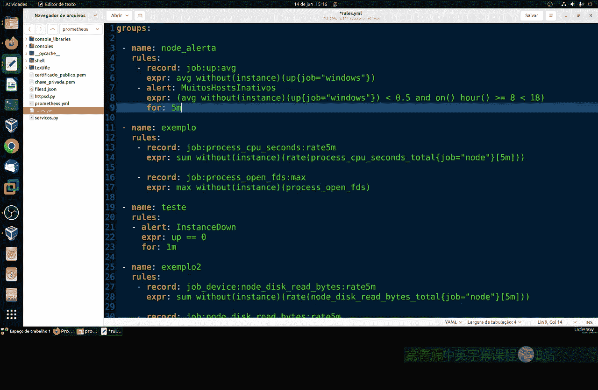

对于某些类型的警报，可能看起来非常严重但实际上并非如此；反之，有些真正严重的问题可能看起来并不紧急。因此，你需要根据实际情况来调整和确定这些参数。


对于更敏感的核心服务器设备，你可以缩短这个持续时间（例如设为 `2m` 或 `1m`）。然而，大多数专业人士认为，**五分钟**是一个适用于通用监控的良好容忍时间窗口，既能有效捕捉真实问题，又不会产生过多误报。

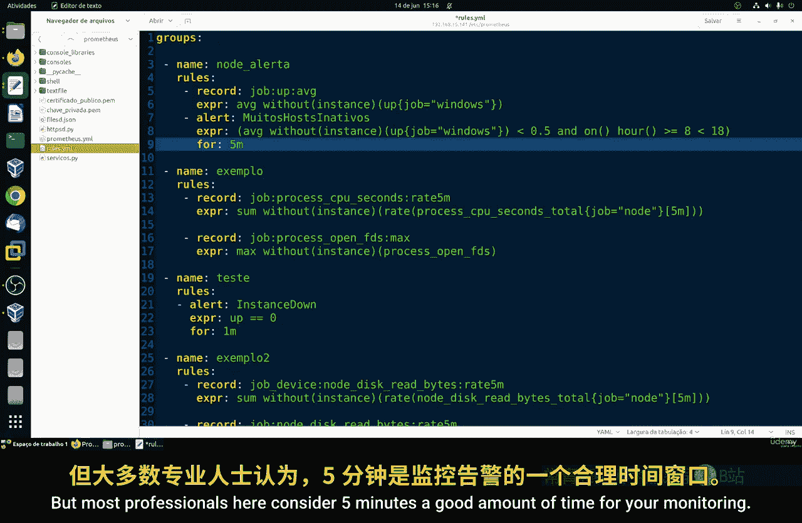

当然，正如前面所说，具体时长很大程度上取决于你的具体使用场景和环境敏感度。环境越敏感，对持续时间的设定就需要越精确。

### 总结

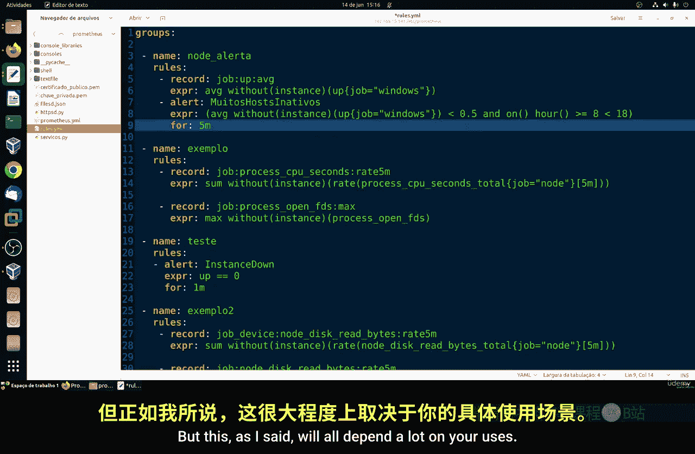

本节课中我们一起学习了如何优化警报规则以减少误报。核心方法是利用 **`for`** 字段为警报规则添加持续时间条件，确保问题持续存在一段时间后才触发通知。同时，需要根据监控目标的重要性，审慎地设定警报阈值和持续时间（通常5分钟是一个不错的起点）。通过这种方式，可以构建一个更可靠、更精准的监控系统。

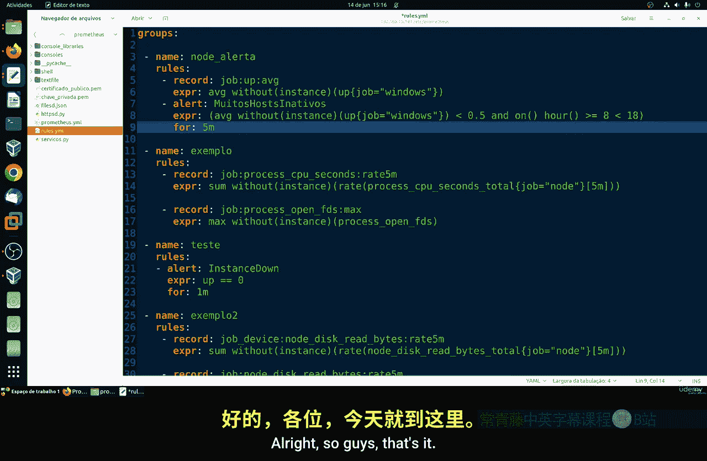

如果大家有任何疑问，可以在我们的课程中提出。

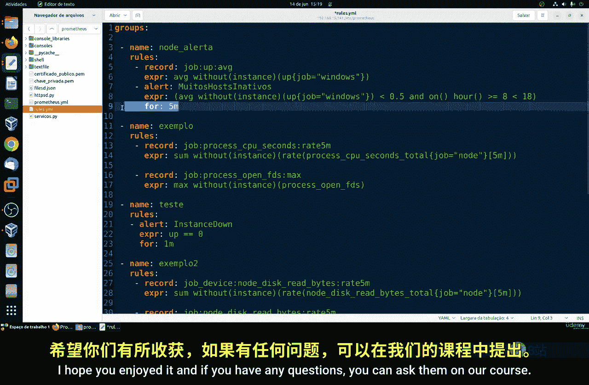


那么，本节课就到这里，下次再见。