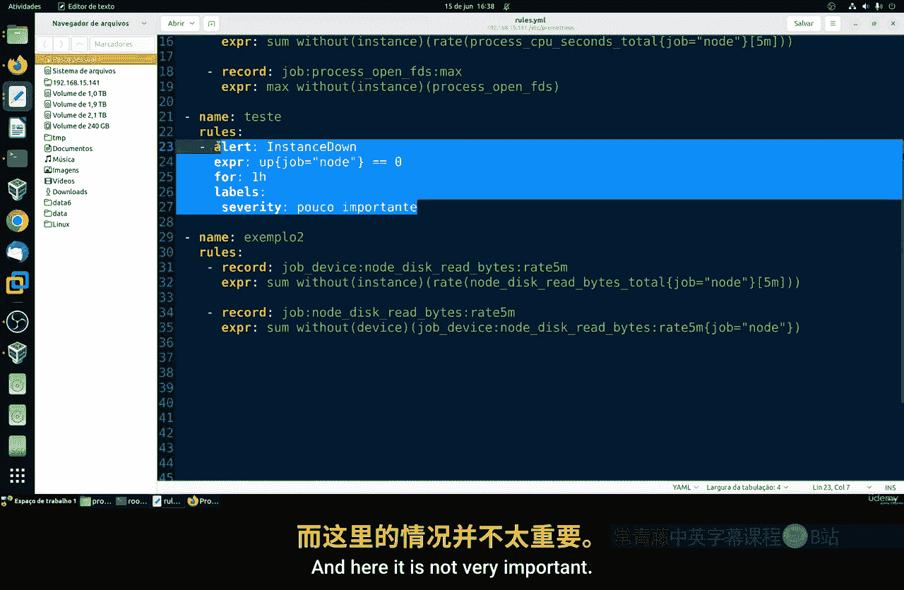
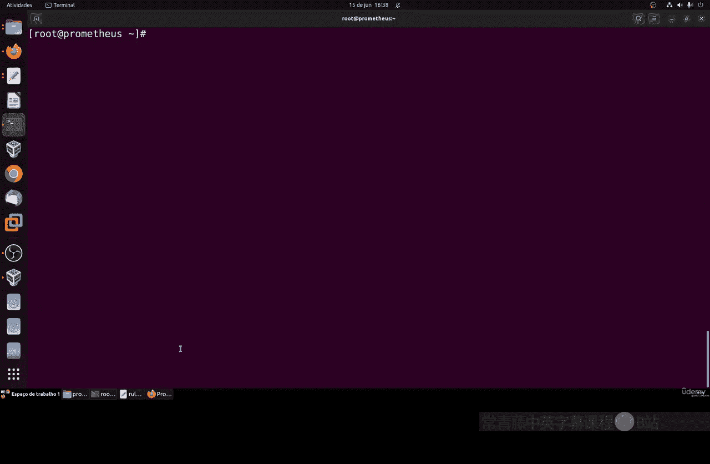
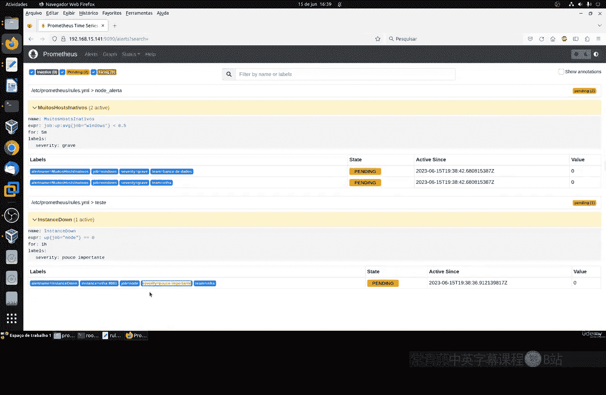
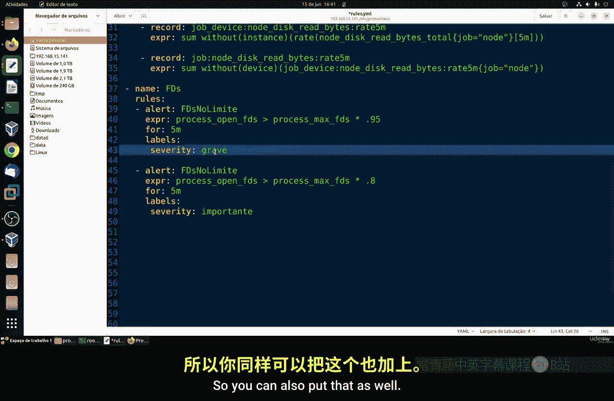
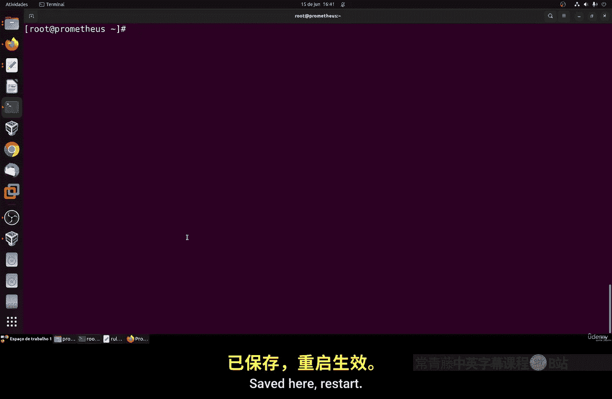
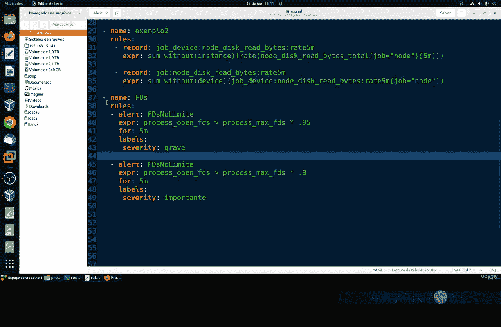
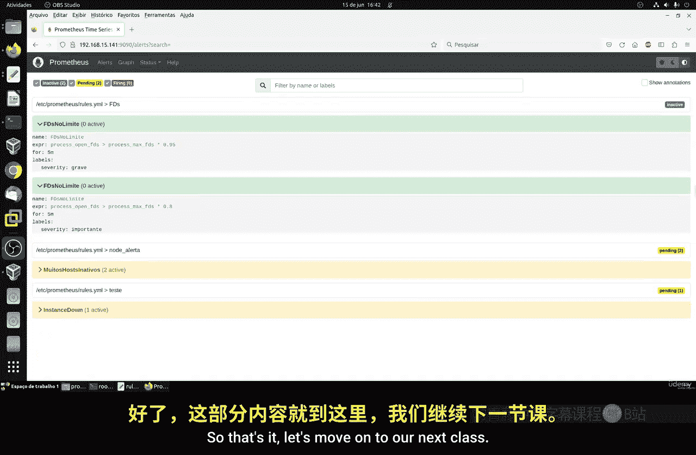

# 115：警报规则第三部分

在本节课中，我们将要学习如何在Prometheus警报规则中使用标签（Labels），特别是用于定义警报的严重性级别。这将帮助我们区分不同紧急程度的警报，并决定是否需要立即通知专业人员进行处理。

上一节我们介绍了警报规则的基本结构，本节中我们来看看如何通过标签来丰富警报的语义。

## 标签在警报规则中的使用

在记录规则中，我们很少使用标签，但在警报规则中，使用标签则非常普遍。最常见的用途之一是添加一个表示严重性级别的标签，例如 `severity`。这个标签用于指示一个警报是否需要紧急处理，或者只是一个需要留意的提示。

以下是定义警报严重性标签的核心概念：
```yaml
labels:
  severity: <严重性级别>
```

## 如何定义严重性级别

严重性级别的名称没有固定标准，完全由您根据警报的性质来定义。关键在于名称要直观，能够清晰反映问题的紧急程度。

例如：
*   一台普通机器的宕机可能并不紧急。
*   但一半数量的机器宕机，即使它们是普通机器，也可能需要紧急关注。
*   核心服务器的崩溃则无疑是严重问题。

因此，您可以将级别命名为 `critical`（严重）、`warning`（警告）、`info`（信息）等，只要符合您团队的运维规范即可。

让我们通过一个具体的例子来实践。我们将修改之前的一个警报规则，为其添加严重性标签。

## 实践：为警报添加严重性标签

我们将基于之前课程中创建的规则进行修改。假设我们有一个监控节点存活状态的警报。

原始规则可能类似这样（仅示意）：
```yaml
- alert: InstanceDown
  expr: up{job="node_exporter"} == 0
  for: 5m
```

现在，我们为其添加 `labels` 部分来定义严重性：



```yaml
- alert: InstanceDown
  expr: up{job="node_exporter"} == 0
  for: 5m
  labels:
    severity: unimportant
```



在这个例子中，我们将单台主机宕机的严重性标记为 `unimportant`（不重要），意味着这可能不需要立即呼叫专业人员处理，可以稍后安排修复。

配置完成后，需要重启Prometheus服务以使新规则生效：
```bash
sudo systemctl restart prometheus
```



重启后，您可以在Prometheus的Alerts页面查看警报状态。如果条件满足，您将看到该警报被触发，并且其标签中包含了 `severity: unimportant`。

## 通过多阈值实现精细告警

Prometheus本身不允许一条警报规则有多个阈值。但是，我们可以通过定义多条具有不同阈值和标签的规则来实现类似效果。这是一种非常实用的技巧。

例如，监控文件描述符使用率：
*   第一条规则：当使用率超过80%时触发，标记为 `severity: warning`。
*   第二条规则：当使用率超过95%时触发，标记为 `severity: critical`。

同时，您还可以为它们设置不同的 `for` 持续时间（例如，80%的规则持续1分钟就告警，95%的规则持续5分钟才告警），以避免因短暂波动产生误报。

配置示例如下：
```yaml
- alert: HighFDUsage
  expr: process_open_fds / process_max_fds > 0.80
  for: 1m
  labels:
    severity: warning

- alert: CriticalFDUsage
  expr: process_open_fds / process_max_fds > 0.95
  for: 5m
  labels:
    severity: critical
```





这样配置后，只有当使用率持续高企并突破更高阈值时，才会触发更严重的警报，从而更精准地要求人工介入。

## 配置注意事项

在编辑YAML格式的规则文件时，请务必注意格式的正确性：
1.  **缩进**：必须使用空格（通常是2个或4个），并且同一层级的元素要对齐。
2.  **避免直接复制粘贴**：从网页或文档复制代码时，可能会引入不可见的格式字符或错误的缩进，建议在专业的IDE（如VSCode）中编辑，它们通常有YAML语法高亮和格式校验功能。
3.  **重启生效**：每次修改规则文件后，都需要重启Prometheus服务。



一个格式错误就可能导致整个配置文件无法加载，Prometheus日志中会报错。养成检查Prometheus服务状态和日志的习惯是个好主意。

本节课中我们一起学习了如何为Prometheus警报规则添加标签，特别是用于区分警报严重性的 `severity` 标签。我们还探讨了如何通过定义多条规则来实现多阈值告警的策略。正确使用这些功能，可以帮助您的团队更高效地处理监控告警，将注意力集中在真正重要的问题上。



下一节课，我们将继续探索Prometheus警报管理的其他高级功能。