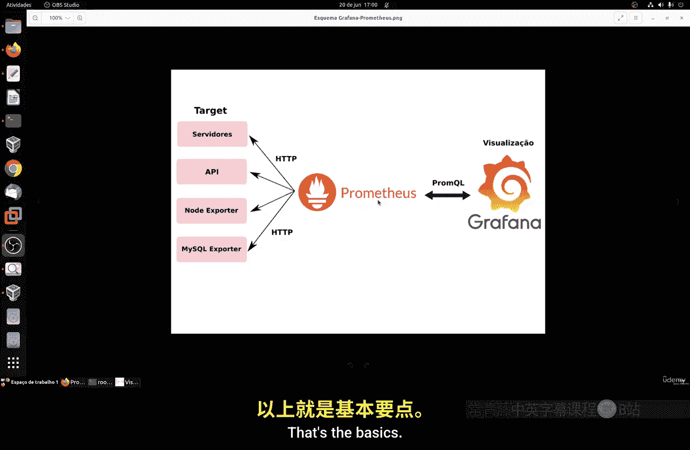
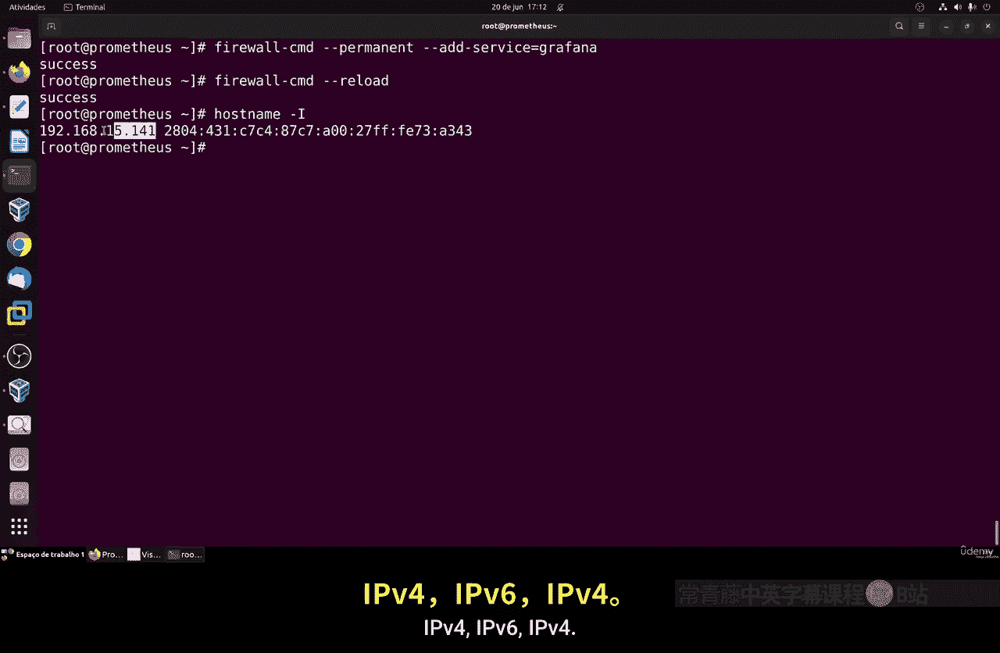
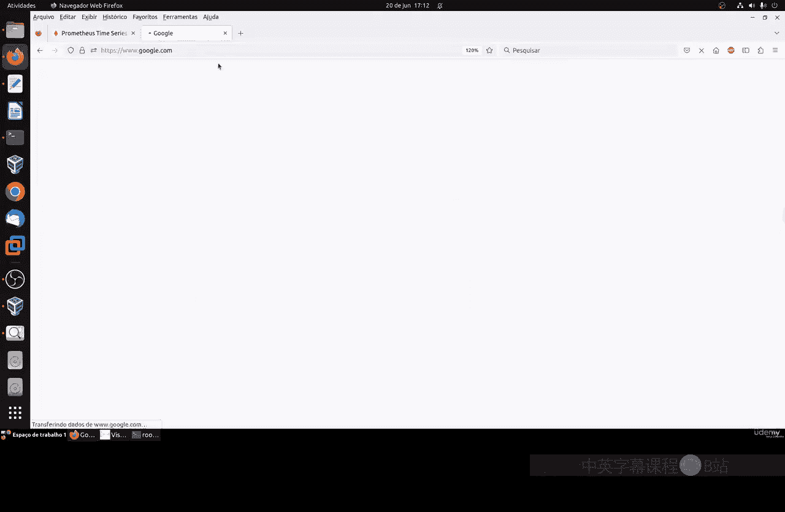
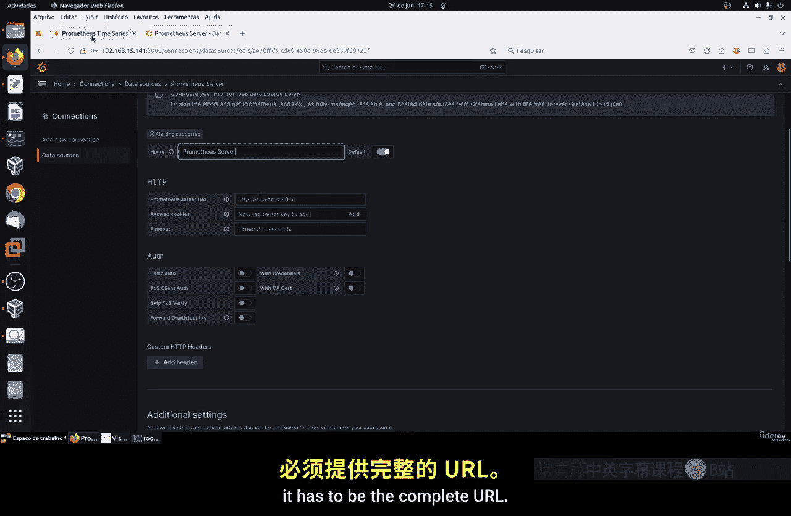
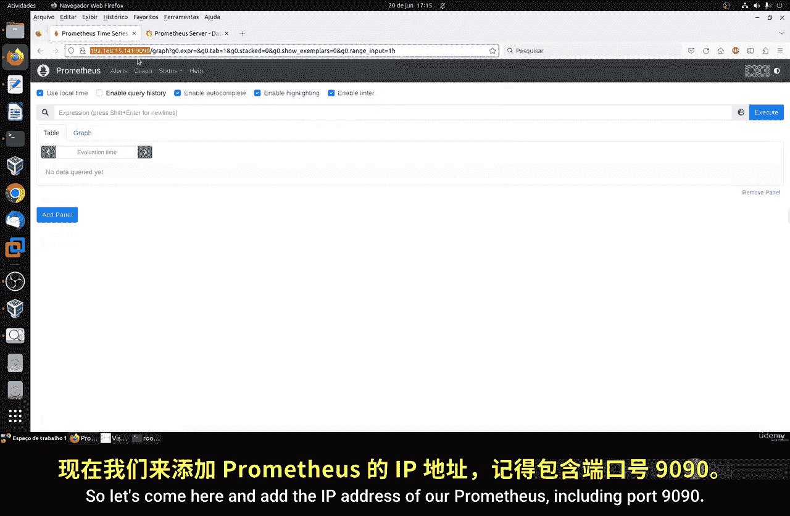
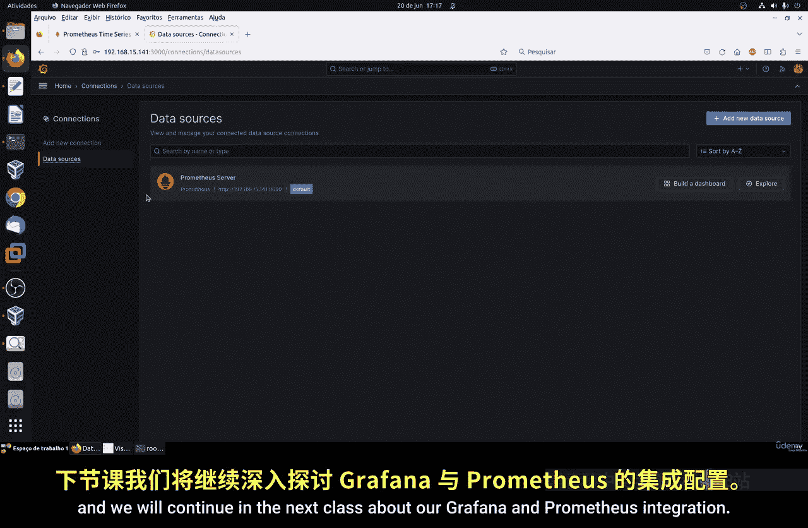

# 116：在Prometheus中使用Grafana 🚀

在本节课中，我们将学习如何在Linux系统上安装Grafana，并将其配置为Prometheus的数据源，以实现更强大的数据可视化和仪表盘功能。

## 概述

Prometheus是一个优秀的指标收集和监控系统，但在数据可视化方面功能较为基础。Grafana是一个功能强大的开源仪表盘和可视化工具，能够与包括Prometheus在内的多种数据源集成，创建丰富、直观的监控视图。本节教程将指导你完成Grafana的安装、基本配置以及与Prometheus的连接。

## 安装Grafana



上一节我们介绍了Prometheus的配置，本节中我们来看看如何安装Grafana。首先，我们需要在Linux系统上设置Grafana的软件仓库并进行安装。

以下是安装步骤：

1.  使用文本编辑器（如Vim或Nano）创建一个Grafana的仓库文件。
2.  将官方的Grafana仓库配置信息复制到该文件中。该文件包含了仓库名称、基础URL以及GPG密钥等信息，用于验证软件包的完整性。
3.  保存文件后，使用包管理器更新系统仓库列表，使其包含新添加的Grafana仓库。
4.  执行安装命令来安装Grafana及其所有依赖包。

对于基于Red Hat的系统（如CentOS、RHEL），可以使用`yum`或`dnf`包管理器。对于Ubuntu/Debian系统，可以使用`apt`。安装完成后，需要启动Grafana服务并设置为开机自启。

**代码示例（Red Hat系系统）:**
```bash
sudo dnf install -y grafana
sudo systemctl daemon-reload
sudo systemctl enable grafana-server
sudo systemctl start grafana-server
```

**代码示例（Debian/Ubuntu系统）:**
```bash
sudo apt-get install -y grafana
sudo systemctl daemon-reload
sudo systemctl enable grafana-server
sudo systemctl start grafana-server
```

安装后，首次启动服务可能需要一些时间来加载所有组件。

## 配置防火墙与访问

为了让Grafana的Web界面可以被访问，我们需要在防火墙中开放其默认端口（3000）。

以下是配置步骤：





1.  根据你的防火墙工具（如`firewalld`或`ufw`），添加规则以允许TCP端口3000的流量。
2.  重新加载防火墙配置使规则生效。
3.  在浏览器中访问Grafana，地址格式为`http://<你的服务器IP地址>:3000`。

首次登录时，默认的用户名和密码都是`admin`。系统会强制要求你修改初始密码，请务必设置一个强密码。

## 添加Prometheus数据源

Grafana本身不存储监控数据，它需要从数据源（如Prometheus）拉取数据来生成图表。现在，我们将把之前搭建的Prometheus服务器添加为Grafana的数据源。

以下是连接步骤：

1.  登录Grafana后，在侧边栏找到“配置”（齿轮图标）下的“数据源”。
2.  点击“添加数据源”，在列表中选择“Prometheus”。
3.  在配置页面中，为数据源设置一个名称（例如“Prometheus-Server”）。
4.  最关键的一步是填写Prometheus服务器的URL。这通常是Prometheus服务的IP地址和端口，格式为`http://<prometheus_ip>:9090`。请确保Grafana服务器能够通过网络访问到这个地址。
5.  点击“保存并测试”。如果配置正确，Grafana会显示“数据源正在工作”的提示，表示连接成功。






至此，Grafana已经成功连接到Prometheus，可以开始使用Prometheus收集的指标数据来创建仪表盘了。

## 探索与下一步

连接建立后，你就可以在Grafana中创建新的仪表盘，或者导入社区预制的仪表盘模板。在“仪表盘”->“导入”页面，你可以通过输入仪表盘ID或上传JSON文件来导入丰富的模板，快速获得监控视图。



本节课中我们一起学习了Grafana的安装、基本服务配置、防火墙设置，以及如何将其与Prometheus监控系统连接起来作为数据源。你已经为构建强大的可视化监控平台打下了基础。在接下来的课程中，我们将深入探讨如何利用Grafana创建和定制个性化的监控仪表盘。