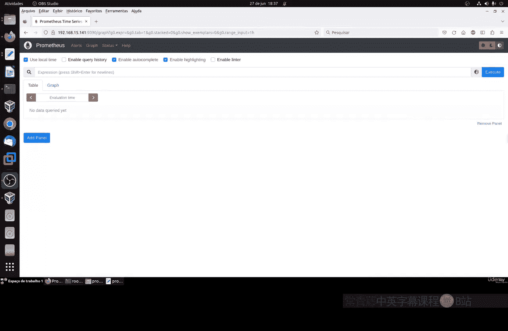
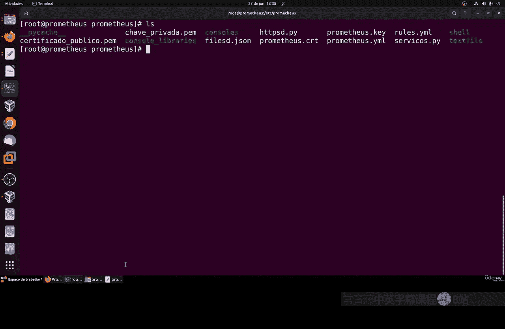
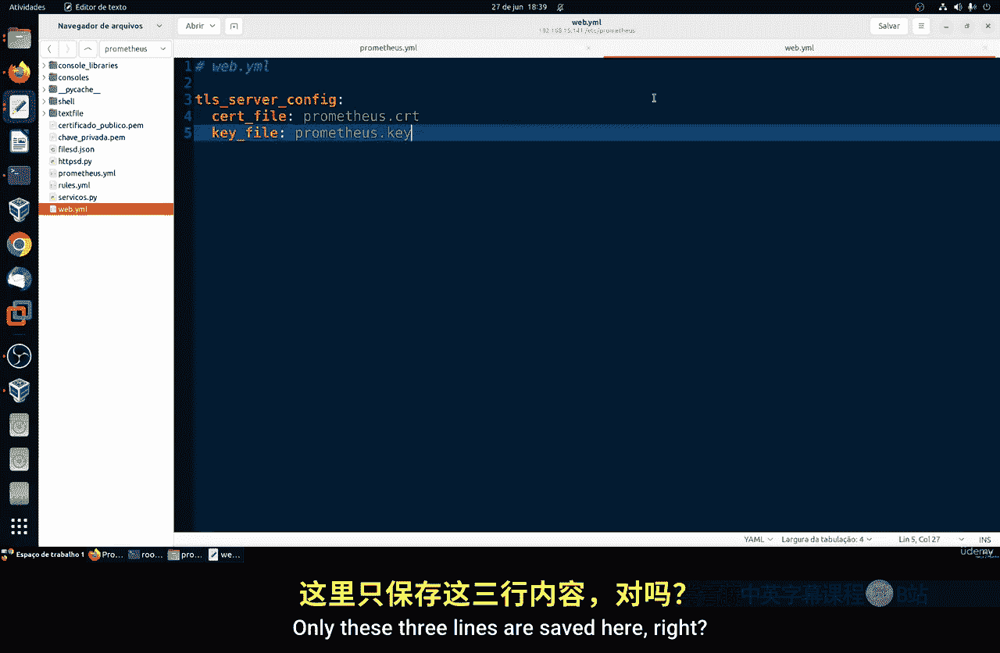
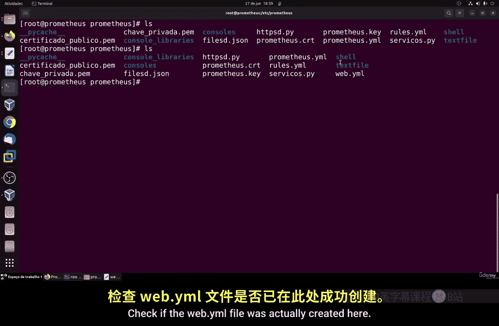
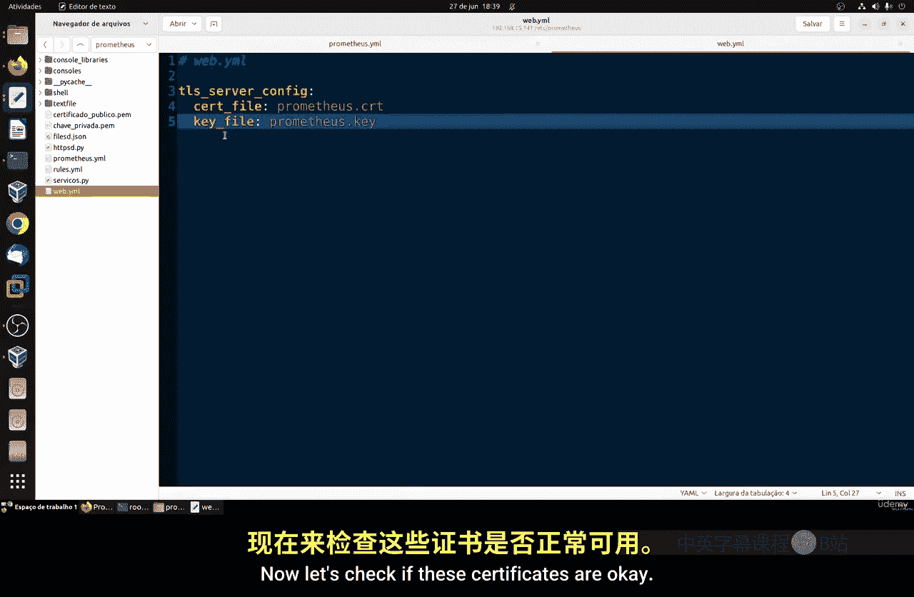
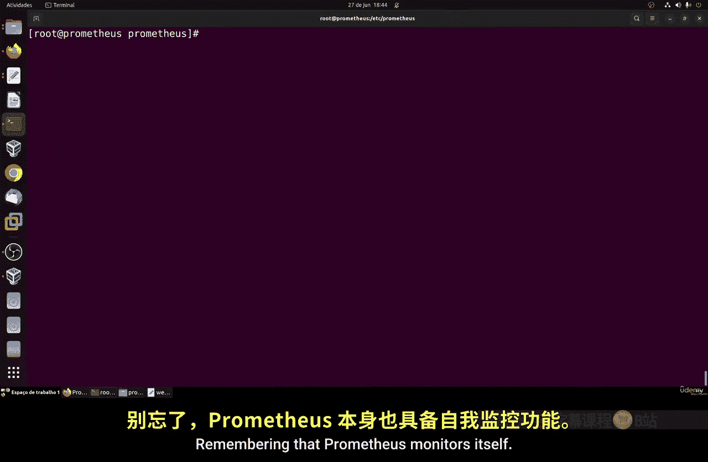
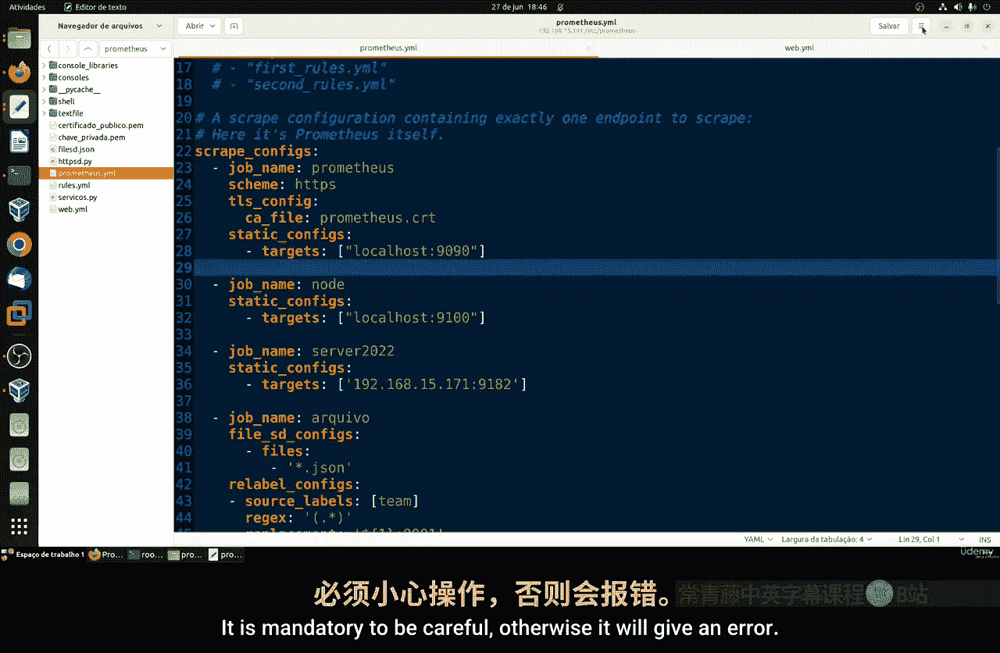
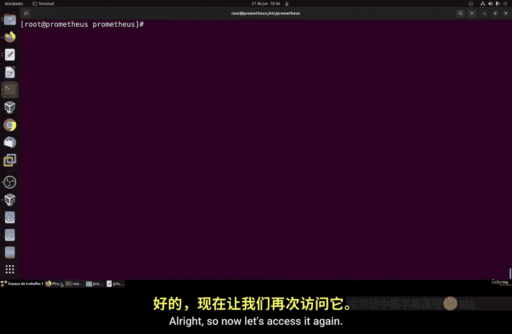
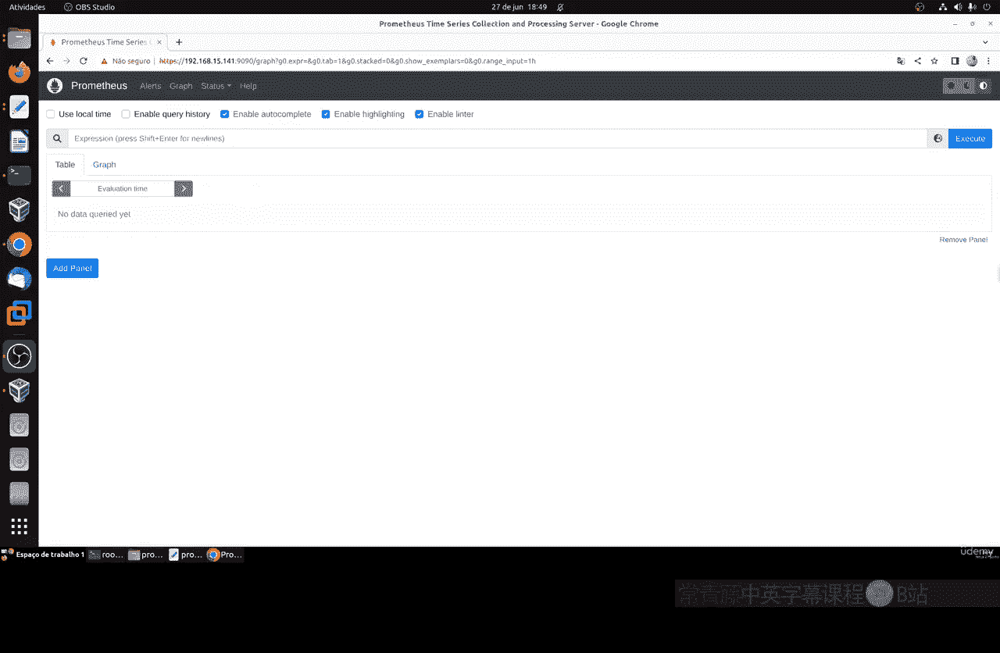

# 118：Prometheus安全性 🔒

在本节课中，我们将学习如何为Prometheus监控系统配置TLS/SSL加密，以保护其Web界面的通信安全。我们将从生成自签名证书开始，逐步完成配置文件的修改和权限设置，最终实现通过HTTPS安全地访问Prometheus。

---

## 概述

之前我们已经对Prometheus进行了许多配置，但忽略了安全性。目前，Prometheus的Web面板没有任何加密措施，所有传输的信息都可能被截获。本节我们将激活TLS/SSL加密，这是网络通信中保护客户端与服务器之间数据传输的常用方法。

我们将使用OpenSSL命令生成自签名证书，并修改Prometheus的配置文件以启用HTTPS。



---

## 生成自签名证书

首先，我们需要进入Prometheus的工作目录并生成证书文件。

以下是具体步骤：

1.  切换到Prometheus目录并确认当前路径。
    ```bash
    cd /path/to/prometheus
    pwd
    ```

2.  使用OpenSSL命令生成证书和密钥。该命令会创建一个有效期为365天、密钥长度为2048位的自签名证书。
    ```bash
    openssl req -new -newkey rsa:2048 -days 365 -nodes -x509 \
        -keyout prometheus-key.pem -out prometheus-cert.pem \
        -subj "/CN=localhost"
    ```
    **说明**：`-subj "/CN=localhost"` 指定了证书的通用名称（Common Name）。你可以将其替换为你Prometheus服务器的实际主机名或网络地址。



执行上述命令后，会在当前目录下生成两个文件：`prometheus-key.pem`（私钥）和 `prometheus-cert.pem`（证书）。

---

## 创建Web配置文件





接下来，我们需要创建一个YAML配置文件来告诉Prometheus使用我们刚刚生成的证书。

1.  创建一个名为 `web.yml` 的新文件。
2.  在该文件中添加以下三行配置，分别指定TLS设置、私钥文件和证书文件的路径。
    ```yaml
    tls_server_config:
      cert_file: prometheus-cert.pem
      key_file: prometheus-key.pem
    ```
3.  保存并退出编辑器。



---

## 验证证书与配置

在继续之前，最好先验证证书文件是否有效，以及Web配置文件格式是否正确。

我们可以使用Prometheus自带的工具来检查 `web.yml` 文件：
```bash
promtool check web-config web.yml
```
如果输出显示“SUCCESS”，则说明配置文件格式正确，证书也适用于Prometheus。

---

## 修改Systemd服务单元

为了让Prometheus在启动时加载我们的Web配置，需要修改其Systemd服务单元文件。

1.  编辑Prometheus的service文件（通常位于 `/etc/systemd/system/` 或 `/lib/systemd/system/` 目录下）。
    ```bash
    sudo vim /etc/systemd/system/prometheus.service
    ```

2.  在 `ExecStart` 命令的末尾，添加 `--web.config.file` 参数，指向我们创建的 `web.yml` 文件的**完整路径**。
    ```
    ExecStart=/usr/local/bin/prometheus \
        --config.file=/etc/prometheus/prometheus.yml \
        --storage.tsdb.path=/var/lib/prometheus/ \
        --web.console.templates=/etc/prometheus/consoles \
        --web.console.libraries=/etc/prometheus/console_libraries \
        --web.config.file=/etc/prometheus/web.yml
    ```
    **重要提示**：请确保路径正确，并且该行命令保持连贯性（如上例所示，使用反斜杠 `\` 进行换行）。

---

## 设置文件权限

由于证书文件是以root用户身份创建的，而Prometheus服务通常以 `prometheus` 用户身份运行，因此需要更改文件的所有权和权限。

运行以下命令，将证书、密钥和Web配置文件的属主改为 `prometheus` 用户和组：
```bash
sudo chown prometheus:prometheus prometheus-key.pem prometheus-cert.pem web.yml
```
更改后，可以使用 `ls -l` 命令确认权限已正确更新。

---

## 重启服务并测试

完成所有配置后，需要重新加载Systemd配置并重启Prometheus服务。

1.  重新加载Systemd配置，使服务文件的更改生效。
    ```bash
    sudo systemctl daemon-reload
    ```



2.  重启Prometheus服务。
    ```bash
    sudo systemctl restart prometheus
    ```

3.  检查服务状态，确认其正在运行。
    ```bash
    sudo systemctl status prometheus
    ```

现在，可以通过HTTPS访问Prometheus的Web界面了。在浏览器中访问：
```
https://localhost:9090
```
或使用服务器的IP地址：
```
https://192.168.1.100:9090
```
由于使用的是自签名证书，浏览器会显示“不安全”警告，这是正常现象。你可以选择“高级”->“继续前往”来访问。此时，通信内容已经过TLS加密。

---

## 配置Prometheus自监控

上一节我们介绍了如何为Web界面启用HTTPS，本节中我们来看看如何让Prometheus在加密环境下监控自身。

Prometheus默认会监控自己（称为“自监控”），但之前的监控配置是基于HTTP的。现在需要更新监控任务，使其通过HTTPS抓取指标。

1.  编辑Prometheus的主配置文件 `prometheus.yml`。
    ```bash
    sudo vim /etc/prometheus/prometheus.yml
    ```



2.  找到监控自身的job（通常名为 `prometheus`），修改其配置。将 `scheme` 改为 `https`，并通过 `tls_config` 部分指定证书（注意，这里通常使用 `ca_file` 来验证服务器证书，对于自签名证书，可以暂时禁用验证，但在生产环境中不推荐）。
    ```yaml
    - job_name: 'prometheus'
      scheme: https
      tls_config:
        ca_file: /etc/prometheus/prometheus-cert.pem
        insecure_skip_verify: true  # 跳过证书验证（仅用于测试）
      static_configs:
      - targets: ['localhost:9090']
    ```
    **重要提示**：YAML格式对缩进非常敏感。请确保 `tls_config` 等部分的缩进正确，否则会导致配置错误。



3.  保存配置文件后，再次重启Prometheus服务以使更改生效。
    ```bash
    sudo systemctl restart prometheus
    ```

4.  访问Prometheus的Web界面（`https://localhost:9090/targets`），检查“prometheus”这个job的状态是否为“UP”，这表示它已能通过HTTPS成功抓取自身的指标。

---

## 总结

本节课中我们一起学习了如何提升Prometheus的安全性。我们从生成自签名的TLS证书开始，创建了Web配置文件，并修改了Systemd服务单元以启用HTTPS。随后，我们设置了正确的文件权限，并重启了服务。最后，我们还更新了Prometheus的自监控配置，使其适应新的加密环境。



现在，你的Prometheus Web界面通信已经受到TLS加密保护，数据传输的安全性得到了显著提升。记住，自签名证书适用于测试和学习环境，在生产环境中应考虑使用由受信任的证书颁发机构（CA）签发的证书。