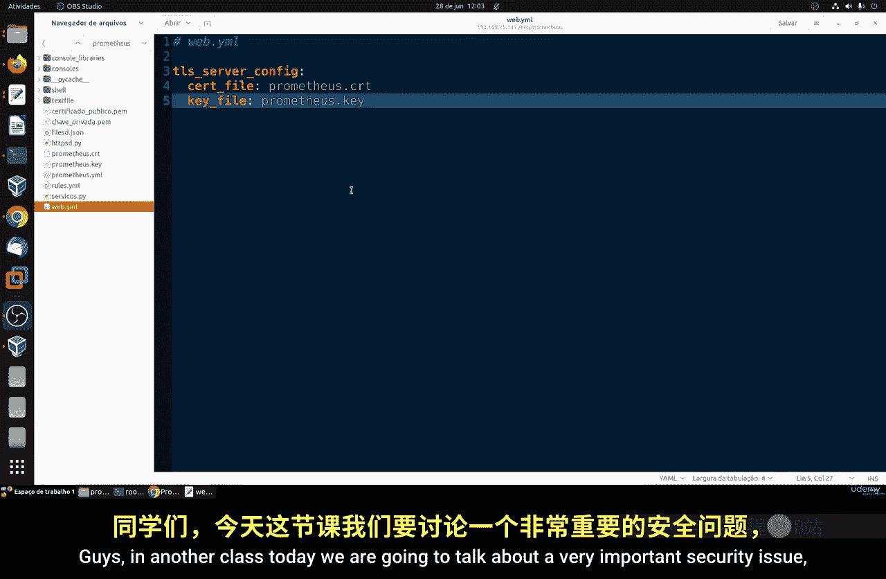
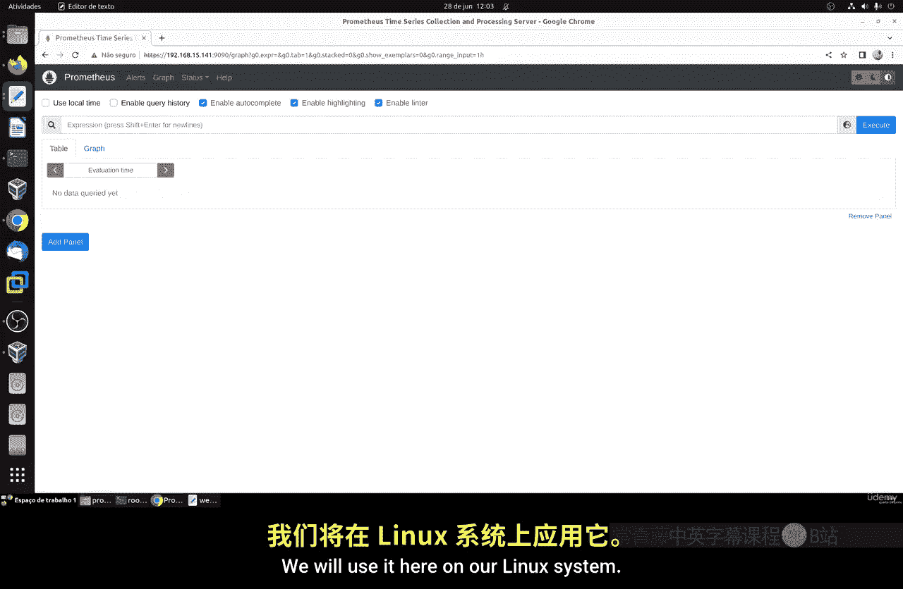
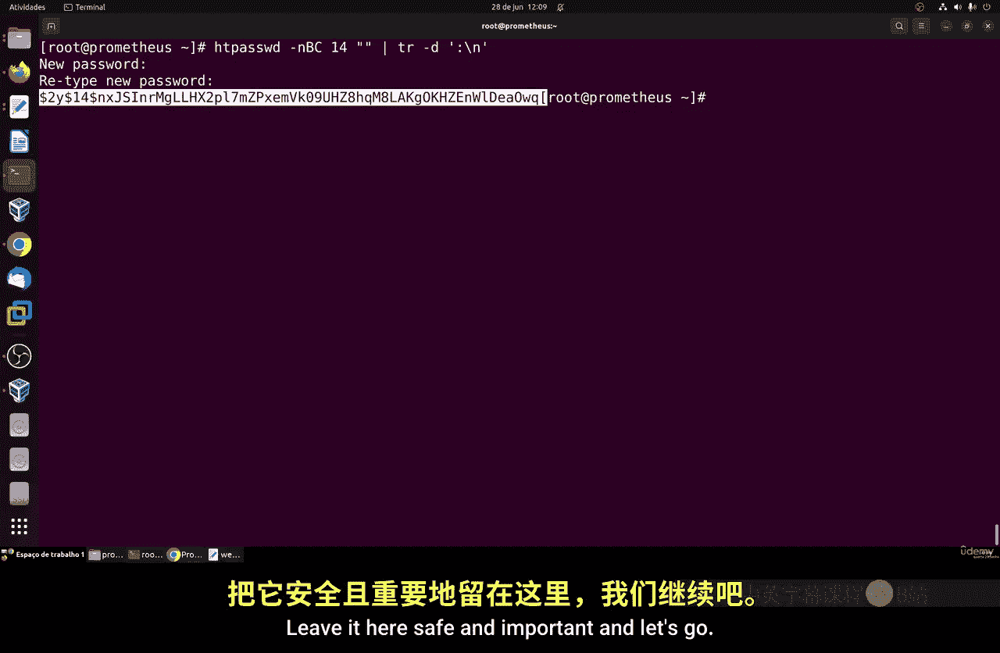
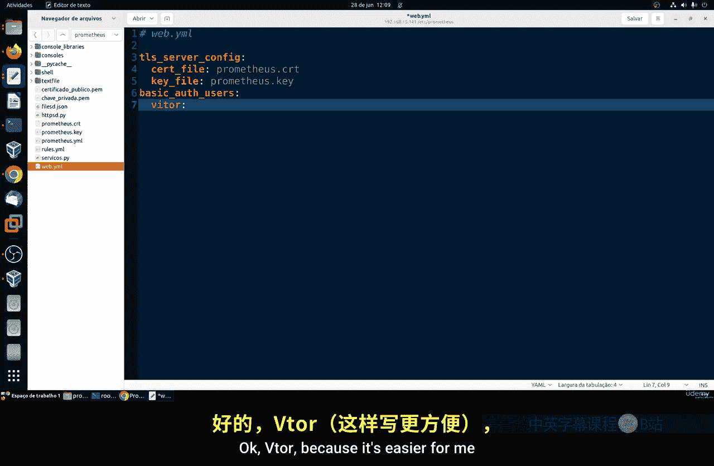
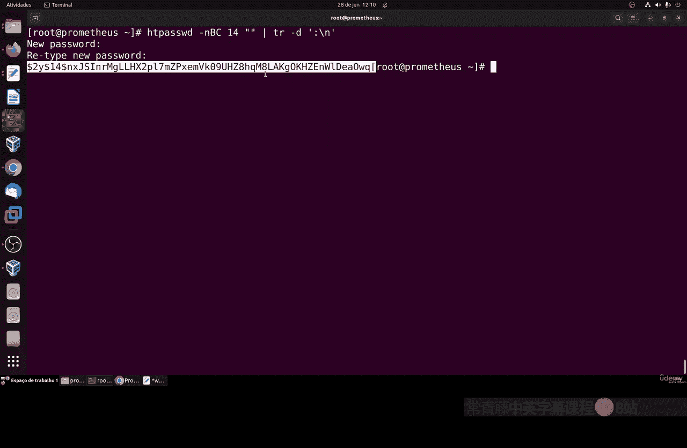
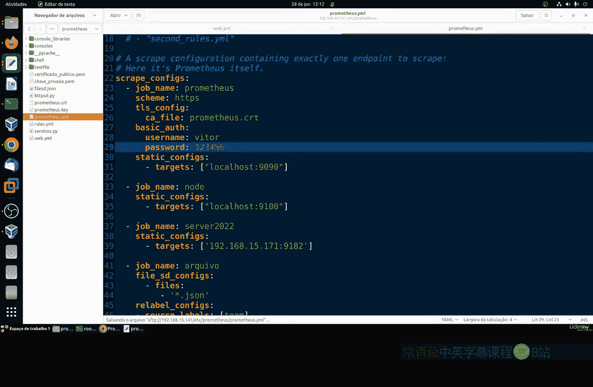
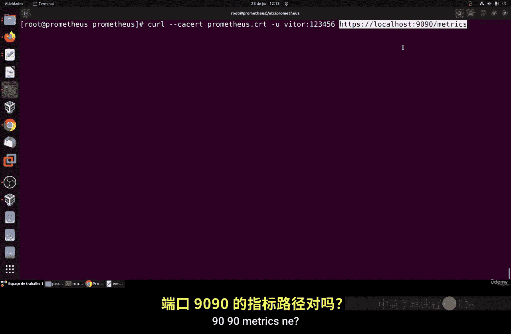
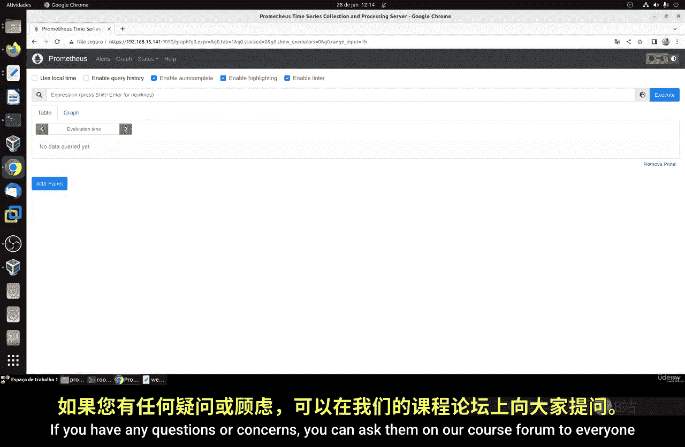

# 119：创建基本认证 🔐



在本节课中，我们将学习如何为Prometheus监控系统配置基本认证。这涉及到创建加密的用户名和密码，以增强服务的安全性。我们将使用Apache工具来生成密码哈希，并将其集成到Prometheus的配置中。



上一节我们介绍了如何配置TLS加密通信，本节中我们来看看如何在此基础上增加用户名和密码认证。

## 安装必要工具

首先，我们需要安装一个用于创建和管理基本认证密码的工具。这个工具来自Apache项目，名为`apache2-utils`（在Ubuntu/Debian系统上）或`httpd-tools`（在Red Hat/Fedora系统上）。

以下是安装命令：

*   **对于Ubuntu/Debian系统：**
    ```bash
    sudo apt install apache2-utils
    ```
*   **对于Red Hat/Fedora/CentOS系统：**
    ```bash
    sudo dnf install httpd-tools
    ```

这个工具包通常不会默认安装。如果你已经安装了Apache网页服务器，它可能已经存在。安装完成后，我们就可以用它来创建加密的密码。

## 创建加密密码

现在，我们来创建一个安全的密码。密码应至少包含8个字符，并混合使用大小写字母和数字，以增强安全性。

我们将使用`htpasswd`命令来生成密码的哈希值。`-B`参数指定使用bcrypt加密算法，`-C`参数设置计算成本因子（数值越高，加密强度越大，但也更消耗CPU资源）。目前推荐的最小值是12。

运行以下命令（请将 `your_username` 替换为你想要的用户名）：
```bash
sudo htpasswd -B -C 12 /etc/prometheus/.htpasswd your_username
```
执行命令后，系统会提示你输入并确认密码。输入时请仔细核对。

命令成功执行后，会在指定的文件（如`/etc/prometheus/.htpasswd`）中创建一行记录，包含用户名和其对应的密码哈希值。请妥善保存这个哈希值。

## 配置Prometheus认证



接下来，我们需要修改Prometheus的配置文件，使其启用基本认证并识别我们创建的用户。

首先，编辑Prometheus的Web配置文件（例如 `web-config.yml`）。在之前配置TLS的部分附近，添加`basic_auth_users`字段来定义用户。





配置文件内容示例如下：
```yaml
tls_server_config:
  cert_file: /path/to/cert.pem
  key_file: /path/to/key.pem
# 添加基本认证配置
basic_auth_users:
  your_username: $2y$12$YourGeneratedPasswordHashHere...
```
请将 `your_username` 和 `$2y$12$YourGeneratedPasswordHashHere...` 替换为之前步骤中实际创建的用户名和完整的密码哈希字符串。

**重要提示**：这个配置文件包含了密码的哈希值，必须将其权限设置为仅允许Prometheus进程用户读取，以防止信息泄露。

然后，需要修改主Prometheus配置文件（`prometheus.yml`），在`scrape_configs`中访问自身或其他需要认证的目标时，提供认证凭据。

配置示例如下：
```yaml
scrape_configs:
  - job_name: 'prometheus'
    static_configs:
      - targets: ['localhost:9090']
    basic_auth:
      username: 'your_username'
      password: 'your_plaintext_password'
```
请将 `your_username` 和 `your_plaintext_password` 替换为实际的用户名和明文密码。注意，这里存放的是明文密码，因此该配置文件同样需要严格的权限控制。

## 重启服务与测试



配置完成后，需要重启Prometheus服务以使更改生效。

使用以下命令重启：
```bash
sudo systemctl restart prometheus
```
使用以下命令检查服务状态，确认其运行正常：
```bash
sudo systemctl status prometheus
```

现在，我们可以测试认证是否生效。使用`curl`命令尝试访问Prometheus指标端点。



测试命令如下：
```bash
curl -u your_username:your_password https://localhost:9090/metrics
```
请替换其中的用户名和密码。如果配置正确，命令将返回Prometheus的指标数据。

你也可以在浏览器中访问 `https://你的服务器地址:9090`。浏览器会弹出一个登录窗口，输入用户名和密码后即可成功访问。请记得在测试前清除浏览器缓存。

## 安全注意事项

本节课我们实现的基本认证是安全的基础措施，但需要注意：
1.  使用的密码必须足够强壮。
2.  包含密码哈希或明文的配置文件必须严格限制访问权限。
3.  这只是一个基础安全层。在生产环境中，应考虑结合网络防火墙、VPN、反向代理等更多安全措施。
4.  根据Prometheus官方文档，其目前主要支持这种基础认证方式。



本节课中我们一起学习了如何为Prometheus配置基本认证。我们安装了`htpasswd`工具来创建加密密码，修改了Prometheus的配置文件以启用认证，最后通过重启服务和使用`curl`命令测试验证了配置的成功。这为你的监控服务增加了一层重要的安全保护。