# 120：使用Prometheus与Grafana监控PostgreSQL

## 概述

在本节课中，我们将学习如何使用Prometheus监控系统与Grafana可视化工具来监控PostgreSQL数据库。我们将从配置PostgreSQL导出器开始，将其连接到Prometheus，并最终在Grafana中创建仪表盘。本教程假设您已经安装并运行了Prometheus和PostgreSQL。


## 配置PostgreSQL导出器

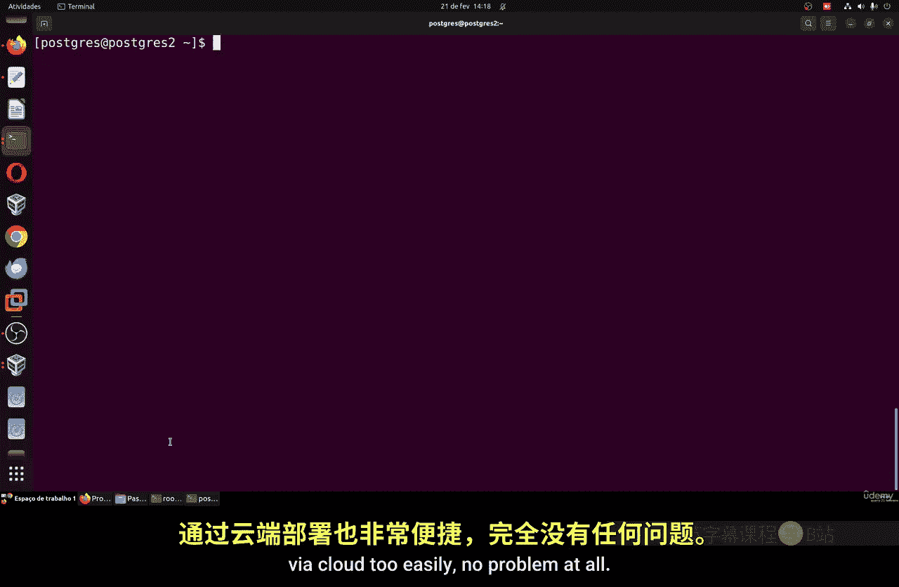

上一节我们介绍了课程目标，本节中我们来看看如何配置PostgreSQL导出器以收集数据库指标。

首先，我们需要在运行Prometheus的服务器上设置PostgreSQL导出器。这个导出器负责从PostgreSQL数据库收集指标，并通过HTTP端点暴露给Prometheus。

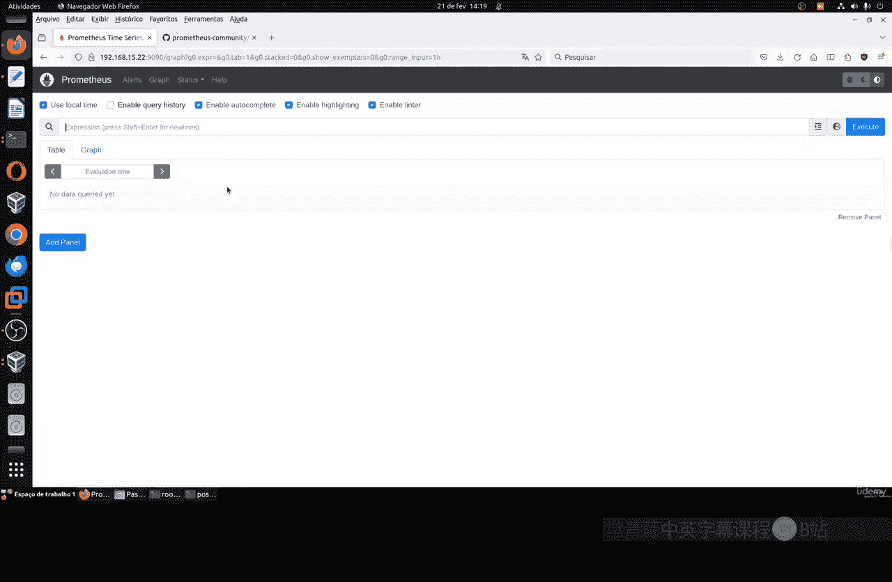


以下是配置步骤：

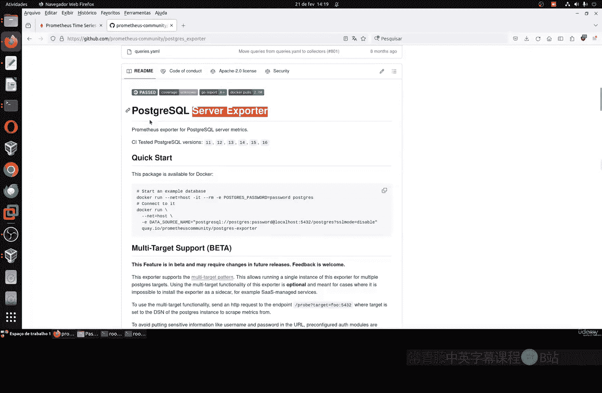

1.  **创建专用目录和用户**：为导出器创建一个目录和一个专用系统用户，以提高安全性。
    ```bash
    mkdir /opt/postgres_exporter
    useradd postgres_exporter
    chown postgres_exporter:postgres_exporter /opt/postgres_exporter
    chmod 706 /opt/postgres_exporter
    cd /opt/postgres_exporter
    ```

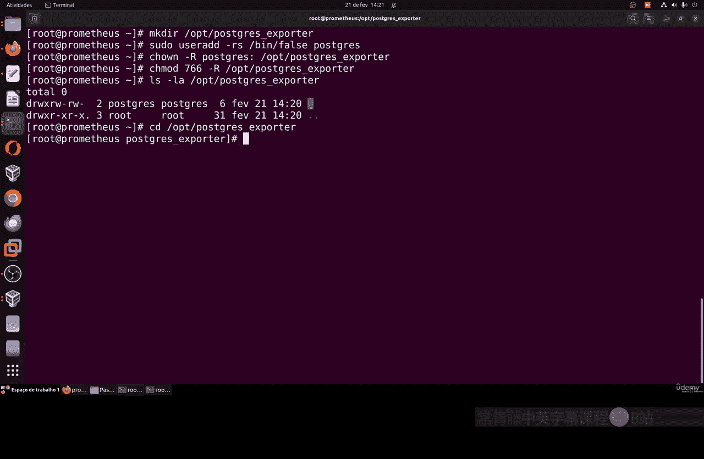

2.  **下载并安装导出器二进制文件**：从GitHub下载PostgreSQL导出器的预编译二进制文件。
    ```bash
    wget https://github.com/prometheus-community/postgres_exporter/releases/download/v0.10.0/postgres_exporter-0.10.0.linux-amd64.tar.gz
    tar -xzf postgres_exporter-0.10.0.linux-amd64.tar.gz
    cp postgres_exporter-0.10.0.linux-amd64/postgres_exporter /usr/local/bin/
    ```

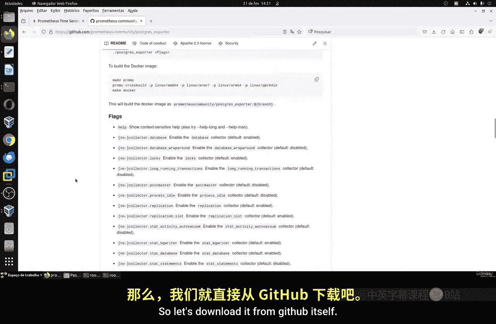

3.  **配置数据库连接**：创建一个环境变量文件，用于存储连接到PostgreSQL数据库所需的凭证。
    ```bash
    cat << EOF > /opt/postgres_exporter/.env
    DATA_SOURCE_NAME="postgresql://zbx_monitor:123456@<你的PostgreSQL服务器IP>:5432/postgres?sslmode=disable"
    EOF
    ```
    请将 `<你的PostgreSQL服务器IP>` 替换为实际的数据库服务器地址。用户 `zbx_monitor` 和密码 `123456` 是下一步创建的。

4.  **在PostgreSQL上创建监控用户**：在PostgreSQL数据库服务器上，创建一个专用于监控的用户并授予必要权限。
    ```sql
    -- 在PostgreSQL中执行
    CREATE USER zbx_monitor WITH PASSWORD '123456';
    GRANT pg_monitor TO zbx_monitor;
    ```

5.  **创建Systemd服务单元文件**：创建一个Systemd服务文件，以便将导出器作为守护进程运行和管理。
    ```bash
    cat << EOF > /etc/systemd/system/postgres_exporter.service
    [Unit]
    Description=Prometheus PostgreSQL Exporter
    After=network.target

    [Service]
    User=postgres_exporter
    EnvironmentFile=/opt/postgres_exporter/.env
    ExecStart=/usr/local/bin/postgres_exporter --web.listen-address=:9187
    Restart=always

    [Install]
    WantedBy=multi-user.target
    EOF
    ```

6.  **启动并启用服务**：重新加载Systemd配置，启动服务，并设置为开机自启。
    ```bash
    systemctl daemon-reload
    systemctl enable postgres_exporter
    systemctl start postgres_exporter
    systemctl status postgres_exporter # 检查状态
    ```

现在，PostgreSQL导出器应该正在运行，并在 `http://<Prometheus服务器IP>:9187/metrics` 上提供指标。您可以通过浏览器访问该地址来验证。

## 配置Prometheus抓取目标

现在PostgreSQL导出器已就绪，我们需要配置Prometheus去抓取它的指标。

以下是配置步骤：

1.  **编辑Prometheus配置文件**：找到并编辑Prometheus的主配置文件 `prometheus.yml`。
    ```bash
    locate prometheus.yml # 通常位于 /etc/prometheus/prometheus.yml
    vim /etc/prometheus/prometheus.yml
    ```

2.  **添加新的作业（Job）**：在 `scrape_configs:` 部分下，添加一个新的抓取作业，指向PostgreSQL导出器。
    ```yaml
    scrape_configs:
      - job_name: 'postgres'
        static_configs:
          - targets: ['localhost:9187'] # 如果导出器与Prometheus在同一服务器
        scrape_interval: 15s
    ```
    如果导出器运行在另一台服务器，请将 `localhost` 替换为其IP地址。

3.  **重启Prometheus服务**：保存配置文件后，重启Prometheus服务以使更改生效。
    ```bash
    systemctl restart prometheus
    ```

4.  **验证目标状态**：在Prometheus的Web界面（默认 `http://<Prometheus服务器IP>:9090`）中，导航到 **Status -> Targets**。您应该能看到名为 `postgres` 的目标状态为 **UP**。

至此，Prometheus已经开始从PostgreSQL数据库收集指标。您可以在Prometheus的表达式浏览器中搜索以 `pg_` 开头的指标进行验证。

## 安装并配置Grafana

虽然Prometheus可以收集和查询指标，但Grafana能提供更强大、美观的可视化仪表盘。

以下是安装和初步配置Grafana的步骤：


1.  **安装Grafana**：根据您的Linux发行版，使用包管理器安装Grafana。
    ```bash
    # 对于RHEL/CentOS/Fedora
    sudo dnf install grafana

    # 对于Ubuntu/Debian
    sudo apt-get install -y grafana
    ```

2.  **启动并启用Grafana服务**：
    ```bash
    systemctl enable grafana-server
    systemctl start grafana-server
    ```

3.  **访问Grafana并登录**：打开浏览器，访问 `http://<Grafana服务器IP>:3000`。默认用户名和密码都是 `admin`。首次登录后会要求更改密码。

4.  **添加Prometheus数据源**：
    *   在Grafana侧边栏，点击 **Configuration（齿轮图标） -> Data Sources**。
    *   点击 **Add data source**。
    *   选择 **Prometheus**。
    *   在 **HTTP** 部分的 **URL** 字段中，输入您的Prometheus服务器地址，例如 `http://localhost:9090`（如果Grafana与Prometheus在同一服务器）。
    *   点击 **Save & Test**，应显示“Data source is working”的成功消息。

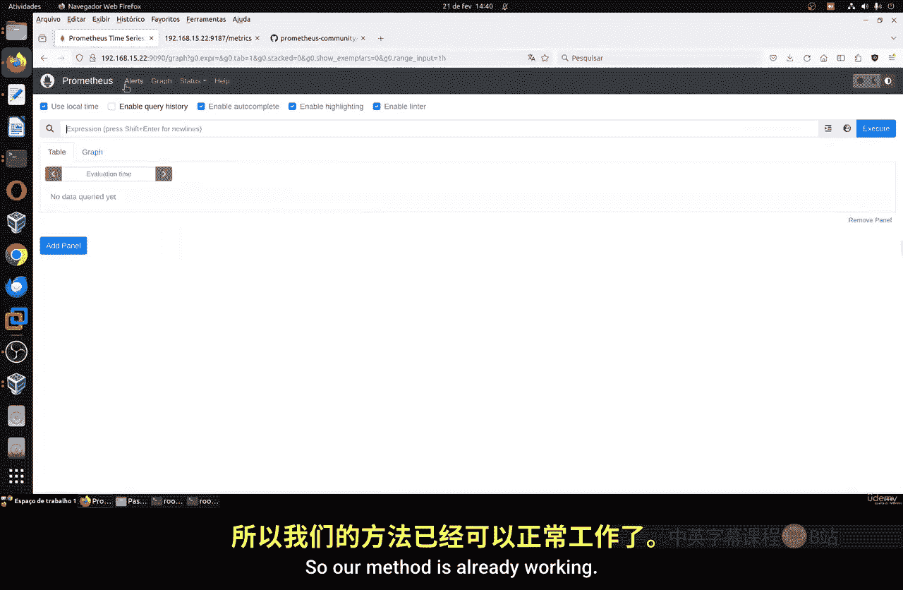

## 导入PostgreSQL监控仪表盘

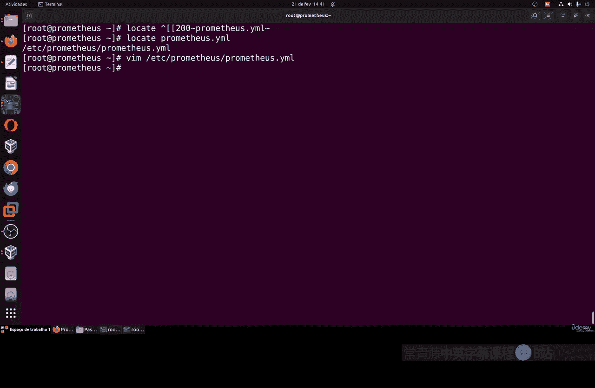

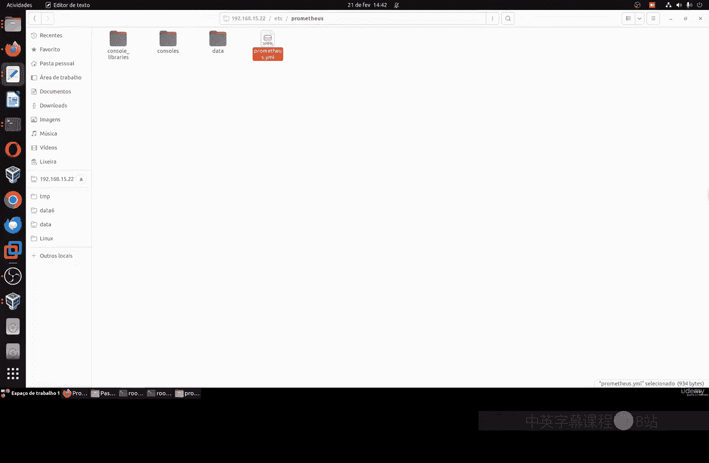

Grafana社区提供了丰富的预构建仪表盘。我们可以直接导入一个专门为PostgreSQL设计的仪表盘。

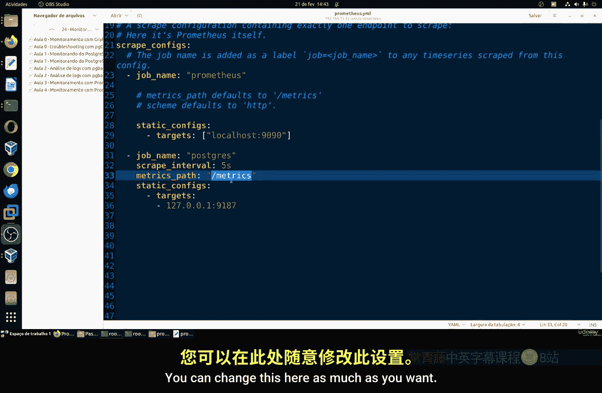

以下是导入仪表盘的步骤：

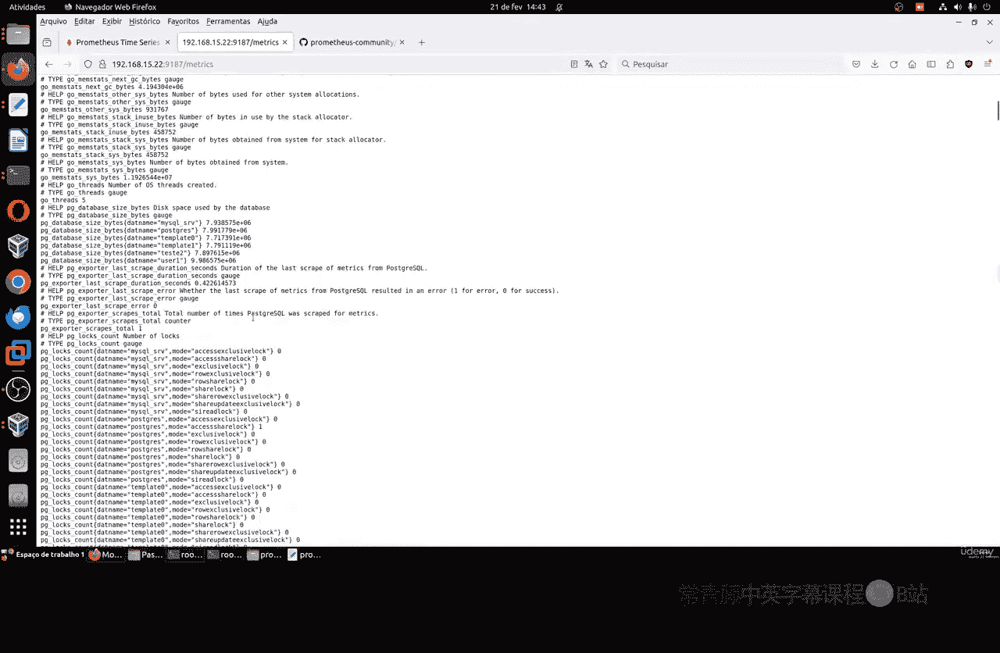

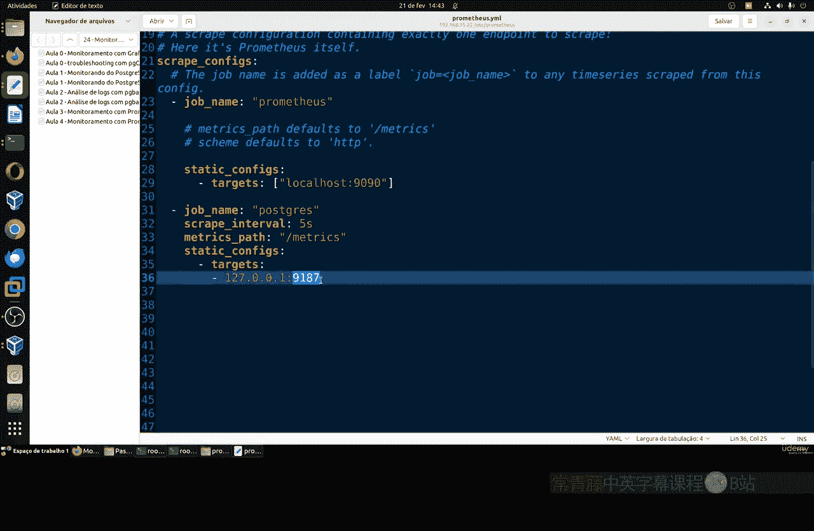

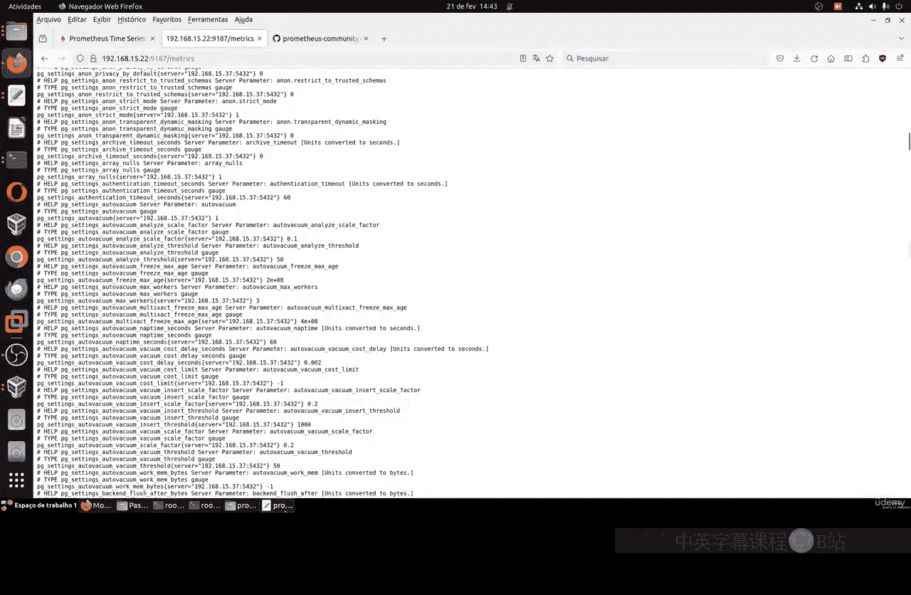

1.  **查找仪表盘ID**：访问 [Grafana官方仪表盘库](https://grafana.com/grafana/dashboards/)，搜索“PostgreSQL”。一个常用且全面的仪表盘ID是 `9628`。

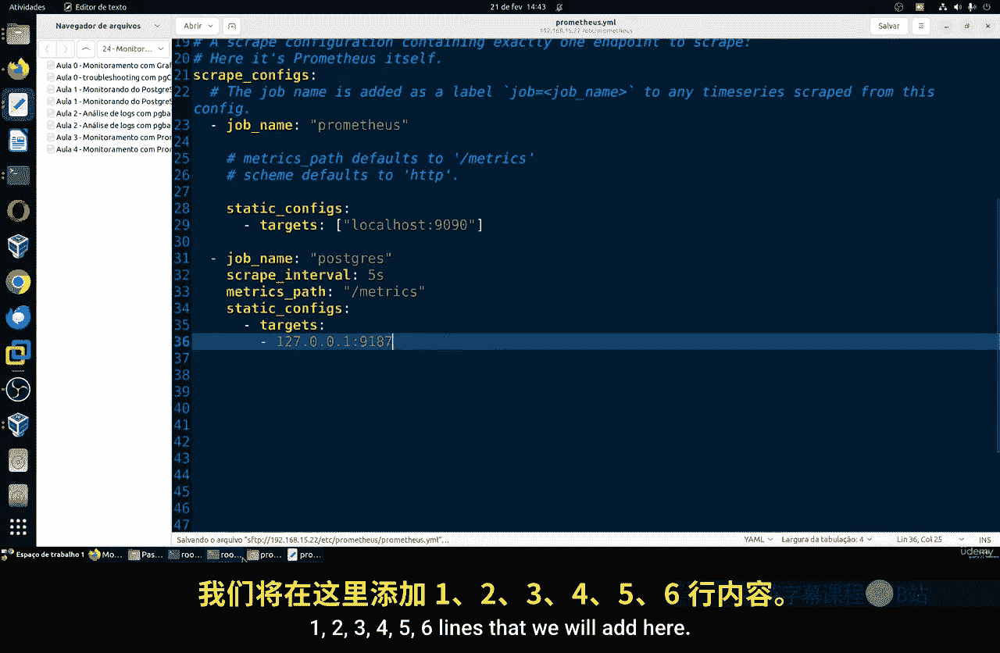

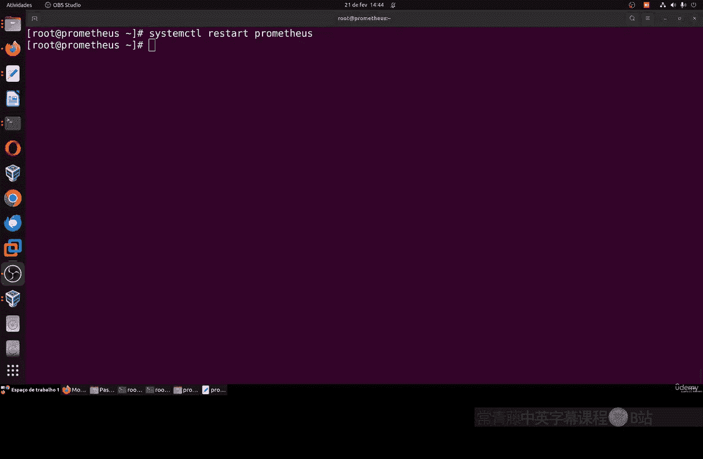

2.  **在Grafana中导入**：
    *   在Grafana侧边栏，点击 **Create（加号图标） -> Import**。
    *   在 **Import via grafana.com** 字段中，输入仪表盘ID `9628`，然后点击 **Load**。
    *   在下一个页面，为仪表盘选择一个文件夹（或保留默认），并在 **Prometheus** 下拉菜单中选择您刚才添加的Prometheus数据源。
    *   点击 **Import**。

现在，您应该能看到一个功能完整的PostgreSQL监控仪表盘，其中包含了数据库连接数、查询性能、缓冲区命中率、表空间使用情况等关键指标的可视化图表。

## 总结

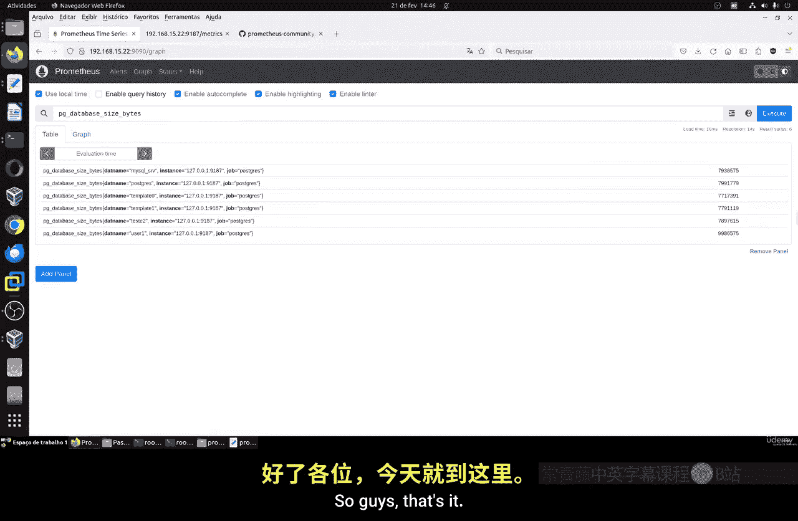

本节课中我们一起学习了如何搭建一个完整的PostgreSQL监控系统。我们首先配置了PostgreSQL导出器来暴露数据库指标，然后修改Prometheus配置以抓取这些指标，接着安装并配置了Grafana作为可视化平台，最后导入了社区提供的专业仪表盘。通过这个组合，您可以实时、直观地监控PostgreSQL数据库的健康状态和性能表现，为运维管理提供有力支持。