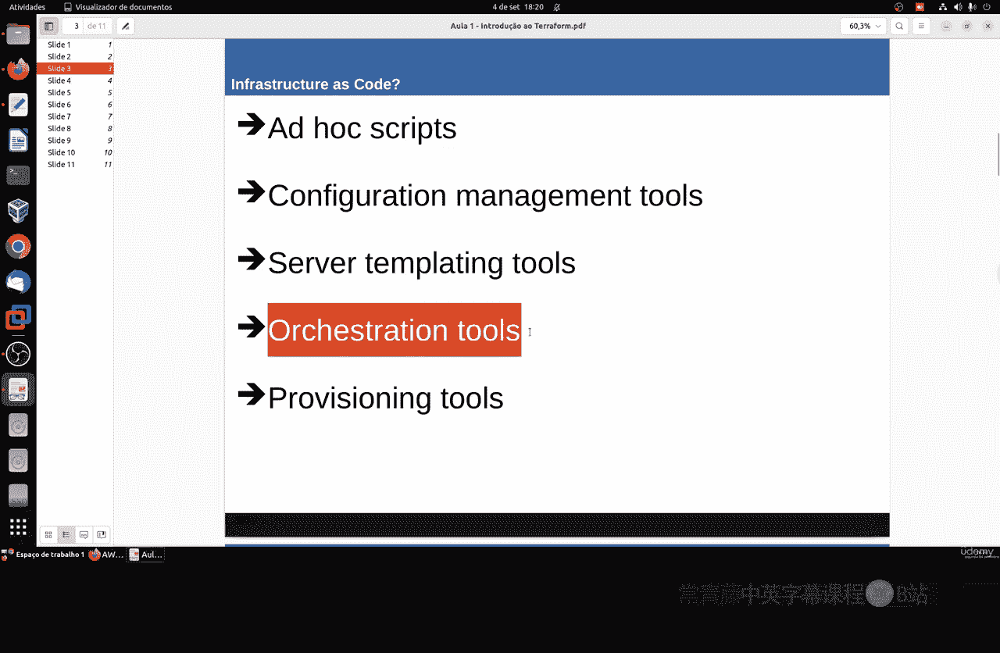
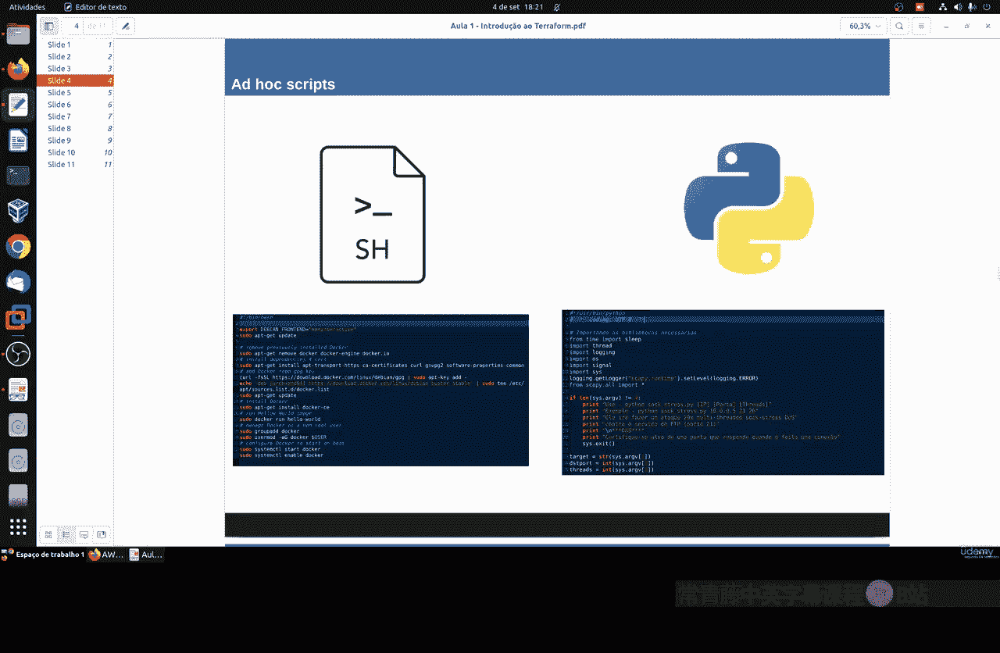
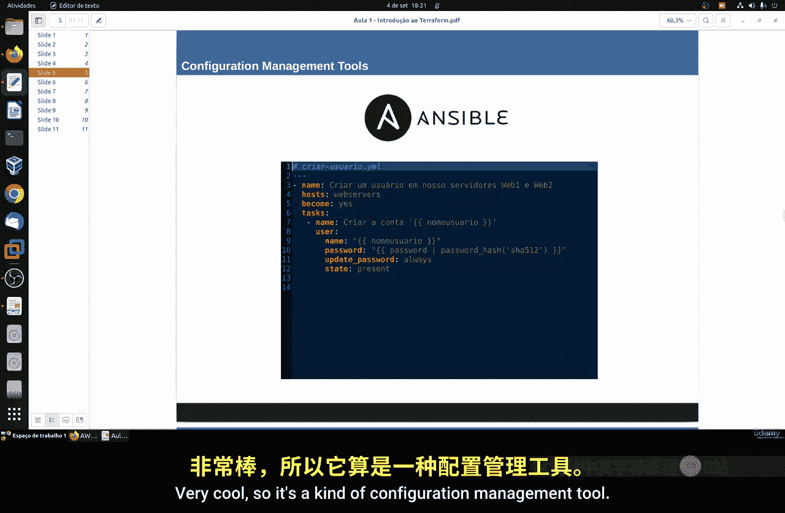
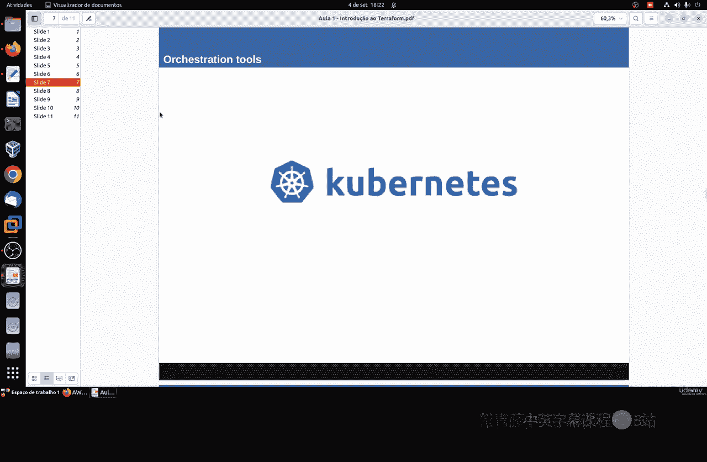
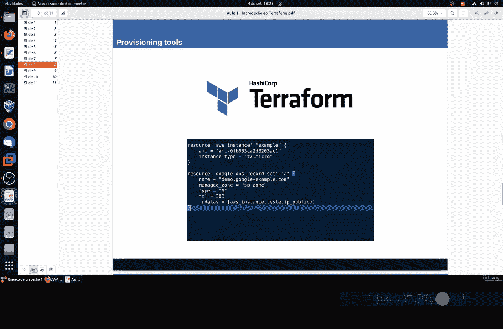
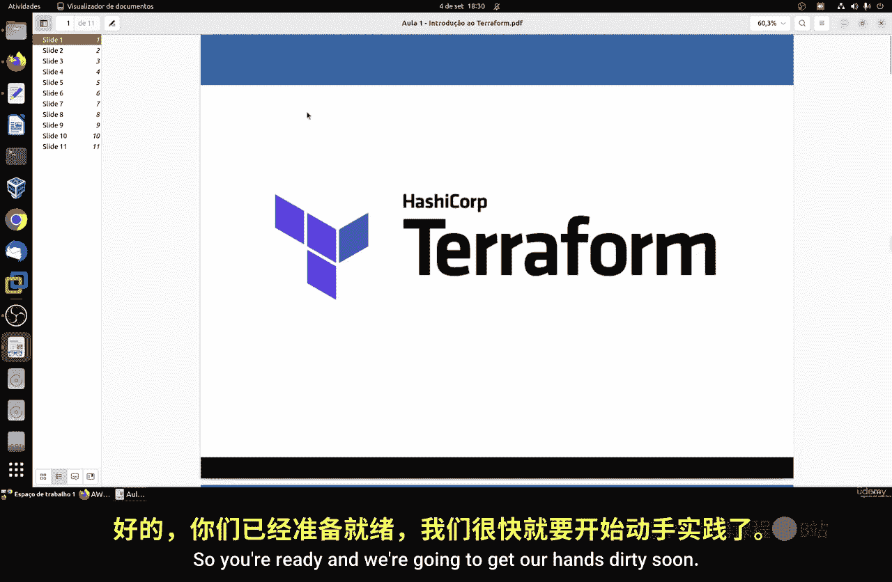

# 122：基础设施即代码入门 🚀

在本节课中，我们将学习Terraform的基础知识。Terraform是一种用于安全、高效地构建、更改和版本化基础设施的工具。它广泛应用于DevOps领域，是管理云服务提供商（如AWS、Google Cloud、Azure、DigitalOcean等）以及内部虚拟化解决方案（如VMware）的出色工具。

## Terraform的核心特性

以下是Terraform的一些主要特性：

*   **基础设施即代码**：这是核心特性。它意味着使用代码来定义和管理整个基础设施，使一切都有据可查。
*   **执行计划**：Terraform有一个规划阶段，会生成一个执行计划。这让你在实际应用更改前，能清晰地看到Terraform将执行哪些操作，从而避免对基础设施造成意外的、可能有害的更改。
*   **资源图**：Terraform会构建所有资源的依赖关系图。这使得它能够以最高效的顺序创建和修改资源，尤其是在处理复杂的基础设施时，这有助于理解各个组件之间的关系。
*   **变更自动化**：复杂的变更集可以以最少的配置应用到基础设施上。通过执行计划和资源图，Terraform能精确地知道要改变什么以及按什么顺序改变，从而最大限度地减少人为错误。

## 什么是基础设施即代码？

上一节我们介绍了Terraform的特性，本节中我们来看看其核心理念——基础设施即代码。

基础设施即代码背后的理念是，你可以将基础设施中的所有内容编写成代码。然后，你可以通过运行代码来定义、部署和更新你的基础设施。这意味着几乎任何事情都可以通过代码来完成。



例如，你可以管理服务器、数据库、网络配置、日志文件记录以及操作系统上运行的应用程序。这一切都留下了完整的文档记录。对于存在人员流动的大型公司而言，拥有清晰的文档至关重要，它能确保新员工了解公司基础设施的运作方式。此外，自动化测试和部署流程也成为可能。



## IAC工具类别

理解了IAC的概念后，我们来看看实现它的几类工具：



以下是主要的IAC工具类别：



1.  **Ad Hoc脚本**：这是一种更直接的方法。指的是根据你喜欢的编程语言（如Shell脚本、Python、Java文件）创建的脚本文件。我们在课程中已经创建过许多脚本。
2.  **配置管理工具**：这类工具用于管理服务器配置。例如Ansible、Chef和Puppet。我们之前已经学习过Ansible。
3.  **服务器模板工具**：这类工具用于创建服务器镜像。例如Docker，我们之前已经学习了很多相关内容。
4.  **编排工具**：这类工具用于管理容器化应用的部署、扩展和网络。例如Kubernetes和Docker Swarm，我们也已经学习过。
5.  **置备工具**：这是我们本节课的重点，Terraform就属于此类。其他工具还有OpenStack Heat等。这类工具负责创建服务器、数据库、负载均衡器、监控、网络配置、防火墙规则、SSL证书等。

## Terraform的优势与实践



现在，让我们聚焦于Terraform这类置备工具，看看它能带来哪些具体好处。

使用Terraform等工具，你可以从一台简单的笔记本电脑远程管理多个云平台（如AWS、Azure、Google Cloud）或虚拟化服务（如VMware）。

以下是使用Terraform的主要优势：

*   **自助服务与速度**：你可以自行启动所需的基础设施实现，一切都将自动记录，过程快速。
*   **安全性与减少人为错误**：由于流程自动化，需要的人工交互最少，这降低了人为出错的可能性。
*   **完整文档**：整个基础设施都有代码记录。即使负责人员变更，新员工也能通过文档快速理解现有架构。这些代码通常非常易读易懂。
*   **版本控制**：所有更改都像Git提交一样被记录。如果新的基础设施部署出错，你可以轻松回滚到之前的版本。
*   **验证与测试**：每次变更都可以进行代码审查和运行测试，以确保其正常工作。
*   **代码复用**：你可以创建可重用的代码模块，从而节省时间、加速流程，并方便新员工利用前人留下的代码。

## 实践预览与资源

在本课程接下来的实践中，我们将学习如何使用Terraform管理一个AWS EC2实例。我们将从零开始，一步步进行操作。

其工作原理是：我们在本地编写Terraform代码（使用HCL语言），然后通过Terraform命令行工具，利用云服务商的API远程配置和管理云资源。

以下是一个简单的Terraform代码示例，用于创建一个AWS EC2实例：

```hcl
resource "aws_instance" "example" {
  ami           = "ami-0c55b159cbfafe1f0"
  instance_type = "t2.micro"
}
```

最后，以下是一些重要的官方资源链接，供你深入学习和解决问题时参考：

*   **官方网站**：https://www.terraform.io
*   **GitHub仓库**：https://github.com/hashicorp/terraform
*   **社区论坛**：https://discuss.hashicorp.com/c/terraform-core
*   **官方文档**：https://www.terraform.io/docs

---



本节课中我们一起学习了Terraform的基本概念、其作为基础设施即代码工具的核心特性与优势，并了解了它在IAC工具生态中的定位。这是一个入门介绍，下一节课我们将开始动手实践，创建我们的第一个云基础设施。