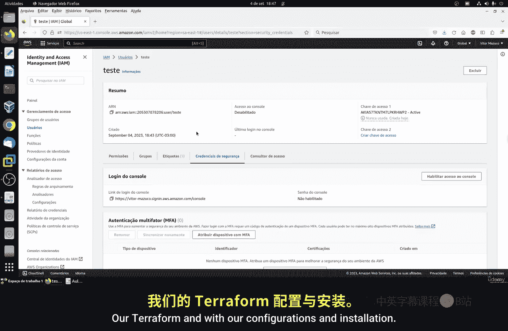

# 123：AWS准备 🚀

在本节课中，我们将学习如何在AWS（亚马逊云服务）上创建账户、用户以及访问密钥，为后续使用Terraform等工具管理云资源做好准备。

---

## 创建AWS账户

首先，你需要在AWS上创建一个账户。访问AWS官方网站，使用你的邮箱和密码进行注册。注册过程中，AWS可能会要求你提供信用卡信息以备未来支付使用。不过，据我所知，初始阶段通常不会产生费用。AWS提供部分免费服务和部分付费服务，只有当你超出免费使用额度时才会被收费。整个账户创建过程只需几次点击和几个简单步骤即可完成。

---

## 登录AWS控制台

成功创建账户后，登录AWS平台，你将进入AWS控制台的主页。AWS的界面设计直观，是全球使用最广泛的云服务平台，因此理解和使用起来并不困难。根据时间或AWS的更新，控制台的布局可能略有不同，但核心功能保持一致。

---

## 创建IAM用户

首次登录时，你使用的是根用户（root user）。根用户拥有最高权限，但出于安全和管理的最佳实践，我们不应直接使用它。本节中，我们将创建一个具有特定权限限制的IAM（身份和访问管理）用户。

这与Linux服务器的用户管理逻辑相似：我们有拥有全部权限的`root`用户，也可以创建权限受限的普通用户。在AWS中，我们同样创建具有受限权限的普通用户用于日常操作和测试。

在AWS控制台主页的搜索栏中，输入“IAM”并进入该服务。IAM是专门用于管理用户账户、权限、用户组和远程访问的服务。

进入IAM面板后，点击“用户”选项。目前列表中没有已创建的用户。点击“创建用户”按钮。

在创建用户页面，输入用户名。用户名只能包含大写字母、小写字母、数字以及部分特殊字符（如句点、加号、等号和连字符）。例如，你可以使用“terraform”作为用户名。输入后，点击“下一步”。

---

## 分配用户权限

接下来是设置权限。AWS提供了大量预置的策略（Policies），我们无需从头创建。选择“直接附加现有策略”的方式。

在策略列表中，搜索并选择名为 **`AdministratorAccess`** 的策略。这个策略授予用户对所有AWS资源的完全访问权限。你可以点击策略名称查看其详细的JSON格式定义，其中描述了具体的权限内容。

选择该策略后，点击“下一步”进入审核页面，确认信息无误后，点击“创建用户”。至此，一个具有管理员权限的IAM用户就创建完成了。

---

## 创建访问密钥

用户创建成功后，我们需要为其创建访问密钥（Access Key），以便通过命令行或应用程序（如Terraform）进行编程访问。

点击进入新创建用户的详情页。在“安全凭证”选项卡中，找到“创建访问密钥”的选项。

创建密钥时，需要选择使用案例。由于我们将在本地电脑上开发Terraform配置文件，并远程访问AWS，因此选择“本地代码”或“命令行界面（CLI）”选项。

为密钥添加一个描述标签以便记忆，例如“terraform”。然后点击“创建访问密钥”。

**重要警告**：访问密钥（包含访问密钥ID和秘密访问密钥）相当于登录凭证，必须妥善保管。请将其保存在本地机器上一个安全且不易被他人访问的位置。如果密钥泄露，他人可能滥用你的AWS资源并导致产生费用。AWS只会在创建时显示一次秘密访问密钥，之后无法再次查看，如果丢失，你必须创建新的密钥。你可以选择将密钥下载为CSV文件保存。

创建成功后，你就获得了访问密钥ID和秘密访问密钥。我们将在后续课程中使用Terraform时用到它们。

---

## 总结

本节课中，我们一起学习了为使用AWS进行云资源管理所做的准备工作。具体步骤包括：创建AWS账户、登录控制台、创建具有特定权限的IAM用户，以及为该用户生成用于编程访问的安全密钥。请务必牢记安全准则，妥善保管你的访问密钥。下一节课，我们将开始进行Terraform的配置和安装。