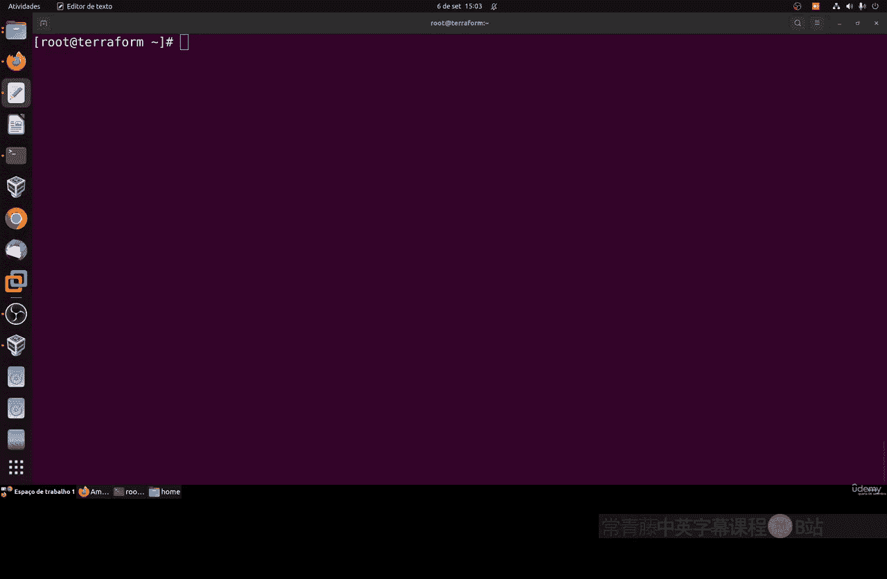
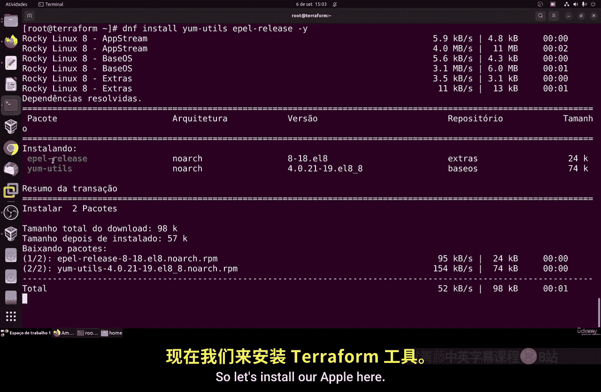
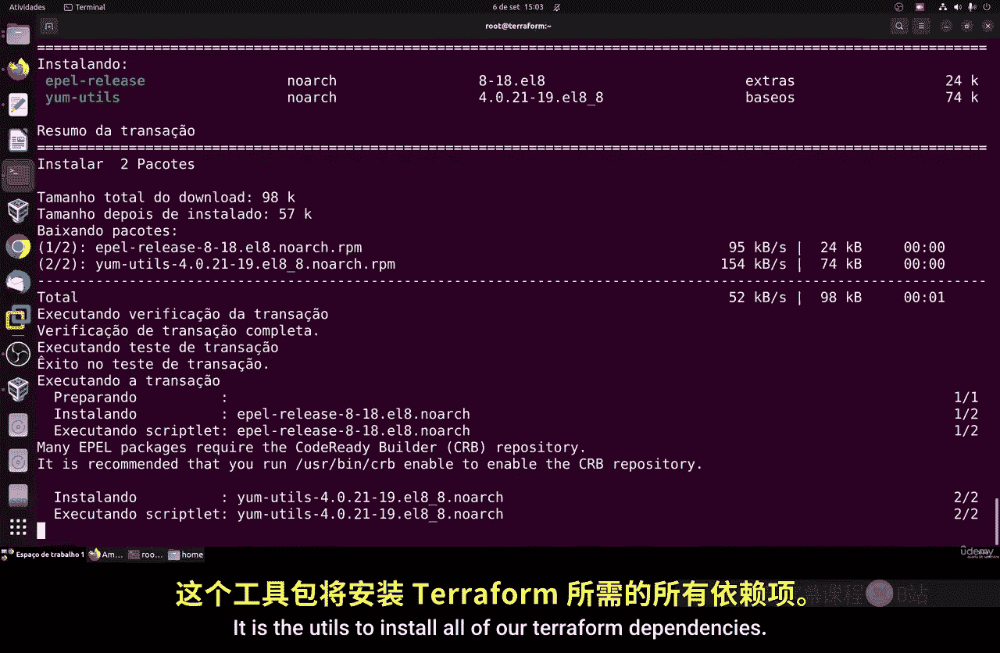
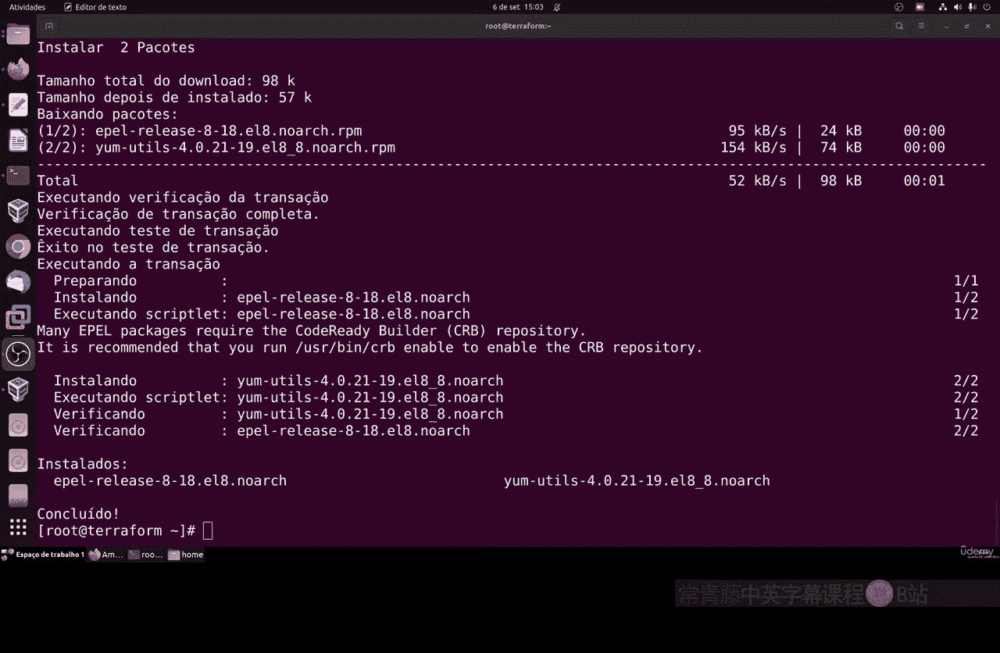
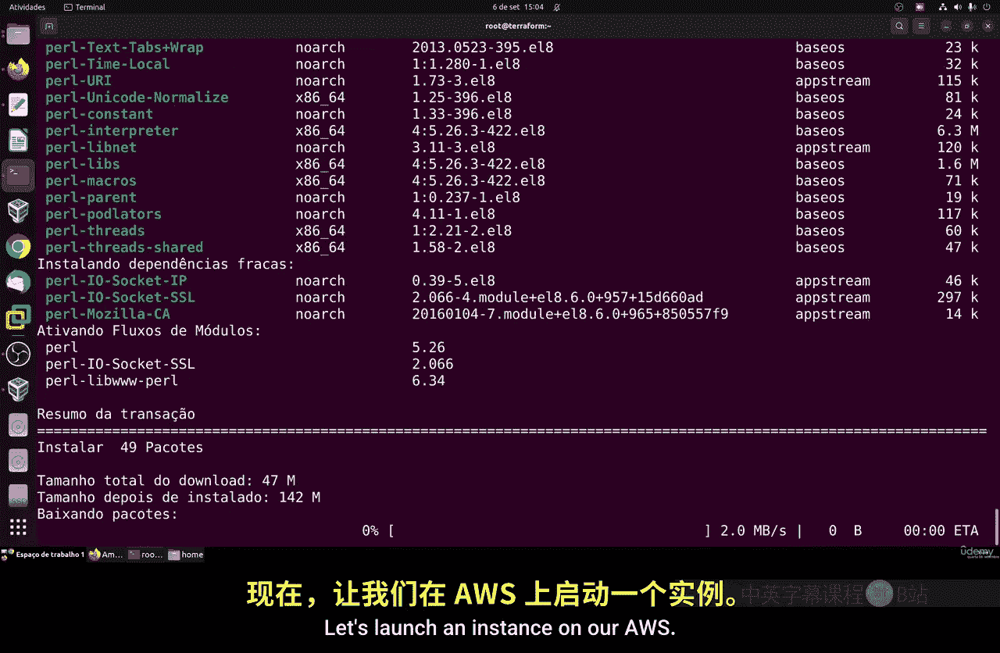
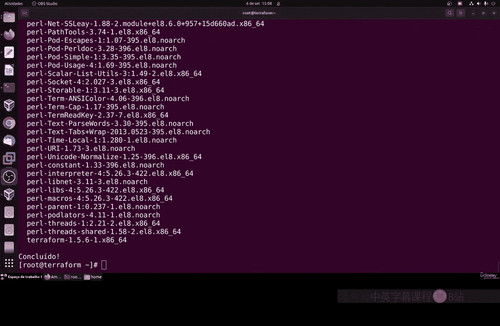
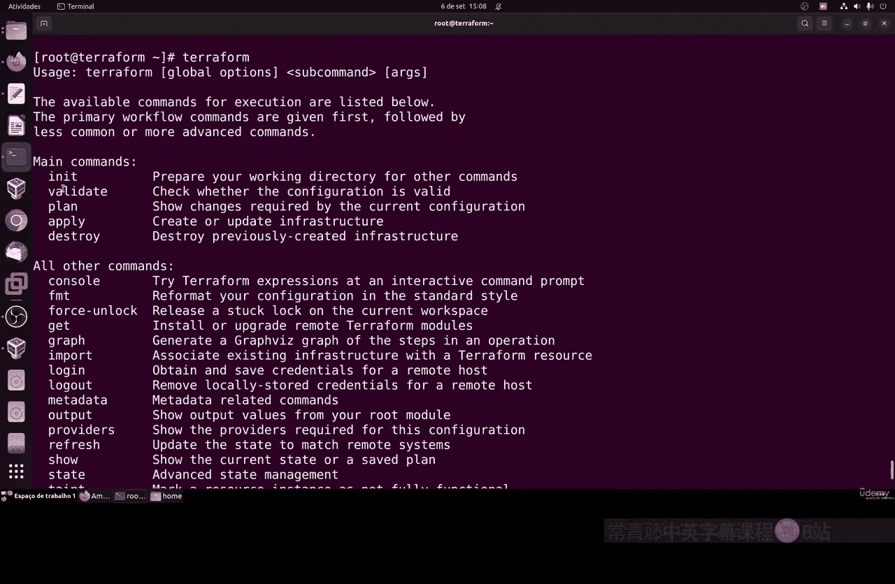
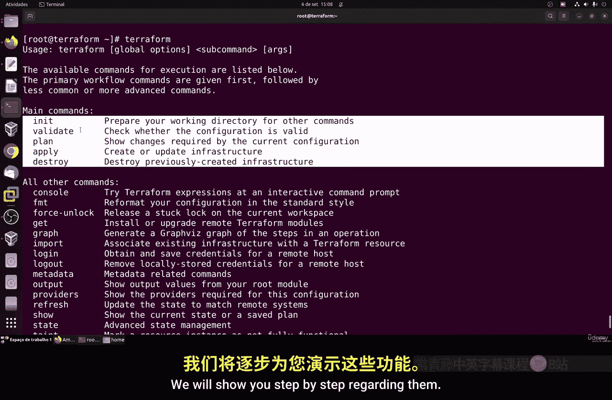
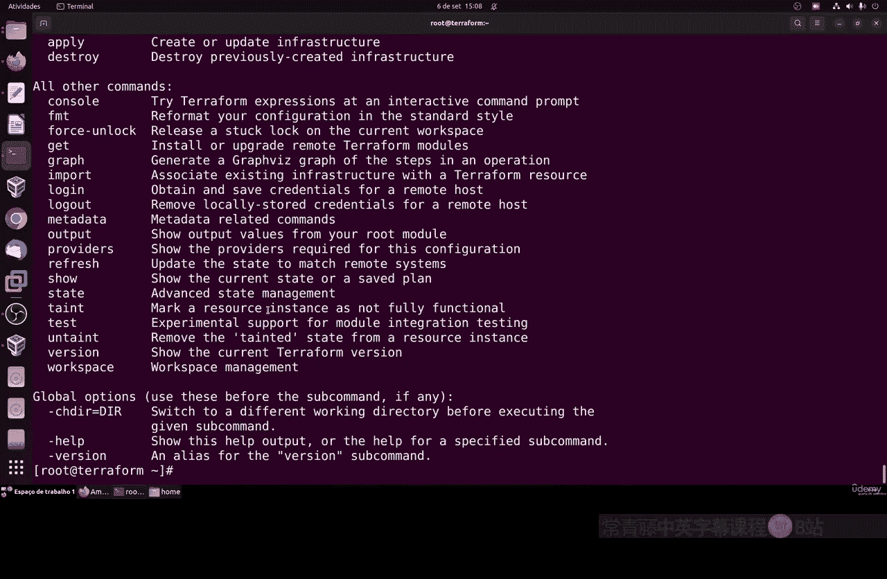
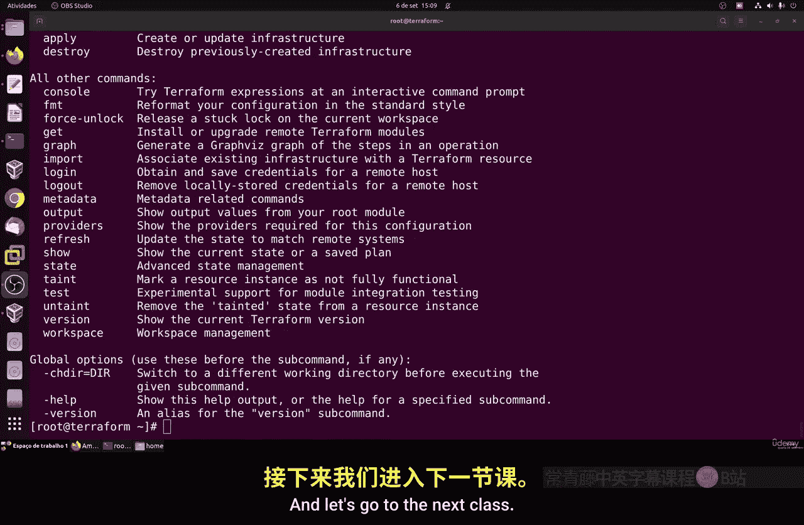

# 124：安装Terraform 🚀

在本节课中，我们将学习如何在Linux系统上安装Terraform。Terraform是一个基础设施即代码工具，它允许你使用代码定义和配置云资源。我们将以Linux为基础进行安装，但也会提供在其他操作系统上安装的参考信息。

## 概述

我们将通过几个简单的步骤来完成Terraform的安装。首先，我们会更新系统并安装必要的依赖包。接着，我们会添加Terraform的官方软件仓库，并从中安装Terraform二进制文件。最后，我们将验证安装是否成功。

## 安装步骤

以下是安装Terraform的具体步骤。

### 1. 更新系统与安装依赖

在开始安装Terraform之前，我们需要确保系统是最新的，并安装一些必要的工具。打开终端并执行以下命令：

```bash
sudo dnf update -y
sudo dnf install -y yum-utils
```

`yum-utils` 工具集包含了管理YUM仓库所需的实用程序，这对于我们后续添加Terraform的官方仓库是必要的。



### 2. 添加Terraform仓库

Terraform由HashiCorp提供，我们需要将其官方仓库添加到我们的系统中。执行以下命令来添加仓库：



```bash
sudo yum-config-manager --add-repo https://rpm.releases.hashicorp.com/RHEL/hashicorp.repo
```



这个命令会将HashiCorp的RPM仓库源添加到你的系统，使你能够通过包管理器直接安装Terraform。



### 3. 安装Terraform

添加仓库后，现在可以安装Terraform了。运行以下命令：

```bash
sudo dnf install terraform -y
```



这个命令会从我们刚刚添加的仓库中下载并安装Terraform及其所有依赖项。`-y` 参数会自动确认安装提示。

### 4. 验证安装

安装完成后，我们需要验证Terraform是否已正确安装并能正常运行。在终端中输入：

```bash
terraform version
```



如果安装成功，这个命令会输出当前安装的Terraform版本号，例如 `Terraform v1.3.7`。这表明Terraform命令行工具已经准备就绪。

## 核心命令与下一步



现在，你已经成功安装了Terraform。主要的Terraform命令包括：
*   `terraform init`：初始化一个包含Terraform配置文件的目录。
*   `terraform plan`：生成一个执行计划，显示Terraform将进行哪些更改。
*   `terraform apply`：应用更改以创建或更新基础设施。
*   `terraform validate`：检查配置文件的语法是否正确。

在下一节课中，我们将开始实际使用Terraform。我们将配置云服务商（如AWS）的凭证，并编写第一个Terraform配置文件来启动一个云服务器实例，真正体验“基础设施即代码”的工作流程。

## 其他平台安装参考



虽然本节课聚焦于Linux（特别是基于RHEL/Fedora的系统），但Terraform也支持其他操作系统。如果你需要在Windows、macOS或其他Linux发行版（如Ubuntu或Linux Mint）上安装，可以参考Terraform官方文档中的安装指南，那里提供了针对各个平台的详细说明。



## 总结



本节课中，我们一起学习了在Linux系统上安装Terraform的完整流程。我们更新了系统，安装了必要的工具，添加了HashiCorp官方仓库，并最终成功安装了Terraform。通过运行 `terraform version` 命令，我们确认了安装成功。现在，你的开发环境已经具备了使用代码管理云基础设施的能力，为后续的实践操作打下了坚实的基础。