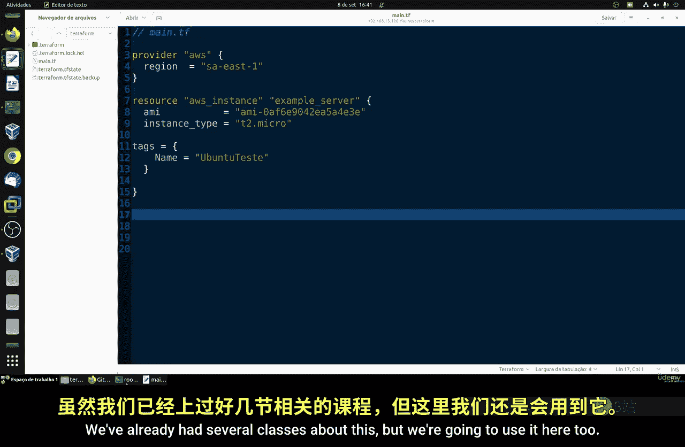
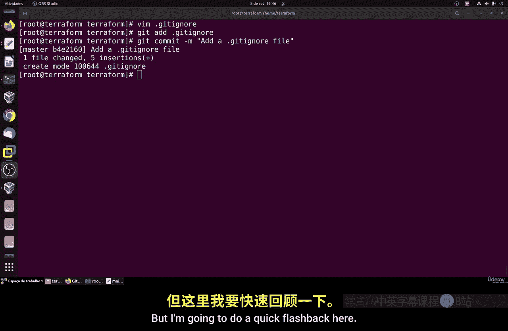
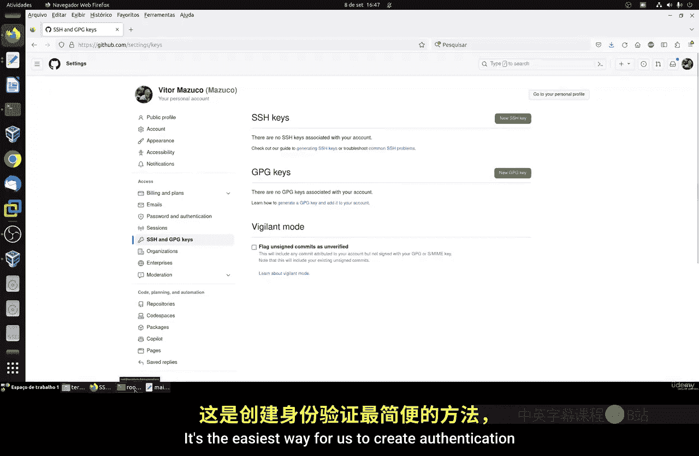
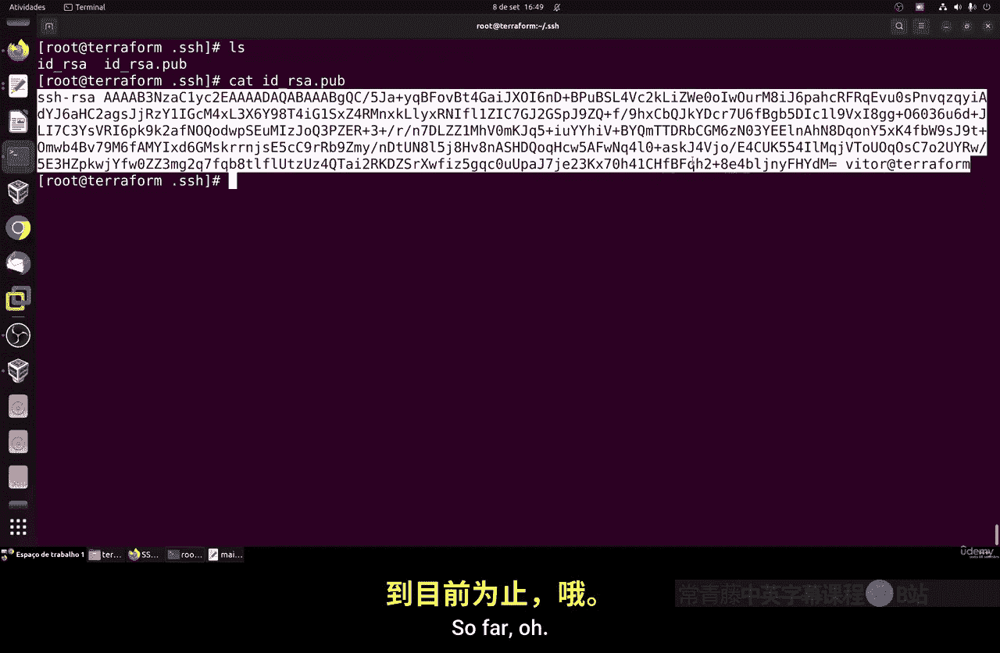
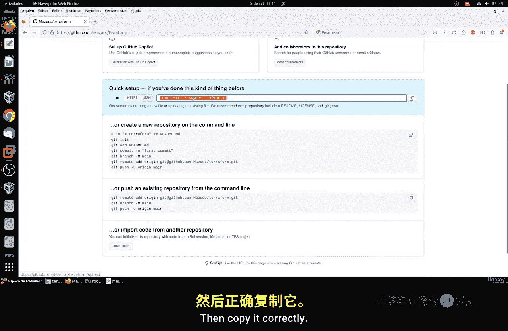
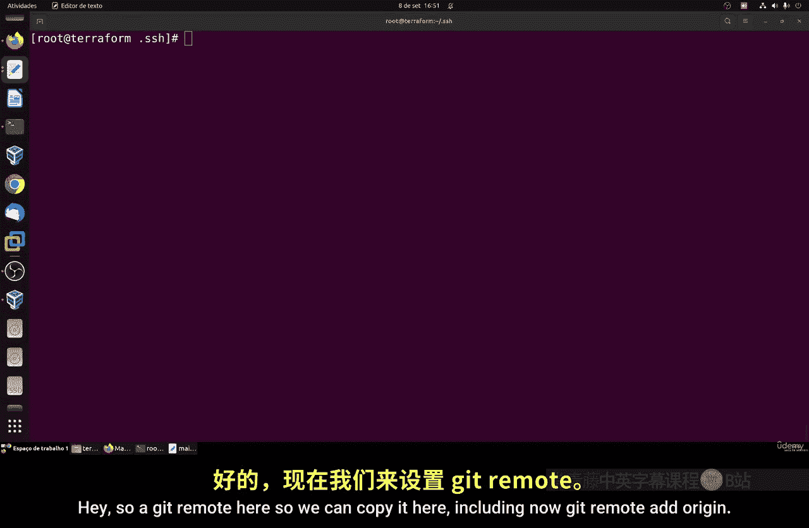
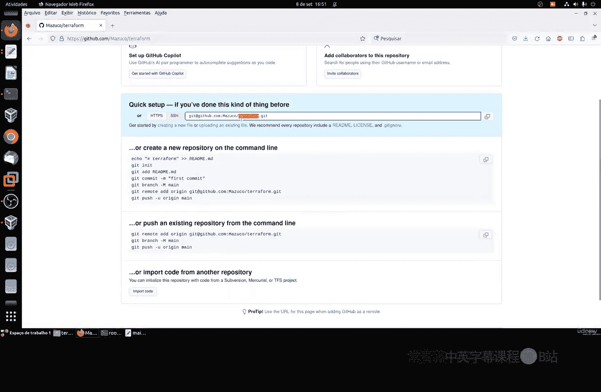
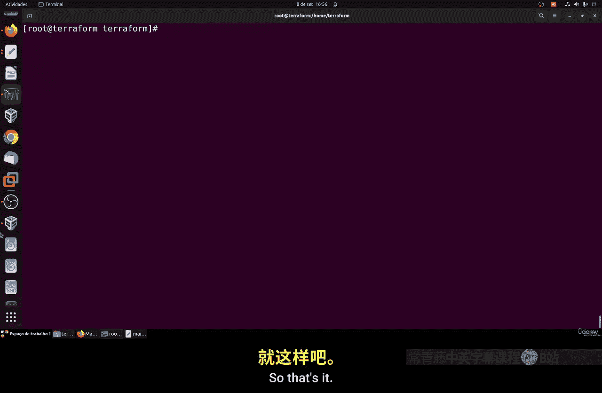
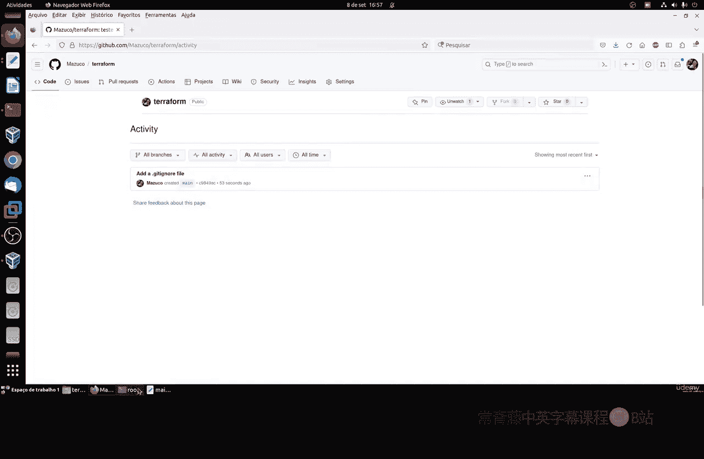
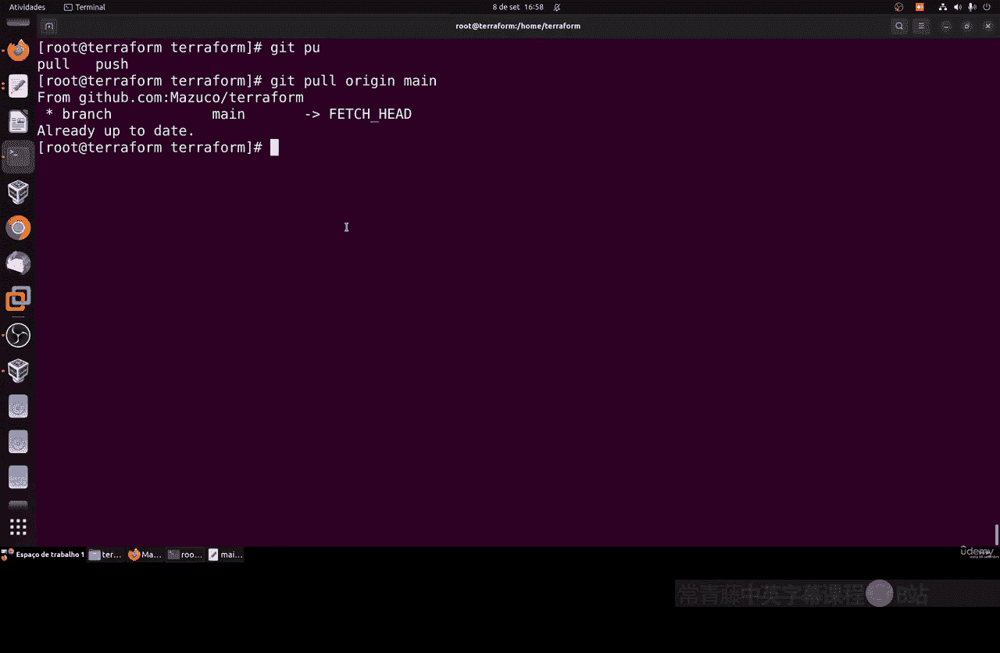

# 126：在 Git 中保存更改 📂

在本节课中，我们将学习如何将 Terraform 配置的更改存储在 Git 中。这对于跟踪基础设施变更历史、团队协作和问题调试至关重要。



## 概述

在大型组织中，记录所有基础设施变更是非常重要的。通过 Git，我们可以将变更历史、提交日志以及变更者信息完整地保存在 GitLab、GitHub 或自建的 Git 服务器上。这有助于团队成员了解变更内容、责任人，并为未来的调试和审计提供依据。

上一节我们介绍了 Terraform 的基础配置，本节中我们来看看如何将这些配置纳入版本控制。

## 初始化 Git 仓库

首先，我们需要在 Terraform 项目目录中初始化一个 Git 仓库。最佳实践是在当前工作目录中进行初始化。

1.  进入你的 Terraform 项目目录。
2.  运行以下命令来初始化一个隐藏的 `.git` 文件夹：
    ```bash
    git init
    ```
3.  使用 `ls -la` 命令可以查看这个隐藏文件夹。

## 创建基础文件并提交



接下来，我们需要创建一些基础文件并进行首次提交。



以下是需要创建和添加的文件列表：
*   **README.md**：项目的首页说明文件，GitHub 等平台通常要求此文件。
*   **.gitignore**：用于指定哪些文件或目录不应被 Git 跟踪。
*   你的 Terraform 主配置文件（例如 `main.tf`）和 `.terraform` 目录下的状态文件（后续会讨论）。

操作步骤如下：
1.  创建 `README.md` 文件并添加项目描述。
2.  创建 `.gitignore` 文件，并添加以下内容以忽略 Terraform 的本地状态和缓存文件：
    ```
    .terraform/
    *.tfstate
    *.tfstate.*
    ```
3.  配置 Git 用户信息（只需执行一次）：
    ```bash
    git config --global user.email "你的邮箱"
    git config --global user.name "你的名字"
    ```
4.  将文件添加到暂存区并提交：
    ```bash
    git add README.md main.tf .gitignore
    git commit -m "initial commit"
    ```
5.  单独提交 `.gitignore` 文件：
    ```bash
    git add .gitignore
    git commit -m "Add .gitignore file"
    ```



## 配置 SSH 密钥并连接远程仓库

为了将本地仓库推送到 GitHub 等远程服务器，我们需要配置 SSH 密钥认证。

1.  生成 SSH 密钥对（如果尚未生成）：
    ```bash
    ssh-keygen -t rsa -b 4096 -C "your_email@example.com"
    ```
    按回车接受默认保存路径，设置密码（可选）。
2.  查看并复制公钥内容：
    ```bash
    cat ~/.ssh/id_rsa.pub
    ```
3.  登录你的 GitHub（或 GitLab）账户。
4.  进入 **Settings** > **SSH and GPG keys**。
5.  点击 **New SSH key**，粘贴复制的公钥，并为其命名（例如 “Terraform Key”）。



## 关联并推送至远程仓库





现在，我们可以在 GitHub 上创建一个新的空仓库，并将本地仓库与之关联。

1.  在 GitHub 上创建新仓库（例如命名为 `terraform-project`）。
2.  创建完成后，在仓库页面找到 **SSH** 格式的仓库地址并复制。
3.  在本地终端，将远程仓库地址添加为 `origin`：
    ```bash
    git remote add origin git@github.com:你的用户名/terraform-project.git
    ```
4.  将本地提交推送到远程仓库：
    ```bash
    git push -u origin main
    ```
    首次推送可能需要确认 SSH 密钥指纹。



## 日常变更管理流程



配置完成后，日常的变更管理应遵循以下流程：
*   **提交变更**：完成修改后，使用 `git add` 和 `git commit -m "描述性信息"` 提交。
*   **推送变更**：定期使用 `git push origin main` 将本地提交推送到远程仓库。
*   **拉取更新**：在开始工作前，可以使用 `git pull origin main` 获取团队其他人的最新更改。

遵循此流程能确保所有协作成员都能访问最新的配置，了解变更内容和责任人，这对于调试和权责划分非常重要。

## 总结




本节课中我们一起学习了如何将 Terraform 项目纳入 Git 版本控制。我们完成了从初始化本地仓库、创建必要文件、配置 SSH 密钥，到关联并推送至远程 GitHub 仓库的完整流程。掌握这些步骤是实施基础设施即代码（IaC）和团队协作的基础，它能确保所有变更可追溯、可审计，是现代 DevOps 实践中的关键环节。