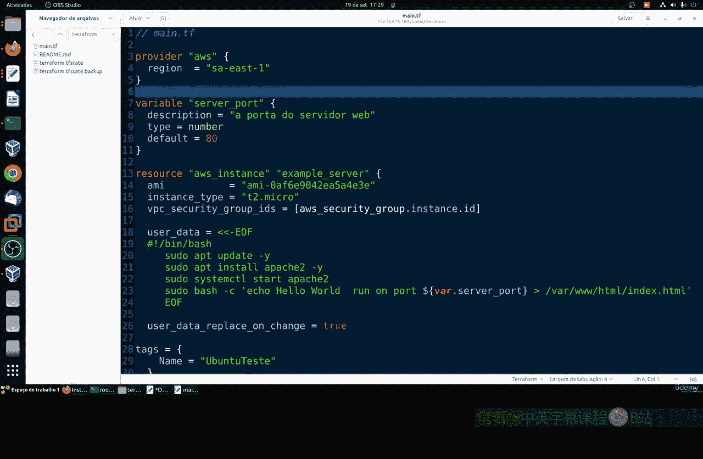
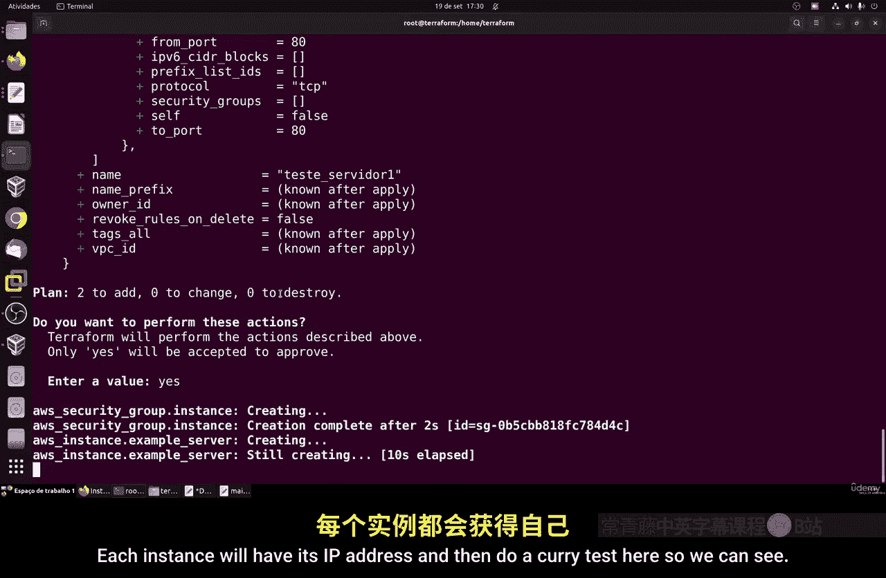
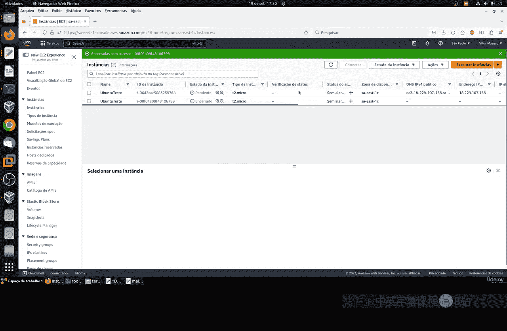
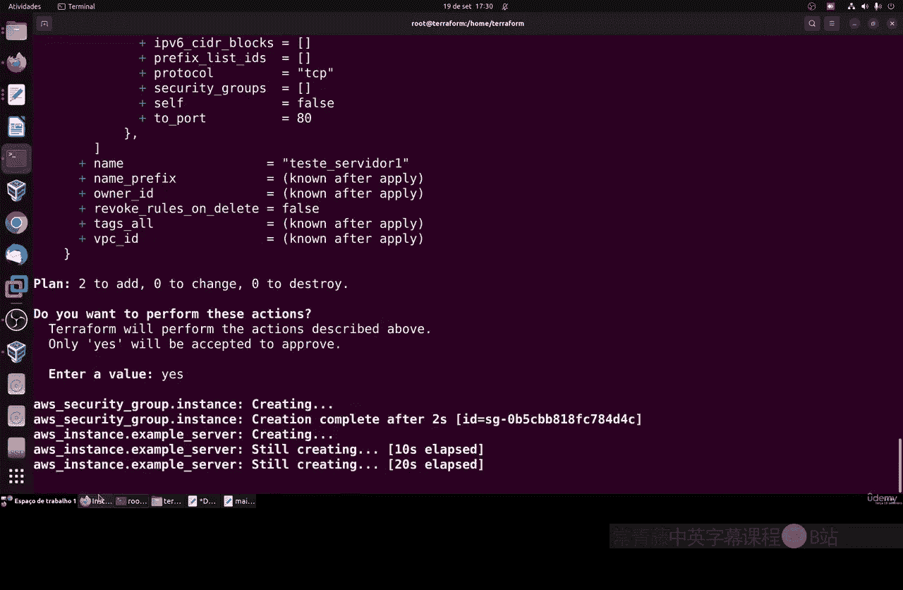
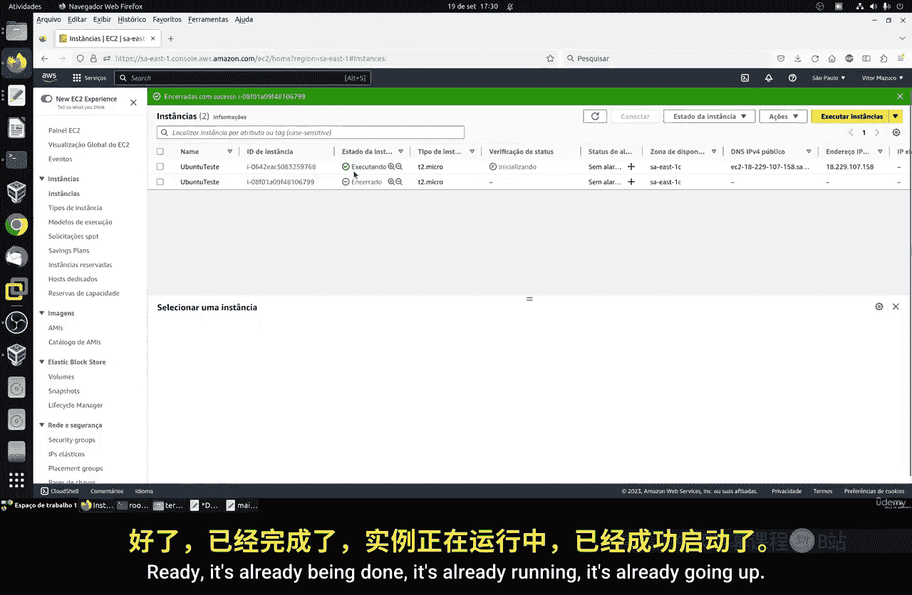
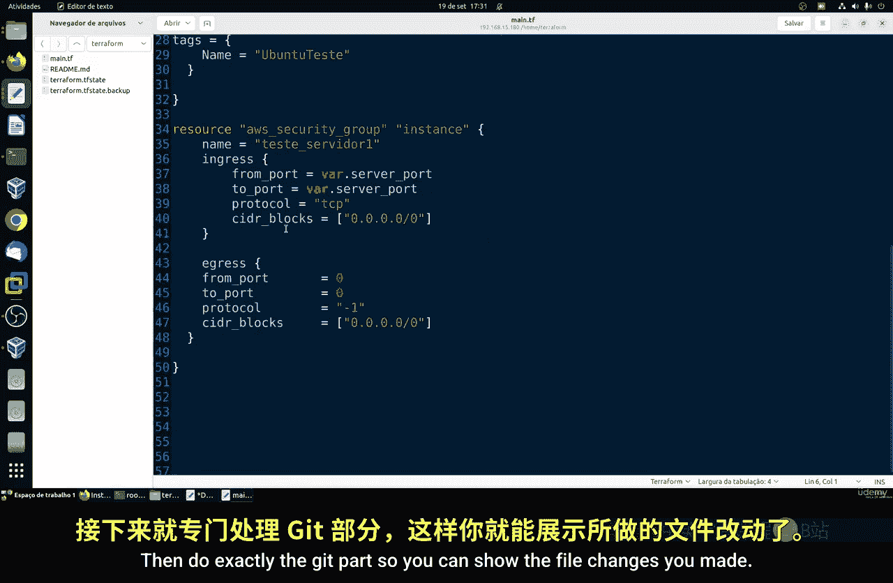
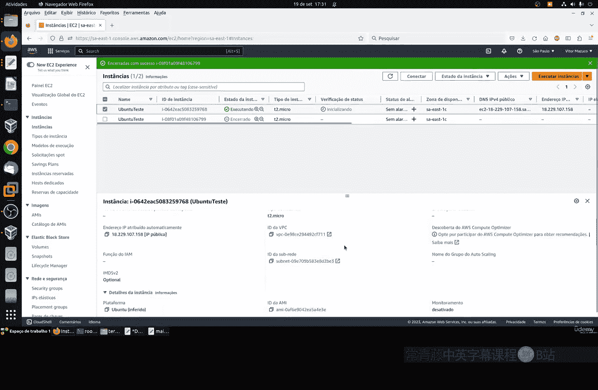
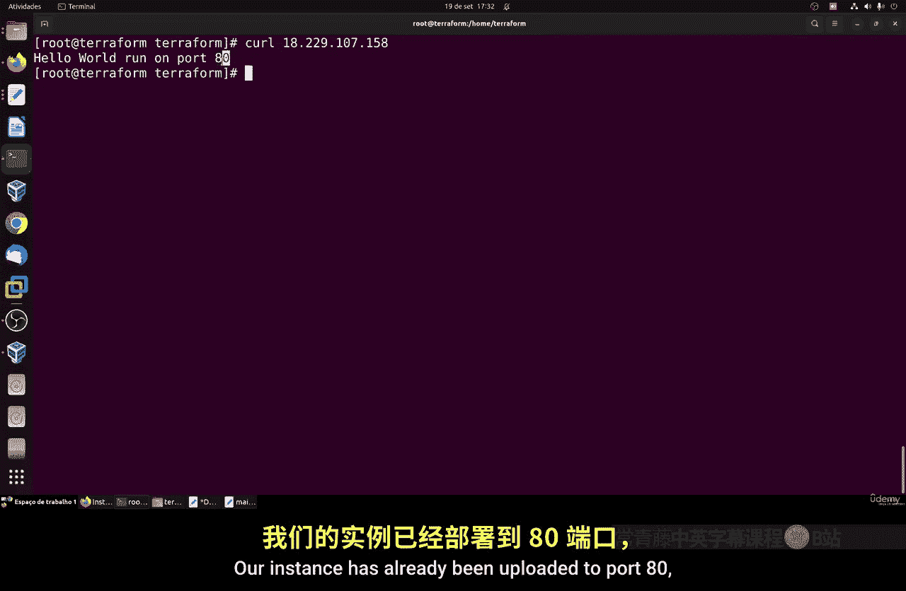
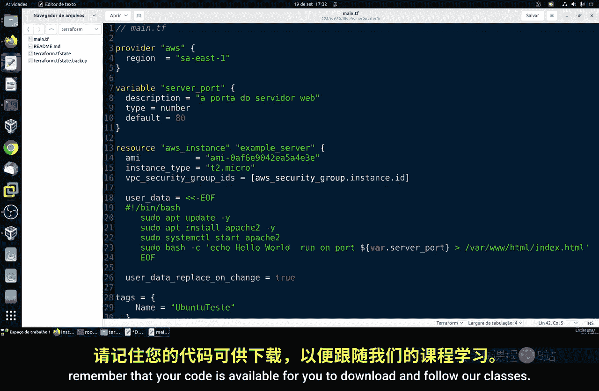

# 128：使用变量 📚

在本节课中，我们将学习如何在Terraform配置文件中使用变量。变量是编程和配置管理中的核心概念，它允许我们定义可复用的值，从而简化代码维护并提高灵活性。

## 概述

变量允许你设置一个默认值，并在整个配置文件中重复使用它。这能节省时间，因为你无需在每次需要更改时都手动修改多个地方的值。在Terraform中，变量的逻辑与其他编程语言类似，理解起来并不困难。

## 变量定义与配置

以下是定义变量的基本方法。使用 `variable` 关键字，后跟变量名及其配置块。配置可以包含多种参数。

**基本语法结构：**
```hcl
variable “variable_name” {
  description = “A description of the variable.”
  type        = string
  default     = “default_value”
}
```

让我们看看变量配置中常用的几个参数：

*   **description**: 提供变量的简短描述，有助于识别其用途。
*   **type**: 指定变量的数据类型，例如数字、列表、字符串或映射。
*   **default**: 设置变量的默认值，该值将在整个配置文件中使用。

## 变量类型详解

上一节我们介绍了变量的基本结构，本节中我们来看看Terraform支持的主要变量类型。

以下是几种常见的变量类型及其定义方式：

1.  **数字 (Number)**
    用于表示整数值。
    ```hcl
    variable “server_port” {
      type    = number
      default = 80
    }
    ```

2.  **列表 (List)**
    用于表示一组有序的值。可以指定列表内元素的类型。
    ```hcl
    variable “availability_zones” {
      type    = list(string)
      default = [“us-east-1a”, “us-east-1b”]
    }
    ```

3.  **映射 (Map)**
    用于表示键值对集合。
    ```hcl
    variable “resource_tags” {
      type = map(string)
      default = {
        “Environment” = “Development”
        “Project”     = “Example”
      }
    }
    ```

4.  **布尔值 (Boolean)**
    用于表示真或假。
    ```hcl
    variable “feature_enabled” {
      type    = bool
      default = true
    }
    ```

## 在配置中引用变量

定义变量后，你可以在资源配置中引用它。引用变量的方式是使用 `var.` 前缀加上变量名。

例如，我们定义了一个名为 `server_port` 的变量，可以在安全组规则中这样引用它：
```hcl
resource “aws_security_group_rule” “allow_http” {
  type        = “ingress”
  from_port   = var.server_port
  to_port     = var.server_port
  protocol    = “tcp”
  cidr_blocks = [“0.0.0.0/0”]
}
```

## 在用户数据脚本中使用变量

在 `user_data` 脚本（用于实例初始化）中引用变量时，语法略有不同。你需要使用 `${}` 插值语法。



假设在用户数据脚本中需要输出端口号，可以这样写：
```bash
#!/bin/bash
echo “Hello World” > index.html
nohup busybox httpd -f -p ${var.server_port} &
```

## 实践演示：应用变量更改

现在，让我们将理论付诸实践。我们将创建一个变量，并在多个地方使用它。







1.  在 `main.tf` 文件中定义变量：
    ```hcl
    variable “server_port” {
      description = “The port the web server will listen on.”
      type        = number
      default     = 8080 # 我们可以将默认值从80改为8080
    }
    ```



2.  在安全组资源和用户数据脚本中，将硬编码的端口号 `80` 替换为 `var.server_port`。

3.  保存文件并运行 `terraform apply` 命令。Terraform会计划创建资源，并显示变量值已被应用。





4.  应用完成后，新的EC2实例将使用变量中定义的端口（例如8080）运行Web服务器。你可以通过获取实例的公共IP地址并使用 `curl` 命令进行测试。



## 总结



本节课中我们一起学习了Terraform变量的核心用法。我们了解了如何定义包含描述、类型和默认值的变量，探索了数字、列表、映射和布尔值等主要类型，并掌握了在普通资源配置和用户数据脚本中引用变量的不同语法。通过使用变量，我们可以使Terraform代码更加动态、可维护和可重用。记得将你的代码更改提交到Git仓库以进行版本管理。