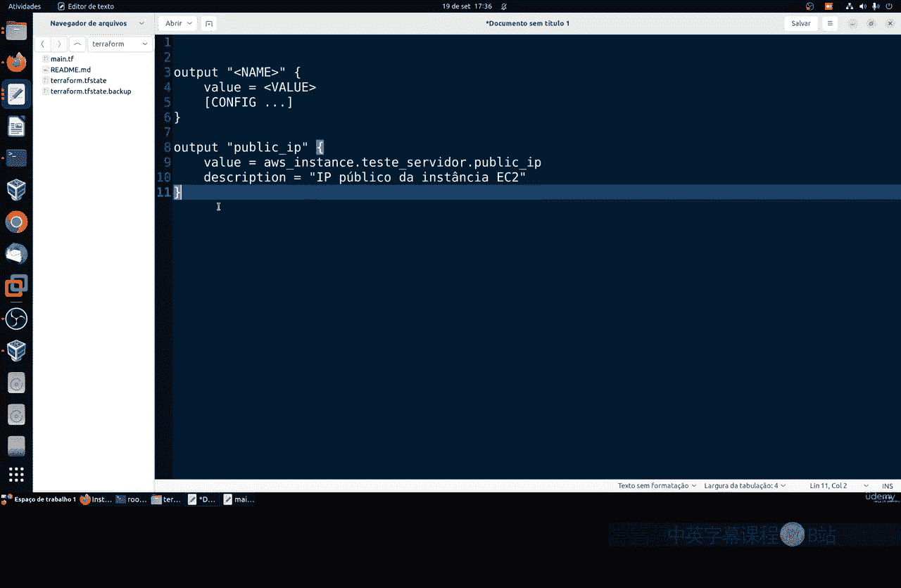
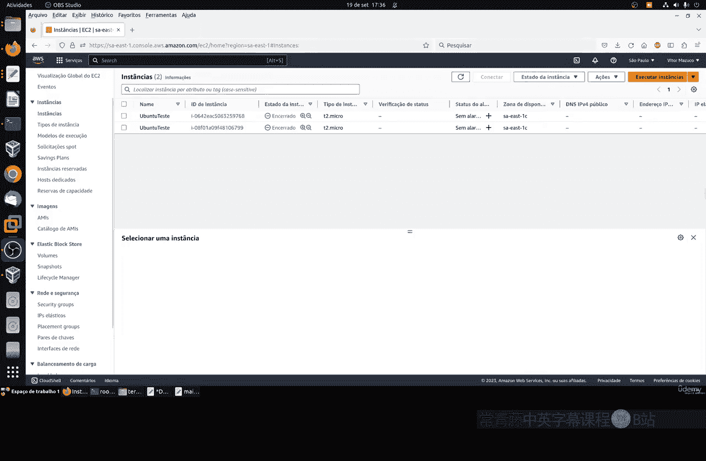
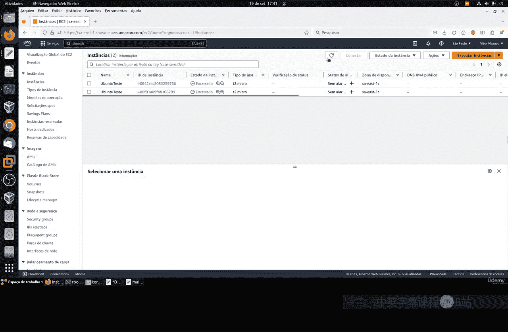
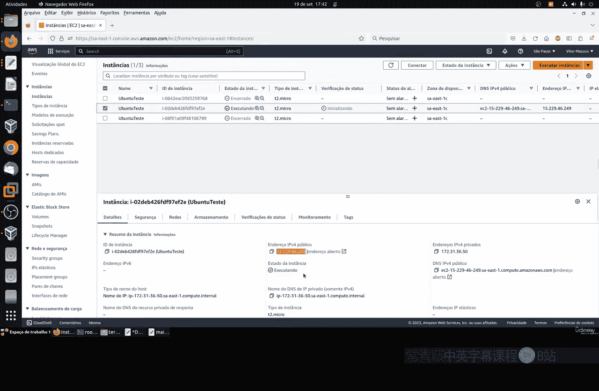
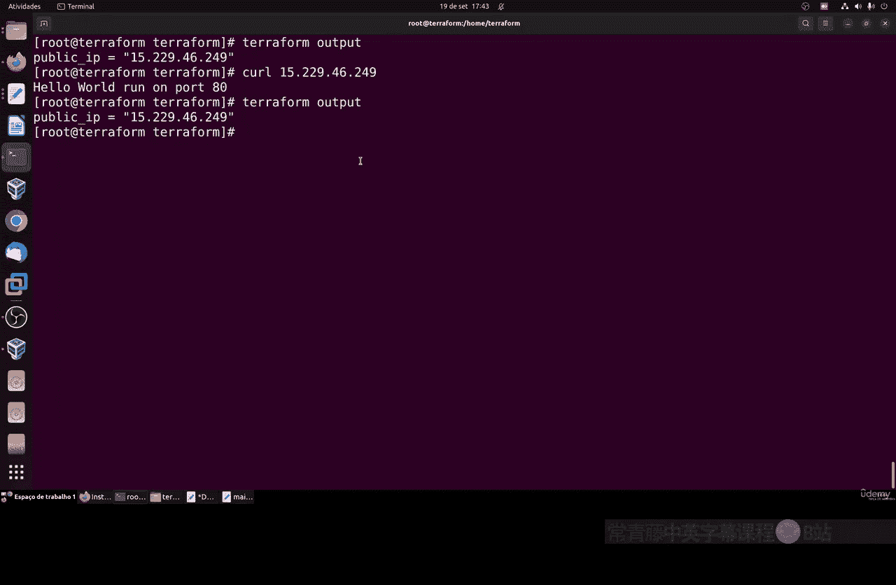

# 129：使用输出变量 📤

在本节课中，我们将要学习Terraform中一个非常实用的功能：输出变量。输出变量用于在基础设施部署完成后，显示或传递特定的信息，例如服务器的公网IP地址。这能帮助我们自动化测试和后续的脚本操作，避免手动查找信息的繁琐过程。

上一节我们介绍了输入变量，本节中我们来看看如何定义和使用输出变量。

## 理解输出变量

输出变量是一种特殊的变量，它仅在Terraform执行流程的末尾（即`apply`命令完成后）显示其值。它的主要用途是输出基础设施的关键信息，供用户或其他自动化工具使用。

一个非常实用的场景是自动获取并显示新创建云服务器的公网IP地址。这样我们就不需要登录云平台的控制面板去手动查找IP，可以直接用输出的IP进行连接或测试。



## 输出变量的基本语法



输出变量的定义遵循以下基本结构：
```hcl
output "<输出变量名称>" {
  value = <值或表达式>
}
```
其核心是`value`参数，它指定了要输出的内容。这个值可以是一个静态值，也可以引用资源属性（例如`aws_instance.example.public_ip`）。

输出变量还支持其他配置参数，例如：
*   **`sensitive`**：将此参数设为`true`可以防止Terraform在日志中明文记录该输出值。这对于输出密码、私钥等敏感信息非常有用。
*   **`depends_on`**：用于显式声明依赖关系。虽然Terraform能基于引用自动分析依赖图，但在某些复杂情况下，可能需要使用此参数来确保资源按正确顺序创建。

## 实战：输出EC2实例的公网IP

我们将修改之前的Terraform配置文件，添加一个输出块来获取EC2实例的公网IP。

以下是修改步骤，我们在文件末尾添加一个`output`块：

1.  我们定义一个名为`public_ip`的输出变量。
2.  其`value`引用之前创建的`aws_instance`资源（假设资源名为`example_server`）的`public_ip`属性。

修改后的配置文件相关部分如下所示：
```hcl
# ... (之前的provider、resource等配置保持不变)

resource "aws_instance" "example_server" {
  # ... (实例的其他配置，如AMI、实例类型等)
}


output "public_ip" {
  value = aws_instance.example_server.public_ip
}
```
请注意，`aws_instance.example_server.public_ip`是一个属性引用。`example_server`是我们在`resource`块中定义的资源名称，`public_ip`是该AWS实例资源的一个导出属性。不同云服务商的资源属性名称可能不同，需要查阅对应的Terraform Provider文档。

## 应用配置并查看输出

保存配置文件后，运行`terraform apply`命令来创建或更新基础设施。

在`apply`命令执行成功后，Terraform不仅会汇总资源变更情况，还会在最后打印出所有定义好的输出变量的值。你会看到类似这样的输出：
```
Apply complete! Resources: X added, Y changed, Z destroyed.

Outputs:


public_ip = "203.0.113.10"
```
这样，我们就直接获得了新服务器的公网IP地址。



即使错过了这个输出，或者之后需要再次查看，也无需重新执行`apply`。Terraform会将输出变量的值保存在状态文件中，我们可以随时使用以下命令查询：
```bash
terraform output
```
运行此命令会列出所有输出变量及其当前值。如果只想查看特定的输出变量，可以指定其名称：
```bash
terraform output public_ip
```




## 输出变量的优势与用途


使用输出变量能带来显著效率提升：
*   **自动化测试**：获得IP后，可以立即通过脚本（如`curl`）测试Web服务是否成功启动。
*   **简化管理**：当管理成百上千个实例时，手动记录每个IP地址是完全不可行的。输出变量让信息获取自动化。
*   **脚本集成**：其他脚本或自动化工具可以轻松地读取`terraform output`的结果，实现与Terraform的无缝集成。



本节课中我们一起学习了Terraform输出变量的定义和使用。我们了解了其基本语法，并通过输出EC2实例公网IP的实战例子，掌握了如何引用资源属性以及如何查看输出结果。输出变量是一个简单但功能强大的工具，它能将关键的基础设施信息暴露出来，极大地提升了后续操作和管理的自动化程度与效率。