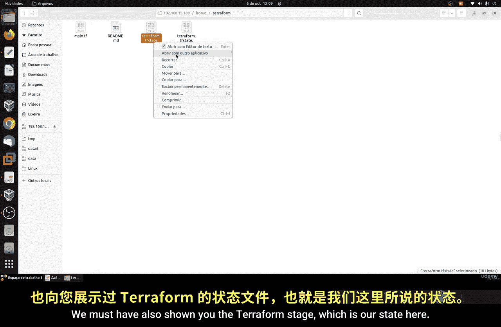
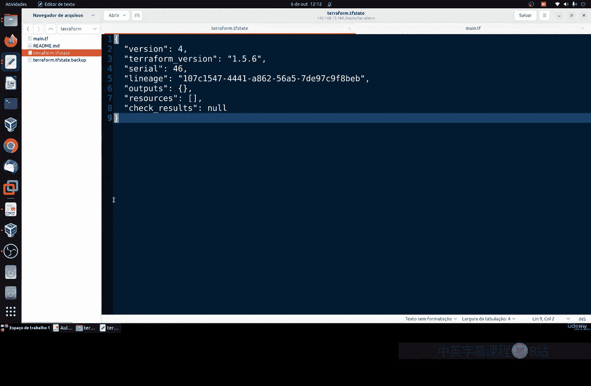
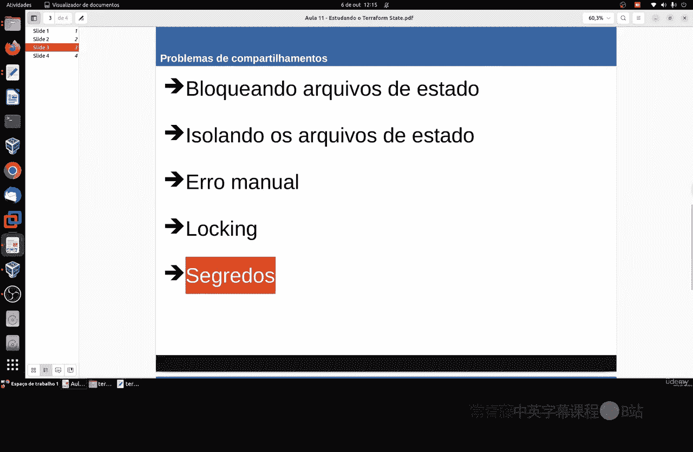
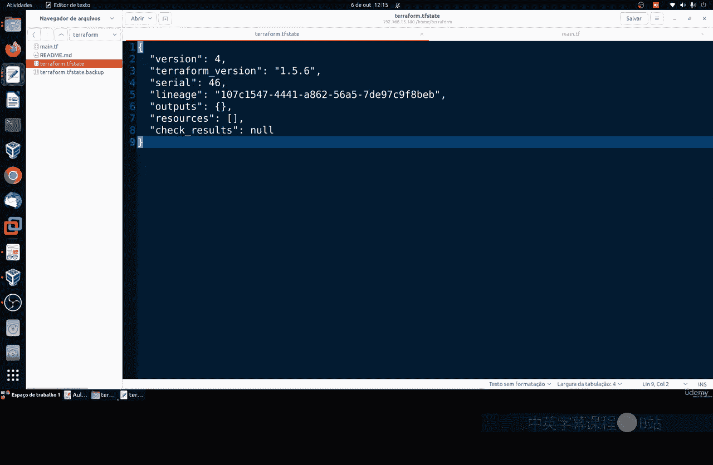
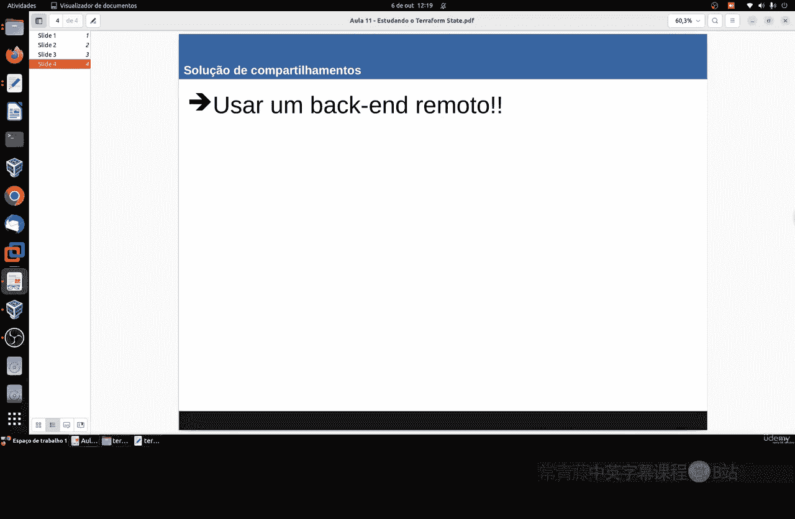
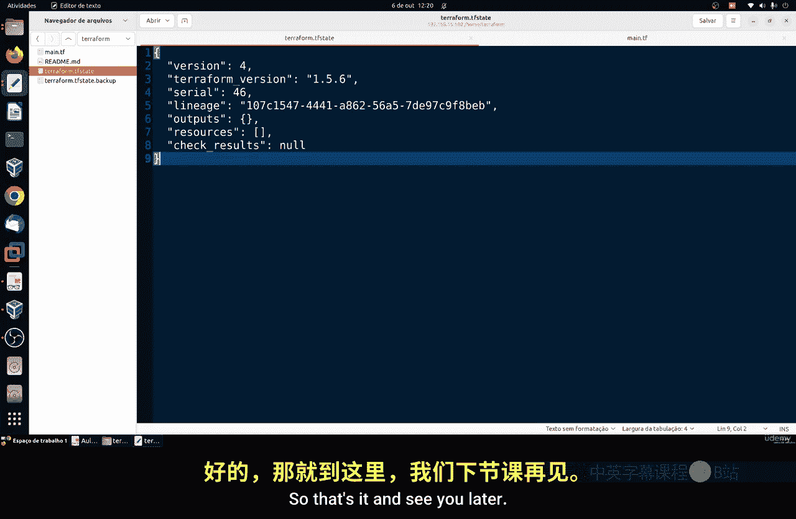

**Terraform 基础：第3章：研究 Terraform 状态文件 📄**

在本节课中，我们将学习 Terraform 状态文件。我们将了解它的作用、工作原理，以及在使用本地状态文件时可能遇到的问题及其解决方案。

上一节我们介绍了 Terraform 的基本应用，本节中我们来看看其核心组件之一——状态文件。



---

### **理解状态文件**

Terraform 状态文件是一个 JSON 格式的文件，它记录了 Terraform 管理的所有基础设施资源的当前状态。每次执行 `terraform apply` 后，Terraform 都会更新这个文件。

**状态文件的核心作用**是映射你的代码配置与实际云资源之间的关系。它是一个键值对结构，包含了资源标识符、属性值和元数据。

```json
{
  "version": 4,
  "terraform_version": "1.5.0",
  "resources": [...]
}
```



每次运行 `terraform plan` 或 `terraform apply` 时，Terraform 都会读取这个状态文件，与你的代码配置进行比较，并计算出需要执行的操作（创建、更新或销毁）。这就是 `plan` 命令输出中显示的变更预览。

**重要提示**：状态文件是 Terraform 内部使用的私有 API，**永远不要手动编辑它**。正确的操作方式是使用 `terraform state` 或 `terraform import` 等专用命令。

---

### **本地状态文件的问题**

在个人或小型项目中，使用本地状态文件（默认存储在 `terraform.tfstate` 中）可能没有问题。但在团队协作或生产环境中，这会带来挑战。

以下是使用本地状态文件时可能遇到的问题：

*   **共享困难**：团队成员需要访问同一个最新的状态文件，手动传递（如通过邮件或U盘）极易出错。
*   **缺乏锁定机制**：如果两个成员同时运行 `terraform apply`，他们可能基于过时的状态文件进行操作，导致配置冲突、数据丢失甚至状态文件损坏。
*   **缺乏隔离**：难以管理不同环境（如开发、测试、生产）的状态。对测试环境的修改可能意外影响到生产环境。
*   **安全风险**：状态文件以明文存储所有信息，包括数据库密码、API密钥等敏感数据。如果文件被共享或泄露，将造成严重安全漏洞。



---



### **解决方案：远程后端**

解决上述所有问题的最佳实践是使用 **远程后端** 来存储状态文件。

远程后端允许你将状态文件存储在远程的共享存储服务中，例如 AWS S3、Azure Storage 或 Google Cloud Storage。这带来了以下好处：

1.  **自动状态同步**：团队成员执行任何 Terraform 命令时，都会自动从远程后端拉取最新状态，极大减少了因状态不同步导致的手动错误。
2.  **状态锁定**：大多数远程后端（如配合 AWS DynamoDB）支持状态锁定。当一个人执行 `terraform apply` 时，会自动获取锁，其他人同时执行时会被阻塞，直到前一个操作完成。
3.  **安全加密**：云服务商通常提供静态加密和传输加密（如 AES-256），确保敏感数据的安全。
4.  **版本历史**：像 S3 这样的服务可以开启版本控制，方便回溯到之前的状态。

因此，对于任何正式的团队项目，**强烈建议使用远程后端替代本地文件或 Git 来管理状态**。Git 适合存储代码，但不适合存储频繁变更且包含敏感信息的状态文件。

---

### **总结**

本节课中我们一起学习了 Terraform 状态文件。我们了解了它的 JSON 格式和核心映射功能，认识了在团队协作中使用本地状态文件会遇到的共享、锁定、隔离和安全问题。最后，我们探讨了解决这些问题的标准方案：使用支持自动同步、状态锁定和数据加密的远程后端。





在下一章，我们将开始实践部分，学习如何具体配置一个远程后端。