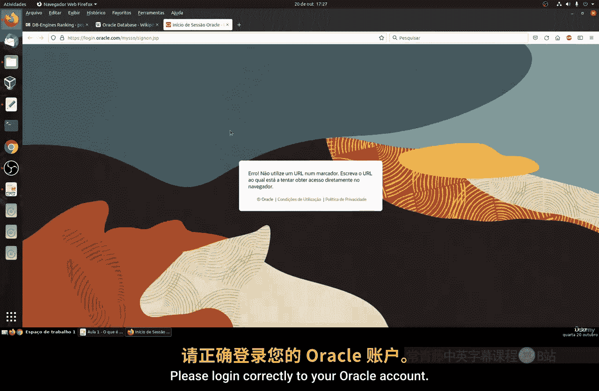

# 135：什么是Oracle数据库 🗄️

在本节课中，我们将要学习Oracle数据库。Oracle是全球最主要的关系型数据库管理系统之一，拥有悠久的历史和广泛的企业应用。本节将介绍其背景、特点、版本以及获取方式。

## 概述

Oracle数据库是一个在20世纪70年代末由商人Larry Ellison创立的数据库管理系统。它是市场上最早出现的关系型数据库之一，至今仍是全球使用最广泛、最重要的数据库系统之一。根据数据库引擎排名，Oracle长期位居榜首，其次是MySQL、Microsoft SQL Server、PostgreSQL和MongoDB等。它不仅用户基数庞大，也拥有大量的专业技术人员，被全球众多大型公司和组织所采用。

## 核心特点与版本

上一节我们介绍了Oracle数据库的历史地位，本节中我们来看看它的核心特点与版本支持策略。

Oracle数据库使用标准的SQL语言进行编程和操作，并特别擅长处理事务。它的一个显著优势是提供**稳定且长期支持的版本**。这意味着企业可以长期运行在某个稳定版本上，并获得持续的技术支持。

以下是Oracle数据库的一些关键版本信息：

*   **版本19c**：当前一个广泛使用的稳定版本。
*   **版本12c/21c**：近年来发布的其他重要版本。
*   **版本11g**：于2009年发布，至今仍提供支持，这充分体现了其长期支持策略。

这种长期稳定性使其非常适合商业环境，尤其是与Red Hat Enterprise Linux或Oracle Linux等稳定操作系统搭配，构建可靠的生产环境。

## 许可与获取方式

了解了其稳定性后，我们需要知道Oracle数据库是一个**专有且付费**的系统，这与PostgreSQL或MySQL等开源数据库不同。用于商业生产环境需要购买许可证。

不过，出于**教育和学习**目的，我们可以免费获取和使用。以下是获取Oracle数据库软件的步骤：

1.  访问Oracle官方网站。
2.  创建一个免费的Oracle账户。
3.  登录后，导航至下载页面。
4.  选择所需的版本（如19c或21c）进行下载。

请注意，下载的安装包体积较大（通常超过2GB），安装过程也可能耗时较长。

## 系统要求与产品线

在准备安装之前，必须了解其系统要求。Oracle数据库设计用于处理海量数据和超高并发交易，通常部署在大型数据中心。因此，它对硬件资源要求较高。

**不建议在配置过低或陈旧的个人电脑上尝试运行Oracle数据库**，这可能导致性能问题甚至安装失败。

Oracle公司提供多条产品线，其中最主要的两款数据库产品是：
*   **Oracle Database Standard Edition (标准版)**：适用于负载较轻的场景。
*   **Oracle Database Enterprise Edition (企业版)**：提供全面的功能集，满足大型企业的苛刻需求。

## 资源与总结

最后，Oracle提供了极其**完整和详细的官方文档**，涵盖安装、管理、安全、数据仓库、集群等所有主题，是学习和解决问题的宝贵资源。

本节课中我们一起学习了Oracle数据库的起源、其作为主流商业数据库的地位、版本长期支持的特点、专有软件的许可模式、如何免费获取用于学习，以及它对系统硬件的要求。记住，它是一个为大型企业级应用设计的强大工具。

对于商业使用的具体定价，可以参考Oracle官网提供的价格清单，其费用根据版本、部署方式（本地或云）、CPU核心数等因素而定。