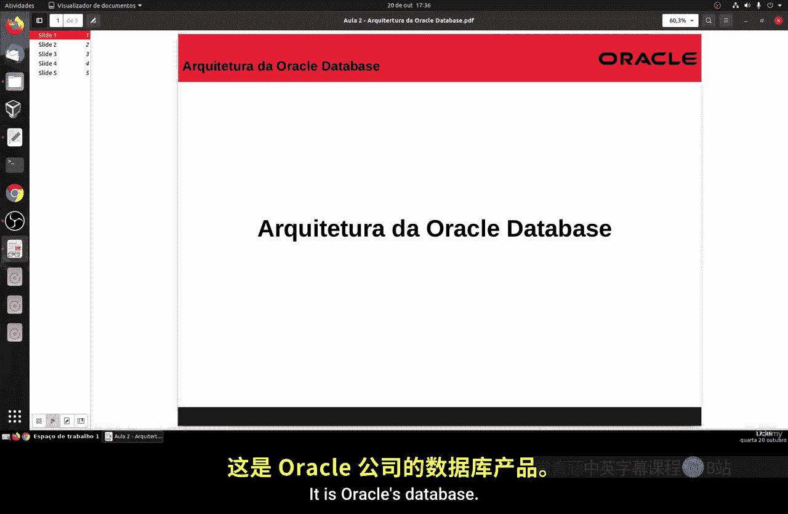
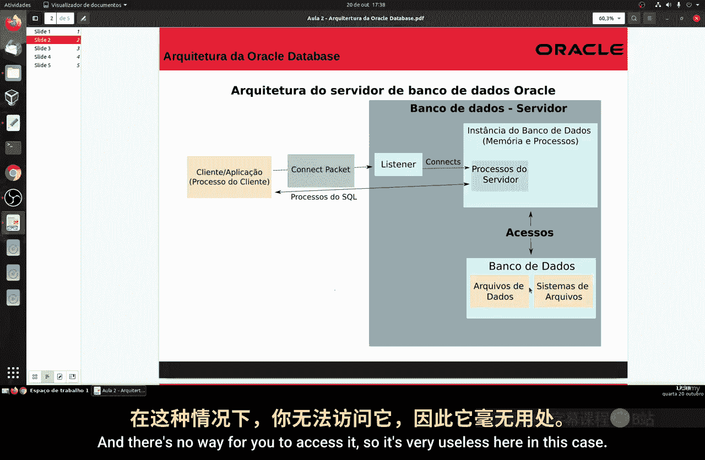
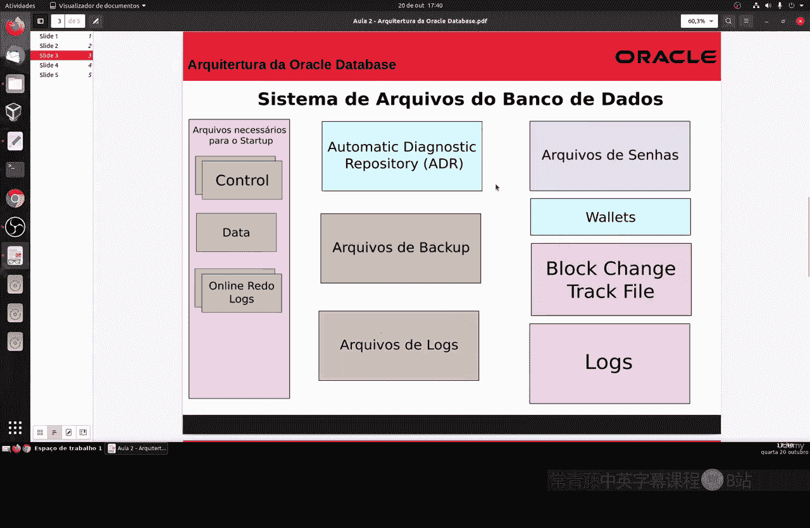
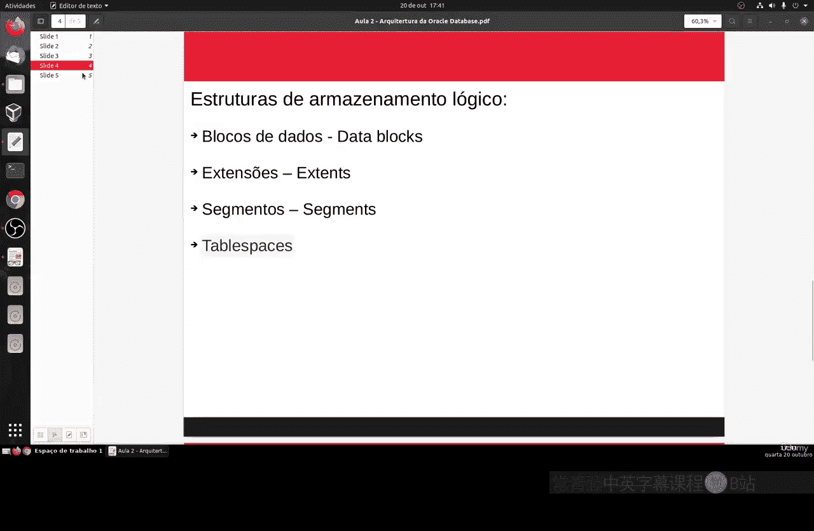
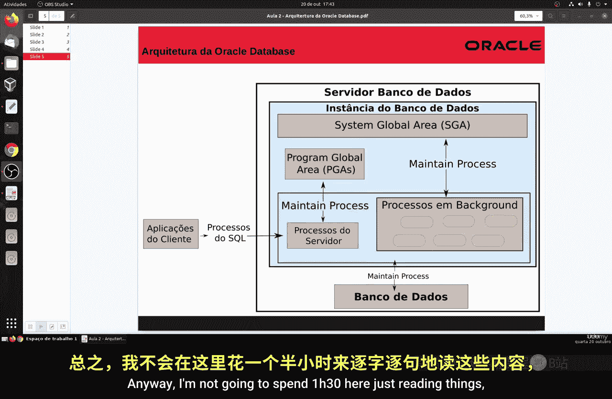
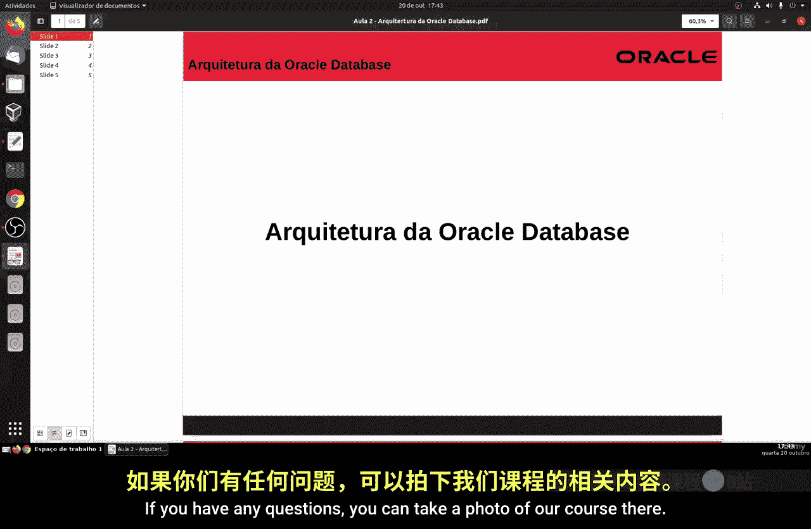

# 136：Oracle数据库架构 🏗️

在本节课中，我们将简要介绍Oracle数据库的架构及其工作原理。

## 概述

Oracle数据库是甲骨文公司开发的数据库管理系统，主要面向大型企业的商业应用。其核心由数据库和至少一个实例组成。本节将解释这些核心概念及其相互关系。

## 数据库与实例

首先，我们需要理解数据库和实例的区别。

一个Oracle数据库是一个存储数据的文件集合。而一个实例则是一组内存结构和后台进程的组合，它是数据库运行时的一部分。实例是访问数据库的接口。

以下是数据库与实例关系的要点：
*   首先启动一个数据库实例。此时，实例尚未关联任何数据文件。
*   然后创建数据库，并将其挂载到该实例上。一个实例在初始化时，一次只能访问一个数据库。
*   多个数据库实例可以访问同一个数据库，但这通常用于集群等高级环境，以实现高可用性和可扩展性。
*   数据库可以脱离实例独立存在，但这只是一堆无法访问的文件，因此没有实际用处。

## 数据库文件系统

接下来，我们看看构成数据库的文件系统。

数据库在物理上由几种关键文件组成，通常包括两个或更多文件。以下是主要文件类型：
*   **控制文件**：包含数据库的元数据信息。
*   **数据文件**：存储实际的数据，例如销售订单、客户信息等。
*   **在线重做日志文件**：记录对数据库的所有更改，用于数据恢复。

此外，数据库系统还包括其他重要文件，如备份文件、用于监控的日志文件以及口令文件等。

## 存储结构

了解了物理文件后，我们来看Oracle管理磁盘空间的逻辑结构。

Oracle使用一种分层的逻辑结构来组织数据存储。以下是其核心组成部分：
*   **数据块**：是磁盘I/O操作的基本单位，对应特定数量的字节。
*   **区**：由一组逻辑上连续的数据块组成，用于存储特定类型的信息。
*   **段**：是为特定数据库对象（如表或索引）分配的一组区。
*   **表空间**：是数据库内主要的逻辑存储容器，一个表空间包含多个段。这个概念与其他数据库系统类似。

## 实例架构

上一节我们介绍了存储的逻辑结构，本节中我们来看看实例内部是如何工作的。

实例是客户端应用程序与数据库服务器之间的桥梁。它主要由三部分组成：
1.  **系统全局区**：这是一个共享内存区域，在实例启动时分配，关闭时释放。它包含实例的控制信息和数据。
2.  **程序全局区**：这是一个私有内存区域，每个服务器进程启动时都会分配一个PGA，进程结束时释放。
3.  **后台进程**：这些是执行维护任务（如写入数据、日志记录等）的进程。

简而言之，SGA是全局共享的，而PGA是每个会话私有的。结合我们之前讨论的数据库文件，就构成了完整的Oracle数据库运行架构。根据不同的系统配置（如集群），架构会有所变化，但基本原理与此一致。

## 总结

本节课中我们一起学习了Oracle数据库的基本架构。我们明确了**数据库**（物理文件集合）与**实例**（内存与进程组合）的区别，了解了构成数据库的**控制文件**、**数据文件**和**日志文件**，探讨了数据存储的**逻辑结构**（块、区、段、表空间），并剖析了**实例**的核心组件（SGA、PGA、后台进程）。理解这些基础概念是进一步学习和操作Oracle数据库的关键。